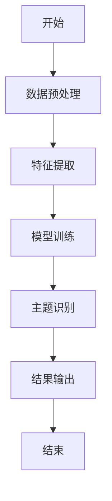
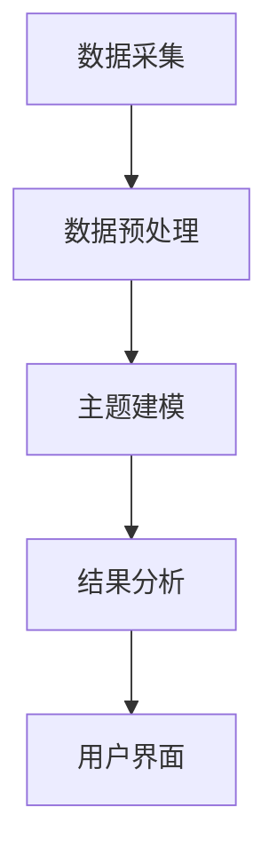
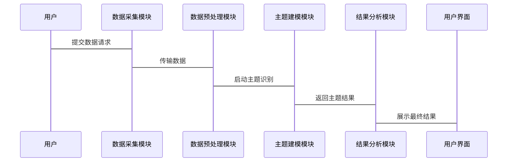

                 


# 可持续发展目标（SDGs）与投资主题识别

## 关键词：
可持续发展目标（SDGs）、投资主题识别、可持续投资、机器学习、主题建模、数据分析

## 摘要：
本文探讨如何通过技术手段识别与SDGs相关的投资主题，从而推动可持续投资。结合SDGs的核心目标，利用数据分析和机器学习方法，构建主题识别模型，为投资者提供基于可持续发展目标的决策支持。

---

## 正文：

### 第一部分：背景介绍

#### 第1章：可持续发展目标（SDGs）概述

##### 1.1 SDGs的定义与核心目标
SDGs是联合国提出的17个全球发展目标，涵盖消除贫困、保护地球、促进繁荣等方面。这些目标强调经济、社会和环境的协调发展，是实现全球可持续发展的基石。

##### 1.2 投资主题识别的背景与重要性
随着可持续投资的兴起，识别与SDGs相关的投资主题变得至关重要。主题识别帮助投资者聚焦于具有社会和环境效益的领域，优化投资组合，实现长期收益。

##### 1.3 SDGs与投资主题识别的关系
SDGs为投资主题识别提供了明确的方向，而投资主题识别则为实现SDGs提供了资金和资源支持。两者的结合不仅推动了可持续投资，还促进了全球目标的实现。

### 第二部分：核心概念与联系

#### 第2章：SDGs与投资主题识别的核心概念

##### 2.1 SDGs的核心概念
SDGs的目标体系由消除贫困、保护地球、促进繁荣等目标组成，每个目标都有具体的指标和实施路径。这些目标相互关联，形成一个综合的可持续发展框架。

##### 2.2 投资主题识别的核心概念
投资主题识别是通过分析市场趋势、行业动态和社会需求，识别具有投资潜力的主题。这些主题通常与社会问题、环境挑战或技术创新相关。

##### 2.3 SDGs与投资主题识别的联系
SDGs为投资主题识别提供了明确的方向，如清洁能源、可持续城市等领域。投资主题识别则帮助投资者将资金投入到能有效推动SDGs实现的项目中，形成良性循环。

#### 第3章：SDGs与投资主题识别的概念对比

##### 3.1 概念属性对比表

| 概念       | 定义                                                                 | 特征                         |
|------------|----------------------------------------------------------------------|------------------------------|
| SDGs       | 17个全球发展目标，涵盖经济、社会和环境方面。                  | 全球性、综合性、长期性         |
| 投资主题识别| 识别具有投资潜力的主题，基于市场趋势和社会需求。             | 数据驱动性、动态性、目标导向性|

##### 3.2 实体关系图（ER图）

```mermaid
erd
  entity SDGs {
    id: int
    target_name: string
    description: string
    goal: string
  }

  entity 投资主题识别 {
    id: int
    theme_name: string
    indicators: string[]
    investment_strategy: string
  }

  SDGs 与 投资主题识别 关联：一对一
```

### 第三部分：算法原理讲解

#### 第3章：SDGs与投资主题识别的算法原理

##### 3.1 算法概述
主题建模（如LDA）用于识别文本数据中的主题。结合SDGs的关键词，通过数据预处理和模型训练，识别出与SDGs相关的投资主题。

##### 3.2 算法流程图



##### 3.3 算法实现代码

```python
from sklearn.decomposition import LatentDirichletAllocation
from sklearn.feature_extraction.text import TfidfVectorizer

# 数据预处理
texts = [...]  # 文本数据

# 特征提取
vectorizer = TfidfVectorizer(max_features=1000)
tfidf = vectorizer.fit_transform(texts)

# 模型训练
lda = LatentDirichletAllocation(n_components=5, random_state=42)
lda.fit(tfidf)

# 主题识别
topic_words = {}
for topic_idx, topic in enumerate(lda.components_):
    topic_words[topic_idx] = [vectorizer.get_feature_names()[i] for i in topic.argsort()[-5:]]

# 输出主题
for topic in topic_words:
    print(f"主题 {topic + 1}: {topic_words[topic]}")
```

##### 3.4 数学模型与公式
主题建模的数学模型如下：

$$
p(\text{主题} | \text{文档}) = \frac{\text{主题在文档中的词频} \times \text{主题在 corpus 中的分布}}{\sum_{k} \text{主题k在文档中的词频} \times \text{主题k在 corpus 中的分布}}
$$

### 第四部分：系统分析与架构设计

#### 第4章：系统分析与架构设计

##### 4.1 项目场景介绍
系统旨在帮助投资者识别与SDGs相关的投资主题，优化投资组合，支持可持续投资决策。

##### 4.2 领域模型设计

```mermaid
classDiagram
    class SDGs {
        id
        target_name
        description
    }
    class 投资主题识别 {
        id
        theme_name
        indicators
        investment_strategy
    }
    SDGs <--- 关联 --> 投资主题识别
```

##### 4.3 系统架构设计



##### 4.4 系统接口设计
系统接口包括数据输入接口、模型调用接口和结果展示接口。各接口通过REST API进行通信。

##### 4.5 交互序列图



### 第五部分：项目实战

#### 第5章：项目实战

##### 5.1 环境安装
安装必要的库：
```bash
pip install scikit-learn jieba mermaid4jupyter
```

##### 5.2 系统核心实现

```python
import jieba

# 数据处理
texts = [...]  # 待处理文本

# 分词处理
seg_texts = [' '.join(jieba.cut(text)) for text in texts]

# 特征提取与主题建模（如前所述）
# 训练主题模型
# 输出主题结果
```

##### 5.3 案例分析
以清洁能源为主题，分析相关文本数据，识别出与SDGs相关的投资主题，如可再生能源、绿色科技等。

##### 5.4 小结
通过案例分析，验证算法的有效性，总结经验教训，为后续优化提供依据。

### 第六部分：最佳实践

#### 第6章：最佳实践

##### 6.1 关键技术总结
- 数据预处理：文本清洗、分词
- 模型选择：主题建模算法（如LDA）
- 结果分析：主题可视化、关键词提取

##### 6.2 注意事项
- 数据质量：确保数据相关性和完整性
- 模型调优：优化主题数量和参数
- 结果解释：结合领域知识解读主题

##### 6.3 小结
通过最佳实践，确保系统的高效性和结果的准确性，提升投资主题识别的可靠性和实用性。

### 第七部分：拓展阅读

#### 第7章：拓展阅读

##### 7.1 推荐书籍
- 《可持续投资：理论与实践》
- 《机器学习实战》

##### 7.2 工具推荐
- 数据分析工具：Python（pandas, scikit-learn）
- 可视化工具：Matplotlib, Seaborn
- 开源框架：Gensim（主题建模）

##### 7.3 学术论文
- 关于主题建模与可持续投资的最新研究

---

通过以上结构，文章详细探讨了SDGs与投资主题识别的关系，结合技术分析和实际案例，为读者提供了全面的知识和实践指导。

