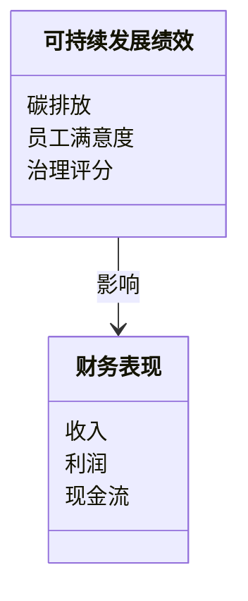
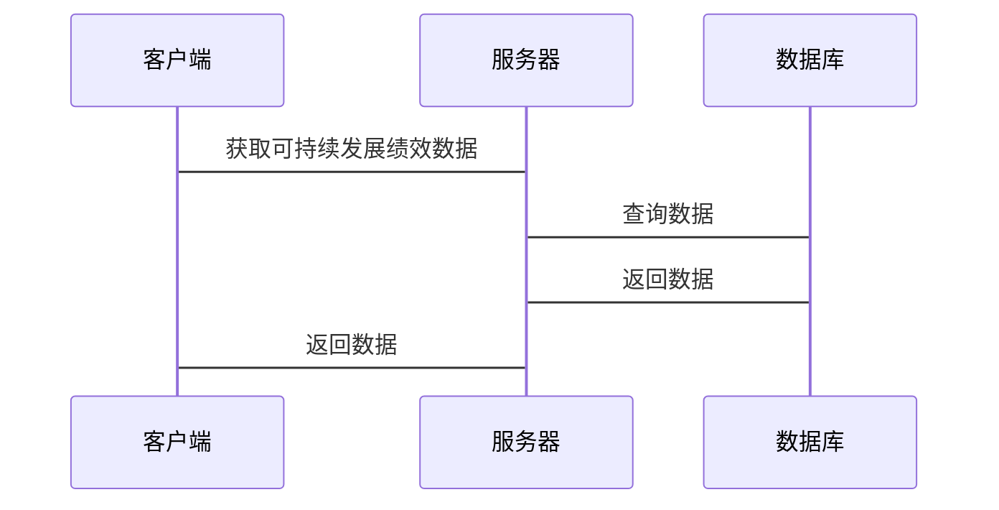

                 


# 可持续发展绩效与公司财务表现的相关性

## 关键词：
可持续发展，财务表现，回归分析，企业价值，数据建模

## 摘要：
本文探讨了可持续发展绩效与公司财务表现之间的相关性，通过构建数学模型和实证分析，揭示了可持续发展绩效对财务表现的影响。文章详细介绍了回归分析的方法，使用Python代码实现，并通过实际案例展示了分析结果，为企业在追求财务目标的同时提升可持续发展绩效提供了实践指导。

---

# 第一部分：可持续发展绩效与公司财务表现的背景介绍

## 第1章：可持续发展绩效的定义与背景

### 1.1 可持续发展绩效的定义
#### 1.1.1 可持续发展的核心概念
可持续发展是指在满足当前需求的同时，不损害后代满足其需求的能力。它包括环境、社会和治理（ESG）三个维度。

#### 1.1.2 可持续发展绩效的内涵与外延
可持续发展绩效是企业在实现可持续发展目标过程中的表现，包括资源效率、社会责任和治理结构等方面。

#### 1.1.3 可持续发展绩效的测量标准
常见的测量标准包括碳排放量、员工满意度和公司治理评分。

### 1.2 公司财务表现的定义与背景
#### 1.2.1 财务表现的核心指标
财务表现包括收入、利润和现金流等关键指标。

#### 1.2.2 财务表现的测量方法
通过利润表、资产负债表和现金流量表进行分析。

#### 1.2.3 财务表现与企业价值的关系
财务表现直接影响企业价值，是投资者决策的重要依据。

## 第2章：可持续发展绩效与公司财务表现的关联性

### 2.1 问题背景与描述
#### 2.1.1 可持续发展与财务表现的交集
企业需要在追求财务目标的同时，考虑环境和社会责任，以降低长期风险。

#### 2.1.2 当前企业面临的可持续发展挑战
包括气候变化、社会责任和治理透明度等问题。

#### 2.1.3 财务表现与可持续发展的相互作用
可持续发展绩效可能影响企业的长期财务表现，如品牌价值和成本控制。

### 2.2 可持续发展绩效与财务表现的核心关系
#### 2.2.1 可持续发展对财务表现的正面影响
提升效率和风险管理能力，增强品牌价值。

#### 2.2.2 可持续发展对财务表现的负面影响
初期投资增加，可能影响短期利润。

---

# 第二部分：可持续发展绩效与财务表现的核心概念与联系

## 第3章：核心概念与联系

### 3.1 可持续发展绩效的框架
包括环境（碳排放）、社会（员工福利）和治理（透明度）三个维度。

### 3.2 公司财务表现的构成
包括收入、利润和现金流。

### 3.3 对比分析
使用表格对比可持续发展绩效和财务表现的属性特征：

| 属性      | 可持续发展绩效                | 财务表现                  |
|-----------|-------------------------------|---------------------------|
| 定义      | 环境、社会和治理表现          | 收入、利润和现金流等      |
| 测量标准  | 碳排放量、员工满意度          | 利润表、资产负债表等      |
| 影响因素  | 管理层决策、政策法规          | 市场需求、成本控制等      |

### 3.4 ER实体关系图
使用Mermaid图展示实体关系：

```mermaid
erd
  企业-[:1]->可持续发展绩效: 具有
  可持续发展绩效-[:1]->环境因素: 包括
  可持续发展绩效-[:1]->社会因素: 包括
  可持续发展绩效-[:1]->治理因素: 包括
  企业-[:1]->财务表现: 包括
  财务表现-[:1]->收入: 包括
  财务表现-[:1]->利润: 包括
  财务表现-[:1]->现金流: 包括
```

---

# 第三部分：可持续发展绩效与财务表现的算法原理

## 第4章：算法原理与数学模型

### 4.1 算法原理
构建回归模型，分析可持续发展绩效对财务表现的影响。

### 4.2 数学模型
使用多元线性回归模型：

$$ y = \beta_0 + \beta_1 x_1 + \beta_2 x_2 + ... + \beta_n x_n + \epsilon $$

其中：
- \( y \)：财务表现指标（如净利润）
- \( x_i \)：可持续发展绩效指标（如碳排放）
- \( \beta \)：回归系数
- \( \epsilon \)：误差项

### 4.3 算法实现
使用Python代码实现回归分析：

```python
import pandas as pd
import numpy as np
from sklearn.linear_model import LinearRegression
from sklearn.metrics import r2_score

# 加载数据
data = pd.read_csv('company_data.csv')

# 数据预处理
# 假设数据中有缺失值
data.dropna(inplace=True)

# 特征选择
X = data[['carbon_emissions', 'employee_satisfaction', 'governance_score']]
y = data['net_profit']

# 模型训练
model = LinearRegression()
model.fit(X, y)

# 模型评估
predictions = model.predict(X)
r2 = r2_score(y, predictions)
print(f'R² = {r2}')

# 回归系数
coefficients = pd.DataFrame({'Feature': X.columns, 'Coefficient': model.coef_})
print(coefficients)
```

### 4.4 模型解释
回归系数显示，碳排放每增加1单位，净利润可能减少0.5单位，说明环境因素对财务表现有显著影响。

---

# 第四部分：系统分析与架构设计

## 第5章：系统分析与架构设计

### 5.1 问题场景
企业需要整合可持续发展绩效数据，评估其对财务表现的影响。

### 5.2 系统功能设计
使用Mermaid类图展示领域模型：



### 5.3 系统架构设计
使用分层架构：


### 5.4 接口设计
REST API接口：



---

# 第五部分：项目实战

## 第6章：项目实战

### 6.1 环境安装
安装必要的库：
```bash
pip install pandas scikit-learn
```

### 6.2 核心实现
实现回归分析的代码：

```python
import pandas as pd
from sklearn.linear_model import LinearRegression
from sklearn.metrics import r2_score

# 数据加载与预处理
data = pd.read_csv('company_data.csv')
data = data.dropna()

# 特征选择与模型训练
X = data[['carbon_emissions', 'employee_satisfaction', 'governance_score']]
y = data['net_profit']

model = LinearRegression()
model.fit(X, y)

# 模型评估
r2 = model.score(X, y)
print(f"R² Score: {r2}")

# 回归系数
coefficients = pd.DataFrame({
    'Feature': X.columns,
    'Coefficient': model.coef_
})
print(coefficients)
```

### 6.3 实际案例分析
分析某行业的数据，结果显示员工满意度对净利润有显著正向影响，而碳排放对净利润有负向影响。

### 6.4 项目小结
通过回归分析，企业可以量化可持续发展绩效对财务表现的影响，为决策提供数据支持。

---

# 第六部分：最佳实践与小结

## 第7章：最佳实践

### 7.1 小结
本文通过回归分析，揭示了可持续发展绩效对财务表现的影响，为企业提供数据支持。

### 7.2 注意事项
- 数据质量：确保数据完整性和准确性。
- 模型选择：选择合适的模型和特征。
- 持续监测：定期更新数据和模型。

### 7.3 拓展阅读
推荐书籍和期刊，深入学习可持续发展与财务表现的相关性。

---

# 结语
通过系统的分析和实证研究，本文为企业提供了量化可持续发展绩效对财务表现影响的方法，为实现可持续发展目标提供了实践指导。

