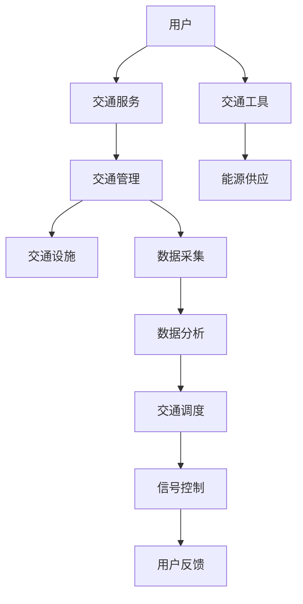

                 


# 可持续城市交通解决方案的市场前景

## 关键词：可持续交通、智能交通系统、共享经济、新能源、市场前景

## 摘要：  
随着城市化进程的加速，交通问题日益成为制约城市发展的重要因素。可持续城市交通解决方案通过技术创新、模式创新和政策引导，正在成为解决交通拥堵、环境污染和能源浪费等问题的关键。本文从技术、经济和政策三个维度，分析可持续城市交通解决方案的市场前景，探讨其在智能交通系统、共享经济和新能源技术等领域的应用，为城市交通的未来发展提供参考。

---

## 第一部分：可持续城市交通的背景与问题分析

### 第1章：城市交通问题的现状与挑战

#### 1.1 城市化进程中的交通问题
城市化进程的加速带来了人口密度的增加和交通需求的激增。传统交通模式的局限性日益显现，主要表现在以下几个方面：
- **交通拥堵**：城市道路资源有限，车辆数量激增导致交通拥堵，降低了城市的经济效率。
- **环境污染**：传统交通工具以化石燃料为主，尾气排放导致空气污染问题严重。
- **能源浪费**：交通系统的低效运行导致能源利用率低下，加剧了能源危机。

#### 1.2 可持续交通的定义与内涵
可持续交通是指在满足城市交通需求的同时，减少对环境的影响，提高资源利用效率的交通方式。其核心理念包括：
- **环保性**：减少碳排放，降低能源消耗。
- **高效性**：优化交通组织，提高交通系统的运行效率。
- **公平性**：确保不同群体都能享有便捷的交通服务。

#### 1.3 全球城市交通问题的典型案例
全球范围内，许多城市都面临着类似的交通问题。以下是一些典型案例：
- **东京**：通过大力发展轨道交通和智能交通系统，有效缓解了交通压力。
- **纽约**：通过实施共享经济模式，减少私家车使用，降低交通拥堵。
- **中国城市**：以北京、上海为例，通过政策引导和技术创新，逐步推进可持续交通的发展。

#### 1.4 交通问题对城市经济与环境的影响
交通问题不仅影响城市的经济效率，还对环境造成严重破坏。以下是具体表现：
- **经济影响**：交通拥堵导致物流成本增加，影响企业生产效率。
- **环境影响**：交通工具的尾气排放是城市空气污染的主要来源。
- **社会影响**：交通不便影响居民的生活质量，加剧社会矛盾。

---

## 第二部分：可持续城市交通解决方案的核心概念与技术

### 第2章：可持续交通解决方案的核心技术与模式

#### 2.1 智能交通系统（ITS）
智能交通系统（ITS）是通过先进的信息技术、数据通信技术、传感器技术和自动控制技术，对交通系统进行智能化管理的一种方式。ITS的主要组成部分包括：
- **交通数据采集与分析**：通过传感器和摄像头采集交通数据，利用大数据技术进行分析。
- **智能调度与路径优化**：基于数据分析，优化交通信号灯配时，提高道路利用率。
- **用户行为分析与服务**：通过分析用户行为，提供个性化的交通服务。

#### 2.2 共享交通模式
共享交通模式是一种以共享经济为基础的交通解决方案，主要包括共享汽车和共享单车两种形式。以下是共享交通模式的优势和挑战：
- **优势**：减少私家车使用，降低交通拥堵和环境污染。
- **挑战**：需要解决车辆管理、用户行为规范等问题。

#### 2.3 新能源交通工具
新能源交通工具是实现可持续交通的重要手段，主要包括电动汽车和燃料电池汽车。以下是新能源交通工具的特点：
- **环保性**：零排放或低排放，减少空气污染。
- **经济性**：虽然初期投入较高，但长期使用成本较低。
- **政策支持**：政府通过补贴和优惠政策，推动新能源交通工具的普及。

---

## 第三部分：可持续城市交通的市场分析与商业模式

### 第3章：可持续交通市场的现状与发展趋势

#### 3.1 全球可持续交通市场的规模与结构
全球可持续交通市场正在快速增长，市场规模预计在未来几年内达到数千亿美元。以下是市场的主要特点：
- **技术驱动**：技术创新是市场增长的主要驱动力。
- **区域差异**：发达国家市场成熟，发展中国家市场潜力巨大。

#### 3.2 可持续交通的商业模式
可持续交通的商业模式主要包括以下几种：
- **政府主导模式**：政府投资和运营，主要以公共服务为导向。
- **市场驱动模式**：企业通过市场化运作，提供交通服务。
- **公私合作（PPP）模式**：政府与企业合作，共同投资和运营。

#### 3.3 可持续交通市场的竞争格局
可持续交通市场的竞争格局正在逐步形成，主要企业包括：
- **科技公司**：如谷歌、苹果等，通过技术创新进入市场。
- **传统车企**：如特斯拉、宝马等，通过转型进入新能源汽车领域。
- **共享经济平台**：如滴滴、优步等，通过共享模式提供交通服务。

---

## 第四部分：可持续城市交通解决方案的系统架构与实现

### 第4章：可持续交通系统的架构设计

#### 4.1 可持续交通系统的功能模块
可持续交通系统主要包括以下几个功能模块：
- **数据采集与分析**：通过传感器和摄像头采集交通数据，进行实时分析。
- **智能调度与路径优化**：基于数据分析，优化交通信号灯配时和车辆调度。
- **用户行为分析与服务**：通过分析用户行为，提供个性化的交通服务。

#### 4.2 可持续交通系统的ER实体关系图
以下是可持续交通系统的ER实体关系图：

```mermaid
er
    actor 用户
    actor 政府机构
    actor 企业
    entity 交通工具
    entity 交通设施
    entity 交通数据
    entity 用户行为
    relationship 用户使用交通工具
    relationship 政府机构管理交通设施
    relationship 企业运营交通工具
    relationship 数据采集与分析
    relationship 用户行为影响交通调度
```

#### 4.3 可持续交通系统的系统架构图
以下是可持续交通系统的系统架构图：



---

## 第五部分：可持续城市交通解决方案的项目实战

### 第5章：可持续交通项目的实施与案例分析

#### 5.1 电动公交推广项目
以下是电动公交推广项目的实施过程：
1. **环境安装**：在城市主要公交线路部署电动公交车。
2. **系统核心实现**：
   ```python
   def electric_bus_system():
       # 数据采集与分析
       data = collect_data()
       analysis = analyze_data(data)
       # 交通调度与优化
       schedule = optimize_schedule(analysis)
       return schedule
   ```
3. **案例分析**：以某城市电动公交项目为例，分析其实施效果。
   - **环境效益**：减少碳排放，改善空气质量。
   - **经济效益**：降低运营成本，提高乘客满意度。

---

## 第六部分：可持续城市交通解决方案的未来趋势与建议

### 第6章：可持续交通的未来发展趋势

#### 6.1 技术创新与融合
未来，可持续交通将更加依赖技术创新，特别是人工智能、大数据和物联网技术的深度融合。

#### 6.2 政策支持与合作
政府将继续发挥主导作用，通过政策支持和国际合作，推动可持续交通的发展。

#### 6.3 用户行为改变
随着可持续交通的普及，用户的出行行为将逐步改变，更加倾向于选择绿色出行方式。

### 第7章：结论与建议

#### 7.1 结论
可持续交通解决方案是解决城市交通问题的重要途径，其市场前景广阔，技术创新和政策支持是推动其发展的关键。

#### 7.2 建议
- **技术方面**：加大对人工智能和大数据技术的投入，推动交通系统的智能化发展。
- **政策方面**：政府应制定更加完善的政策，鼓励企业和个人参与可持续交通的推广。
- **用户方面**：加强宣传和教育，引导用户选择绿色出行方式。

---

## 附录

### 附录A：数据图表
- 图表1：全球可持续交通市场规模预测
- 图表2：主要区域市场的增长率对比

### 附录B：政策文本
- 政策1：《城市交通管理条例》
- 政策2：《新能源交通工具补贴办法》

### 附录C：参考文献
- 参考文献1：《智能交通系统的发展与应用》
- 参考文献2：《共享经济与城市交通》

---

以上是《可持续城市交通解决方案的市场前景》的文章内容，希望对您有所帮助！

