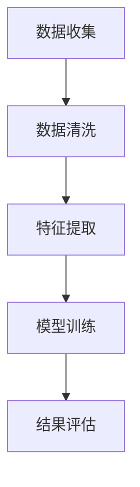
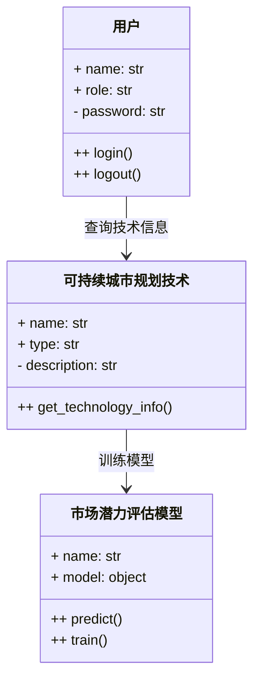
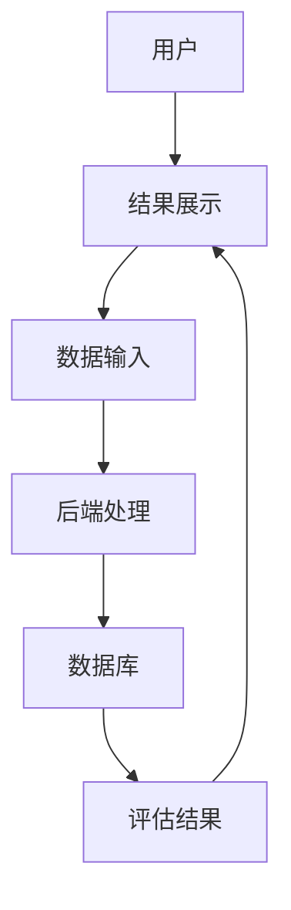
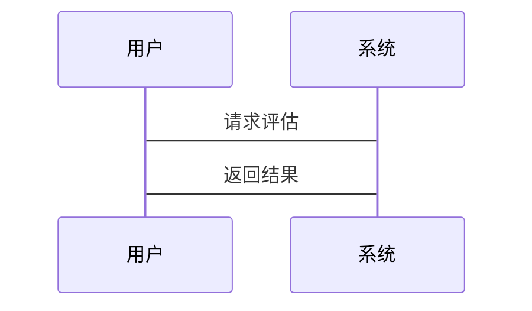

                 


# 可持续城市规划技术的市场潜力评估

> 关键词：可持续城市规划，市场潜力，技术评估，城市化，智慧交通，绿色建筑

> 摘要：本文详细探讨了可持续城市规划技术的市场潜力评估，从背景介绍、核心概念、算法原理、系统架构到项目实战，层层剖析，结合实际案例，为读者提供全面的指导和见解。

---

## 第一部分：可持续城市规划技术的背景与核心概念

### 第1章：可持续城市规划技术的背景介绍

#### 1.1 问题背景与问题描述
- **城市化带来的环境与资源问题**  
  随着城市化进程的加快，资源消耗、环境污染和生态破坏等问题日益严重。城市规划的传统模式已难以满足现代社会对可持续发展的需求。
- **可持续城市规划的必要性**  
  可持续城市规划通过优化空间布局、减少资源消耗和环境污染，实现城市与自然环境的和谐共生。
- **可持续城市规划的核心目标**  
  包括减少碳排放、提高资源利用效率、改善居民生活质量、保护生态环境等。

#### 1.2 可持续城市规划技术的边界与外延
- **技术边界：规划技术的范围与限制**  
  可持续城市规划技术主要关注城市设计、交通系统优化、能源利用等领域，不包括城市经济和社会政策的全部内容。
- **应用边界：技术适用的场景与条件**  
  适用于新建城市、旧城改造、绿色建筑项目等场景，需结合当地自然条件和政策环境。
- **外延：与城市经济、社会的关联**  
  可持续城市规划技术与城市经济的可持续发展、社会公平与包容性密切相关。

#### 1.3 可持续城市规划技术的核心要素
- **绿色建筑技术**  
  包括节能设计、可再生能源利用等，减少建筑对环境的负面影响。
- **智慧交通系统**  
  通过智能交通管理、共享出行等方式，优化交通资源利用，减少碳排放。
- **可再生能源利用**  
  包括太阳能、风能等清洁能源的利用，降低城市能源消耗对环境的依赖。
- **环境保护与生态修复**  
  保护自然生态系统，修复被破坏的环境，确保城市与自然的和谐。

### 第2章：可持续城市规划技术的核心概念与联系

#### 2.1 核心概念原理
- **可持续性原则**  
  确保城市发展的长期性，避免对环境和资源的过度消耗。
- **技术的创新性**  
  通过技术创新推动城市规划的优化和效率提升。
- **经济可行性**  
  可持续技术的应用需考虑成本效益，确保技术在经济上可行。

#### 2.2 概念属性特征对比表格
```plaintext
| 概念       | 可持续性 | 创新性 | 经济性 |
|------------|----------|--------|--------|
| 绿色建筑   | 高       | 中     | 中     |
| 智慧交通   | 高       | 高     | 高     |
| 可再生能源 | 高       | 高     | 中     |
| 环境保护   | 高       | 中     | 中     |
```

#### 2.3 ER实体关系图
```mermaid
er
actor: 用户
technique: 可持续城市规划技术
market_potential: 市场潜力
goal: 可持续发展目标
```

---

## 第二部分：可持续城市规划技术的市场潜力评估方法

### 第3章：市场潜力评估的算法原理

#### 3.1 数据收集与处理
- **数据来源**  
  包括政府统计数据、市场调研数据、企业案例数据等。
- **数据清洗**  
  去除噪声数据，确保数据的准确性和一致性。
- **数据预处理**  
  通过标准化和归一化处理，为后续分析提供基础。

#### 3.2 评估模型构建
- **线性回归模型**  
  $$ y = \beta_0 + \beta_1x_1 + \beta_2x_2 + \dots + \beta_nx_n $$
  其中，$y$ 表示市场潜力，$x_i$ 表示各影响因素，$\beta_i$ 表示回归系数。
- **加权评分模型**  
  $$ y = \sum_{i=1}^{n} w_i x_i $$
  其中，$w_i$ 表示各因素的权重，$x_i$ 表示各因素的评分。

#### 3.3 算法流程图


#### 3.4 Python代码实现
```python
import pandas as pd
from sklearn.linear_model import LinearRegression
from sklearn.metrics import r2_score

# 数据加载
data = pd.read_csv('market_potential.csv')

# 特征与目标变量分离
X = data[['green_building', 'smart_traffic', 'renewable_energy']]
y = data['market_potential']

# 模型训练
model = LinearRegression()
model.fit(X, y)

# 模型评估
y_pred = model.predict(X)
print(f"R² Score: {r2_score(y, y_pred)}")
```

---

### 第4章：系统分析与架构设计方案

#### 4.1 问题场景介绍
- **问题场景**  
  在城市规划中，如何利用可持续技术提升市场潜力，同时满足环保和经济目标。

#### 4.2 系统功能设计


#### 4.3 系统架构设计


#### 4.4 接口与交互设计


---

### 第5章：项目实战

#### 5.1 环境安装
- **安装Python环境**  
  使用Anaconda或virtualenv管理环境。
- **安装依赖库**  
  安装numpy、pandas、scikit-learn等库。

#### 5.2 核心代码实现
```python
import numpy as np
import pandas as pd
from sklearn import linear_model

# 示例数据
data = {
    'green_building': [0.8, 0.7, 0.9, 0.6],
    'smart_traffic': [0.7, 0.8, 0.6, 0.9],
    'renewable_energy': [0.6, 0.7, 0.5, 0.8],
    'market_potential': [0.85, 0.75, 0.9, 0.7]
}

df = pd.DataFrame(data)

# 模型训练
X = df[['green_building', 'smart_traffic', 'renewable_energy']]
y = df['market_potential']

model = linear_model.LinearRegression()
model.fit(X, y)

# 预测结果
new_case = np.array([[0.7, 0.7, 0.6]])
print(f"预测市场潜力：{model.predict(new_case)[0]}")
```

#### 5.3 案例分析
- **案例背景**  
  某城市计划建设绿色建筑区，评估其市场潜力。
- **分析过程**  
  使用线性回归模型，输入绿色建筑、智慧交通、可再生能源的评分，预测市场潜力。
- **结果解读**  
  预测市场潜力为0.75，说明该区域具有较高的市场潜力。

#### 5.4 项目小结
- **关键点总结**  
  数据质量、模型选择、结果解读是影响评估结果的关键因素。
- **经验分享**  
  在实际应用中，需结合具体场景调整模型参数，确保评估结果的准确性。

---

### 第6章：最佳实践与小结

#### 6.1 小结
- **核心观点总结**  
  可持续城市规划技术在市场潜力评估中具有重要意义，通过技术创新和数据分析，可以有效提升评估的准确性和效率。
- **成功案例分享**  
  某城市通过引入智慧交通系统，显著提升了市场潜力，实现了可持续发展目标。

#### 6.2 注意事项
- **数据质量**  
  确保数据的准确性和完整性，避免噪声数据的干扰。
- **模型选择**  
  根据具体场景选择合适的模型，避免盲目追求复杂性。
- **结果验证**  
  对评估结果进行交叉验证，确保结果的可靠性和可解释性。

#### 6.3 拓展阅读
- **推荐书籍**  
  《可持续城市规划：理论与实践》、《城市数据科学：方法与应用》。
- **在线资源**  
  推荐相关论文、研究报告和在线课程，帮助读者深入学习。

---

## 结语
通过本文的详细讲解，读者可以全面了解可持续城市规划技术的市场潜力评估方法，从理论到实践，从概念到系统，层层剖析，帮助读者在实际应用中掌握关键技术，为城市可持续发展提供有力支持。

