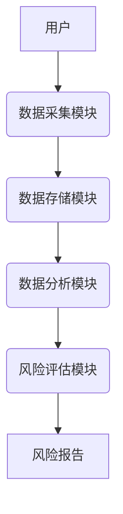
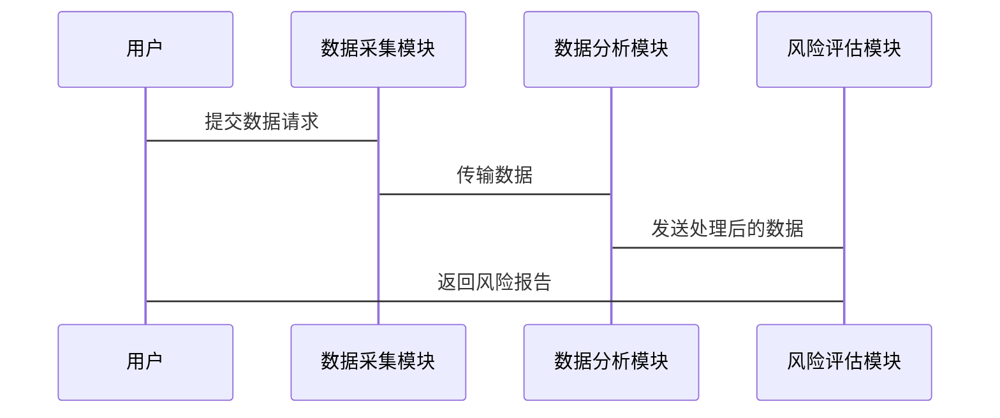

                 


# 可持续旅游业的投资机会与风险评估

> 关键词：可持续旅游、投资机会、风险评估、环境影响、经济效益、社会责任

> 摘要：本文系统地探讨了可持续旅游业的投资机会与风险评估，结合行业背景、核心概念、算法原理、系统架构和实际案例，深入分析了可持续旅游业的定义、特点、投资价值、风险因素及其评估方法。通过技术手段，本文提出了基于大数据和人工智能的可持续旅游业风险评估模型，并结合实际案例进行了详细分析，为投资者提供了科学的决策依据。

---

## 第一部分: 可持续旅游业的背景与核心概念

### 第1章: 可持续旅游业的定义与特点

#### 1.1 可持续旅游业的定义
可持续旅游业是指在满足当前游客需求的同时，不破坏或尽量减少对环境、社会和经济资源负面影响的旅游活动。其核心在于实现旅游业的长期发展与环境保护、社会责任和经济效益的平衡。

#### 1.2 可持续旅游业的特点
- **环境友好性**：注重生态保护，减少资源消耗和污染。
- **社会参与性**：强调与当地社区的合作，促进社会公平与文化传承。
- **经济可持续性**：追求长期的经济收益，避免过度依赖短期利润。

#### 1.3 可持续旅游业与传统旅游业的区别
| 特性                | 可持续旅游业                | 传统旅游业                |
|---------------------|-----------------------------|---------------------------|
| 环境影响            | 最小化资源消耗，保护生态     | 可能过度依赖自然资源，造成破坏 |
| 社会影响            | 促进当地经济发展，尊重文化   | 可能导致社区资源被剥夺，文化冲突 |
| 经济模式            | 长期可持续的收益模式         | 可能依赖短期高利润，忽视长期发展 |

#### 1.4 可持续旅游业的核心要素
- **环境影响评估**：分析旅游活动对生态环境的具体影响。
- **社会责任**：关注当地社区的利益，确保旅游活动不损害居民的生活质量。
- **经济效益**：确保旅游活动能够为当地经济带来稳定的收益。

### 第2章: 可持续旅游业的投资机会

#### 2.1 可持续旅游业的投资背景
随着全球环保意识的增强和消费者偏好的变化，可持续旅游逐渐成为市场热点。政府政策的支持和行业规范的完善也为可持续旅游业的发展提供了良好的环境。

#### 2.2 可持续旅游业的投资机会分析
- **生态旅游项目**：开发自然保护区、生态农场等旅游项目，吸引注重环保的游客。
- **绿色酒店与民宿**：推广节能减排的住宿设施，提供环保型服务。
- **可持续交通与基础设施**：建设低碳交通系统，如自行车租赁、电动公交等。

---

## 第二部分: 可持续旅游业的风险评估模型与技术应用

### 第3章: 可持续旅游业风险评估的核心概念

#### 3.1 风险评估的基本概念
- **风险的定义**：可能对项目造成负面影响的不确定性事件。
- **风险的分类**：环境风险、社会风险、经济风险。

#### 3.2 可持续旅游业风险的特殊性
- **环境风险**：由于旅游活动对自然环境的影响，可能导致生态破坏。
- **社会风险**：旅游活动可能引发当地居民的不满或文化冲突。
- **经济风险**：由于市场需求变化或政策调整，可能导致收益下降。

### 第4章: 可持续旅游业风险评估的技术实现

#### 4.1 数据采集与处理
- **数据来源**：环境数据、社会数据、经济数据。
- **数据清洗与预处理**：去除噪声数据，标准化处理。

#### 4.2 风险评估模型的构建
- **层次分析法（AHP）**：用于评估不同风险因素的重要性。
  $$ A = \frac{w_i x_i}{\sum w_j x_j} $$
  其中，$w_i$ 为权重，$x_i$ 为因素值。

- **风险指数模型**：
  $$ R = \sum (w_i \times f_i) $$
  其中，$w_i$ 为风险因素权重，$f_i$ 为风险因素影响程度。

#### 4.3 风险评估的核心要素
- **环境影响评估**：分析旅游活动对生态系统的具体影响。
- **社会影响评估**：评估旅游活动对当地社区的积极或消极影响。
- **经济影响评估**：预测旅游活动对当地经济的长期影响。

---

## 第三部分: 可持续旅游业的风险评估系统架构与实现

### 第5章: 可持续旅游业风险评估的系统架构

#### 5.1 系统功能设计
- **数据采集模块**：收集环境、社会、经济数据。
- **数据分析模块**：对数据进行清洗、预处理和分析。
- **风险评估模块**：基于模型计算风险指数。

#### 5.2 系统架构设计


#### 5.3 系统交互设计


### 第6章: 可持续旅游业风险评估的项目实战

#### 6.1 环境安装
```bash
pip install numpy pandas scikit-learn
```

#### 6.2 核心代码实现
```python
import numpy as np
import pandas as pd
from sklearn.metrics import pairwise_distances

# 数据预处理
data = pd.read_csv('data.csv')
X = data.drop('label', axis=1).values
y = data['label'].values

# 层次分析法计算权重
def calculate_weights(X, y):
    n = len(X)
    weight = np.zeros((n, n))
    for i in range(n):
        for j in range(n):
            weight[i][j] = 1 / (1 + pairwise_distances(X[i], X[j]))
    # 计算特征权重
    feature_weights = np.sum(weight, axis=0) / np.sum(weight)
    return feature_weights

weights = calculate_weights(X, y)
```

#### 6.3 实际案例分析
假设我们有一个海岛旅游项目，通过数据采集和分析，计算出各风险因素的权重如下：
| 风险因素         | 权重   |
|------------------|--------|
| 环境破坏风险     | 0.3     |
| 社会冲突风险     | 0.4     |
| 经济收益下降风险 | 0.3     |

最终风险指数为：
$$ R = 0.3 \times 0.7 + 0.4 \times 0.6 + 0.3 \times 0.8 = 0.21 + 0.24 + 0.24 = 0.69 $$

---

## 第四部分: 可持续旅游业的风险评估结论与展望

### 第7章: 可持续旅游业的风险评估结论

#### 7.1 研究结论
- 可持续旅游业具有较高的投资价值，但也面临多种风险。
- 风险评估模型能够有效量化风险，为投资决策提供科学依据。
- 技术手段（如大数据和人工智能）在风险评估中具有重要作用。

#### 7.2 投资策略建议
- 优先选择环境影响小、社会影响积极的项目。
- 结合政策支持，选择具有长期收益的绿色项目。

### 第8章: 可持续旅游业的未来展望

#### 8.1 未来趋势
- 绿色技术的应用将进一步普及，如太阳能、节能设备等。
- 数字化管理将提升风险评估的效率和准确性。

#### 8.2 投资机会展望
- 碳中和旅游项目将成为新的热点。
- 智慧旅游平台将推动行业升级。

---

## 总结

通过本文的分析，我们可以看出，可持续旅游业的投资机会与风险评估是一个复杂但具有重要意义的课题。通过科学的风险评估和技术创新，投资者可以更好地把握机遇，避免潜在风险，实现可持续发展。

**小结**：本文从背景、核心概念、算法原理、系统架构和实际案例五个方面，全面分析了可持续旅游业的投资机会与风险评估。通过技术手段，本文提出了基于大数据和人工智能的可持续旅游业风险评估模型，并结合实际案例进行了详细分析，为投资者提供了科学的决策依据。

**注意事项**：
1. 在实际应用中，需结合具体项目特点调整风险评估模型。
2. 数据的准确性和完整性是风险评估的关键，建议使用多源数据进行验证。

**拓展阅读**：
- 参考文献：[可持续旅游发展研究]、[风险管理与投资决策]
- 关键技术：层次分析法、支持向量机、神经网络

