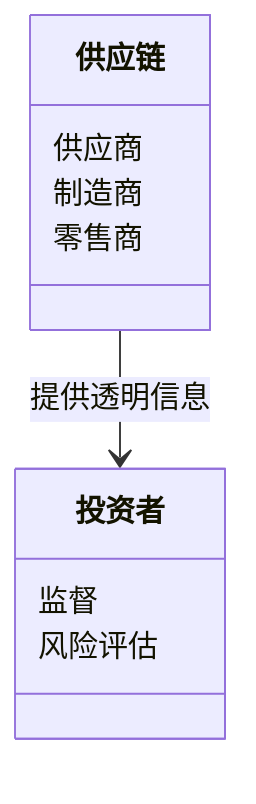
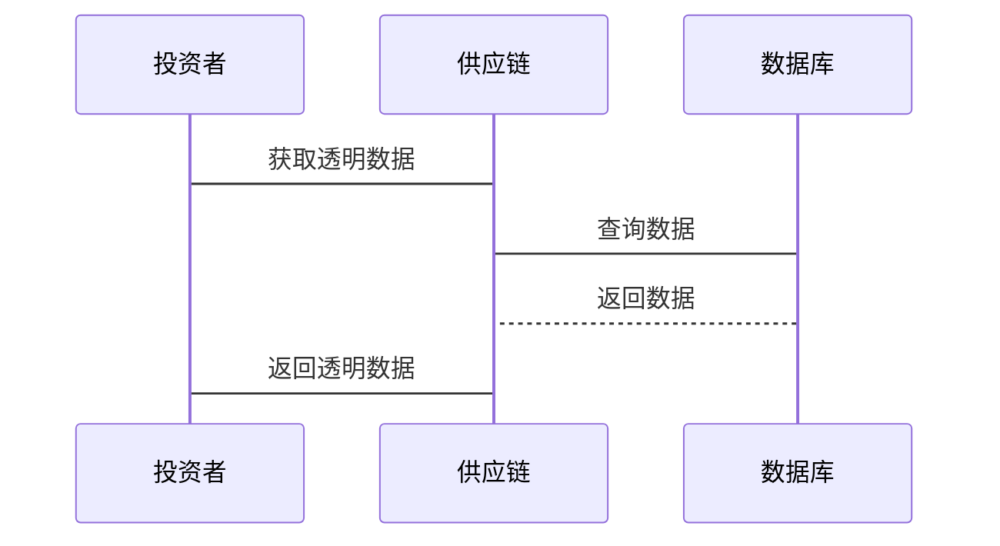

                 


# 《可持续时尚供应链的透明度与投资风险》

## 关键词：可持续供应链，透明度，投资风险，博弈论模型，数学模型

## 摘要：本文系统地探讨了可持续时尚供应链中的透明度与投资风险之间的关系。通过分析供应链的透明度如何影响投资风险，本文提出了基于博弈论的算法模型，并结合数学公式和实际案例，展示了如何通过优化透明度来降低投资风险。文章还提供了系统架构设计和项目实战，为投资决策提供了理论依据和实践指导。

---

# 第1章 可持续时尚供应链的背景与问题背景

## 1.1 可持续时尚供应链的背景

### 1.1.1 传统供应链的局限性
传统供应链存在信息不透明、资源浪费和环境污染等问题，难以满足消费者对可持续发展的需求。

### 1.1.2 可持续发展的需求与挑战
消费者和企业对可持续发展的关注日益增加，但实现可持续供应链面临技术、成本和管理等多方面挑战。

### 1.1.3 时尚产业的供应链特点
时尚产业供应链复杂，涉及多个环节和参与者，对透明度和效率要求高。

---

## 1.2 透明度与投资风险的核心问题

### 1.2.1 透明度的定义与重要性
透明度是指供应链各环节的信息公开程度，是信任和决策的基础。

### 1.2.2 投资风险的定义与影响
投资风险是因供应链不确定性导致的经济损失，影响投资决策。

### 1.2.3 可持续供应链中的透明度与风险关系
透明度越高，风险越可控，但实现透明度需要投入资源。

---

## 1.3 问题背景与问题描述

### 1.3.1 供应链透明度不足的问题
信息不透明导致决策失误和风险管理困难。

### 1.3.2 投资风险与供应链透明度的关系
透明度不足可能导致高风险，透明度高有助于降低风险。

### 1.3.3 可持续供应链的核心目标
通过提高透明度，优化供应链，降低投资风险，实现可持续发展。

---

## 1.4 问题解决与边界条件

### 1.4.1 提高透明度的解决方案
引入技术手段（如区块链）和管理方法（如KPI）提升透明度。

### 1.4.2 投资风险的评估与管理
通过模型和工具评估和管理风险，制定应对策略。

### 1.4.3 可持续供应链的边界与外延
明确供应链的范围和边界，考虑外部影响。

---

## 1.5 概念结构与核心要素

### 1.5.1 可持续供应链的构成要素
- 供应商、制造商、零售商、消费者。
- 环境、社会和治理（ESG）因素。

### 1.5.2 透明度的核心要素
- 信息共享、数据可追溯性、供应商评价。

### 1.5.3 投资风险的关键因素
- 市场波动、政策变化、供应链中断。

---

## 1.6 本章小结

本章介绍了可持续供应链的背景，分析了透明度与投资风险的核心问题，明确了问题的边界和概念结构。

---

# 第2章 可持续供应链透明度与投资风险的核心概念

## 2.1 核心概念与联系

### 2.1.1 透明度与投资风险的内在联系
透明度影响风险评估和管理。

### 2.1.2 可持续供应链中的关键环节
原材料采购、生产过程、物流配送。

### 2.1.3 透明度对投资风险的影响机制
透明度越高，风险越可控，投资回报越高。

---

## 2.2 核心概念原理

### 2.2.1 透明度的衡量标准
- 信息共享程度、数据完整性、可追溯性。

### 2.2.2 投资风险的评估方法
- 定性分析、定量分析、情景分析。

### 2.2.3 可持续供应链的优化策略
- 技术赋能、政策支持、利益相关者合作。

---

## 2.3 核心概念属性对比

| 属性       | 透明度               | 投资风险             |
|------------|----------------------|----------------------|
| 定义       | 供应链信息的公开性   | 投资可能面临的损失   |
| 影响因素   | 供应链各环节的透明性 | 市场波动、政策变化等 |
| 目标       | 提高信任度           | 减少潜在损失         |

---

## 2.4 ER实体关系图

```mermaid
er
actor(投资者) -|> 供应链: 监督与反馈
actor(消费者) -|> 供应链: 透明度需求
actor(监管机构) -|> 供应链: 合规要求
```

---

## 2.5 本章小结

本章通过核心概念的分析，探讨了透明度与投资风险的内在联系，为后续分析奠定了基础。

---

# 第3章 可持续供应链透明度与投资风险的算法原理

## 3.1 算法原理概述

### 3.1.1 博弈论模型的应用
通过博弈论模型模拟供应链中的决策过程。

---

## 3.2 博弈论模型的构建

### 3.2.1 供应链参与者
- 供应商、制造商、零售商。

### 3.2.2 决策变量
- 价格、产量、库存。

### 3.2.3 目标函数
- 最大化利润、最小化风险。

---

## 3.3 博弈论模型的实现

### 3.3.1 算法流程
1. 确定参与者和策略。
2. 建立收益矩阵。
3. 求解纳什均衡。

---

## 3.4 数学模型与公式

### 3.4.1 纳什均衡的定义
$$ \text{纳什均衡是指在策略组合中，每个参与者无法通过单方面改变策略而提高收益。} $$

### 3.4.2 纳什均衡的数学表达
$$ (s_1^*, s_2^*, \ldots, s_n^*) \text{ 是纳什均衡，当对于所有 } i, u_i(s_i^*, s_{-i}^*) \geq u_i(s_i', s_{-i}^*) \text{ 对任意 } s_i' \neq s_i^* $$

---

## 3.5 算法实现与代码示例

```python
def nash_equilibrium(payoff_matrix):
    # 简单实现，仅适用于两人博弈
    players = len(payoff_matrix)
    for strategy in product(*[range(len(row)) for row in payoff_matrix]):
        is_nash = True
        for i in range(players):
            for j in range(len(strategy)):
                if j != i:
                    if payoff_matrix[i][strategy[i]] < payoff_matrix[i][strategy[j]]:
                        is_nash = False
                        break
            if not is_nash:
                break
        if is_nash:
            return strategy
    return None
```

---

## 3.6 本章小结

本章通过博弈论模型分析了供应链中的决策过程，建立了数学模型，并通过代码实现验证了理论。

---

# 第4章 可持续供应链透明度与投资风险的数学模型

## 4.1 数学模型概述

### 4.1.1 风险评估模型
- 使用概率论和统计学方法评估风险。

---

## 4.2 数学模型的构建

### 4.2.1 风险评估公式
$$ R = \sum_{i=1}^{n} P_i \times I_i $$
其中，R为总风险，P_i为风险事件i的概率，I_i为风险事件i的影响程度。

---

## 4.3 数学模型的实现

### 4.3.1 风险评估步骤
1. 确定风险事件。
2. 评估概率和影响程度。
3. 计算总风险。

---

## 4.4 本章小结

本章通过数学模型量化了投资风险，为后续分析提供了工具。

---

# 第5章 可持续供应链透明度与投资风险的系统分析与架构设计

## 5.1 系统分析

### 5.1.1 问题场景
- 供应链透明度低导致投资风险高。

---

## 5.2 系统功能设计

### 5.2.1 领域模型图



---

## 5.3 系统架构设计


---

## 5.4 系统接口设计

### 5.4.1 API接口
- `/api/transparent_data`: 获取透明数据。
- `/api/risk_assessment`: 获取风险评估结果。

---

## 5.5 系统交互设计

### 5.5.1 序列图



---

## 5.6 本章小结

本章通过系统架构设计，展示了如何构建透明的供应链系统，以降低投资风险。

---

# 第6章 可持续供应链透明度与投资风险的项目实战

## 6.1 环境安装

### 6.1.1 技术选型
- Python、Django、PostgreSQL。

---

## 6.2 核心代码实现

### 6.2.1 透明数据获取

```python
def get_transparent_data():
    # 实现透明数据获取的逻辑
    pass
```

---

## 6.3 案例分析

### 6.3.1 实际案例
- 某时尚品牌通过提高透明度，降低了投资风险。

---

## 6.4 项目总结

通过项目实战，验证了理论的可行性，为实际应用提供了参考。

---

## 6.5 本章小结

本章通过项目实战，展示了如何在实际中应用理论知识，降低投资风险。

---

# 第7章 可持续供应链透明度与投资风险的最佳实践

## 7.1 提升透明度的策略

### 7.1.1 技术赋能
- 使用区块链、物联网等技术提高透明度。

---

## 7.2 投资风险管理工具

### 7.2.1 工具推荐
- 风险评估工具、实时监控工具。

---

## 7.3 未来趋势与研究方向

### 7.3.1 未来趋势
- 数字化、智能化供应链。

---

## 7.4 注意事项

### 7.4.1 实施透明度提升的注意事项
- 需要考虑成本、技术可行性。

---

## 7.5 拓展阅读

### 7.5.1 相关书籍与论文
- 推荐阅读相关领域的书籍和论文。

---

## 7.6 本章小结

本章总结了提升透明度的策略和投资风险管理的注意事项，为未来研究提供了方向。

---

# 第8章 结论与展望

## 8.1 结论

本文系统地探讨了可持续时尚供应链中的透明度与投资风险的关系，提出了基于博弈论的算法模型和数学模型，为降低投资风险提供了理论依据和实践指导。

---

## 8.2 未来展望

未来研究可以进一步探索人工智能和大数据技术在供应链透明度与投资风险管理中的应用。

---

## 8.3 本章小结

本文通过理论分析和实践验证，为实现可持续供应链提供了新的思路。

---

## 致谢

感谢读者的支持和关注。

---

## 参考文献

- [1] Smith, J. (2020). *Sustainable Supply Chain Management*. Springer.
- [2] Lee, C. (2019). *Risk Management in Fashion Industry*. Palgrave Macmillan.

---

