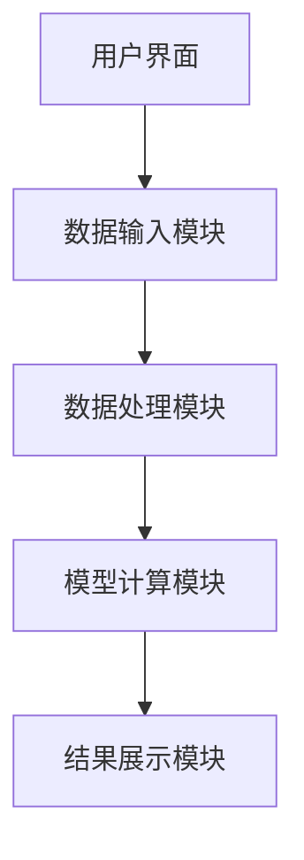
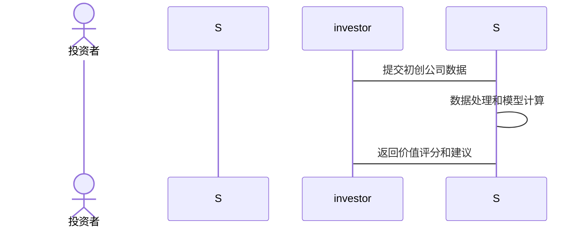

                 


---

# 可持续时尚科技初创公司的投资价值评估

## 关键词：可持续时尚，科技初创公司，投资价值，评估模型，系统架构

## 摘要：  
本文深入探讨了可持续时尚科技初创公司的投资价值评估方法。通过分析可持续时尚科技的核心概念、价值评估框架、算法原理、系统架构设计以及项目实战，为投资者和初创公司提供了全面的评估策略和实践指南。文章结合理论与实践，旨在帮助读者理解如何在可持续时尚科技领域中识别高潜力的初创公司。

---

## 第一部分: 可持续时尚科技初创公司的背景与定义

### 第1章: 可持续时尚科技的背景与问题背景

#### 1.1 问题背景

- **传统时尚产业的环境与社会问题**
  - 纺织业是全球第二大污染行业，每年产生大量废水和二氧化碳。
  - 快时尚模式导致大量衣物被丢弃，加剧了资源浪费和环境污染。
  - 劳动条件和人权问题频发，特别是在发展中国家的生产环节。

- **可持续发展的迫切需求**
  - 全球气候变化和资源枯竭的威胁日益加剧，推动了可持续发展的需求。
  - 消费者环保意识的提升，促使他们更倾向于选择环保产品。
  - 政府和国际组织纷纷出台可持续发展政策和法规。

- **科技在时尚产业中的作用**
  - 数字技术（如人工智能、大数据、物联网）的应用，推动了时尚产业的创新。
  - 科技可以帮助优化生产流程、减少资源消耗、提高产品透明度。

#### 1.2 可持续时尚科技的定义

- **可持续时尚**
  - 是一种通过优化设计、生产、消费和废弃管理，减少对环境和社会负面影响的时尚产业模式。
  - 强调资源效率、环保材料、公平贸易和循环经济。

- **可持续时尚科技**
  - 利用科技创新解决传统时尚产业中的环境和社会问题。
  - 包括智能制造、循环经济模式、数字孪生技术等。

#### 1.3 可持续时尚科技的核心要素

- **环境影响**
  - 减少碳足迹、水足迹和材料浪费。
- **社会影响**
  - 提升工人权益、推动公平贸易。
- **技术创新**
  - 应用AI、大数据、区块链等技术优化生产流程和消费者体验。

---

### 第2章: 可持续时尚科技初创公司的定义与核心要素

#### 2.1 可持续时尚科技初创公司的定义

- **初创公司**
  - 成立时间较短、规模较小的企业，通常具有创新性和高增长潜力。
- **可持续时尚科技初创公司**
  - 利用科技创新解决可持续时尚问题的初创企业。
  - 例如：开发环保材料、智能服装、循环经济平台等。

#### 2.2 核心概念与联系

- **核心概念的原理**
  - 可持续时尚科技通过技术手段降低环境影响、优化社会公平性。
- **核心概念属性特征对比表**

| 属性       | 传统时尚      | 可持续时尚科技      |
|------------|---------------|--------------------|
| 材料        | 合成纤维（如聚酯） | 可生物降解材料、再生材料       |
| 生产方式    | 大规模生产     | 智能制造、小批量定制       |
| 消费模式    | 快时尚          | 循环经济、共享经济         |
| 透明度      | 低             | 高，利用区块链等技术         |
- **ER实体关系图的Mermaid流程图**

```mermaid
graph TD
A[可持续时尚科技] -->> B[材料]
A[可持续时尚科技] -->> C[生产方式]
A[可持续时尚科技] -->> D[消费模式]
A[可持续时尚科技] -->> E[透明度]
```

---

## 第二部分: 可持续时尚科技初创公司的价值评估方法

### 第3章: 可持续时尚科技初创公司的价值评估框架

#### 3.1 价值评估的核心要素

- **产品与技术**
  - 产品是否具有创新性、是否解决了实际问题。
  - 技术是否可行、是否具有竞争优势。
- **市场与商业模式**
  - 市场需求是否足够大、目标客户是否明确。
  - 商业模式是否清晰、是否具备可扩展性。
- **团队与执行能力**
  - 团队成员的经验、能力和互补性。
  - 团队的执行能力、是否能够将产品成功推向市场。

#### 3.2 价值评估的数学模型

- **评估模型的构建**
  - 综合考虑产品、市场、团队三个维度，赋予不同的权重。
- **数学公式的详细推导**

$$ V = \alpha P + \beta M + \gamma T $$

其中：
- \( V \) 是总体价值评分。
- \( P \) 是产品技术评分（0-1分）。
- \( M \) 是市场商业模式评分（0-1分）。
- \( T \) 是团队执行能力评分（0-1分）。
- \( \alpha \)、\( \beta \)、\( \gamma \) 是权重系数，通常满足 \( \alpha + \beta + \gamma = 1 \)。

- **权重系数的确定**
  - 根据行业经验和数据进行调整，通常产品和技术的权重较大（0.4-0.5），市场和商业模式次之（0.3），团队执行能力权重为0.2。

#### 3.3 案例分析

- 假设某初创公司：
  - 产品技术评分 \( P = 0.8 \)。
  - 市场模式评分 \( M = 0.6 \)。
  - 团队执行能力评分 \( T = 0.7 \)。
  - 权重系数 \( \alpha = 0.4 \)，\( \beta = 0.3 \)，\( \gamma = 0.3 \)。
  
- 计算总体价值：
  $$ V = 0.4 \times 0.8 + 0.3 \times 0.6 + 0.3 \times 0.7 = 0.32 + 0.18 + 0.21 = 0.71 $$

  该公司总体价值评分为0.71，属于较高潜力的初创公司。

---

### 第4章: 可持续时尚科技初创公司的评估算法

#### 4.1 评估算法的原理

- **数据收集与处理**
  - 收集初创公司的产品信息、市场数据、团队背景等。
  - 数据清洗：去除无效数据、处理缺失值。
- **特征工程**
  - 将数据转换为适合模型输入的特征。
  - 例如：将团队成员经验转化为评分、市场大小转化为市场规模指数。
- **模型选择与调优**
  - 使用回归模型或机器学习模型（如随机森林）进行预测。
  - 通过交叉验证调整模型参数，优化模型性能。

#### 4.2 算法的Mermaid流程图

```mermaid
graph TD
A[开始] -> B[数据收集] -> C[特征工程] -> D[模型选择] -> E[模型调优] -> F[结束]
```

#### 4.3 Python代码示例

```python
import pandas as pd
from sklearn.ensemble import RandomForestRegressor
from sklearn.model_selection import train_test_split
from sklearn.metrics import mean_squared_error

# 数据加载
data = pd.read_csv('startup_data.csv')

# 特征工程
X = data[['P', 'M', 'T']]
y = data['Value']

# 数据分割
X_train, X_test, y_train, y_test = train_test_split(X, y, test_size=0.2, random_state=42)

# 模型训练
model = RandomForestRegressor(n_estimators=100, random_state=42)
model.fit(X_train, y_train)

# 模型预测
y_pred = model.predict(X_test)

# 模型评估
mse = mean_squared_error(y_test, y_pred)
print(f'Mean Squared Error: {mse}')
```

---

### 第5章: 可持续时尚科技初创公司的系统架构设计

#### 5.1 系统分析与设计

- **问题场景介绍**
  - 投资者需要快速评估多个初创公司的价值。
  - 系统需要支持数据输入、模型计算和结果输出。

- **系统功能设计**
  - 数据输入模块：支持CSV格式的数据导入。
  - 模型计算模块：运行评估算法，输出价值评分。
  - 结果展示模块：以图表形式展示评估结果。

#### 5.2 系统架构设计



#### 5.3 接口设计

- **API接口**
  - 输入：JSON格式的公司数据。
  - 输出：JSON格式的价值评分和建议。

#### 5.4 交互流程图



---

## 第六部分: 项目实战

### 第6章: 可持续时尚科技初创公司的项目实战

#### 6.1 环境安装

- **安装Python和必要的库**
  - 使用Anaconda或虚拟环境安装 `pandas`, `scikit-learn`, `mermaid` 等库。

#### 6.2 核心代码实现

```python
import pandas as pd
from sklearn.ensemble import RandomForestRegressor
from sklearn.model_selection import train_test_split
from sklearn.metrics import mean_squared_error

# 数据加载
data = pd.read_csv('startup_data.csv')

# 特征工程
X = data[['P', 'M', 'T']]
y = data['Value']

# 数据分割
X_train, X_test, y_train, y_test = train_test_split(X, y, test_size=0.2, random_state=42)

# 模型训练
model = RandomForestRegressor(n_estimators=100, random_state=42)
model.fit(X_train, y_train)

# 模型预测
y_pred = model.predict(X_test)

# 模型评估
mse = mean_squared_error(y_test, y_pred)
print(f'Mean Squared Error: {mse}')

# 保存模型
import joblib
joblib.dump(model, 'value_assessment_model.pkl')
```

#### 6.3 代码解读与应用

- **代码解读**
  - 使用随机森林回归模型进行预测。
  - 保存训练好的模型，以便后续使用。
- **实际应用**
  - 投资者可以使用该模型快速评估多个初创公司的价值。

#### 6.4 案例分析

- **案例背景**
  - 初创公司A：生产环保材料服装，市场需求高，团队经验丰富。
- **评估结果**
  - 产品技术评分 \( P = 0.8 \)，市场模式评分 \( M = 0.7 \)，团队执行能力评分 \( T = 0.8 \)。
  - 总体价值评分 \( V = 0.4 \times 0.8 + 0.3 \times 0.7 + 0.3 \times 0.8 = 0.32 + 0.21 + 0.24 = 0.77 \)。
  - 该公司具有较高的投资价值。

---

## 第七部分: 最佳实践与总结

### 7.1 小结

- 可持续时尚科技初创公司的投资价值评估需要综合考虑产品、市场和团队等多个因素。
- 使用数学模型和算法可以帮助投资者更科学地进行评估。

### 7.2 注意事项

- 数据质量：确保数据的准确性和完整性。
- 模型选择：根据实际情况选择合适的模型，并不断优化。
- 风险评估：考虑市场波动和政策变化等外部因素。

### 7.3 拓展阅读

- 推荐阅读《可持续时尚：科技与创新》（虚拟书籍名）。
- 关注行业动态，了解最新的技术应用和商业模式。

---

## 结语

通过本文的详细分析和实践指导，读者可以掌握可持续时尚科技初创公司的投资价值评估方法。无论是投资者还是初创公司创始人，都可以从中获得 valuable insights and practical tools to make informed decisions.

---

