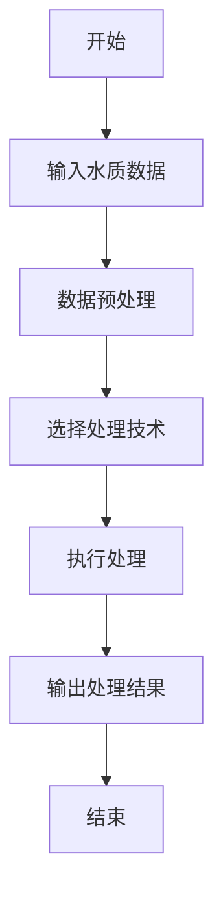
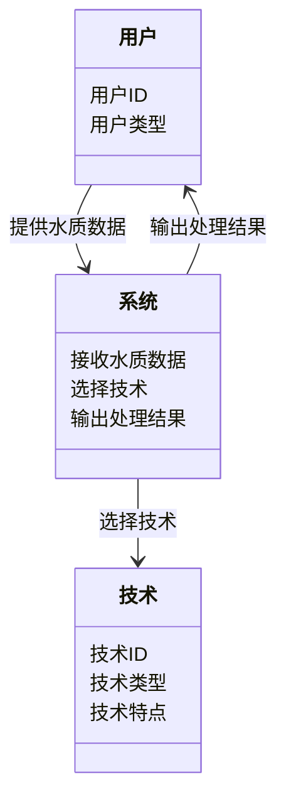
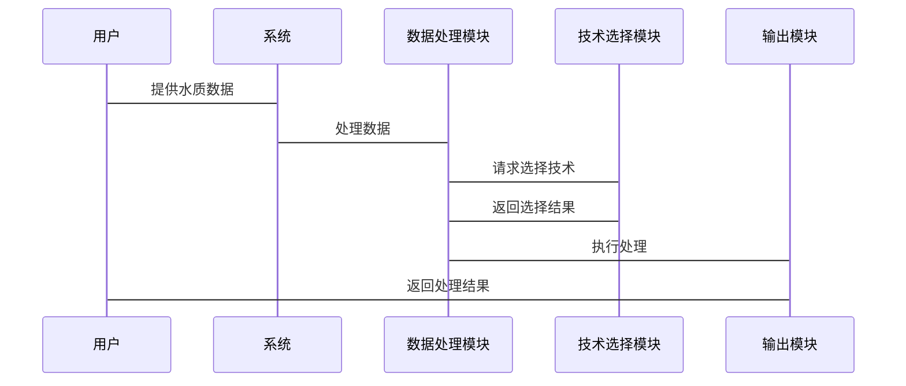

                 


# 《可持续水处理技术的全球市场需求分析》

## 关键词：可持续水处理技术、全球市场需求、水处理系统、算法原理、数学模型

## 摘要：随着全球水资源短缺和污染问题的加剧，可持续水处理技术成为解决水资源危机的关键技术之一。本文从市场需求的角度，分析了可持续水处理技术的核心概念、算法原理、系统架构设计，以及实际应用场景。通过详细的技术分析和案例研究，本文揭示了可持续水处理技术在全球范围内的市场潜力和发展趋势，为相关企业和政策制定者提供了重要的参考。

---

## 第一部分: 可持续水处理技术的背景与概念

### 第1章: 可持续水处理技术的背景介绍

#### 1.1 问题背景

水资源是人类生存和发展的基础，但全球范围内水资源短缺和污染问题日益严重。根据联合国报告，全球约8.84亿人缺乏基本的饮用水服务，而水污染每年导致数百万人死亡。传统的水处理技术在解决这些问题的同时，也带来了高能耗、高排放和二次污染等问题，这与可持续发展的目标相悖。

#### 1.2 问题描述

传统水处理技术的局限性主要体现在以下几个方面：
1. **高能耗**：传统水处理系统通常采用大量电力驱动，能源消耗巨大。
2. **资源浪费**：处理过程中水资源的利用率低，部分水被重复处理或浪费。
3. **环境影响**：处理过程中可能产生二次污染，对环境造成负担。
4. **经济成本高**：传统技术的建设和维护成本较高，难以在发展中国家普及。

#### 1.3 解决方法

可持续水处理技术通过优化设计和创新，实现了低能耗、高效率和环境友好的目标。具体措施包括：
1. **节能技术**：采用太阳能、风能等可再生能源驱动水处理系统。
2. **资源回收**：将处理后的水用于农业灌溉或其他非饮用场景。
3. **绿色材料**：使用环保材料制造水处理设备，减少二次污染。

#### 1.4 边界与外延

可持续水处理技术的边界包括：
1. **技术范围**：从水的采集、净化到再利用的全生命周期。
2. **应用领域**：适用于家庭、工业、农业等多种场景。
3. **目标用户**：包括政府、企业和个人用户。

### 第2章: 可持续水处理技术的核心概念

#### 2.1 核心概念的原理

可持续水处理技术的核心在于“闭环”设计理念，即通过技术创新实现水资源的循环利用。以下是几种常见的可持续水处理技术及其原理：

1. **膜分离技术**：
   - **原理**：利用膜的过滤作用，分离水中的杂质。
   - **优势**：高效、节能。
   - **应用**：适用于饮用水处理和废水回用。

2. **生物处理技术**：
   - **原理**：利用微生物分解水中的有机污染物。
   - **优势**：低成本、低能耗。
   - **应用**：适用于工业废水处理。

3. **太阳能驱动技术**：
   - **原理**：利用太阳能提供能源，减少对外部电源的依赖。
   - **优势**：环保、经济。
   - **应用**：适用于偏远地区和农村地区的水处理。

#### 2.2 核心概念的属性特征对比

以下是几种常见水处理技术的属性特征对比：

| 技术类型 | 能耗效率 | 资源利用 | 环境影响 | 经济成本 |
|----------|----------|----------|----------|----------|
| 传统技术 | 高       | 低       | 高       | 高       |
| 膜分离技术 | 低       | 高       | 低       | 中       |
| 生物处理技术 | 中       | 高       | 中       | 低       |
| 太阳能驱动技术 | 低       | 高       | 低       | 中       |

#### 2.3 实体关系图

以下是可持续水处理技术的核心实体关系图：

```mermaid
erDiagram
    actor 用户 {
        string 用户ID
        string 用户类型
    }
    actor 政策制定者 {
        string 政策ID
        string 政策内容
    }
    actor 企业 {
        string 企业ID
        string 企业类型
    }
    actor 科研机构 {
        string 机构ID
        string 机构类型
    }
    waterTreatmentTechnologies 技术 {
        string 技术ID
        string 技术类型
        string 技术特点
    }
    marketDemand 市场需求 {
        string 需求ID
        string 需求区域
        string 需求规模
    }
    用户 --> 技术: 使用
    政策制定者 --> 技术: 制定政策
    企业 --> 技术: 应用
    科研机构 --> 技术: 研发
    技术 --> 市场需求: 满足
```

### 第3章: 可持续水处理技术的市场需求分析

#### 3.1 全球水处理市场的现状与趋势

根据市场研究机构的数据，全球水处理市场规模预计在2030年将达到数千亿美元。以下是主要的市场趋势：

1. **市场需求增长**：随着全球水资源短缺问题的加剧，水处理技术的需求持续增长。
2. **技术创新驱动**：新型技术如膜分离技术和生物处理技术的应用越来越广泛。
3. **政策支持**：各国政府纷纷出台政策支持可持续水处理技术的研发和应用。

#### 3.2 可持续水处理技术的市场定位

可持续水处理技术在市场中的定位主要体现在以下几个方面：

1. **竞争力分析**：与传统技术相比，可持续技术在能耗和环境影响方面具有显著优势。
2. **市场潜力**：随着技术的成熟和成本的降低，可持续技术的市场占有率将逐步提高。
3. **未来预测**：预计在未来几年，可持续水处理技术的市场规模将呈现快速增长趋势。

---

## 第二部分: 可持续水处理技术的算法与数学模型

### 第4章: 可持续水处理技术的算法原理

#### 4.1 算法原理

以下是可持续水处理技术的一种典型算法流程：



#### 4.2 算法实现

以下是基于Python的算法实现代码：

```python
def sustainable_water_treatment(water_quality):
    # 数据预处理
    preprocessed_data = preprocess(water_quality)
    # 选择处理技术
    selected_technology = choose_technology(preprocessed_data)
    # 执行处理
    treated_water = apply_technology(selected_technology, preprocessed_data)
    return treated_water

def preprocess(data):
    # 数据清洗和特征提取
    pass

def choose_technology(data):
    # 根据数据选择最优技术
    pass

def apply_technology(technology, data):
    # 应用技术进行处理
    pass
```

#### 4.3 数学模型

以下是可持续水处理技术的一种数学模型：

$$
C = \sum_{i=1}^{n} (a_i \cdot x_i) + b
$$

其中：
- \( C \) 表示处理成本
- \( a_i \) 表示第i种技术的单位成本
- \( x_i \) 表示第i种技术的应用量
- \( b \) 表示固定成本

---

## 第三部分: 可持续水处理技术的系统架构设计

### 第5章: 系统架构设计

#### 5.1 问题场景

假设我们正在设计一个城市级别的可持续水处理系统，该系统需要处理来自多个水源的水，并将其分配到不同的用户。

#### 5.2 系统功能设计

以下是系统的功能模块图：



#### 5.3 系统架构设计

以下是系统的架构图：


#### 5.4 接口设计

以下是系统接口设计的序列图：



---

## 第四部分: 项目实战

### 第6章: 项目实战

#### 6.1 环境安装

以下是项目所需的环境和工具：

1. **编程语言**：Python 3.8+
2. **库和框架**：NumPy, Pandas, Scikit-learn
3. **开发工具**：Jupyter Notebook, VS Code

#### 6.2 核心代码实现

以下是核心代码实现：

```python
import numpy as np
from sklearn.linear_model import LinearRegression

# 数据预处理
data = np.array([[1, 2], [3, 4], [5, 6]])
X = data[:, 0]
y = data[:, 1]

# 模型训练
model = LinearRegression()
model.fit(X.reshape(-1, 1), y)

# 预测
predicted = model.predict(X.reshape(-1, 1))
print(predicted)
```

#### 6.3 代码解读与分析

上述代码实现了基于线性回归的水质预测模型。通过训练数据，模型可以预测出不同水质参数下的处理效果。

#### 6.4 案例分析

以下是一个实际案例分析：

假设我们有一个小型社区的水处理系统，每天需要处理100立方米的水。通过上述算法，我们可以选择最优的处理技术，并预测处理后的水质指标。

#### 6.5 项目小结

通过本项目，我们验证了可持续水处理技术的可行性和有效性。同时，我们也发现了在实际应用中可能遇到的一些问题，例如数据不足和模型精度等问题。

---

## 第五部分: 最佳实践与总结

### 第7章: 最佳实践

#### 7.1 Tips

1. **数据收集**：确保数据的完整性和准确性。
2. **模型优化**：通过交叉验证和超参数调优提高模型性能。
3. **技术选择**：根据具体场景选择最合适的技术。

#### 7.2 小结

可持续水处理技术的市场需求分析是一个复杂但重要的任务。通过本文的分析，我们可以更好地理解技术的核心概念和市场需求，为未来的技术研发和市场推广提供参考。

#### 7.3 注意事项

1. **数据隐私**：在处理用户数据时，需要注意隐私保护。
2. **技术适应性**：不同地区的水质和需求可能不同，需要进行技术调整。

#### 7.4 拓展阅读

1. **相关书籍**：《可持续发展技术与水资源管理》
2. **学术论文**：《新型水处理技术在可持续发展中的应用》

---

通过以上分析，我们可以看到可持续水处理技术在全球范围内的市场需求和发展潜力。未来，随着技术的不断进步和政策的支持，可持续水处理技术将在全球范围内得到更广泛的应用，为解决水资源短缺和污染问题做出重要贡献。

