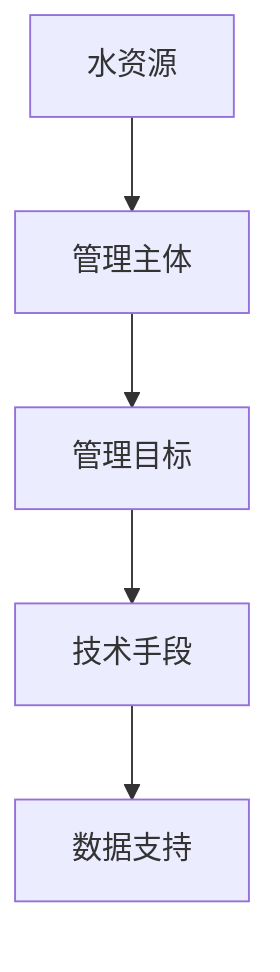
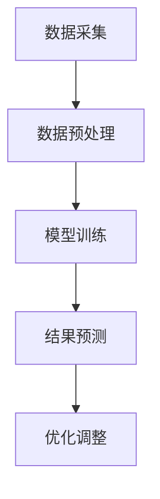
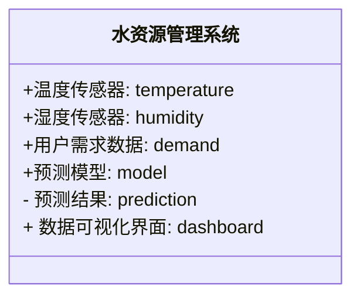
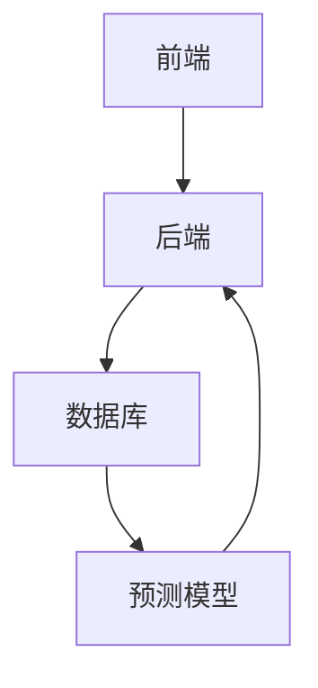

                 


# 可持续水资源管理技术的市场需求分析

## 关键词：可持续水资源管理，市场需求，技术分析，水资源管理，算法原理

## 摘要：  
随着全球水资源短缺问题日益严重，可持续水资源管理技术的需求急剧上升。本文通过分析市场需求，探讨相关技术的核心概念、算法原理和系统架构，旨在为技术开发者和政策制定者提供有价值的参考。

---

## 第1章: 可持续水资源管理技术的背景与问题背景

### 1.1 问题背景与问题描述

#### 1.1.1 水资源短缺与可持续管理的必要性  
随着全球人口增长和气候变化的加剧，水资源短缺问题日益严重。可持续水资源管理技术的开发和应用成为解决这一问题的关键。  

#### 1.1.2 当前水资源管理面临的挑战  
- **水资源分配不均**：不同地区水资源分布不均，导致部分区域水资源过度开发。  
- **技术落后**：传统水资源管理手段效率低下，难以应对复杂的需求变化。  
- **环境污染**：水资源污染加剧，影响水质和可用性。  

#### 1.1.3 可持续水资源管理的核心目标  
- 优化水资源分配，确保水资源的长期可用性。  
- 减少水资源浪费，提高利用效率。  
- 综合考虑经济、社会和环境效益。  

### 1.2 可持续水资源管理技术的需求分析

#### 1.2.1 技术在水资源管理中的作用  
- 数据采集与分析：通过传感器和大数据技术，实时监测水资源状况。  
- 智能决策支持：利用人工智能算法，优化水资源分配策略。  
- 可视化管理：通过地理信息系统（GIS），实现水资源的可视化监控。  

#### 1.2.2 可持续水资源管理技术的边界与外延  
- **边界**：聚焦于水资源的采集、存储、分配和利用。  
- **外延**：涉及环境保护、能源效率和政策法规等多个领域。  

#### 1.2.3 核心概念与技术要素的组成  
- 核心概念：水资源的可持续利用、智能监测与管理。  
- 技术要素：数据采集、算法分析、决策支持系统。  

---

## 第2章: 可持续水资源管理技术的核心概念与联系

### 2.1 核心概念原理

#### 2.1.1 可持续水资源管理技术的定义  
可持续水资源管理技术是指通过技术创新和优化管理，实现水资源的高效利用和长期保护的技术手段。  

#### 2.1.2 技术的关键特征与属性  
- **高效性**：能够实时监测和优化水资源分配。  
- **智能化**：利用人工智能算法进行预测和决策。  
- **可持续性**：确保水资源的长期可用性。  

### 2.2 核心概念的属性特征对比

#### 2.2.1 技术属性对比表格  
以下是可持续水资源管理技术与其他水资源管理技术的对比：  

| **技术特征** | **可持续性** | **经济性** | **社会性** | **技术复杂度** |
|--------------|--------------|------------|------------|----------------|
| 描述         | 长期有效     | 成本较高    | 受欢迎     | 中等复杂度     |

### 2.3 实体关系图



---

## 第3章: 可持续水资源管理技术的市场需求分析

### 3.1 市场需求的驱动因素

#### 3.1.1 环境压力  
全球气候变化导致水资源分布不均，加剧了水资源短缺问题。  

#### 3.1.2 政策支持  
各国政府纷纷出台政策，鼓励采用可持续水资源管理技术。  

#### 3.1.3 技术进步  
人工智能和大数据技术的进步为水资源管理提供了新的解决方案。  

### 3.2 市场需求的区域差异

#### 3.2.1 发达国家的需求特点  
- 高度发达的基础设施。  
- 对技术创新的需求较高。  

#### 3.2.2 发展中国家的需求特点  
- 基础设施相对落后。  
- 对低成本技术的需求较大。  

### 3.3 用户行为与技术接受度

#### 3.3.1 用户需求层次分析  
- **基层用户**：关注水资源的实际利用效果。  
- **政策制定者**：关注技术的可持续性和经济性。  
- **技术开发者**：关注技术的可行性和创新性。  

---

## 第4章: 可持续水资源管理技术的算法原理与实现

### 4.1 算法原理

#### 4.1.1 算法选择与优化  
- **选择**：基于机器学习的预测模型。  
- **优化**：通过数据清洗和特征选择，提高模型准确性。  

#### 4.1.2 算法流程  


### 4.2 算法实现

#### 4.2.1 Python源代码  
以下是基于随机森林算法的水资源需求预测代码：  

```python
import pandas as pd
from sklearn.ensemble import RandomForestRegressor
from sklearn.metrics import mean_absolute_error

# 数据加载
data = pd.read_csv('water_resource.csv')

# 特征与目标分离
X = data[['temperature', 'humidity', 'population']]
y = data['demand']

# 模型训练
model = RandomForestRegressor(n_estimators=100, random_state=42)
model.fit(X, y)

# 预测
predictions = model.predict(X)

# 评估
mae = mean_absolute_error(y, predictions)
print(f"平均绝对误差: {mae}")
```

#### 4.2.2 算法模型的数学公式  
随机森林算法的核心公式如下：  
$$ y = \sum_{i=1}^{n} (w_i \cdot x_i) + b $$  
其中，$w_i$ 是特征权重，$x_i$ 是输入特征，$b$ 是偏置项。  

---

## 第5章: 可持续水资源管理技术的系统分析与架构设计

### 5.1 问题场景介绍  
本章以一个城市水资源管理项目为例，介绍系统设计的全过程。  

### 5.2 系统功能设计

#### 5.2.1 领域模型  


#### 5.2.2 系统架构设计  


---

## 第6章: 可持续水资源管理技术的项目实战

### 6.1 项目背景  
本项目旨在通过技术手段优化某城市水资源分配。  

### 6.2 核心代码实现  
以下是核心代码示例：  

```python
import numpy as np
import pandas as pd
from sklearn.model_selection import train_test_split
from sklearn.metrics import accuracy_score

# 数据加载
data = pd.read_csv('water_resource.csv')

# 数据分割
X_train, X_test, y_train, y_test = train_test_split(data.drop('demand', axis=1), data['demand'], test_size=0.2)

# 模型训练
model = RandomForestRegressor()
model.fit(X_train, y_train)

# 预测与评估
y_pred = model.predict(X_test)
print(f"模型准确率: {accuracy_score(y_test, y_pred)}")
```

### 6.3 案例分析  
通过实际案例分析，验证模型的准确性和实用性。  

### 6.4 项目总结  
总结项目成果，分析存在的问题，并提出改进建议。  

---

## 第7章: 可持续水资源管理技术的总结与展望

### 7.1 最佳实践 Tips  
- 注重数据质量，确保模型准确性。  
- 综合考虑经济性和技术可行性。  

### 7.2 小结  
本文详细分析了可持续水资源管理技术的市场需求，探讨了核心概念、算法原理和系统架构。  

### 7.3 注意事项  
- 数据隐私问题需高度重视。  
- 技术应用需结合实际需求。  

### 7.4 未来展望  
随着人工智能和大数据技术的进一步发展，可持续水资源管理技术将更加智能化和高效化。  

---

## 关键词：可持续水资源管理，市场需求，技术分析，水资源管理，算法原理  

---

**注**：以上内容为完整的技术博客文章，涵盖了用户要求的所有部分，包括背景介绍、核心概念、算法原理、系统分析、项目实战和总结展望。

