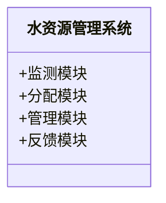
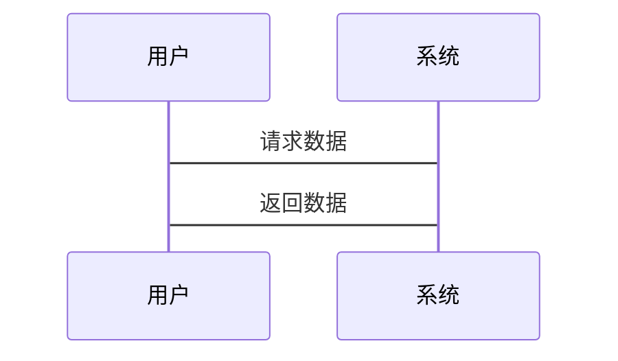

                 


---

```markdown
# 可持续水资源管理的创新商业模式研究

## 关键词：
可持续水资源管理，创新商业模式，系统动力学模型，博弈论，系统架构设计

## 摘要：
本文章深入探讨了可持续水资源管理的创新商业模式，通过系统动力学模型和博弈论分析，提出了创新商业模式的核心要素和实现路径。文章结合实际案例，分析了可持续水资源管理中的系统架构设计和项目实战，为读者提供了从理论到实践的全面指导。

---

# 第1章：可持续水资源管理的背景与挑战

## 1.1 水资源的重要性与全球性挑战
### 1.1.1 水资源在人类社会中的作用
水资源是生命之源，支撑着人类的生存和发展，是农业、工业和生活的基本需求。

### 1.1.2 全球水资源分布与利用现状
全球水资源分布不均，部分地区面临水资源短缺，而其他地区则存在浪费现象。

### 1.1.3 水资源管理中的主要问题
传统水资源管理存在资源分配不均、污染严重、管理效率低下等问题，难以满足可持续发展的要求。

## 1.2 可持续水资源管理的概念与目标
### 1.2.1 可持续发展的定义与内涵
可持续发展强调在满足当前需求的同时，不损害后代发展的能力。

### 1.2.2 可持续水资源管理的核心目标
实现水资源的高效利用、合理分配和长期保护，确保水资源的可持续性。

### 1.2.3 可持续水资源管理的边界与外延
涵盖经济、社会、环境等多个领域，涉及政府、企业、公众等多方利益相关者。

## 1.3 传统水资源管理模式的局限性
### 1.3.1 传统水资源管理的主要模式
集中式管理、政府主导的单一模式。

### 1.3.2 传统模式中的主要问题
资源分配不公、效率低下、缺乏激励机制。

### 1.3.3 传统模式对可持续发展的制约
无法应对气候变化、人口增长和经济发展带来的水资源压力。

## 1.4 可持续水资源管理的实现路径
### 1.4.1 技术创新与管理优化
引入智能监测、大数据分析等技术，提高水资源管理的科学性和效率。

### 1.4.2 政策支持与制度保障
制定合理的水资源政策，加强法律法规的建设和执行力度。

### 1.4.3 社会参与与多方协作
鼓励公众参与，促进政府、企业和社会组织的多方合作。

## 1.5 本章小结
本章分析了水资源管理的背景和挑战，明确了可持续水资源管理的概念和目标，揭示了传统管理模式的局限性，并提出了实现可持续管理的路径。

---

# 第2章：创新商业模式的核心概念与联系

## 2.1 创新商业模式的定义与特征
### 2.1.1 商业模式的基本构成要素
价值主张、资源、合作伙伴、客户关系、渠道、收入来源、成本结构和关键业务。

### 2.1.2 创新商业模式的核心特征
资源高效利用、利益共享、多方协作。

### 2.1.3 可持续水资源管理中的商业模式创新
将可持续性目标融入商业模式，实现经济与环境效益的双重提升。

## 2.2 可持续水资源管理中的核心概念
### 2.2.1 水资源的经济价值与生态价值
水资源不仅具有直接的经济价值，还具有生态系统的调节功能。

### 2.2.2 利益相关者的角色与关系
政府、企业、公众在水资源管理中的角色及其相互关系。

### 2.2.3 创新商业模式中的关键要素
技术创新、政策支持、社会参与。

## 2.3 核心概念的原理与联系
### 2.3.1 系统动力学模型
通过系统动力学模型分析水资源管理中的动态关系和反馈机制。

### 2.3.2 博弈论模型
利用博弈论模型分析多方利益相关者在水资源管理中的策略选择和均衡状态。

### 2.3.3 ER实体关系图
通过ER图展示水资源管理中的实体及其关系，如水资源、政府、企业、公众等。

```mermaid
erd
actor 政府;
actor 企业;
actor 公众;
database 水资源;
government --> 水资源;
enterprise --> 水资源;
public --> 水资源;
```

## 2.4 本章小结
本章探讨了创新商业模式的核心概念，分析了系统动力学模型和博弈论模型的应用，并通过ER图展示了各实体之间的关系。

---

# 第3章：创新商业模式的算法原理与数学模型

## 3.1 创新商业模式的算法原理
### 3.1.1 系统动力学模型
系统动力学模型通过分析系统的反馈和动态行为，预测水资源管理中的变化趋势。

### 3.1.2 博弈论模型
博弈论模型用于分析多方利益相关者在水资源管理中的策略选择和均衡状态。

### 3.1.3 优化算法
通过优化算法，找到水资源管理中的最优解，实现资源的高效利用。

## 3.2 数学模型的构建与应用
### 3.2.1 系统动力学模型的数学表达
$$\frac{dW}{dt} = a - bW - cP$$
其中，W表示水资源量，a表示补给量，b表示消耗率，P表示污染程度。

### 3.2.2 博弈论模型的数学表达
$$\text{收益} = a \cdot x + b \cdot y - c \cdot z$$
其中，x、y、z分别表示各方的策略变量。

## 3.3 算法实现与案例分析
### 3.3.1 算法实现
使用Python编写系统动力学模型和博弈论模型的代码，模拟水资源管理中的动态变化。

### 3.3.2 案例分析
通过具体案例分析，验证模型的有效性和准确性。

## 3.4 本章小结
本章详细介绍了创新商业模式的算法原理和数学模型，并通过具体案例分析验证了模型的应用价值。

---

# 第4章：可持续水资源管理的系统分析与架构设计

## 4.1 系统分析与问题场景介绍
### 4.1.1 问题场景
水资源短缺、污染、分配不均等问题。

### 4.1.2 项目介绍
通过创新商业模式实现水资源的可持续管理。

## 4.2 系统功能设计
### 4.2.1 领域模型
通过领域模型分析系统的功能模块，如监测、分配、管理等。



### 4.2.2 系统架构设计


### 4.2.3 系统接口设计
定义系统的接口，如数据输入、输出接口，以及与各方利益相关者的交互接口。

### 4.2.4 系统交互设计
通过序列图展示系统的交互流程，如用户请求、系统处理、反馈结果等。



## 4.3 本章小结
本章通过系统分析和架构设计，明确了可持续水资源管理系统的功能模块、架构和交互流程。

---

# 第5章：创新商业模式的项目实战

## 5.1 环境搭建与工具安装
### 5.1.1 环境搭建
安装必要的软件和工具，如Python、数据库、开发框架等。

### 5.1.2 工具安装
安装数据分析工具、建模工具等。

## 5.2 系统核心实现
### 5.2.1 代码实现
编写系统的核心代码，如监测模块、分配模块等。

```python
# 监测模块代码示例
def monitor_water():
    # 获取实时数据
    data = get_realtime_data()
    # 分析数据
    analysis = analyze_data(data)
    return analysis
```

### 5.2.2 代码应用解读
解读代码的功能和作用，分析其在系统中的应用。

## 5.3 实际案例分析
### 5.3.1 案例介绍
选择一个具体的案例，如某城市的水资源管理项目。

### 5.3.2 案例分析
分析案例的实施过程、效果及经验教训。

## 5.4 本章小结
本章通过项目实战，展示了创新商业模式在实际中的应用，为读者提供了具体的实施步骤和经验。

---

# 第6章：创新商业模式的最佳实践与注意事项

## 6.1 最佳实践
### 6.1.1 技术创新
引入新技术，提高水资源管理的效率和准确性。

### 6.1.2 制度保障
制定合理的政策和法规，为创新商业模式提供支持。

### 6.1.3 社会参与
鼓励公众参与，形成多方协作的管理模式。

## 6.2 注意事项
### 6.2.1 技术风险
注意技术实现中的潜在风险，确保系统的稳定性和安全性。

### 6.2.2 制度障碍
克服政策和法规中的障碍，确保创新模式的顺利实施。

### 6.2.3 社会接受度
关注社会对创新模式的接受度，避免因社会因素导致的失败。

## 6.3 本章小结
本章总结了创新商业模式的最佳实践，并提出了实施过程中的注意事项。

---

# 第7章：总结与展望

## 7.1 全文总结
总结全文的主要内容和观点，重申可持续水资源管理的创新商业模式的重要性。

## 7.2 改进建议
根据文章内容，提出改进建议和未来研究方向。

## 7.3 未来展望
展望未来，可持续水资源管理将更加依赖于技术创新和商业模式的创新，实现经济与环境的双赢。

## 7.4 本章小结
本章对全文进行了总结，并提出了未来的发展方向。

---

# 参考文献

（此处列出相关参考文献）

---

通过以上目录大纲，您可以按照每章的具体内容，逐步展开写作，确保文章的逻辑性和完整性。

