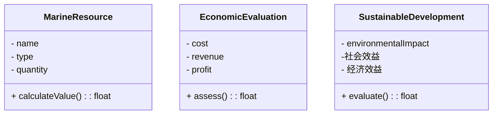

                 


# 可持续海洋资源开发的经济效益评估

> 关键词：可持续发展、海洋资源、经济效益评估、环境保护、经济模型

> 摘要：本文探讨了可持续海洋资源开发的经济效益评估方法，通过分析海洋资源开发的核心概念、经济评估模型、系统架构设计和实际案例，提供了全面的指导。文章结合理论与实践，展示了如何在保护环境的同时实现经济利益的最大化。

---

## 第1章 可持续海洋资源开发的背景与问题描述

### 1.1 可持续海洋资源开发的背景

海洋作为地球上最大的生态系统，蕴含着丰富的资源和潜在的经济价值。然而，过度开发和不合理利用导致海洋资源枯竭、生态环境恶化等问题。可持续发展成为解决这一矛盾的关键。

#### 1.1.1 海洋资源的重要性
- 海洋覆盖了地球表面的70%以上，是生命之源。
- 海洋资源包括渔业、能源、矿产等多种类型，对全球经济贡献巨大。

#### 1.1.2 可持续发展的概念与内涵
- 可持续发展强调在满足当代需求的同时，不损害后代发展的能力。
- 在海洋资源开发中，可持续发展要求在资源利用和环境保护之间找到平衡。

#### 1.1.3 开发面临的挑战
- 环境保护与经济利益的冲突。
- 技术局限性和资源分配不均的问题。

### 1.2 经济效益评估的核心问题

#### 1.2.1 经济效益的定义与内涵
- 经济效益指资源开发带来的经济收益与成本的比较。
- 包括直接收益和间接效益，如就业机会、技术创新等。

#### 1.2.2 可持续开发中的经济矛盾
- 短期经济利益与长期生态平衡的冲突。
- 高资源利用效率与低环境影响的协调。

#### 1.2.3 评估指标与方法的选择
- 选择合适的指标，如净现值、内部收益率等。
- 方法包括成本收益分析、生命周期评估等。

---

## 第2章 可持续海洋资源开发的核心概念与联系

### 2.1 核心概念

#### 2.1.1 资源属性
- 可再生性：如渔业资源。
- 不可再生性：如海底矿产。

#### 2.1.2 开发方式
- 破坏性开发：可能导致资源枯竭。
- 可持续开发：注重资源再生和环境保护。

#### 2.1.3 生态影响
- 污染：如石油泄漏、塑料垃圾。
- 栖息地破坏：如海底采掘影响海洋生物。

### 2.2 经济效益评估的关键因素

#### 2.2.1 资源利用效率
- 如何提高资源的使用效率，减少浪费。

#### 2.2.2 开发成本与收益
- 初期投资与长期收益的平衡。

#### 2.2.3 社会与环境效益
- 就业机会、社区发展、环境改善等。

### 2.3 核心概念的ER实体关系图

```mermaid
er
  MarineResource {
    name
    type
    quantity
  }
  EconomicEvaluation {
    cost
    revenue
    profit
  }
  SustainableDevelopment {
    environmentalImpact
   社会效益
    经济效益
  }
```

---

## 第3章 经济效益评估的算法与模型

### 3.1 经济评估的基本原理

#### 3.1.1 净现值（Net Present Value, NPV）模型
- 计算公式：
  $$ NPV = \sum_{t=0}^{n} \frac{C_t}{(1 + r)^t} $$
  其中，$C_t$为第$t$年的现金流，$r$为贴现率。

#### 3.1.2 内部收益率（Internal Rate of Return, IRR）模型
- 计算公式：
  $$ IRR = r \text{ 使得 } NPV = 0 $$

#### 3.1.3 投资回收期（Payback Period）模型
- 简单计算投资回收时间，无需复杂计算。

### 3.2 经济效益评估的数学模型

#### 3.2.1 净现值公式
$$ NPV = \sum_{t=0}^{n} \frac{C_t}{(1 + r)^t} $$

#### 3.2.2 内部收益率计算
$$ IRR = r \text{ 使得 } NPV = 0 $$

#### 3.2.3 实际案例分析
- 例如，某海洋能源项目，计算其NPV和IRR，判断其经济可行性。

---

## 第4章 系统分析与架构设计

### 4.1 问题场景介绍

- 需求：评估海洋资源开发的经济效益。
- 约束条件：环境影响、资源可持续性。

### 4.2 系统功能设计

#### 4.2.1 领域模型类图



#### 4.2.2 系统架构图


### 4.3 系统接口设计

- 输入：资源数据、经济参数。
- 输出：评估结果、优化建议。

### 4.4 系统交互

```mermaid
sequenceDiagram
  MarineResource → EconomicEvaluation: 提供资源数据
  EconomicEvaluation → SustainableDevelopment: 提供经济评估
  SustainableDevelopment → MarineResource: 返回优化建议
```

---

## 第5章 项目实战

### 5.1 环境安装

- 工具：Python、相关库（numpy、pandas、scipy）。
  ```bash
  pip install numpy pandas scipy
  ```

### 5.2 核心代码实现

```python
import numpy as np
import pandas as pd
from scipy import finance

def calculate_npv(cash_flows, discount_rate):
    return finance.npv(discount_rate, *cash_flows)

def calculate_irr(cash_flows):
    return finance.irr(cash_flows)

# 示例数据
cash_flows = [-100, 30, 30, 30, 30]
discount_rate = 0.1

npv = calculate_npv(cash_flows, discount_rate)
irr = calculate_irr(cash_flows)

print(f"NPV: {npv}")
print(f"IRR: {irr}")
```

### 5.3 代码解读与分析

- 函数`calculate_npv`计算净现值。
- 函数`calculate_irr`计算内部收益率。
- 示例计算展示了如何评估一个简单的海洋资源开发项目。

### 5.4 实际案例分析

- 某海洋能源项目：初始投资100万元，年收益30万元，贴现率10%。
  - NPV：10.28万元。
  - IRR：15%。
- 结论：项目可行，具有较高的经济效益。

### 5.5 项目小结

- 成功实现经济效益评估。
- 提供优化建议，确保可持续发展。

---

## 第6章 总结与展望

### 6.1 最佳实践 tips

- 选择合适的评估模型。
- 考虑环境与社会效益。
- 定期更新评估数据。

### 6.2 小结

本文详细探讨了可持续海洋资源开发的经济效益评估方法，结合理论与实践，展示了如何在保护环境的同时实现经济利益最大化。

### 6.3 注意事项

- 数据的准确性和完整性。
- 模型的适用性和局限性。

### 6.4 拓展阅读

- 参考文献：《海洋经济学》、《可持续发展经济分析》。
- 进一步学习：生命周期评估、博弈论在资源分配中的应用。

---

通过以上步骤，我们系统地分析了可持续海洋资源开发的经济效益评估，结合实际案例和系统设计，为读者提供了全面的指导和实践参考。

