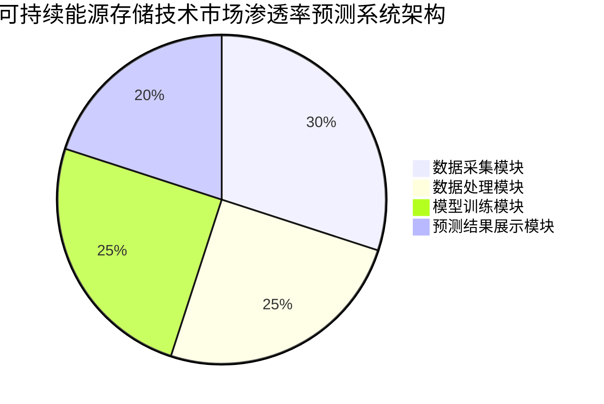
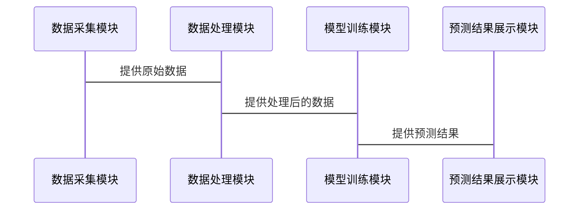

                 


# 可持续能源存储技术的市场渗透率预测

---

## 关键词

- 可持续能源存储技术
- 市场渗透率预测
- 储能技术
- 市场分析
- 技术预测

---

## 摘要

可持续能源存储技术是推动全球能源转型的关键技术之一，其市场渗透率的预测对于政策制定者、投资者和技术开发者具有重要意义。本文通过分析可持续能源存储技术的核心概念、影响因素、算法原理、系统架构以及实际案例，系统地探讨了如何预测其市场渗透率。文章首先介绍了可持续能源存储技术的背景及其重要性，然后详细分析了各种存储技术的特点及其市场定位，接着从算法原理和系统架构两个方面深入探讨了市场渗透率预测的方法，最后通过实际案例展示了如何将理论应用于实践。本文旨在为读者提供一个全面的视角，帮助其更好地理解和预测可持续能源存储技术的市场渗透率。

---

## 目录大纲

---

### 第一部分：可持续能源存储技术的背景与概述

#### 第1章：可持续能源存储技术的定义与现状

##### 1.1 可持续能源存储技术的定义
- 1.1.1 可持续能源的定义
- 1.1.2 可持续能源存储技术的分类
- 1.1.3 可持续能源存储技术的重要性

##### 1.2 可持续能源存储技术的现状
- 1.2.1 当前主流存储技术分析
- 1.2.2 各种存储技术的优缺点对比
- 1.2.3 可持续能源存储技术的发展趋势

##### 1.3 可持续能源存储技术的市场渗透率
- 1.3.1 市场渗透率的定义
- 1.3.2 可持续能源存储技术的市场现状
- 1.3.3 市场渗透率预测的重要性

##### 1.4 影响市场渗透率的因素
- 1.4.1 技术因素
- 1.4.2 市场因素
- 1.4.3 政策因素
- 1.4.4 经济因素

---

### 第二部分：可持续能源存储技术的核心概念与联系

#### 第2章：可持续能源存储技术的核心概念

##### 2.1 各种存储技术的核心原理
- 2.1.1 电池存储技术
- 2.1.2 氢能存储技术
- 2.1.3 超级电容器存储技术
- 2.1.4 热能存储技术

##### 2.2 各种存储技术的性能对比
- 2.2.1 存储效率对比
- 2.2.2 存储容量对比
- 2.2.3 存储寿命对比
- 2.2.4 成本对比

##### 2.3 可持续能源存储技术的市场定位
- 2.3.1 市场定位的定义
- 2.3.2 不同存储技术的市场定位
- 2.3.3 市场定位对渗透率的影响

##### 2.4 可持续能源存储技术与可再生能源的关系
- 2.4.1 可再生能源的定义
- 2.4.2 可再生能源与存储技术的结合
- 2.4.3 可再生能源的波动性对存储技术的需求

---

### 第三部分：可持续能源存储技术市场渗透率预测的算法原理

#### 第3章：预测算法的原理与实现

##### 3.1 数据预处理
- 3.1.1 数据收集与清洗
- 3.1.2 数据特征提取
- 3.1.3 数据标准化与归一化

##### 3.2 市场渗透率预测模型的选择
- 3.2.1 线性回归模型
- 3.2.2 时间序列分析模型（如ARIMA）
- 3.2.3 机器学习模型（如随机森林、XGBoost）
- 3.2.4 深度学习模型（如LSTM）

##### 3.3 基于机器学习的预测模型实现
- 3.3.1 数据集划分与交叉验证
- 3.3.2 模型训练与优化
- 3.3.3 模型评估与验证

##### 3.4 基于时间序列的预测模型实现
- 3.4.1 时间序列数据的分解（趋势、季节性、噪声）
- 3.4.2 ARIMA模型的参数选择
- 3.4.3 模型预测与结果分析

##### 3.5 综合预测模型的构建
- 3.5.1 多模型融合的思路
- 3.5.2 基于权重的综合预测方法
- 3.5.3 综合预测结果的稳定性分析

---

### 第四部分：可持续能源存储技术市场渗透率预测的系统分析

#### 第4章：系统架构与设计

##### 4.1 问题场景介绍
- 4.1.1 可持续能源存储技术的市场渗透率预测目标
- 4.1.2 数据来源与数据类型
- 4.1.3 系统需求分析

##### 4.2 系统功能设计
- 4.2.1 数据采集模块
- 4.2.2 数据处理模块
- 4.2.3 模型训练模块
- 4.2.4 预测结果展示模块

##### 4.3 系统架构设计（使用 Mermaid 图）


##### 4.4 系统接口设计
- 4.4.1 数据输入接口
- 4.4.2 模型调用接口
- 4.4.3 结果输出接口

##### 4.5 系统交互流程（使用 Mermaid 图）


---

### 第五部分：可持续能源存储技术市场渗透率预测的项目实战

#### 第5章：项目实现与案例分析

##### 5.1 环境安装
- 5.1.1 Python 环境的安装与配置
- 5.1.2 数据处理库（Pandas、NumPy）的安装
- 5.1.3 机器学习库（Scikit-learn、XGBoost）的安装
- 5.1.4 时间序列分析库（Statsmodels、Prophet）的安装
- 5.1.5 深度学习库（TensorFlow、Keras）的安装

##### 5.2 系统核心实现源代码
- 5.2.1 数据预处理代码
```python
import pandas as pd
import numpy as np

# 数据加载
data = pd.read_csv('storage_technology.csv')

# 数据清洗
data.dropna(inplace=True)
data = data[~data['date'].isnull()]
data['date'] = pd.to_datetime(data['date'])
data.set_index('date', inplace=True)

# 数据特征提取
features = data[['storage_capacity', 'efficiency', 'cost']]
labels = data['market_penetration']
```

- 5.2.2 模型训练代码（基于随机森林）
```python
from sklearn.ensemble import RandomForestRegressor
from sklearn.model_selection import train_test_split
from sklearn.metrics import mean_absolute_error

# 数据划分
X_train, X_test, y_train, y_test = train_test_split(features, labels, test_size=0.2, random_state=42)

# 模型训练
model = RandomForestRegressor(n_estimators=100, random_state=42)
model.fit(X_train, y_train)

# 模型预测
y_pred = model.predict(X_test)
print('预测结果:', y_pred)
print('真实结果:', y_test.values)
print('平均绝对误差:', mean_absolute_error(y_pred, y_test))
```

- 5.2.3 时间序列预测代码（基于ARIMA）
```python
from statsmodels.tsa.arima_model import ARIMA

# 数据准备
train_data = data['market_penetration'].values[:80]
test_data = data['market_penetration'].values[80:]

# 模型训练
model = ARIMA(train_data, order=(5, 1, 0))
model_fit = model.fit(disp=0)

# 预测
y_pred = model_fit.forecast(steps=len(test_data))
print('预测结果:', y_pred)
print('真实结果:', test_data)
```

##### 5.3 实际案例分析
- 5.3.1 某种存储技术的市场渗透率预测案例
- 5.3.2 案例分析与结果解读
- 5.3.3 案例对市场渗透率预测的启示

##### 5.4 项目小结
- 5.4.1 项目实现的关键点总结
- 5.4.2 预测结果的准确性分析
- 5.4.3 项目中存在的问题与改进方向

---

### 第六部分：总结与展望

#### 第6章：总结与展望

##### 6.1 最佳实践 tips
- 6.1.1 数据质量的重要性
- 6.1.2 模型选择的策略
- 6.1.3 系统设计的注意事项

##### 6.2 小结
- 6.2.1 本文的核心内容总结
- 6.2.2 可持续能源存储技术市场渗透率预测的未来发展方向

##### 6.3 注意事项
- 6.3.1 数据偏差的影响
- 6.3.2 模型局限性
- 6.3.3 政策与市场变化的不确定性

##### 6.4 拓展阅读
- 6.4.1 推荐的相关书籍与论文
- 6.4.2 推荐的学习资源与工具

---

## 附录

- 附录A：常用数据预处理方法
- 附录B：各种预测模型的优缺点对比
- 附录C：项目完整代码与数据集

--- 

通过以上步骤，我们可以全面、系统地分析和预测可持续能源存储技术的市场渗透率，为相关领域的研究和实践提供参考和指导。

