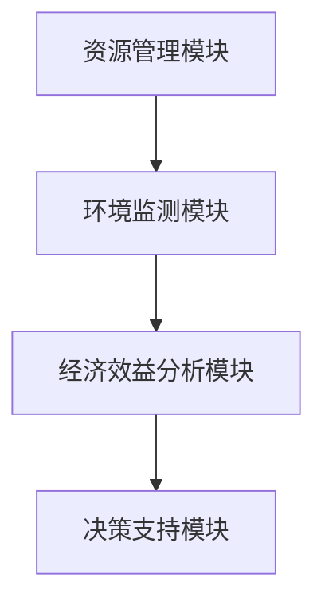
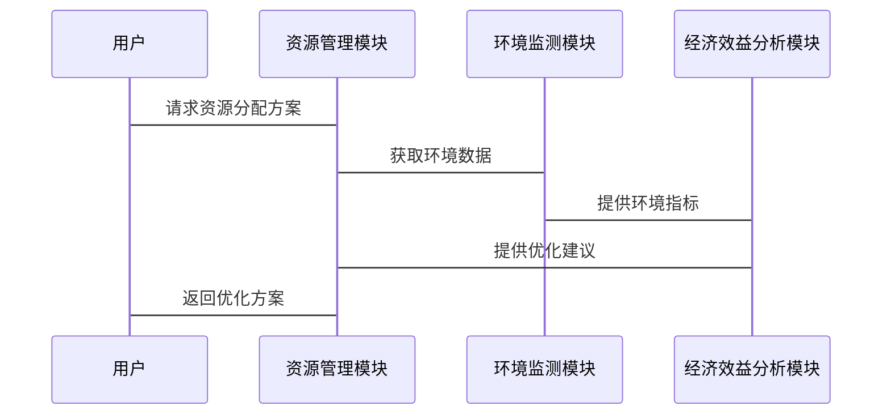

                 


# 可持续采矿实践的经济效益与投资机会

> 关键词：可持续采矿，经济效益，投资机会，环境影响，资源利用，优化模型

> 摘要：本文探讨了可持续采矿的定义、核心概念、数学模型与算法、系统架构与设计、项目实战、投资机会、挑战与解决方案，以及案例分析。通过详细分析，展示了可持续采矿在实现环境保护的同时，如何带来经济效益和投资机会。

---

## 第1章: 可持续采矿的定义与背景

### 1.1 可持续采矿的定义

可持续采矿是一种在满足当前需求的同时，不破坏未来资源利用和发展潜力的采矿方式。它强调在采矿过程中最大限度地减少对环境的破坏，同时履行企业社会责任，实现经济效益最大化。

#### 1.1.1 传统采矿与可持续采矿的对比

| 对比维度         | 传统采矿                  | 可持续采矿                  |
|------------------|---------------------------|-----------------------------|
| 环境影响          | 高                        | 低                          |
| 资源利用效率      | 低                        | 高                          |
| 社会责任履行      | 少                        | 多                          |
| 经济效益          | 短期高                    | 长期高                      |

#### 1.1.2 可持续采矿的核心目标

- **环境保护**：减少对生态系统的破坏，降低碳排放。
- **资源高效利用**：提高资源利用率，减少浪费。
- **社会责任履行**：关注员工福利、社区发展和人权保护。

#### 1.1.3 可持续采矿的全球发展趋势

随着全球对环境保护的重视，可持续采矿正成为行业趋势。各国政府和企业纷纷制定相关政策和标准，推动可持续采矿的发展。

---

### 1.2 可持续采矿的背景

#### 1.2.1 环境保护的需求

全球资源枯竭和环境问题的加剧，促使采矿行业向可持续方向转型。通过减少尾矿、废水和有害气体的排放，可持续采矿有助于保护生态环境。

#### 1.2.2 社会责任的提升

企业社会责任（CSR）要求采矿企业在追求利润的同时，关注员工福利、社区发展和人权保护。可持续采矿通过透明的运营和公正的劳动条件，提升企业形象和社会声誉。

#### 1.2.3 经济效益的优化

尽管可持续采矿的初期投资较大，但其长期经济效益显著。通过优化资源利用和降低运营成本，可持续采矿能够提高企业的竞争力和盈利能力。

---

## 第2章: 可持续采矿的核心概念

### 2.1 可持续采矿的原理

#### 2.1.1 资源高效利用

可持续采矿通过优化采矿计划和采用先进技术，最大限度地提高资源利用率。例如，使用传感器和数据分析技术，实时监测矿石品位和储量，减少资源浪费。

#### 2.1.2 环境保护措施

可持续采矿采用多种措施减少环境影响，例如：

- **尾矿管理**：采用尾矿干排技术，减少尾矿库的建设和维护成本。
- **废水处理**：通过循环利用和化学处理，降低废水排放对环境的污染。
- **碳排放控制**：使用清洁能源和节能技术，减少温室气体排放。

#### 2.1.3 社会责任履行

可持续采矿注重员工培训、社区参与和人权保护。例如，通过提供公平的薪资和良好的工作环境，提高员工满意度和工作效率。

---

### 2.2 核心概念对比

#### 2.2.1 可持续采矿与传统采矿的对比

| 对比维度         | 传统采矿                  | 可持续采矿                  |
|------------------|---------------------------|-----------------------------|
| 环境影响          | 高                        | 低                          |
| 资源利用效率      | 低                        | 高                          |
| 社会责任履行      | 少                        | 多                          |
| 经济效益          | 短期高                    | 长期高                      |

#### 2.2.2 可持续采矿与绿色经济的关系

可持续采矿是绿色经济的重要组成部分。通过减少资源消耗和环境污染，可持续采矿为绿色经济的发展提供了支持。

#### 2.2.3 可持续采矿与企业社会责任的联系

企业社会责任要求企业在追求利润的同时，关注环境保护和社会福祉。可持续采矿通过履行社会责任，提升企业的社会形象和市场竞争力。

---

## 第3章: 可持续采矿的经济效益分析

### 3.1 经济效益的定义

可持续采矿的经济效益包括资源节约、成本降低和长期收益三个方面。

#### 3.1.1 资源节约

通过优化采矿计划和采用先进技术，可持续采矿能够显著减少资源浪费，降低生产成本。

#### 3.1.2 成本降低

可持续采矿通过减少能源消耗、降低尾矿处理成本和优化物流管理，显著降低运营成本。

#### 3.1.3 长期收益

尽管可持续采矿的初期投资较大，但其长期经济效益显著。通过提高资源利用率和减少环境影响，可持续采矿能够为企业带来持续的收益。

---

### 3.2 经济效益的量化

#### 3.2.1 资源利用率计算

资源利用率可以通过以下公式计算：

$$
\text{资源利用率} = \frac{\text{实际利用的资源量}}{\text{可利用的资源总量}} \times 100\%
$$

#### 3.2.2 成本节约模型

成本节约模型可以通过以下步骤进行计算：

1. **确定初始成本**：包括设备购置、能源消耗和人工成本。
2. **确定节约成本**：通过优化资源配置和采用先进技术，降低各部分成本。
3. **计算节约率**：节约率 = (初始成本 - 节约成本) / 初始成本 × 100%。

#### 3.2.3 投资回报率分析

投资回报率（ROI）可以通过以下公式计算：

$$
\text{ROI} = \frac{\text{净利润}}{\text{初始投资}} \times 100\%
$$

---

## 第4章: 可持续采矿的优化模型

### 4.1 资源分配优化

#### 4.1.1 资源分配问题的数学建模

资源分配问题可以通过线性规划模型进行建模。目标函数为最大化利润，约束条件包括资源限制、市场需求和技术要求。

$$
\text{最大化} \quad \sum_{i=1}^{n} p_i x_i
$$

$$
\text{约束} \quad \sum_{i=1}^{n} a_i x_i \leq R
$$

$$
x_i \geq 0 \quad \text{且为整数}
$$

其中，$p_i$ 为产品的利润，$a_i$ 为资源消耗，$R$ 为总资源量。

#### 4.1.2 线性规划模型

线性规划模型可以通过以下步骤进行求解：

1. **确定目标函数**：最大化或最小化目标函数。
2. **确定约束条件**：列出所有约束条件。
3. **求解模型**：使用线性规划算法（如单纯形法）求解模型。
4. **验证结果**：检查结果是否满足所有约束条件。

#### 4.1.3 整数规划模型

整数规划模型要求决策变量为整数。例如，采矿企业可以使用整数规划模型优化矿场的布局和设备配置。

---

### 4.2 环境影响评估

#### 4.2.1 环境影响的评估指标

环境影响的评估指标包括：

- **碳排放量**：单位产品产生的碳排放量。
- **水消耗量**：单位产品消耗的水量。
- **土地使用量**：矿场占用的土地面积。

#### 4.2.2 环境影响的数学模型

环境影响的数学模型可以通过以下公式表示：

$$
\text{环境影响} = \sum_{i=1}^{n} w_i e_i
$$

其中，$w_i$ 为环境影响指标的权重，$e_i$ 为各指标的数值。

---

## 第5章: 可持续采矿的算法实现

### 5.1 算法原理

#### 5.1.1 算法的基本思想

可持续采矿的优化算法通过数学建模和计算，找到最优的资源分配和环境保护方案。

#### 5.1.2 算法的步骤分解

1. **问题分析**：明确问题目标和约束条件。
2. **模型建立**：建立数学模型，包括目标函数和约束条件。
3. **算法选择**：选择合适的优化算法（如遗传算法、模拟退火算法）。
4. **算法实现**：编写代码，实现算法。
5. **结果验证**：检查结果是否满足约束条件和优化目标。

#### 5.1.3 算法的复杂度分析

算法的复杂度取决于问题规模和算法类型。例如，线性规划算法的时间复杂度为 $O(n^3)$，适用于小规模问题。

---

### 5.2 算法实现

#### 5.2.1 算法的代码实现

以下是一个简单的线性规划算法的Python代码示例：

```python
import numpy as np
from scipy.optimize import linprog

# 目标函数系数
c = [-5, -4]

# 约束条件矩阵
A = [
    [2, 1],
    [1, 2]
]

# 约束条件右边
b = [12, 8]

# 非负约束
x_bounds = (0, None)
y_bounds = (0, None)

# 求解线性规划问题
result = linprog(c, A, b, bounds=[x_bounds, y_bounds], method='highs')

# 输出结果
print("最优解：", result.x)
print("最优值：", -result.fun)
```

#### 5.2.2 算法的测试与验证

通过测试用例验证算法的有效性。例如，测试算法在不同约束条件下的表现。

#### 5.2.3 算法的优化与改进

根据测试结果，对算法进行优化，例如调整参数或改进算法结构。

---

## 第6章: 可持续采矿系统的架构设计

### 6.1 系统架构概述

#### 6.1.1 系统的组成模块

- **资源管理模块**：负责资源的分配和监控。
- **环境监测模块**：实时监测环境指标，如碳排放和水消耗。
- **经济效益分析模块**：计算经济效益，评估投资回报率。

#### 6.1.2 模块之间的关系

资源管理模块与环境监测模块相互关联，环境监测模块为经济效益分析模块提供数据支持。

#### 6.1.3 系统的总体架构图



---

### 6.2 系统功能设计

#### 6.2.1 资源管理模块

资源管理模块负责优化资源分配，减少浪费。例如，使用传感器和数据分析技术，实时监测矿石品位和储量。

#### 6.2.2 环境监测模块

环境监测模块实时监测碳排放、水消耗和土地使用情况。通过数据采集和分析，为优化决策提供支持。

#### 6.2.3 经济效益分析模块

经济效益分析模块计算资源利用率、成本节约和投资回报率。通过数据可视化，帮助企业管理者做出决策。

---

## 第7章: 可持续采矿系统的接口与交互

### 7.1 系统接口设计

#### 7.1.1 系统内部接口

系统内部接口包括资源管理模块与环境监测模块之间的接口，以及环境监测模块与经济效益分析模块之间的接口。

#### 7.1.2 系统外部接口

系统外部接口包括与传感器、数据库和用户的接口。例如，传感器接口用于采集环境数据，用户接口用于显示系统运行状态。

#### 7.1.3 接口的标准化

通过制定统一的接口标准，确保系统各模块之间的兼容性和可扩展性。

---

### 7.2 系统交互流程图



---

## 第8章: 可持续采矿的项目实战

### 8.1 环境安装

#### 8.1.1 系统环境要求

- 操作系统：Linux/Windows/MacOS
- 开发工具：Python、Jupyter Notebook、Git
- 数据库：MySQL/PostgreSQL
- 可视化工具：Matplotlib、Seaborn

#### 8.1.2 安装依赖

使用以下命令安装所需的依赖：

```bash
pip install numpy scipy matplotlib seaborn pandas
```

---

### 8.2 系统核心实现源代码

以下是一个可持续采矿系统的Python实现示例：

```python
import numpy as np
import pandas as pd
from sklearn.metrics import accuracy_score

# 数据加载
data = pd.read_csv('mining_data.csv')

# 数据预处理
X = data.drop('label', axis=1)
y = data['label']

# 模型训练
from sklearn.model

