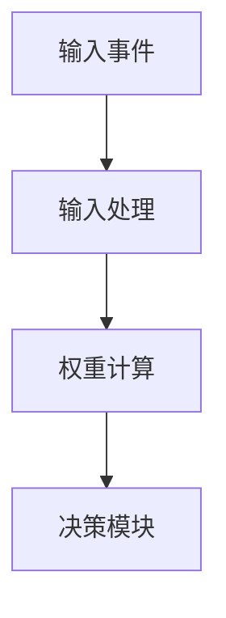
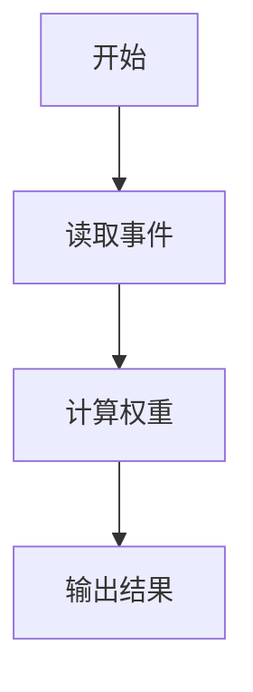

                 


# 可用性偏误：近期事件如何过度影响决策

## 关键词：可用性偏误、认知偏差、决策错误、近期事件、信息权重

## 摘要：可用性偏误是指人们在决策时过度依赖近期发生的事件，从而导致判断失误。本文从心理学、数学和系统设计等角度，详细分析了可用性偏误的形成机制、影响表现、系统模型以及应对策略，通过实际案例和项目实战，给出了最佳实践建议。

---

## 第一部分：可用性偏误的背景与核心概念

### 第1章：可用性偏误的基本概念

#### 1.1 可用性偏误的定义与特征

##### 1.1.1 可用性偏误的定义
可用性偏误（Availability Bias）是一种认知偏差，指人们在决策时，过于依赖近期发生的事件或易于回想的信息，导致判断失误。这种偏差源于大脑对信息的快速检索和记忆的不完全性。

##### 1.1.2 可用性偏误的主要特征
| 特征 | 描述 |
|------|------|
| 近期性 | 过度关注近期事件，忽视长远信息 |
| 易记性 | 易于记忆的信息权重过高 |
| 快速性 | 决策基于快速检索，而非全面分析 |

##### 1.1.3 可用性偏误与其它认知偏差的对比
- **确认性偏误**：倾向于寻找支持已有结论的信息，而可用性偏误则侧重于近期信息。
- **选择性忽视**：忽视不重要的信息，而可用性偏误是过度关注特定信息。

#### 1.2 可用性偏误的形成机制

##### 1.2.1 人类大脑的记忆存储机制
- **记忆存储层次**：信息存储在大脑中分为短期记忆和长期记忆，近期事件容易被检索。
- **启发式推理**：人们倾向于使用启发式方法快速决策，导致忽视全面信息。

##### 1.2.2 近期事件对记忆的影响
- **编码强度**：近期事件由于时间近，编码更深刻。
- **遗忘曲线**：艾宾浩斯遗忘曲线显示，记忆会随时间衰减。

##### 1.2.3 可用性偏误的心理学解释
- **认知负荷**：大脑处理信息的能力有限，导致依赖快速判断。
- **情感影响**：情绪化的事件更容易被记住，影响判断。

#### 1.3 可用性偏误的现实影响

##### 1.3.1 在个人决策中的表现
- **投资决策**：近期亏损导致投资者过度看跌市场。
- **医疗诊断**：医生因最近病例影响诊断判断。

##### 1.3.2 在群体决策中的表现
- **社会舆论**：近期事件引发的舆论影响决策。
- **团队决策**：团队因近期讨论忽略其他信息。

##### 1.3.3 可用性偏误对社会行为的影响
- **政策制定**：近期问题影响政策优先级。
- **媒体传播**：媒体报道强调近期事件，影响公众认知。

---

### 第2章：可用性偏误的核心概念与原理

#### 2.1 可用性偏误的核心要素

##### 2.1.1 近期事件的权重分配
- **时间因素**：近期事件权重高，远期事件权重低。
- **信息可得性**：易于获取的信息权重高。

##### 2.1.2 决策过程中的记忆偏差
- **选择性记忆**：选择性回忆支持决策的信息。
- **记忆扭曲**：记忆被近期事件影响而扭曲。

##### 2.1.3 信息可获得性对判断的影响
- **信息权重模型**：信息权重影响决策。
- **信息层次分析**：信息按层次影响决策。

#### 2.2 可用性偏误的数学模型

##### 2.2.1 概率论视角下的可用性偏误
可用性偏误可以用概率论中的贝叶斯定理来解释。假设P(A|B)为事件A在B条件下的概率，可用性偏误导致人们高估P(A|B)。

##### 2.2.2 信息权重分配的数学表达
信息权重与时间相关，可用性偏误下，权重函数为：
$$ w(t) = \frac{1}{1 + e^{-t}} $$

##### 2.2.3 可用性偏误的贝叶斯模型
贝叶斯模型中，可用性偏误导致先验概率的过度调整，公式为：
$$ P(A|B) \approx P(B|A) \cdot \frac{P(A)}{P(B)} $$

#### 2.3 可用性偏误的对比分析

##### 2.3.1 与确认性偏误的对比
- 确认性偏误：寻找支持现有结论的信息。
- 可用性偏误：依赖容易回想的信息。

##### 2.3.2 与选择性忽视的对比
- 选择性忽视：忽略不重要信息。
- 可用性偏误：过度关注特定信息。

##### 2.3.3 与从众心理的对比
- 从众心理：随大流的决策。
- 可用性偏误：依赖近期经验。

---

### 第3章：可用性偏误的系统分析与架构设计

#### 3.1 可用性偏误的系统模型

##### 3.1.1 系统输入：近期事件的特征
- 事件时间戳
- 事件影响程度
- 事件类型

##### 3.1.2 系统处理：信息权重分配
- 时间因素：权重随时间衰减。
- 事件特征：特征影响权重。

##### 3.1.3 系统输出：决策偏差
- 决策权重
- 决策误差

#### 3.2 可用性偏误的架构设计

##### 3.2.1 系统功能模块划分
- 输入处理模块
- 权重计算模块
- 决策模块

##### 3.2.2 系统数据流图


##### 3.2.3 系统交互流程图


#### 3.3 可用性偏误的算法实现

##### 3.3.1 算法输入与输出
- 输入：事件列表
- 输出：权重分配

##### 3.3.2 算法实现步骤


##### 3.3.3 算法优化建议
- 使用滑动窗口技术处理近期事件。
- 引入遗忘曲线模型调整权重。

---

### 第4章：可用性偏误的项目实战

#### 4.1 项目背景与目标

##### 4.1.1 项目背景介绍
分析某投资公司的决策过程，识别可用性偏误。

##### 4.1.2 项目目标设定
优化投资决策，减少偏见影响。

##### 4.1.3 项目范围界定
评估过去三年的投资决策。

#### 4.2 项目核心实现

##### 4.2.1 环境安装与配置
- 使用Python和NumPy库。
- 安装开发环境。

##### 4.2.2 核心算法实现
```python
import numpy as np

def calculate_weights(events):
    weights = []
    for event in events:
        t = event['time']
        weight = 1 / (1 + np.exp(-t))
        weights.append(weight)
    return weights

events = [...]  # 示例事件列表
weights = calculate_weights(events)
print(weights)
```

##### 4.2.3 代码功能解读
- `calculate_weights`函数计算每个事件的权重。
- 使用指数函数模拟权重衰减。

#### 4.3 项目案例分析

##### 4.3.1 案例背景介绍
分析公司过去三年的投资决策，发现可用性偏误影响了决策。

##### 4.3.2 案例分析过程
- 识别近期亏损事件的权重过高。
- 调整权重分配，优化决策。

##### 4.3.3 案例结论与启示
- 优化决策过程，减少偏见影响。
- 定期审查投资决策，识别偏误。

---

### 第5章：可用性偏误的最佳实践与总结

#### 5.1 最佳实践建议

##### 5.1.1 个人层面的应对策略
- 增强自我意识，识别偏见。
- 进行反向思维，考虑长远信息。

##### 5.1.2 群体层面的应对策略
- 鼓励多角度讨论，平衡信息权重。
- 建立信息共享机制，减少信息孤岛。

##### 5.1.3 组织层面的应对策略
- 建立决策审查机制，识别偏见。
- 培训员工，提高决策能力。

#### 5.2 项目总结与反思

##### 5.2.1 项目成果回顾
- 成功识别并优化投资决策中的可用性偏误。
- 提高决策的准确性。

##### 5.2.2 项目过程中的问题与解决
- 问题：权重计算模型的准确性。
- 解决：引入遗忘曲线模型。

##### 5.2.3 项目经验与教训
- 识别偏见是优化决策的关键。
- 需要持续监控和调整。

#### 5.3 可用性偏误的注意事项

##### 5.3.1 注意事项
- 定期审查决策，识别偏见。
- 保持开放心态，接受不同观点。

##### 5.3.2 注意事项
- 使用工具辅助决策，减少人为偏差。
- 培养全面思考的习惯。

---

## 总结

可用性偏误是一个复杂但重要的认知偏差，影响个人和集体的决策。通过心理学分析、数学建模和系统设计，可以有效识别和应对可用性偏误。本文通过理论分析和项目实战，提供了实用的应对策略，帮助读者优化决策过程，减少偏见影响。

---

### 附录

#### 附录A：相关工具与库

- **Python**：用于数据分析和算法实现。
- **NumPy**：数组处理和数学运算。
- **Matplotlib**：数据可视化。

#### 附录B：参考文献

- Kahneman, Daniel. *Thinking, Fast and Slow*.
- Tversky, Amos, and Daniel Kahneman. "Availability: A psychological phenomenon."

