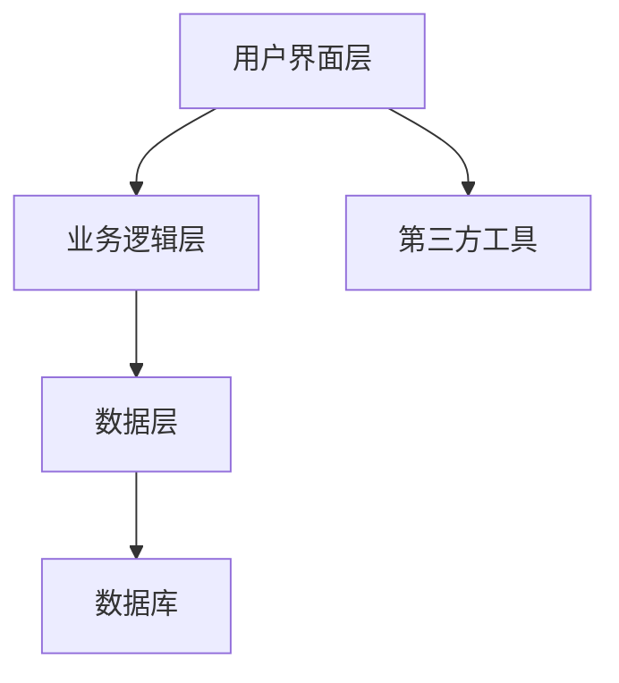

                 


# 可视化调试：深入了解AI Agent的决策过程

> 关键词：AI Agent，可视化调试，决策过程，可解释性AI，决策树，系统架构

> 摘要：本文详细探讨了AI Agent的决策过程，并通过可视化调试的方法，深入分析了其背后的技术原理。从AI Agent的基本概念到可视化调试的核心理念，从决策过程的数学模型到可视化实现的系统架构，本文旨在帮助读者全面理解AI Agent的决策机制，并通过实际案例展示如何通过可视化调试工具提升AI系统的可解释性和优化能力。

---

# 第1章: AI Agent与可视化调试概述

## 1.1 AI Agent的基本概念

### 1.1.1 AI Agent的定义与分类

AI Agent（智能体）是指在计算机系统中，能够感知环境并采取行动以实现目标的实体。AI Agent可以分为简单反射Agent、基于模型的反射Agent、目标驱动的Agent和效用驱动的Agent等类型。

### 1.1.2 AI Agent的决策机制

AI Agent的决策机制通常包括感知环境、构建状态空间、选择行动和执行行动四个步骤。决策过程涉及概率论、强化学习和图论等技术。

### 1.1.3 可视化调试的必要性

随着AI系统的复杂性增加，AI Agent的决策过程变得难以理解和优化。可视化调试通过直观的图形化界面，帮助开发者和用户更好地理解AI Agent的行为，发现潜在问题并优化系统性能。

## 1.2 可视化调试的核心理念

### 1.2.1 可视化调试的定义

可视化调试是指通过图形化界面展示AI Agent的决策过程、状态变化和数据流，帮助用户更好地理解和分析系统行为。

### 1.2.2 可视化调试的重要性

可视化调试能够提高AI系统的可解释性，帮助开发者快速定位问题，优化算法，并验证系统的正确性。

### 1.2.3 可视化调试的应用场景

可视化调试在AI教育、自动驾驶、机器人控制和游戏AI等领域有广泛应用，尤其是在需要高透明度和可解释性的场景中。

## 1.3 本章小结

---

# 第2章: AI Agent的决策机制

## 2.1 决策过程的数学模型

### 2.1.1 决策树模型

决策树是一种常见的决策模型，通过树状结构展示所有可能的决策路径和结果。决策树模型常用于分类和回归问题。

### 2.1.2 马尔可夫决策过程

马尔可夫决策过程（MDP）是一种用于描述动态决策过程的数学模型，适用于状态转移概率已知的环境。

### 2.1.3 强化学习算法

强化学习是一种通过试错机制优化决策策略的方法。AI Agent通过与环境交互，逐步学习最优策略。

## 2.2 决策过程中的关键因素

### 2.2.1 状态空间

状态空间是AI Agent可能遇到的所有状态的集合。状态空间的大小和复杂性直接影响决策过程的效率和效果。

### 2.2.2 行动空间

行动空间是AI Agent在每个状态下可以采取的所有可能行动的集合。行动空间的大小和类型决定了决策的复杂性。

### 2.2.3 奖励机制

奖励机制是强化学习中的核心概念，用于衡量AI Agent的决策是否符合目标。奖励机制的设计直接影响学习过程和最终策略的优化。

## 2.3 决策过程的可视化表示

### 2.3.1 决策树的可视化

通过图形化工具将决策树的结构展示出来，帮助用户理解决策逻辑和路径。

### 2.3.2 状态转移图的可视化

状态转移图通过节点和边展示状态之间的转移关系，帮助用户分析系统的动态行为。

### 2.3.3 奖励函数的可视化

奖励函数的可视化可以通过颜色、形状等直观方式展示不同状态和行动的奖励值，帮助用户理解决策的优劣。

## 2.4 本章小结

---

# 第3章: 可视化调试的原理与方法

## 3.1 可视化调试的基本原理

### 3.1.1 可视化调试的理论基础

可视化调试基于人类视觉感知和认知科学的原理，通过图形化界面将复杂的决策过程转化为易于理解和分析的形式。

### 3.1.2 可视化调试的技术路线

可视化调试的技术路线包括数据采集、数据处理、数据可视化和用户交互四个步骤。

### 3.1.3 可视化调试的实现步骤

实现可视化调试需要首先收集AI Agent的决策数据，然后选择合适的可视化工具和方法，最后通过图形化界面展示决策过程。

## 3.2 可视化调试的关键技术

### 3.2.1 数据可视化技术

数据可视化技术包括图表、图形和交互式界面的设计，用于直观展示数据的分布、趋势和关系。

### 3.2.2 图形化编程技术

图形化编程技术通过拖放和可视化编辑器简化程序开发过程，帮助用户快速构建和调试AI Agent。

### 3.2.3 交互式调试技术

交互式调试技术允许用户在可视化界面上实时调整参数、观察状态变化和验证决策结果，提供即时反馈和优化能力。

## 3.3 可视化调试的工具与平台

### 3.3.1 常见可视化调试工具介绍

常见的可视化调试工具有TensorBoard、PyTorch Visualizer和Unity编辑器等，这些工具提供了丰富的可视化功能和用户友好的界面。

### 3.3.2 各种工具的优缺点对比

不同可视化调试工具在功能、性能和易用性方面各有优缺点，选择合适的工具需要根据具体需求进行权衡。

### 3.3.3 工具选择的建议

建议根据项目需求、技术栈和团队能力选择合适的可视化调试工具，并结合实际场景进行定制化开发。

## 3.4 本章小结

---

# 第4章: 决策过程的可视化建模

## 4.1 决策过程的建模方法

### 4.1.1 基于图的建模方法

基于图的建模方法通过节点和边表示状态和转移关系，适用于复杂系统的建模和分析。

### 4.1.2 基于树的建模方法

基于树的建模方法通过树状结构展示决策路径和结果，适用于决策树模型的可视化。

### 4.1.3 基于状态转移的建模方法

基于状态转移的建模方法通过状态转移图展示系统的动态行为，适用于马尔可夫决策过程的建模。

## 4.2 可视化建模工具的选择

### 4.2.1 图形化建模工具

图形化建模工具包括Lucidchart和Draw.io等，提供了丰富的图形绘制功能和用户友好的界面。

### 4.2.2 数据流图建模工具

数据流图建模工具包括Lucidchart和Mermaid，适用于展示数据流和系统架构。

### 4.2.3 状态机建模工具

状态机建模工具包括PlantUML和Statechart，适用于展示系统的状态转移关系。

## 4.3 基于可视化的决策过程模拟

### 4.3.1 模拟过程的可视化表示

通过图形化界面展示模拟过程中的状态变化、行动选择和结果反馈。

### 4.3.2 模拟结果的可视化分析

通过图表和图形展示模拟结果的趋势和分布，帮助用户分析系统的性能和优化方向。

### 4.3.3 模拟优化的可视化实现

通过实时可视化反馈优化参数调整和模拟结果变化，帮助用户快速找到最优解。

## 4.4 本章小结

---

# 第5章: 可视化调试系统的架构设计

## 5.1 系统功能需求分析

### 5.1.1 系统目标

系统的总体目标是提供一个图形化界面，帮助用户可视化和调试AI Agent的决策过程。

### 5.1.2 系统功能模块划分

系统功能模块包括数据采集、数据处理、可视化展示和用户交互四个模块。

### 5.1.3 系统性能要求

系统需要具备高实时性和高扩展性，能够处理大规模数据和复杂场景。

## 5.2 系统架构设计

### 5.2.1 分层架构设计

系统采用分层架构，包括数据层、业务逻辑层和用户界面层，每一层都有明确的功能划分和交互接口。

### 5.2.2 组件化设计

系统采用组件化设计，将功能模块独立开发和测试，便于后续维护和扩展。

### 5.2.3 系统架构图



## 5.3 系统接口设计

### 5.3.1 数据采集接口

数据采集接口负责收集AI Agent的决策数据，包括状态、行动和奖励值。

### 5.3.2 数据处理接口

数据处理接口负责对采集到的数据进行清洗、转换和存储，为后续的可视化展示提供数据支持。

### 5.3.3 用户交互接口

用户交互接口负责与用户进行交互，展示可视化界面并响应用户的操作请求。

## 5.4 本章小结

---

# 第6章: 项目实战与案例分析

## 6.1 环境安装与配置

### 6.1.1 系统需求

系统运行环境需要满足一定的硬件和软件要求，包括操作系统、编程语言和可视化工具的安装。

### 6.1.2 工具安装

安装必要的可视化调试工具和编程框架，例如TensorFlow、PyTorch和Matplotlib。

## 6.2 系统核心实现

### 6.2.1 数据采集模块

编写代码采集AI Agent的决策数据，包括状态、行动和奖励值。

### 6.2.2 数据处理模块

对采集到的数据进行清洗、转换和存储，为后续的可视化展示提供数据支持。

### 6.2.3 可视化展示模块

使用可视化工具展示决策过程的状态变化、行动选择和结果反馈。

## 6.3 代码实现与解读

### 6.3.1 数据采集代码

```python
# 数据采集代码示例
import numpy as np

# 生成随机状态和行动
state = np.random.randint(0, 10, size=10)
action = np.random.randint(0, 5, size=10)
reward = np.random.uniform(0, 1, size=10)

# 保存数据
data = {'state': state, 'action': action, 'reward': reward}
print(data)
```

### 6.3.2 数据处理代码

```python
# 数据处理代码示例
import pandas as pd

# 加载数据
data = pd.DataFrame({'state': [1, 2, 3, 4, 5], 'action': [0, 1, 2, 3, 4], 'reward': [0.5, 0.3, 0.8, 0.6, 0.7]})

# 数据清洗
data.drop_duplicates(inplace=True)
print(data)
```

### 6.3.3 可视化展示代码

```python
# 可视化展示代码示例
import matplotlib.pyplot as plt

# 绘制奖励分布图
plt.hist(data['reward'], bins=5)
plt.title('Reward Distribution')
plt.xlabel('Reward Value')
plt.ylabel('Frequency')
plt.show()
```

## 6.4 实际案例分析

### 6.4.1 案例背景

通过一个具体的AI Agent决策案例，展示可视化调试的实际应用。

### 6.4.2 可视化分析

通过可视化工具展示AI Agent的决策过程，分析其优缺点和优化方向。

### 6.4.3 优化建议

基于可视化分析结果，提出优化AI Agent决策过程的具体建议。

## 6.5 本章小结

---

# 第7章: 总结与展望

## 7.1 本章总结

总结本文的主要内容，回顾可视化调试在AI Agent决策过程中的重要性。

## 7.2 未来展望

展望可视化调试技术的发展方向，探讨其在AI领域的潜在应用和挑战。

## 7.3 最佳实践Tips

### 7.3.1 可视化调试工具选择

根据项目需求和团队能力选择合适的可视化调试工具。

### 7.3.2 数据可视化技巧

掌握数据可视化的基本原理和技巧，提高可视化效果的可读性和美观性。

### 7.3.3 系统优化建议

通过不断优化系统架构和功能模块，提高可视化调试系统的性能和用户体验。

## 7.4 本章小结

---

# 附录: 参考文献与拓展阅读

## 附录A: 参考文献

列出本文中引用的主要文献和资料。

## 附录B: 拓展阅读

推荐一些与可视化调试和AI Agent相关的书籍和论文，供读者进一步学习和研究。

---

# 结语

可视化调试是理解AI Agent决策过程的重要工具，通过本文的深入探讨和实际案例分析，读者可以更好地掌握可视化调试的技术原理和应用方法。未来，随着AI技术的不断发展，可视化调试将在更多领域发挥重要作用。

