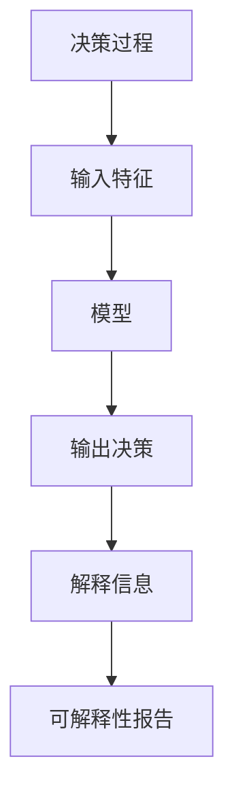
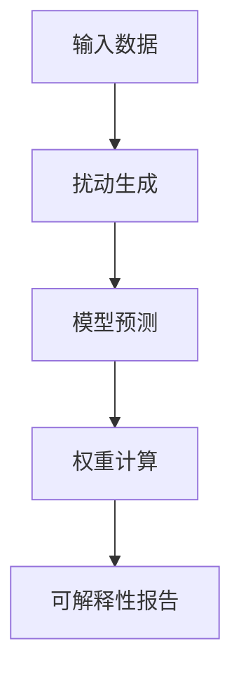
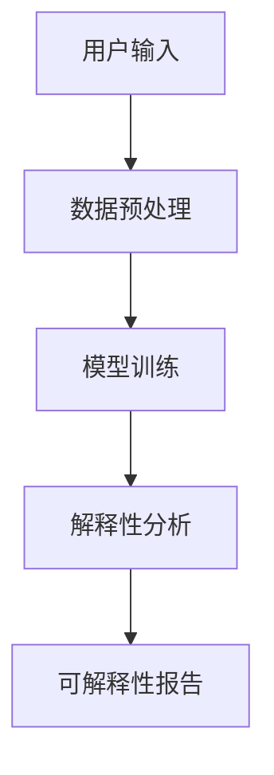

                 


# 《可解释性设计：理解AI Agent的决策过程》

**关键词：可解释性设计、AI Agent、决策过程、LIME、SHAP、模型可解释性、系统架构**

**摘要**：  
随着人工智能技术的快速发展，AI Agent在各个领域的应用日益广泛。然而，AI Agent的决策过程往往被视为“黑箱”，这引发了人们对决策透明性和可解释性的关注。本文从可解释性设计的核心概念出发，逐步分析AI Agent的决策过程，并通过具体算法和系统架构的设计，探讨如何实现可解释性设计。文章结合实际案例，详细解读了可解释性设计的实现路径，为AI技术的广泛应用提供了理论和实践指导。

---

# 第一部分: 可解释性设计的背景与核心概念

## 第1章: 可解释性设计的背景与问题背景

### 1.1 人工智能与决策透明性的重要性
#### 1.1.1 人工智能决策的复杂性  
人工智能系统的决策过程往往依赖于复杂的算法和大量数据，这使得决策过程难以被人类理解和解释。例如，基于深度学习的推荐系统可能会根据用户的浏览行为、点击率和历史数据做出推荐，但用户通常无法理解推荐的具体原因。

#### 1.1.2 可解释性在AI决策中的必要性  
可解释性是用户对AI系统信任的重要基础。特别是在医疗、金融等领域，AI的决策需要符合法律法规和伦理规范。如果AI的决策过程缺乏透明性，用户和相关机构将难以验证决策的合理性和合规性。

#### 1.1.3 从“黑箱”到透明的转变  
可解释性设计的核心目标是将AI的决策过程从“黑箱”变为透明，让用户和开发者能够理解AI的决策逻辑。这不仅有助于提升用户信任，还能帮助开发者发现和修复系统中的问题。

### 1.2 AI Agent决策过程的挑战
#### 1.2.1 AI Agent的基本概念与功能  
AI Agent是一种能够感知环境、自主决策并执行任务的智能实体。它可以基于当前状态、目标和环境信息做出决策。例如，自动驾驶汽车中的AI Agent需要实时感知路况并做出驾驶决策。

#### 1.2.2 决策过程中的不确定性  
AI Agent的决策过程往往面临不确定性，例如环境变化、数据噪声和模型假设等。这些不确定性可能导致决策的不可预测性，从而增加了可解释性的难度。

#### 1.2.3 可解释性设计的核心问题  
可解释性设计的核心问题是如何在不牺牲模型性能的前提下，实现对AI Agent决策过程的透明解释。这需要在模型设计、数据处理和算法实现等多个层面进行优化。

### 1.3 可解释性设计的边界与外延
#### 1.3.1 可解释性设计的适用范围  
可解释性设计适用于需要决策透明性的场景，例如医疗诊断、金融风控和自动驾驶等领域。在这些场景中，用户的信任和系统的合规性是关键。

#### 1.3.2 与可解释性相关的概念对比  
可解释性设计与可解释性模型、可解释性报告等概念密切相关。例如，可解释性模型是指能够提供决策解释的模型，而可解释性报告则是对模型决策过程的详细说明。

#### 1.3.3 可解释性设计的实现路径  
可解释性设计的实现路径包括模型选择、数据预处理、算法优化和结果解释等多个步骤。每个步骤都需要精心设计，以确保最终的解释性。

### 1.4 本章小结  
本章从背景和问题背景出发，分析了可解释性设计的重要性和必要性，并提出了实现可解释性设计的核心问题和路径。

---

## 第2章: 可解释性设计的核心概念与联系

### 2.1 可解释性设计的核心原理
#### 2.1.1 可解释性模型的分类  
可解释性模型可以分为基于规则的模型（如决策树）和基于统计的模型（如线性回归）。基于规则的模型通常具有较高的可解释性，而基于统计的模型则在复杂场景中表现更优。

#### 2.1.2 解释性与可解释性的区别  
解释性是指模型能够提供具体的解释信息，而可解释性是指模型的决策过程可以被人类理解。例如，决策树模型可以通过树状结构提供解释性信息，从而实现可解释性设计。

#### 2.1.3 可解释性设计的数学基础  
可解释性设计的数学基础包括线性代数、概率论和统计学等。例如，线性回归模型的系数可以直接解释变量对目标变量的影响。

### 2.2 核心概念的属性特征对比
#### 2.2.1 可解释性模型的特征对比表格  
| 模型类型      | 可解释性 | 鲁棒性 | 计算效率 |
|---------------|----------|--------|----------|
| 决策树        | 高       | 中     | 低       |
| 线性回归      | 高       | 低     | 高       |
| 随机森林      | 中       | 高     | 低       |

#### 2.2.2 可解释性与不可解释性模型的对比  
可解释性模型通常具有较低的复杂性，而不可解释性模型（如深度神经网络）则在复杂场景中表现更优，但缺乏透明性。

#### 2.2.3 解释性与可解释性的关系  
解释性是可解释性设计的基础，而可解释性设计则是实现解释性的重要手段。

### 2.3 ER实体关系图架构


### 2.4 本章小结  
本章详细分析了可解释性设计的核心概念，包括模型分类、特征对比和实体关系图架构。

---

## 第3章: 可解释性设计的算法原理

### 3.1 常见的可解释性算法
#### 3.1.1 LIME算法  
LIME（Local Interpretable Model-agnostic Explanations）是一种通过局部线性模型解释非线性模型的算法。它适用于分类和回归任务。

#### 3.1.2 SHAP值  
SHAP（Shapley Additive exPlanations）是一种基于博弈论的解释方法，能够量化每个特征对模型预测的贡献。

#### 3.1.3 特征重要性分析  
特征重要性分析通过评估每个特征对模型预测的影响程度，帮助理解模型的决策逻辑。

### 3.2 LIME算法的原理与实现


#### 3.2.1 LIME算法的数学公式  
$$ \text{权重} = \sum_{i=1}^{n} w_i \cdot y_i $$

### 3.3 SHAP值的计算与解释
#### 3.3.1 SHAP值的数学公式  
$$ \text{SHAP值} = \phi_i = \sum_{j} w_{i,j} \cdot f_j(x) $$

#### 3.3.2 SHAP值的可视化  
SHAP值可以通过力图（force plot）进行可视化，展示每个特征对预测结果的正向和负向影响。

### 3.4 特征重要性分析的实现
#### 3.4.1 特征重要性排序  
特征重要性排序可以通过模型自带的特征重要性属性或第三方库（如eli5）实现。

#### 3.4.2 特征贡献度可视化  
特征贡献度可以通过条形图或热图进行可视化。

### 3.5 本章小结  
本章详细介绍了可解释性设计的常见算法，包括LIME、SHAP和特征重要性分析，并展示了它们的原理和实现方式。

---

## 第4章: 可解释性设计的系统分析与架构方案

### 4.1 系统分析与问题场景
#### 4.1.1 可解释性设计的系统目标  
系统目标是实现AI Agent决策过程的透明解释，确保用户和开发者能够理解模型的决策逻辑。

#### 4.1.2 系统边界与功能需求  
系统边界包括数据输入、模型训练和结果解释。功能需求包括数据预处理、模型选择和解释性报告生成。

#### 4.1.3 系统的输入输出分析  
输入：原始数据、模型参数  
输出：可解释性报告、决策解释

### 4.2 系统架构设计


#### 4.2.1 数据预处理模块  
数据预处理模块负责清洗、归一化和特征选择，确保数据符合模型输入要求。

#### 4.2.2 模型训练模块  
模型训练模块基于预处理后的数据，选择合适的可解释性模型进行训练。

#### 4.2.3 解释性分析模块  
解释性分析模块通过LIME或SHAP等算法，生成模型的解释信息。

### 4.3 系统接口设计
#### 4.3.1 输入接口  
输入接口包括数据输入和参数设置。

#### 4.3.2 输出接口  
输出接口包括解释性报告和决策解释。

### 4.4 系统交互设计


### 4.5 本章小结  
本章详细分析了可解释性设计的系统架构，包括模块设计、接口设计和交互设计。

---

## 第5章: 可解释性设计的项目实战

### 5.1 环境安装与数据准备
#### 5.1.1 环境安装  
安装必要的库，如scikit-learn、xgboost、eli5和shap。

#### 5.1.2 数据准备  
加载数据集，进行数据清洗和特征工程。

### 5.2 系统核心实现
#### 5.2.1 模型选择与训练  
选择可解释性模型（如XGBoost），进行模型训练。

#### 5.2.2 解释性分析  
使用eli5或shap库，生成模型的解释信息。

### 5.3 代码实现与解读
#### 5.3.1 数据预处理代码  
```python
import pandas as pd
from sklearn.preprocessing import StandardScaler

# 加载数据集
data = pd.read_csv('data.csv')

# 数据清洗
data.dropna()

# 特征工程
features = data.drop('label', axis=1)
label = data['label']

# 数据归一化
scaler = StandardScaler()
features_scaled = scaler.fit_transform(features)
```

#### 5.3.2 模型训练代码  
```python
from xgboost import XGBClassifier
from sklearn.metrics import accuracy_score

# 模型训练
model = XGBClassifier()
model.fit(features_scaled, label)
```

#### 5.3.3 解释性分析代码  
```python
import shap

# SHAP解释
explainer = shap.TreeExplainer(model)
shap_values = explainer.shap_values(features_scaled)

shap.summary_plot(shap_values, features, plot_type="bar")
```

### 5.4 案例分析与详细解读
以电商推荐系统为例，展示如何通过可解释性设计实现用户的推荐偏好分析。

### 5.5 本章小结  
本章通过实际案例，详细解读了可解释性设计的实现过程，包括数据准备、模型训练和解释性分析。

---

## 第6章: 可解释性设计的最佳实践与注意事项

### 6.1 最佳实践 tips
#### 6.1.1 数据质量的重要性  
确保数据的准确性和完整性，避免因数据问题导致解释错误。

#### 6.1.2 模型可解释性与性能的平衡  
在选择模型时，需在可解释性和性能之间找到平衡点，避免一味追求高精度而忽视解释性。

### 6.2 小结与展望
#### 6.2.1 小结  
可解释性设计是实现AI Agent决策透明性的重要手段，通过模型选择、数据处理和算法优化，可以有效提升系统的解释能力。

#### 6.2.2 展望  
未来，随着AI技术的不断发展，可解释性设计将更加重要。研究者需要在模型复杂性和解释性之间找到更好的平衡点，推动AI技术的广泛应用。

### 6.3 注意事项
#### 6.3.1 解释性报告的完整性  
解释性报告应包含模型概述、特征重要性分析和决策解释等内容。

#### 6.3.2 解释性设计的可扩展性  
在设计可解释性系统时，需考虑系统的可扩展性，以应对未来数据和场景的变化。

---

## 第7章: 总结与展望

### 7.1 总结  
可解释性设计是实现AI Agent决策透明性的关键，通过系统化的设计和优化，可以有效提升用户的信任和系统的合规性。

### 7.2 展望  
未来，随着AI技术的不断发展，可解释性设计将更加重要。研究者需要在模型复杂性和解释性之间找到更好的平衡点，推动AI技术的广泛应用。

---

**参考文献**  
[此处列出相关文献和参考资料]

