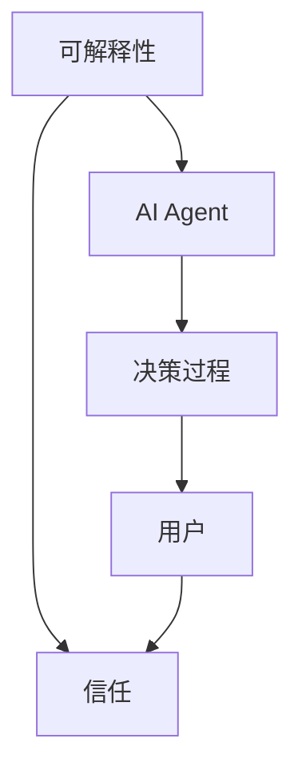
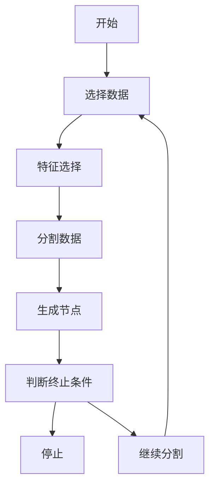
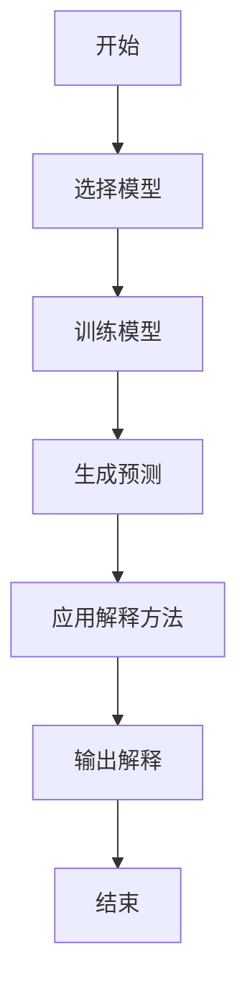
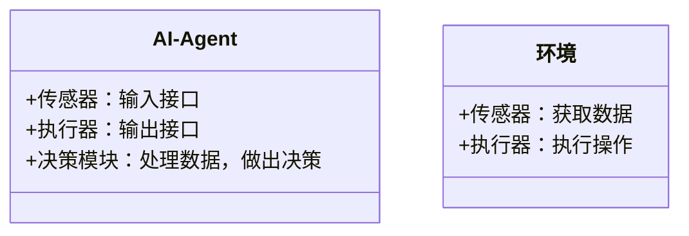
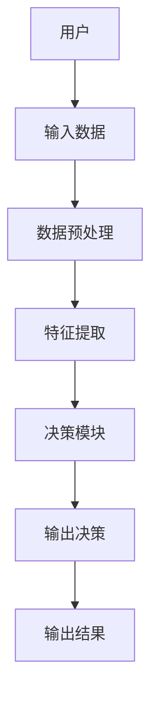
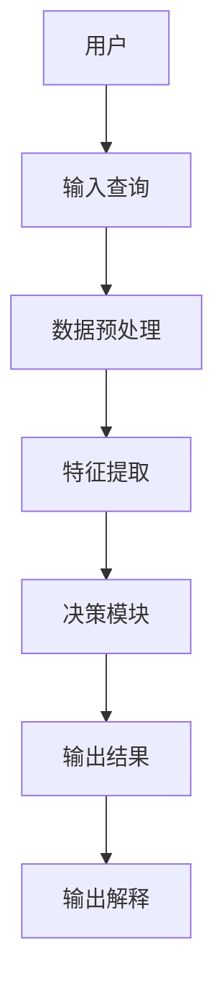

                 


# 《可解释性：理解AI Agent的决策过程》

## 关键词：AI Agent，可解释性，决策过程，解释树模型，系统架构，项目实战

## 摘要：本文深入探讨了AI Agent的可解释性，从背景、核心概念、算法原理到系统架构和项目实战，全面解析如何理解AI Agent的决策过程。文章通过详细分析可解释性的原理、算法实现、系统设计和实际案例，为读者提供了从理论到实践的全面指南。

---

## 第1章：可解释性与AI Agent的背景

### 1.1 问题背景

#### 1.1.1 AI Agent的基本概念
AI Agent是一种智能体，能够感知环境、自主决策并执行任务。它通过传感器获取信息，利用算法处理数据，做出决策，并通过执行器与环境互动。AI Agent广泛应用于自动驾驶、智能助手、机器人等领域。

#### 1.1.2 可解释性的重要性
随着AI Agent的应用越来越广泛，用户和开发者对AI决策过程的理解需求日益增加。可解释性是确保用户信任、优化算法和符合法规的关键因素。

#### 1.1.3 当前AI Agent面临的挑战
许多AI模型，如深度神经网络，虽然性能强大，但缺乏可解释性，导致用户难以理解其决策过程。这种不可解释性限制了其在金融、医疗等高风险领域的应用。

### 1.2 问题描述

#### 1.2.1 可解释性在AI Agent中的定义
可解释性指AI Agent的决策过程能够被人类理解、验证和信任。它包括决策的透明度、逻辑性和可追溯性。

#### 1.2.2 可解释性与不可解释性的对比
可解释性与不可解释性的对比如下：

| 属性 | 可解释性 | 不可解释性 |
|------|----------|------------|
| 理解难度 | 易于理解 | 困难 |
| 用户信任 | 高 | 低 |
| 调试能力 | 易 | 难 |

#### 1.2.3 可解释性对用户信任的影响
可解释性直接影响用户对AI Agent的信任。高可解释性的系统更容易被用户接受和依赖。

### 1.3 问题解决

#### 1.3.1 可解释性目标的设定
设定可解释性目标是实现透明决策的第一步。目标应明确具体，如“提供决策原因的详细解释”。

#### 1.3.2 可解释性在决策过程中的作用
可解释性通过提供决策依据，帮助用户理解AI的行为，增强信任。

#### 1.3.3 可解释性对算法改进的意义
可解释性促使算法设计者关注模型的透明性，推动算法优化和改进。

### 1.4 边界与外延

#### 1.4.1 可解释性的适用范围
可解释性适用于所有AI应用，尤其在高风险领域如医疗、金融等更为关键。

#### 1.4.2 可解释性与其他AI特性
可解释性与可预测性、可解释性与模型复杂度、可解释性与数据量之间的关系需平衡。

#### 1.4.3 可解释性在不同场景下的表现
在实时决策场景中，可解释性可能需要快速响应；在复杂场景中，可解释性需要详细分析。

### 1.5 概念结构与核心要素

#### 1.5.1 可解释性的核心要素
- 解释性：决策的解释方式。
- 透明度：决策过程的开放性。
- 可追溯性：决策的来源和依据。

#### 1.5.2 AI Agent决策过程的构成
1. 数据收集：通过传感器获取信息。
2. 数据处理：分析数据，提取特征。
3. 决策推理：基于模型做出决策。
4. 决策执行：通过执行器执行决策。

#### 1.5.3 可解释性与用户需求
用户需求不同，可解释性的实现方式也不同。例如，普通用户需要简单解释，专家用户需要详细技术分析。

---

## 第2章：可解释性核心概念与联系

### 2.1 核心概念原理

#### 2.1.1 可解释性的基本原理
可解释性通过提供决策的依据和逻辑，帮助用户理解AI的行为。这需要算法设计时就考虑可解释性。

#### 2.1.2 解释性与决策透明度的关系
解释性是决策透明度的基础，高透明度要求详细的解释。

#### 2.1.3 可解释性在不同AI模型中的表现
- 传统模型（如决策树）通常可解释性较强。
- 复杂模型（如深度神经网络）通常可解释性较弱。

### 2.2 属性特征对比

| 特性 | 可解释性 | 不可解释性 |
|------|----------|------------|
| 解释复杂度 | 低 | 高 |
| 信任度 | 高 | 低 |
| 调试难度 | 易 | 难 |

### 2.3 ER实体关系图


---

## 第3章：可解释性算法基础

### 3.1 算法原理

#### 3.1.1 解释树模型（如决策树）
决策树是一种直观的可解释模型，通过树状结构展示决策过程。例如，ID3、C4.5和CART算法。

#### 3.1.2 层次化解释方法
层次化解释通过逐步分解决策过程，提供分层解释。例如，使用LIME或SHAP值。

#### 3.1.3 局部可解释性方法
局部可解释性方法专注于单个预测的解释，如LOF（局部 outlier factor）。

### 3.2 算法流程图

#### 3.2.1 决策树算法流程图


#### 3.2.2 层次化解释流程图


### 3.3 Python代码实现

#### 3.3.1 决策树解释示例
```python
from sklearn.tree import DecisionTreeClassifier
from sklearn import datasets

# 加载数据集
iris = datasets.load_iris()
X = iris.data
y = iris.target

# 训练模型
model = DecisionTreeClassifier()
model.fit(X, y)

# 解释决策过程
from sklearn.tree import export_text
export_text(model, feature_names=iris.feature_names)
```

#### 3.3.2 LIME解释方法
```python
import lime
import lime.lime_tabular

explainer = lime.lime_tabular.LimeTabularExplainer(X, feature_names=iris.feature_names)
explanation = explainer.express_model.predict_partial依赖树结构
```

---

## 第4章：系统分析与架构设计

### 4.1 问题场景介绍
一个智能客服AI Agent需要根据用户输入做出响应，其决策过程需要可解释，以便用户理解。

### 4.2 系统功能设计

#### 4.2.1 领域模型


#### 4.2.2 系统架构


### 4.3 系统接口设计

#### 4.3.1 接口设计
- 输入接口：接收用户输入。
- 输出接口：返回决策结果和解释。

### 4.4 系统交互流程

#### 4.4.1 交互流程图


---

## 第5章：项目实战

### 5.1 环境安装
安装必要的库，如scikit-learn、LIME、numpy、pandas。

### 5.2 核心代码实现

#### 5.2.1 决策树模型实现
```python
from sklearn.tree import DecisionTreeClassifier
from sklearn import datasets

# 加载数据集
iris = datasets.load_iris()
X = iris.data
y = iris.target

# 训练模型
model = DecisionTreeClassifier()
model.fit(X, y)

# 解释决策过程
from sklearn.tree import export_text
export_text(model, feature_names=iris.feature_names)
```

#### 5.2.2 LIME解释方法
```python
import lime
import lime.lime_tabular

explainer = lime.lime_tabular.LimeTabularExplainer(X, feature_names=iris.feature_names)
explanation = explainer.express_model.predict_partial依赖树结构
```

### 5.3 案例分析
以智能客服为例，分析用户输入，生成解释性回复。

### 5.4 项目总结
实现可解释性AI Agent需要选择合适的模型和解释方法，确保用户能够理解决策过程。

---

## 第6章：最佳实践与小结

### 6.1 最佳实践

#### 6.1.1 选择合适的可解释性方法
根据应用场景选择模型，如决策树适合可解释性要求高的场景。

#### 6.1.2 持续优化
定期监控和优化模型，确保可解释性和性能的平衡。

#### 6.1.3 用户教育
向用户普及可解释性知识，提升用户对AI决策的理解。

### 6.2 小结
本文从背景到实战，全面探讨了AI Agent的可解释性，为实现透明和可信的AI系统提供了指导。

### 6.3 注意事项
- 确保可解释性不牺牲模型性能。
- 在不同场景下调整可解释性策略。

### 6.4 拓展阅读
建议阅读相关书籍和论文，深入理解可解释性在不同领域的应用。

---

## 结语
通过本文的探讨，读者可以全面理解AI Agent的可解释性，并在实际项目中应用这些方法和工具，开发出更透明和可信的AI系统。

