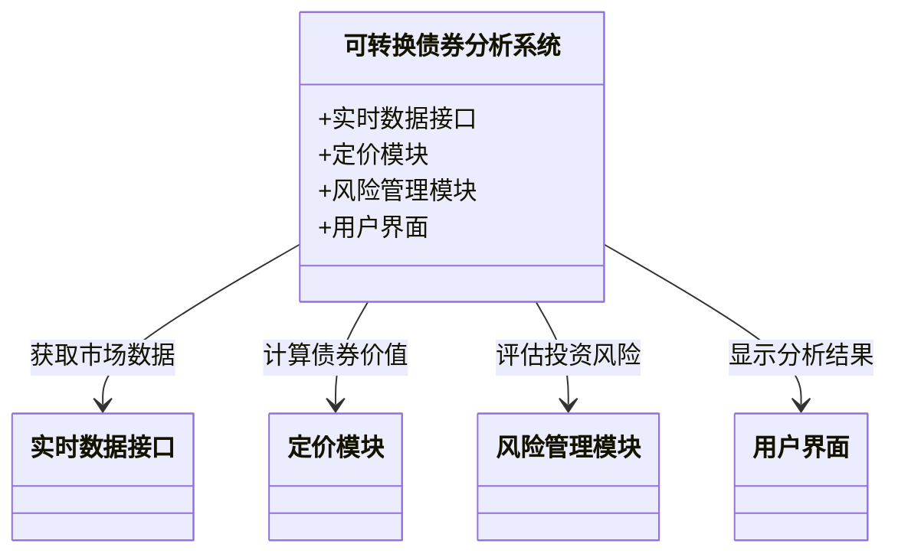

                 


# 可转换债券策略：兼具股债特性的灵活工具

## 关键词
可转换债券, 股债特性, 定价模型, 风险管理, 投资策略, 系统架构, 项目实战

## 摘要
可转换债券是一种结合了债券和股票特性的金融工具，具有灵活性和多样性。本文详细探讨了可转换债券的核心概念、定价模型、风险管理策略、投资策略以及系统架构设计。通过实际案例分析，帮助读者理解如何在实际操作中应用这些策略，优化投资组合并管理风险。

---

## 第1章：可转换债券的基本概念

### 1.1 可转换债券的定义与特点

#### 1.1.1 可转换债券的定义
可转换债券是一种混合型证券，允许投资者在特定条件下将其转换为公司股票。它结合了债券的固定收益特性和股票的潜在增长特性，为投资者提供了灵活的选择。

#### 1.1.2 可转换债券的主要特点
- **债券部分**：提供固定的利息收入，到期偿还本金。
- **股票期权部分**：赋予投资者在特定价格和时间内将债券转换为股票的权利。
- **灵活性**：投资者可以根据市场情况选择持有债券或转换为股票，优化投资收益。

#### 1.1.3 可转换债券的发行与交易机制
可转换债券通常由公司发行，投资者可以在二级市场上买卖，或者在特定条件下行使转换权。

---

### 1.2 可转换债券的股债特性分析

#### 1.2.1 债券部分的特性
- **固定收益**：投资者定期获得利息，到期偿还本金。
- **信用风险**：债券价值受发行公司信用状况影响。

#### 1.2.2 股票期权部分的特性
- **潜在收益**：股价上涨时，转换为股票可带来资本收益。
- **市场风险**：股价下跌时，期权部分价值可能大幅缩水。

#### 1.2.3 股债结合的优势与劣势
- **优势**：收益稳定，潜在高回报。
- **劣势**：复杂性高，风险管理难度大。

---

## 第2章：可转换债券的核心结构与定价模型

### 2.1 可转换债券的结构分析

#### 2.1.1 债券部分的价值评估
债券价值主要由其面值、票面利率和剩余期限决定。

#### 2.1.2 股票期权部分的价值评估
使用Black-Scholes模型评估期权价值，考虑标的股票价格、波动率、执行价和到期时间等因素。

#### 2.1.3 转换价格与转换期限的影响
转换价格决定了债券的转换价值，转换期限影响期权的时间价值。

---

### 2.2 可转换债券的定价模型

#### 2.2.1 二叉树模型在可转换债券定价中的应用
使用二叉树模型模拟股票价格的波动，计算期权部分的价值。

#### 2.2.2 Black-Scholes模型的适用性分析
适用于波动率稳定的市场环境，考虑股息收益率和债券收益率的影响。

#### 2.2.3 其他定价模型的比较与选择
比较不同模型的优缺点，选择适合特定市场条件的定价方法。

---

## 第3章：可转换债券的风险管理策略

### 3.1 可转换债券的主要风险类型

#### 3.1.1 信用风险
发行人无法按时偿还债券本金或利息的风险。

#### 3.1.2 市场风险
市场波动导致债券和期权部分价值下降的风险。

#### 3.1.3 利率风险
利率上升导致债券价格下跌的风险。

---

### 3.2 风险管理的常用方法

#### 3.2.1 久期分析
评估债券价格对利率变化的敏感性。

#### 3.2.2 Value at Risk（VaR）模型的应用
量化投资组合在特定置信水平下的潜在损失。

#### 3.2.3 对冲策略的实施
通过卖出期权或购买相关资产对冲市场风险。

---

## 第4章：可转换债券的投资策略与实战案例

### 4.1 可转换债券的投资策略

#### 4.1.1 买入并持有策略
长期持有债券，享受固定利息收入，伺机转换为股票。

#### 4.1.2 期权套利策略
利用期权市场的波动，进行无风险套利。

#### 4.1.3 灵活配置策略
根据市场环境动态调整债券和股票的配置比例。

---

### 4.2 实战案例分析

#### 4.2.1 某公司可转换债券的发行与定价分析
以某公司为例，分析其可转换债券的发行条件和定价模型。

#### 4.2.2 市场波动对可转换债券价值的影响
通过历史数据，分析市场波动如何影响债券和期权部分的价值。

#### 4.2.3 投资者如何在不同市场环境下优化投资组合
根据市场趋势，调整投资策略，平衡风险和收益。

---

## 第5章：可转换债券的系统分析与架构设计

### 5.1 系统需求分析

#### 5.1.1 问题场景介绍
设计一个可转换债券分析系统，帮助投资者进行定价和风险管理。

#### 5.1.2 项目目标与范围
开发一个用户友好的系统，提供实时定价、风险评估和投资建议。

#### 5.1.3 关键业务需求
- 实时数据获取
- 自动化定价模型
- 风险评估工具
- 可视化投资建议

---

### 5.2 系统功能设计

#### 5.2.1 领域模型设计（Mermaid类图）


#### 5.2.2 系统架构设计（Mermaid架构图）


---

## 第6章：项目实战

### 6.1 环境安装

#### 6.1.1 安装Python和相关库
- 安装Python 3.8及以上版本
- 安装NumPy、Pandas、Matplotlib和Scipy库

#### 6.1.2 安装可转换债券分析系统依赖
- 使用pip安装必要的金融分析库

---

### 6.2 系统核心实现源代码

#### 6.2.1 定价模块实现
```python
import numpy as np
from scipy.stats import norm

def bond_value(face_value, coupon_rate, years):
    # 计算债券的现值
    return face_value * (1 + coupon_rate * years)

def option_value(S, K, T, r, sigma):
    # 使用Black-Scholes模型计算期权价值
    d1 = (np.log(S/K) + (r + 0.5*sigma**2)*T) / (sigma*np.sqrt(T))
    d2 = d1 - sigma*np.sqrt(T)
    C = S * norm.cdf(d1) - K * norm.cdf(d2)
    return C

# 示例计算
face_value = 100
coupon_rate = 0.05
years = 5
S = 50
K = 50
T = 1
r = 0.02
sigma = 0.3

bond_val = bond_value(face_value, coupon_rate, years)
option_val = option_value(S, K, T, r, sigma)
total_value = bond_val + option_val
print(f"债券价值：{bond_val}")
print(f"期权价值：{option_val}")
print(f"总价值：{total_value}")
```

---

### 6.3 代码应用解读与分析

#### 6.3.1 定价模块解读
- `bond_value`函数计算债券的现值，考虑票面价值和票息。
- `option_value`函数使用Black-Scholes模型计算期权价值，考虑股票价格、行权价、时间、利率和波动率。

#### 6.3.2 系统交互分析
用户输入债券参数，系统计算并显示债券和期权的总价值，帮助投资者做出决策。

---

## 第7章：最佳实践、小结和注意事项

### 7.1 最佳实践
- 定期监控市场数据，及时调整投资策略。
- 结合技术分析和基本面分析，优化投资决策。
- 使用专业工具和系统，提高分析效率和准确性。

### 7.2 小结
可转换债券是一种复杂的金融工具，通过合理配置和风险管理，投资者可以在不同市场环境下实现收益最大化。

### 7.3 注意事项
- 投资者需具备一定的金融知识，避免盲目投资。
- 选择可靠的发行公司和金融机构，降低信用风险。
- 定期评估投资组合，及时应对市场变化。

---

## 附录：拓展阅读

### 7.4 拓展阅读推荐
- 《期权、期货和其他衍生产品》
- 《投资学》
- 《金融风险管理》

---

通过以上结构和内容，本文系统地介绍了可转换债券的各个方面，从基础概念到实际应用，为投资者提供了全面的指导和实用的工具。

