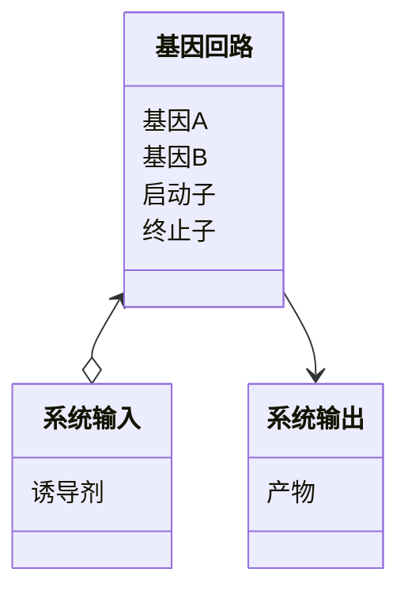
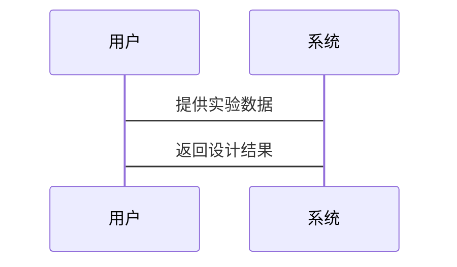

                 


# 合成生物学的发展前景与投资风险分析

> 关键词：合成生物学，基因编辑，投资风险，生物技术，合成基因回路

> 摘要：合成生物学作为一门新兴的交叉学科，结合了生物学、化学、工程学和信息技术，致力于设计和构建新的生物系统或改进现有生物系统。本文将深入探讨合成生物学的发展前景，分析其在医疗、农业、化工等领域的应用潜力，并结合实际案例，评估合成生物学的投资风险和挑战。通过系统分析和实际项目案例，本文将为投资者和技术人员提供有价值的见解和建议。

---

## 第一部分: 合成生物学的发展背景与基本概念

### 第1章: 合成生物学的基本概念与背景

#### 1.1 合成生物学的定义与核心概念

合成生物学（Synthetic Biology）是一门新兴的交叉学科，旨在通过工程学的方法设计和构建新的生物系统或改进现有生物系统。其核心目标是将生物学视为一种可编程的材料，通过基因编辑、代谢工程和系统生物学等技术，实现对生物系统的精确设计和优化。

**1.1.1 合成生物学的定义**

合成生物学可以被定义为一门结合了生物学、化学、工程学和信息技术的学科，旨在通过设计和构建人工生物系统来解决复杂的科学和技术问题。合成生物学的研究范围包括从单个基因到整个生物系统的构建和优化。

**1.1.2 合成生物学的核心概念与研究领域**

合成生物学的核心概念包括：

- **基因编辑**：通过CRISPR-Cas9等工具对基因组进行精确编辑，以实现特定功能的增强或抑制。
- **合成基因回路**：设计和构建人工基因回路，用于控制基因表达的动态行为。
- **代谢工程**：通过调整代谢途径来优化生物系统的生产效率。
- **合成生态系统**：设计人工生态系统，以实现特定的生物功能。

**1.1.3 合成生物学的起源与发展历程**

合成生物学的起源可以追溯到20世纪末，随着基因组测序技术的发展，科学家们开始尝试通过工程学的方法对生物系统进行设计和优化。2003年，Craig Venter等人成功合成第一个完整的细菌基因组，这一突破标志着合成生物学的诞生。近年来，随着CRISPR技术的广泛应用，合成生物学进入快速发展阶段。

---

#### 1.2 合成生物学的现状与发展趋势

**1.2.1 合成生物学的现状分析**

目前，合成生物学已经在多个领域取得了显著进展，例如：

- **医疗领域**：通过设计合成基因回路治疗疾病，如癌症和遗传病。
- **农业领域**：通过代谢工程改良作物的抗病性和营养价值。
- **化工领域**：利用合成生物系统生产生物基材料和化学品。

**1.2.2 合成生物学的技术进步与突破**

近年来，合成生物学在技术上取得了多项突破，包括：

- **CRISPR-Cas9技术**：使基因编辑更加精确和高效。
- **合成基因回路的动态调控**：通过数学建模和实验验证，实现了基因回路的动态行为调控。
- **人工智能在合成生物学中的应用**：利用AI技术加速生物系统的设计和优化。

**1.2.3 合成生物学的未来发展方向**

未来，合成生物学将朝着以下几个方向发展：

- **智能化设计**：利用AI和大数据技术实现生物系统的智能化设计。
- **多功能集成**：构建具有多种功能的合成生物系统，以应对复杂的科学和技术挑战。
- **绿色工业应用**：推动合成生物学在环保和可持续发展领域的应用。

---

## 第二部分: 合成生物学的核心技术与原理

### 第2章: 合成生物学的关键技术

#### 2.1 基因编辑技术

**2.1.1 CRISPR-Cas9技术的原理与应用**

CRISPR-Cas9是一种革命性的基因编辑工具，其原理是通过Cas9蛋白和向导RNA（gRNA）的结合，精准地定位并切割特定的DNA序列。CRISPR-Cas9技术在合成生物学中的应用包括：

- **基因敲除**：通过敲除特定基因来研究其功能。
- **基因敲入**：通过插入特定基因来增强或改变生物系统的功能。

**2.1.2 其他基因编辑工具的比较分析**

除了CRISPR-Cas9，还有其他基因编辑工具，如TALEN和ZFN。这些工具各有优缺点，适用于不同的应用场景。

| 工具名称 | 优点 | 缺点 |
|----------|------|------|
| CRISPR-Cas9 | 高效、便宜、易于操作 | 可能存在脱靶效应 |
| TALEN | 高特异性 | 操作复杂、成本高 |
| ZFN | 高特异性 | 操作复杂、成本高 |

---

#### 2.2 合成基因回路设计

**2.2.1 合成基因回路的基本概念**

合成基因回路是通过人工设计和构建的基因网络，用于控制基因表达的动态行为。一个典型的合成基因回路包括启动子、基因、终止子和调控元件。

**2.2.2 基因回路的设计原理与方法**

基因回路的设计需要考虑以下几个方面：

- **动态行为**：基因回路的响应速度、稳定性等动态特性。
- **调控机制**：基因回路的启动、关闭和反馈调节机制。
- **数学建模**：通过数学模型预测基因回路的行为，并进行实验验证。

**2.2.3 基因回路的稳定性分析**

基因回路的稳定性是设计中的一个重要问题。通过数学建模和实验验证，可以评估基因回路的稳定性，并进行优化设计。

---

#### 2.3 合成生物学中的代谢工程

**2.3.1 代谢工程的基本原理**

代谢工程是指通过基因工程技术优化生物体的代谢途径，以提高特定产物的产量。代谢工程的核心在于对代谢途径的关键酶进行基因敲除或增强。

**2.3.2 合成生物学中代谢工程的应用案例**

一个典型的代谢工程应用是通过基因敲除和过表达关键酶，提高微生物生产目标产物的效率。

---

### 第3章: 合成生物学的核心技术原理

#### 3.1 合成基因回路的数学建模

**3.1.1 基因回路的动态模型构建**

通过建立微分方程模型，可以模拟基因回路的动态行为。例如，以下是一个简单的基因回路模型：

$$ \frac{dx}{dt} = \alpha x - \beta y $$
$$ \frac{dy}{dt} = \gamma x - \delta y $$

其中，x和y分别表示基因A和基因B的表达水平，α、β、γ、δ为速率常数。

**3.1.2 基因回路的稳定性分析**

通过线性稳定性分析，可以评估基因回路的稳态是否稳定。例如，通过计算特征方程的根，可以判断系统的稳定性。

---

#### 3.2 合成生物学中的系统生物学方法

**3.2.1 系统生物学的基本概念**

系统生物学是通过整体分析生物系统的组成和相互作用，以理解其功能和行为的学科。

**3.2.2 系统生物学在合成生物学中的应用**

系统生物学方法在合成生物学中的应用包括：

- **网络分析**：通过构建基因调控网络，分析生物系统的功能。
- **数学建模**：通过系统模型预测生物系统的行为。

---

#### 3.3 合成生物学中的计算工具与平台

**3.3.1 合成生物学的计算工具概述**

目前，有许多计算工具可用于合成生物学的设计和优化，例如：

- **GenoCAD**：用于合成基因回路的设计。
- **SBOL**：用于合成生物学的标准建模语言。

**3.3.2 常用合成生物学设计平台的介绍**

常用的合成生物学设计平台包括：

- **iGEM Parts Database**：提供合成生物学所需的标准化元件。
- **BioBricks**：提供标准化的生物模块。

---

## 第三部分: 合成生物学的应用场景与投资分析

### 第4章: 合成生物学的应用场景

#### 4.1 医疗领域的应用

**4.1.1 疾病治疗**

合成生物学在医疗领域的应用包括通过设计合成基因回路治疗疾病，例如癌症和遗传病。

**4.1.2 疫苗开发**

合成生物学技术可以用于设计和优化疫苗的生产过程。

#### 4.2 农业领域的应用

**4.2.1 作物改良**

通过代谢工程改良作物的抗病性和营养价值。

**4.2.2 农业可持续性**

通过设计合成生物系统，提高农业生产的可持续性。

#### 4.3 化工领域的应用

**4.3.1 生物基材料生产**

通过合成生物系统生产生物基材料，例如聚乳酸。

**4.3.2 化学品合成**

通过代谢工程优化微生物的代谢途径，提高化学品的产量。

---

### 第5章: 合成生物学的投资风险分析

#### 5.1 合成生物学的投资现状

**5.1.1 投资趋势**

近年来，合成生物学吸引了大量的投资，特别是在医疗和农业领域。

**5.1.2 投资机构**

许多风险投资机构已经开始关注合成生物学领域，例如：

- **Flagship Pioneers**：专注于合成生物学的投资机构。

---

#### 5.2 合成生物学的投资风险

**5.2.1 技术风险**

合成生物学技术尚处于发展阶段，存在技术不确定性和失败风险。

**5.2.2 市场风险**

合成生物学的应用可能面临市场需求不足的风险。

**5.2.3 政策风险**

合成生物学的监管政策可能影响投资回报。

---

#### 5.3 合成生物学的退出机制

**5.3.1 并购退出**

通过将合成生物技术公司出售给大型企业，实现退出。

**5.3.2 IPO退出**

通过首次公开募股（IPO）实现退出。

---

## 第四部分: 合成生物学的系统分析与架构设计

### 第6章: 合成生物学的系统分析与架构设计

#### 6.1 项目介绍

**6.1.1 项目背景**

本章将以一个合成生物系统的设计为例，介绍系统分析与架构设计的过程。

---

#### 6.2 系统功能设计

**6.2.1 领域模型（mermaid类图）**



---

#### 6.3 系统架构设计

**6.3.1 系统架构（mermaid架构图）**


---

#### 6.4 系统接口设计

**6.4.1 接口描述**

系统接口包括：

- **输入接口**：接收实验数据和模型参数。
- **输出接口**：输出基因回路的设计方案和模拟结果。

---

#### 6.5 系统交互设计

**6.5.1 交互流程（mermaid序列图）**



---

## 第五部分: 合成生物学的项目实战

### 第7章: 合成生物学的项目实战

#### 7.1 环境搭建

**7.1.1 软件安装**

需要安装以下软件：

- **Python**：用于数据分析和模拟。
- **CRISPR设计工具**：用于基因编辑设计。

---

#### 7.2 系统核心实现

**7.2.1 代码实现**

以下是一个简单的基因回路设计代码示例：

```python
def simulate_gene_circuit(parameter):
    # 模拟基因回路的动态行为
    import numpy as np
    import matplotlib.pyplot as plt
    t = np.linspace(0, 100, 1000)
    y = np.zeros(1000)
    for i in range(1, 1000):
        y[i] = parameter * y[i-1] + (1 - y[i-1])
    plt.plot(t, y)
    plt.show()
```

---

#### 7.3 代码应用解读与分析

**7.3.1 代码功能**

上述代码模拟了一个简单的基因回路的动态行为，通过调整参数可以观察系统的稳定性。

---

#### 7.4 实际案例分析

**7.4.1 案例介绍**

以下是一个合成生物系统设计的案例：通过设计合成基因回路提高微生物的代谢效率。

---

#### 7.5 项目小结

**7.5.1 项目总结**

通过本项目，我们了解了合成生物学的设计和实现过程，掌握了基因回路的模拟方法。

---

## 第六部分: 合成生物学的总结与展望

### 第8章: 合成生物学的总结与展望

#### 8.1 总结

**8.1.1 核心内容回顾**

本文详细介绍了合成生物学的发展背景、核心技术、应用场景和投资风险。

---

#### 8.2 展望

**8.2.1 未来发展方向**

未来，合成生物学将朝着智能化、多功能化和绿色化方向发展，为人类社会带来更多的创新和变革。

---

## 第七部分: 合成生物学的注意事项与最佳实践

### 第9章: 合成生物学的注意事项与最佳实践

#### 9.1 最佳实践

**9.1.1 技术建议**

在进行合成生物学研究时，建议以下几点：

- **注重数学建模**：通过数学模型预测系统的动态行为。
- **实验验证**：设计合理的实验方案，验证模型的准确性。

---

#### 9.2 小结

**9.2.1 内容回顾**

本文通过系统分析和实际案例，为读者提供了合成生物学的全面解读。

---

#### 9.3 注意事项

**9.3.1 投资风险提示**

在进行合成生物学投资时，需要注意技术风险、市场风险和政策风险。

---

## 第八部分: 合成生物学的拓展阅读与进一步思考

### 第10章: 合成生物学的拓展阅读与进一步思考

#### 10.1 拓展阅读

**10.1.1 推荐书籍**

- 《Synthetic Biology: A Primer》
- 《Gene Therapy: Principles and Practice》

---

#### 10.2 进一步思考

**10.2.1 合成生物学的未来挑战**

合成生物学的发展需要解决以下问题：

- **技术瓶颈**：基因编辑的精度和效率需要进一步提高。
- **伦理问题**：合成生物学的伦理争议需要引起关注。

---

## 结语

合成生物学作为一门新兴的交叉学科，具有广阔的发展前景和巨大的投资潜力。然而，其发展也面临技术、市场和政策等多方面的挑战。通过系统分析和实际案例，本文为读者提供了合成生物学的全面解读，为投资者和技术人员提供了有价值的参考和建议。

---

通过以上内容，您可以深入了解合成生物学的发展前景与投资风险分析。如需进一步探讨或获取更多资料，请随时联系。

