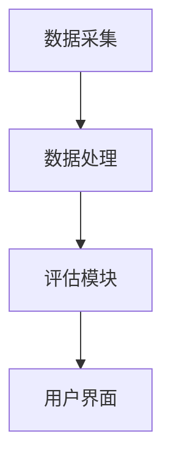
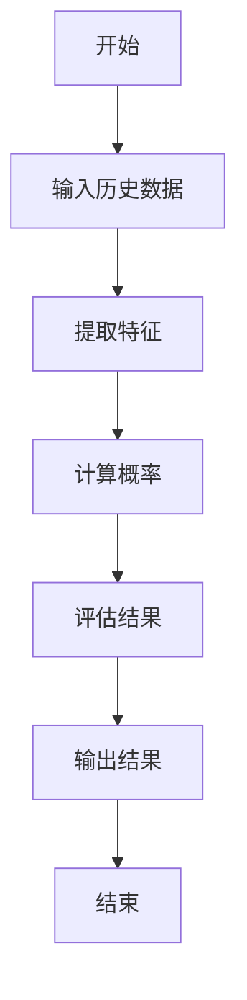
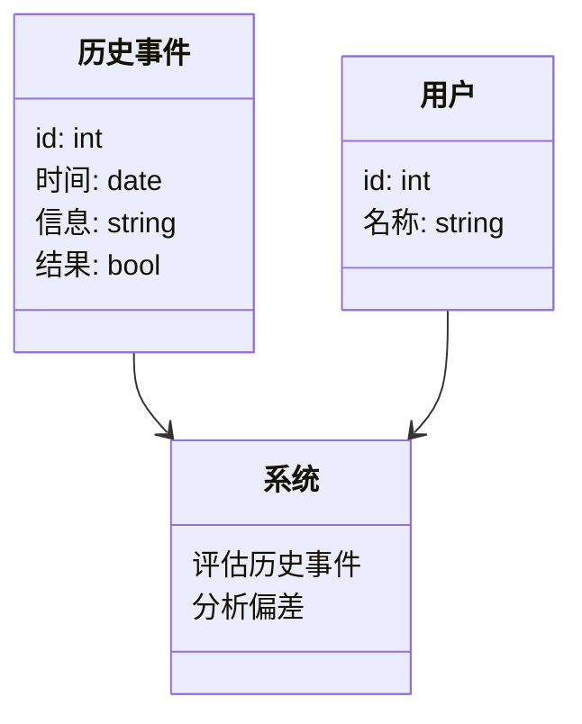
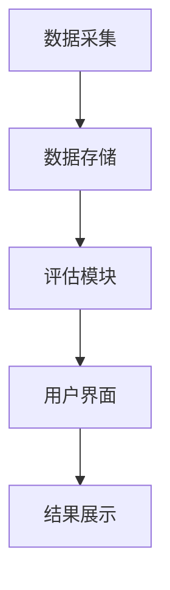
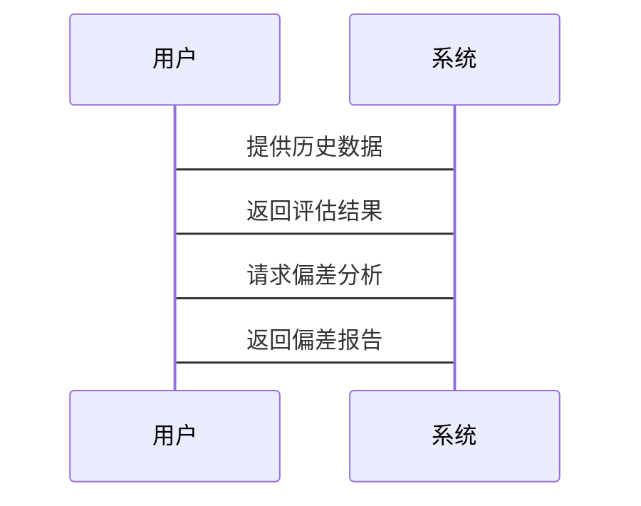

                 


# 后见之明偏差：正确评估历史信息的价值

## 关键词：后见之明偏差、历史信息评估、认知偏差、算法原理、系统设计

## 摘要：  
后见之明偏差（Hindsight Bias）是指人们在得知结果后，倾向于相信自己在事前已经预料到了这一结果。这种偏差会影响我们对历史信息的评估和决策。本文将深入分析后见之明偏差的定义、成因及其对历史信息评估的影响，探讨如何通过算法和系统设计来避免这种偏差，并提供实际案例和解决方案。

---

# 第1章 后见之明偏差的定义与成因

## 1.1 后见之明偏差的定义

后见之明偏差是一种认知偏差，表现为人们在得知某一事件的结果后，倾向于认为自己在事前已经预测到了这一结果。这种偏差源于人类对确定性的追求和对不确定性的厌恶。  

### 1.1.1 偏差的基本概念  
- 后见之明偏差的核心在于“**结果导向**”，即人们倾向于根据已知的结果来重新解释过去的信息，从而产生一种“我早就知道”的错觉。  
- 这种偏差不仅影响个人决策，还可能影响集体决策和历史研究。  

### 1.1.2 偏差的成因  
- **认知偏差的内因**：人类大脑倾向于简化复杂信息，后见之明偏差使得人们更倾向于选择性记忆和选择性解释。  
- **结果的可预测性**：如果结果是高度可预测的，人们更容易产生后见之明偏差；反之，则较难。  

### 1.1.3 偏差的特征与表现  
- **确定性错觉**：人们倾向于认为过去的信息比实际情况更具可预测性。  
- **选择性记忆**：人们倾向于记住那些支持自己事后判断的信息，而忽略或遗忘矛盾的信息。  

---

## 1.2 后见之明偏差与信息评估的关系

### 1.2.1 偏差对历史信息评估的影响  
- 偏差会导致人们高估自己对历史信息的预测能力，从而影响对历史事件的客观分析。  
- 在团队决策中，后见之明偏差可能导致团队成员对过去决策的过度自信，从而忽视当前决策的真实风险。  

### 1.2.2 信息评估的基本原理  
- 信息评估的核心在于对历史数据的分析和对未来可能性的预测。  
- 后见之明偏差会扭曲这种分析，导致评估结果的偏差。  

---

# 第2章 后见之明偏差的算法原理

## 2.1 偏差的数学模型

### 2.1.1 概率模型  
后见之明偏差可以用概率模型来描述。假设事件A的发生概率为P(A)，在事件A发生后，人们倾向于认为自己在事前已经预测到了这一结果。  

$$ P(\text{预测到}|A) = P(A) $$  

然而，实际上，预测的概率可能远低于事件发生的概率。  

### 2.1.2 贝叶斯定理的应用  
贝叶斯定理可以帮助我们更准确地评估历史信息的价值。假设我们有历史数据D，我们需要评估事件E的可能性：  

$$ P(E|D) = \frac{P(D|E)P(E)}{P(D)} $$  

通过贝叶斯框架，我们可以避免后见之明偏差，因为我们需要根据数据和先验概率，而不是仅仅根据结果来判断事件的可能性。

---

## 2.2 后见之明偏差的系统分析

### 2.2.1 系统架构设计  

#### 2.2.1.1 系统功能模块  
- **数据采集模块**：收集历史事件的相关数据。  
- **数据处理模块**：对数据进行清洗和特征提取。  
- **评估模块**：基于概率模型评估历史信息的价值。  
- **用户界面**：展示评估结果和偏差分析。  

#### 2.2.1.2 系统架构图  



### 2.2.2 算法流程图  



---

# 第3章 后见之明偏差的系统设计

## 3.1 问题场景介绍

假设我们正在分析一个历史事件（例如，某公司的市场策略失败），我们需要评估哪些信息对事件的结果起到了关键作用。后见之明偏差可能导致我们高估某些信息的价值，而忽视其他关键因素。

## 3.2 系统功能设计

### 3.2.1 领域模型  



---

## 3.3 系统架构设计



---

## 3.4 系统接口设计

### 3.4.1 接口描述  

- **输入接口**：历史事件数据，包括时间、信息和结果。  
- **输出接口**：评估结果和偏差分析报告。  

### 3.4.2 交互流程  



---

## 4. 项目实战：基于概率模型的历史信息评估

### 4.1 环境安装

```bash
pip install numpy pandas scikit-learn
```

### 4.2 核心代码实现

```python
import numpy as np
from sklearn.metrics import accuracy_score

# 示例数据：历史事件的特征和结果
X = np.array([[1, 0], [0, 1], [1, 1], [0, 0]])
y = np.array([0, 1, 1, 0])

# 训练模型
from sklearn.tree import DecisionTreeClassifier
model = DecisionTreeClassifier()
model.fit(X, y)

# 预测结果
y_pred = model.predict(X)
print("预测准确率：", accuracy_score(y, y_pred))
```

### 4.3 代码解读与分析

- 该代码使用决策树模型对历史数据进行分类。  
- 准确率反映了模型对历史数据的预测能力，但需要注意后见之明偏差可能导致对模型性能的高估。

### 4.4 案例分析

假设我们正在分析某次市场活动的成功与否，使用上述模型可以评估哪些市场因素对结果起到了关键作用。通过分析模型的特征重要性，我们可以避免后见之明偏差的影响。

### 4.5 项目小结

通过概率模型和系统设计，我们可以更准确地评估历史信息的价值，避免后见之明偏差的影响。

---

## 5. 最佳实践与总结

### 5.1 小结

- 后见之明偏差是认知偏差的一种，会影响历史信息的评估和决策。  
- 通过概率模型和系统设计，我们可以更客观地评估历史信息的价值。

### 5.2 注意事项

- 在分析历史数据时，应尽量避免结果导向的思维。  
- 使用概率模型和统计方法可以有效减少偏差的影响。  

### 5.3 拓展阅读

- 《Thinking, Fast and Slow》：丹尼尔·卡尼曼的著作，深入分析了认知偏差及其对决策的影响。  
- 《The Signal and the Noise》： Nate Silver 的著作，探讨了概率预测在现实中的应用。  

---

# 总结

后见之明偏差是一个普遍存在的认知问题，但在技术领域，我们可以通过概率模型和系统设计来减少其影响。通过本文的分析和实践，我们可以在历史信息评估中更加客观和科学。

