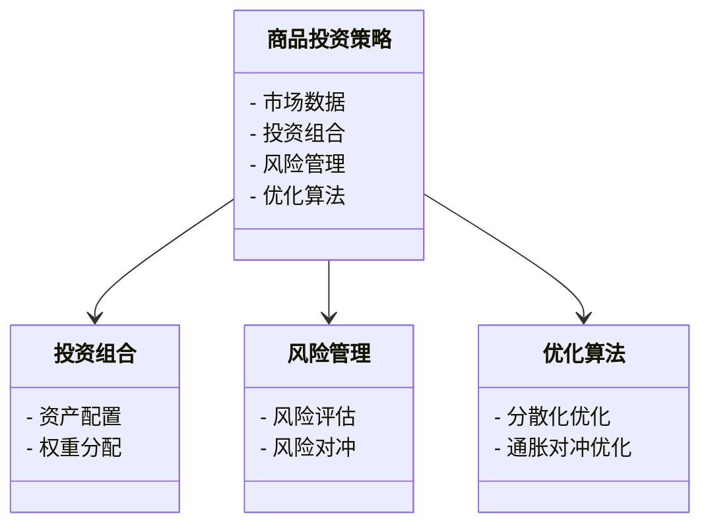
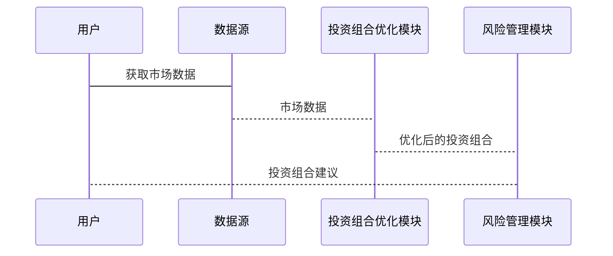

                 


# 商品投资策略：分散化和通胀对冲

> 关键词：商品投资、分散化策略、通胀对冲、风险管理、投资组合优化、数学模型

> 摘要：本文深入探讨商品投资策略中的分散化和通胀对冲两大核心主题。通过分析分散化投资的原理与应用、通胀对冲的机制与工具，结合数学模型和实际案例，为投资者提供科学的决策依据。文章从背景介绍、核心概念、算法原理、系统架构到项目实战，层层递进，帮助读者全面理解商品投资策略的精髓。

---

# 第1章: 商品投资策略的背景与基础

## 1.1 商品投资的基本概念

### 1.1.1 商品投资的定义与分类

商品投资是指通过购买或投资于实物商品（如黄金、石油、农产品等）或相关金融工具（如期货、期权）来实现资本增值的活动。商品投资可以分为实物商品投资和金融商品投资两大类。

### 1.1.2 商品市场的基本特征

商品市场具有以下基本特征：
- **周期性**：商品价格受供需关系、市场情绪和宏观经济因素的影响，呈现周期性波动。
- **杠杆性**：商品投资可以通过杠杆放大收益或损失。
- **多样性**：商品市场涵盖能源、金属、农产品等多个领域，投资者可以根据市场趋势选择合适的投资标的。
- **风险性**：商品价格波动较大，投资风险较高。

### 1.1.3 商品投资与金融投资的区别

商品投资与传统金融投资（如股票、债券）的区别主要体现在以下几个方面：
- **标的物**：商品投资以实物商品或相关衍生品为标的，而金融投资以股票、债券等金融资产为标的。
- **波动性**：商品价格波动较大，而金融资产的波动性相对较小。
- **对冲机制**：商品市场可以通过期货、期权等工具进行有效的价格对冲，而金融投资则更多依赖于市场波动和公司基本面。

---

## 1.2 分散化投资的必要性

### 1.2.1 投资风险的来源

商品投资中的风险主要来源于以下几个方面：
- **市场风险**：商品价格受市场供需关系和宏观经济因素的影响，存在波动性风险。
- **流动性风险**：部分商品市场的流动性较低，可能导致买卖价差较大或难以快速变现。
- **信用风险**：在商品衍生品交易中，交易对手的信用风险需要重点关注。

### 1.2.2 分散化投资的基本原理

分散化投资是指通过将资金分配到多个不同的资产或领域，降低单一资产价格波动带来的风险。其基本原理是通过多样化投资来分散和降低非系统性风险。

### 1.2.3 分散化与收益的关系

分散化投资并不意味着收益的降低，相反，通过合理分散投资标的，可以在控制风险的前提下，实现收益的最大化。根据现代投资组合理论（MPT），通过分散化可以降低投资组合的总体风险，从而提高风险调整后的收益。

---

## 1.3 通胀对冲的核心概念

### 1.3.1 通胀的定义与影响

通货膨胀是指物价总水平在一段时间内持续上涨，导致货币购买力下降。通胀对经济和个人投资的影响是多方面的，包括资产价格的波动、利率的变化以及消费者购买力的下降。

### 1.3.2 商品在通胀对冲中的作用

商品作为实物资产，其价格通常会随着通胀的上升而上涨。例如，能源、金属和农产品等商品的价格往往与通胀水平密切相关，因此在通胀上升周期中，商品投资可以起到有效的对冲作用。

### 1.3.3 通胀对冲的策略选择

通胀对冲的策略主要包括以下几种：
- **持有实物商品**：通过直接持有黄金、石油等实物商品，对冲通胀带来的货币贬值风险。
- **投资商品期货**：通过投资商品期货市场，利用价格波动进行对冲。
- **配置商品相关股票**：投资于与商品价格密切相关的上市公司股票，间接实现通胀对冲。

---

## 1.4 本章小结

本章介绍了商品投资的基本概念、分散化投资的必要性以及通胀对冲的核心概念。通过分析商品投资的特点和风险，我们认识到分散化投资和通胀对冲是实现长期稳健收益的重要策略。

---

# 第2章: 分散化投资的原理与应用

## 2.1 分散化投资的数学模型

### 2.1.1 投资组合的方差计算公式

投资组合的方差计算公式为：
$$\sigma_p^2 = \sum_{i=1}^n w_i^2 \sigma_i^2 + 2 \sum_{i<j} w_i w_j \sigma_{i,j}$$

其中：
- \( w_i \) 为第 \( i \) 个资产的投资权重。
- \( \sigma_i^2 \) 为第 \( i \) 个资产的收益率方差。
- \( \sigma_{i,j} \) 为第 \( i \) 个资产和第 \( j \) 个资产的协方差。

---

## 2.2 分散化投资的实现方法

### 2.2.1 等权重分配策略

等权重分配策略是指将资金均匀分配到多个资产或领域中，以实现分散化投资。例如，将资金按相等比例投资于能源、金属和农产品三个领域。

### 2.2.2 风险调整后的权重分配

风险调整后的权重分配是根据各资产的风险程度进行权重调整，以降低组合的整体风险。例如，根据历史波动率对各资产进行权重调整。

### 2.2.3 行业和地区的分散化策略

通过投资不同行业和地区的商品，可以有效降低区域性和行业性风险。例如，同时投资于美国和中东的石油资产。

---

## 2.3 分散化投资的工具与平台

### 2.3.1 期货市场的分散化应用

通过投资商品期货市场，投资者可以利用期货价格波动进行分散化投资。例如，投资于不同交割月的原油期货合约。

### 2.3.2 股票市场的分散化配置

通过投资于与商品价格相关的上市公司股票，投资者可以实现分散化投资。例如，投资于多家能源公司的股票。

### 2.3.3 基金与ETF在分散化中的作用

商品ETF（交易所交易基金）是实现分散化投资的重要工具。例如，投资于黄金ETF可以间接持有黄金资产。

---

## 2.4 实际案例分析

### 2.4.1 石油与天然气行业的分散化投资

假设投资者将资金分配到不同地区的石油和天然气资产中，以降低区域风险。

### 2.4.2 金属与矿业的分散化配置

通过投资于黄金、白银和铜等多种金属资产，实现分散化投资。

### 2.4.3 农产品市场的分散化策略

将资金分配到小麦、大豆和玉米等多个农产品领域，降低单一作物价格波动带来的风险。

---

## 2.5 本章小结

本章详细讲解了分散化投资的数学模型、实现方法和工具应用，并通过实际案例分析展示了分散化投资在商品投资中的重要作用。

---

# 第3章: 通胀对冲的原理与工具

## 3.1 通胀对冲的基本原理

### 3.1.1 通胀对冲的核心机制

通胀对冲的核心机制是通过投资于价格随通胀上升的商品资产，抵消通胀对购买力的侵蚀。例如，黄金和石油等商品的价格通常会随着通胀上升而上涨。

### 3.1.2 商品在通胀对冲中的角色

商品作为实物资产，其价格通常与通胀水平密切相关。通过投资商品资产，可以有效对冲通胀风险。

### 3.1.3 通胀对冲与分散化投资的结合

通过分散化投资于不同商品资产，可以在对冲通胀的同时降低单一资产价格波动带来的风险。

---

## 3.2 通胀对冲的主要工具

### 3.2.1 通胀保值债券（TIPS）

TIPS是一种通胀保值债券，其本金会随着通胀指数上涨而调整，从而保证投资者的实际购买力。

### 3.2.2 商品期货与期权

商品期货与期权是常用的通胀对冲工具。例如，投资于原油期货可以对冲能源价格上涨带来的通胀风险。

### 3.2.3 股票中的通胀对冲资产

通过投资于与通胀密切相关的上市公司股票，可以间接实现通胀对冲。例如，投资于能源和矿业公司股票。

---

## 3.3 通胀对冲的数学模型

### 3.3.1 通胀预期的回归模型

通胀预期的回归模型可以表示为：
$$\pi_t = \beta_1 + \beta_2 x_t + \epsilon_t$$

其中：
- \( \pi_t \) 为第 \( t \) 期的通胀率。
- \( x_t \) 为影响通胀的解释变量。
- \( \epsilon_t \) 为误差项。

---

## 3.4 实际案例分析

### 3.4.1 石油期货在通胀对冲中的应用

通过投资于石油期货，投资者可以对冲能源价格上涨带来的通胀风险。

### 3.4.2 黄金在通胀对冲中的历史表现

黄金作为传统的通胀对冲工具，在历史上的通胀周期中表现优异。

### 3.4.3 农产品期权的对冲策略

通过投资于农产品期权，投资者可以对冲农产品价格上涨带来的通胀风险。

---

## 3.5 本章小结

本章详细讲解了通胀对冲的基本原理、主要工具和数学模型，并通过实际案例分析展示了通胀对冲在商品投资中的应用。

---

# 第4章: 商品投资策略的数学模型

## 4.1 分散化投资的数学模型

### 4.1.1 投资组合优化的数学公式

投资组合优化的数学公式为：
$$\text{最大化 } \mu_p \text{，使得 } \sigma_p^2 \text{ 最小化}$$

其中：
- \( \mu_p \) 为投资组合的预期收益率。
- \( \sigma_p^2 \) 为投资组合的收益率方差。

---

## 4.2 通胀对冲的数学模型

### 4.2.1 通胀预期的回归模型

通胀预期的回归模型可以表示为：
$$\pi_t = \beta_1 + \beta_2 x_t + \epsilon_t$$

---

## 4.3 商品投资组合的优化策略

通过结合分散化投资和通胀对冲的数学模型，可以实现商品投资组合的优化。例如，通过优化算法选择最优的投资组合，以实现风险最小化和收益最大化。

---

## 4.4 本章小结

本章通过数学模型详细讲解了分散化投资和通胀对冲的实现方法，为投资者提供了科学的决策依据。

---

# 第5章: 系统分析与架构设计方案

## 5.1 问题场景介绍

商品投资策略的实现需要考虑多个因素，包括市场数据的获取、投资组合的优化、风险的控制等。

---

## 5.2 系统功能设计

### 5.2.1 领域模型（Mermaid 类图）



---

## 5.3 系统架构设计（Mermaid 架构图）

```mermaid
architecturalDiagram
    数据源 --> 数据处理 --> 投资组合优化 --> 风险管理 --> 输出结果
```

---

## 5.4 系统接口设计

### 5.4.1 数据接口

- **输入**：市场数据（商品价格、宏观经济指标等）。
- **输出**：优化后的投资组合。

### 5.4.2 用户接口

- **输入**：用户的投资目标和风险偏好。
- **输出**：优化后的投资组合建议。

---

## 5.5 系统交互设计（Mermaid 序列图）



---

## 5.6 本章小结

本章通过系统分析和架构设计，展示了商品投资策略实现的全过程，为投资者提供了技术支持。

---

# 第6章: 项目实战

## 6.1 环境安装

- **编程语言**：Python 3.8+
- **库的安装**：Pandas、NumPy、Matplotlib、Scipy

```bash
pip install pandas numpy matplotlib scipy
```

---

## 6.2 核心实现源代码

### 6.2.1 分散化投资的实现

```python
import numpy as np
import pandas as pd

# 示例数据：假设有3种商品的收益率
returns = pd.DataFrame({
    '能源': [0.1, 0.05, -0.02],
    '金属': [0.08, 0.03, 0.05],
    '农产品': [-0.02, 0.1, 0.03]
})

# 计算投资组合的方差
weights = np.array([1/3, 1/3, 1/3])
cov_matrix = returns.cov()
portfolio_variance = np.dot(weights, np.dot(cov_matrix, weights))
print("投资组合方差为：", portfolio_variance)
```

### 6.2.2 通胀对冲的实现

```python
import statsmodels.api as sm

# 示例数据：通胀率和解释变量
inflation = [2, 3, 4, 5]
x = [1, 2, 3, 4]

# 构建回归模型
model = sm.OLS(inflation, sm.add_constant(x))
result = model.fit()
print(result.summary())
```

---

## 6.3 实际案例分析

### 6.3.1 分散化投资的案例

假设投资者有100万美元，将其分配到能源、金属和农产品三个领域，每个领域投资30万美元。通过计算投资组合的方差，可以评估整体风险。

### 6.3.2 通胀对冲的案例

通过回归模型分析通胀预期，选择合适的商品资产进行投资，以实现通胀对冲。

---

## 6.4 本章小结

本章通过项目实战，展示了商品投资策略的具体实现过程，帮助读者将理论应用于实践。

---

# 第7章: 总结与注意事项

## 7.1 总结

本文从分散化投资和通胀对冲两大核心策略出发，结合数学模型和实际案例，全面讲解了商品投资策略的实现方法。通过系统分析和项目实战，为投资者提供了科学的决策依据。

## 7.2 注意事项

- **风险控制**：商品投资风险较高，投资者需注意风险控制。
- **市场监控**：密切关注市场动态，及时调整投资策略。
- **分散化与对冲结合**：通过分散化投资和通胀对冲的结合，实现风险最小化和收益最大化。

## 7.3 拓展阅读

- 《商品期货交易策略》
- 《投资组合优化与风险管理》
- 《通胀对冲的理论与实践》

---

# 附录: 商品投资策略的数学公式汇总

## 附录1: 分散化投资的数学公式

- 投资组合方差公式：
$$\sigma_p^2 = \sum_{i=1}^n w_i^2 \sigma_i^2 + 2 \sum_{i<j} w_i w_j \sigma_{i,j}$$

## 附录2: 通胀对冲的数学公式

- 通胀预期回归模型：
$$\pi_t = \beta_1 + \beta_2 x_t + \epsilon_t$$

---

通过以上内容，读者可以系统地掌握商品投资策略的核心内容和实现方法。

