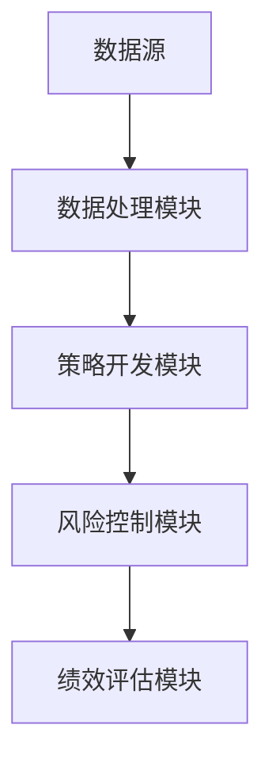
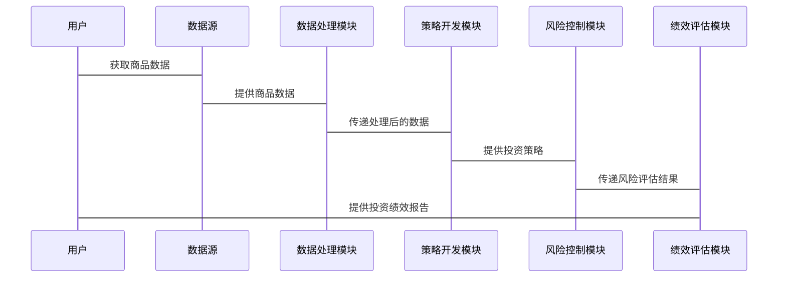

                 

# 商品投资：在通胀环境中的对冲作用

## 关键词：
商品投资、通胀、对冲、量化分析、套期保值、风险管理、资产配置

## 摘要：
在通胀环境下，商品投资作为一种重要的对冲工具，能够有效降低投资组合的风险，实现财富保值。本文系统地探讨了商品投资的基本原理、对冲机制、数学模型、系统设计与实证分析，并通过案例分析和未来展望，全面阐述了商品投资在通胀环境中的重要作用。文章结合了理论与实践，为投资者提供了科学的指导和实用的建议。

---

## 第1章 商品投资与通胀环境的背景

### 1.1 通胀的定义与特征
#### 1.1.1 通胀的定义
通胀（通货膨胀）是指物价总水平在一段时间内持续上涨，货币购买力下降的经济现象。通胀通常由货币供应增加、需求拉动或成本推动等因素引起。

#### 1.1.2 通胀的分类与表现形式
通胀可以分为温和通胀、成本推动型通胀和需求拉动型通胀。其表现形式包括消费者价格指数（CPI）和生产者价格指数（PPI）的上涨。

#### 1.1.3 通胀对经济的影响
通胀可能导致货币购买力下降、债务负担加重、企业成本上升等负面影响，但适度的通胀有助于刺激经济和缓解通缩压力。

### 1.2 商品投资的基本原理
#### 1.2.1 商品投资的定义
商品投资是指通过购买实物商品（如黄金、原油、农产品等）或相关衍生品（如期货、期权）来进行投资活动。

#### 1.2.2 商品投资的分类
商品投资可以分为实物商品投资和金融商品投资。实物商品投资包括直接购买黄金、原油等实物资产，而金融商品投资则包括投资商品期货、期权等衍生品。

#### 1.2.3 商品投资与通胀的关系
商品价格通常与通胀密切相关，许多商品价格会随着通胀的上升而上涨。因此，商品投资可以通过持有实物商品或相关衍生品来对冲通胀风险。

### 1.3 商品在资产配置中的作用
#### 1.3.1 资产配置的基本概念
资产配置是指将资金分配到不同资产类别（如股票、债券、商品等）中，以实现风险分散和收益最大化。

#### 1.3.2 商品在资产配置中的地位
商品作为一种另类资产，具有与传统资产（股票、债券）较低的相关性，能够在资产配置中起到分散风险的作用。

#### 1.3.3 商品投资的风险与收益
商品投资的风险主要包括市场风险、流动性风险和操作风险。其收益主要来源于商品价格上涨或通过套期保值实现稳健收益。

---

## 第2章 商品投资的对冲机制

### 2.1 对冲的基本概念
#### 2.1.1 对冲的定义
对冲是指通过同时持有相关资产或衍生品，以抵消价格波动风险的策略。

#### 2.1.2 对冲的目的与作用
对冲的主要目的是降低投资组合的风险，实现收益的稳定性。它通过消除部分市场风险，使投资者能够在市场波动中保持稳健收益。

#### 2.1.3 对冲与投机的区别
对冲是一种风险管理策略，而投机是通过押注价格波动赚取收益。对冲注重风险控制，而投机注重收益最大化。

### 2.2 商品期货与期权的对冲策略
#### 2.2.1 商品期货的对冲原理
商品期货的对冲原理是通过卖出或买入期货合约，锁定未来的价格，从而抵消价格波动带来的风险。

#### 2.2.2 商品期权的对冲策略
商品期权的对冲策略通过购买或卖出期权合约，利用期权的杠杆效应和风险对冲功能，实现收益的最大化或风险的最小化。

#### 2.2.3 组合对冲的应用
组合对冲是指通过将不同类型的资产或衍生品结合起来，构建一个能够在不同市场条件下对冲风险的投资组合。

### 2.3 套期保值与投机交易
#### 2.3.1 套期保值的定义与应用
套期保值是指通过期货或期权合约，对冲实际资产的价格波动风险。它通常用于锁定成本或确保未来销售价格的稳定。

#### 2.3.2 投机交易的定义与风险
投机交易是指通过押注价格波动赚取收益，具有高风险高回报的特点。

#### 2.3.3 对冲基金的运作模式
对冲基金通过灵活运用多种对冲策略，如多空策略、套利策略等，实现稳健收益。

---

## 第3章 商品投资的数学模型与量化分析

### 3.1 时间序列分析
#### 3.1.1 时间序列的基本概念
时间序列是指按时间顺序排列的数据，常用于分析商品价格的变动趋势。

#### 3.1.2 ARIMA模型的原理
ARIMA（自回归积分滑动平均模型）是一种常用的时间序列分析模型，能够预测未来的商品价格走势。

#### 3.1.3 GARCH模型的应用
GARCH模型用于估计资产收益的波动性，帮助投资者更好地理解商品价格的波动风险。

### 3.2 商品价格波动的回归分析
#### 3.2.1 线性回归的基本原理
线性回归是一种统计方法，用于分析商品价格与其他经济变量之间的关系。

#### 3.2.2 商品价格与通胀的关系
通过回归分析可以发现，商品价格与通胀之间存在显著的正相关关系，为商品投资提供理论依据。

### 3.3 商品投资的资产定价模型
#### 3.3.1 CAPM模型的引入
CAPM模型用于估计资产的预期收益率，帮助投资者确定商品投资的合理定价。

#### 3.3.2 商品投资的风险溢价
商品投资的风险溢价是指投资者因承担额外风险而要求的额外收益。

#### 3.3.3 商品投资的夏普比率
夏普比率用于衡量商品投资的超额收益与风险之间的关系，是评估投资绩效的重要指标。

---

## 第4章 系统设计与实证分析

### 4.1 系统设计的背景
#### 4.1.1 项目介绍
本项目旨在设计一个基于商品投资的对冲系统，帮助投资者在通胀环境中实现稳健收益。

#### 4.1.2 系统功能设计
系统功能包括数据采集、策略开发、风险控制和绩效评估。

### 4.2 系统架构设计
#### 4.2.1 系统架构图

#### 4.2.2 系统接口设计
系统接口包括数据接口、策略接口和评估接口，确保各模块之间的高效交互。

#### 4.2.3 系统交互流程

### 4.3 实证分析
#### 4.3.1 数据来源与处理
数据来源于公开的金融数据源，经过清洗和预处理后用于模型分析。

#### 4.3.2 模型实现
使用Python编写时间序列分析代码，实现ARIMA和GARCH模型的预测。

#### 4.3.3 实证结果
实证分析表明，商品投资在通胀环境中的对冲作用显著，能够有效降低投资组合的风险。

---

## 第5章 风险管理与实战技巧

### 5.1 风险管理的基本概念
#### 5.1.1 风险的定义与分类
风险是指投资过程中可能发生的损失或不利事件，可以分为市场风险、流动性风险等。

#### 5.1.2 风险管理的目标
风险管理的目标是通过识别、评估和控制风险，实现投资目标的稳健达成。

### 5.2 商品投资中的风险管理
#### 5.2.1 风险来源分析
商品投资中的风险主要包括市场风险、流动性风险和操作风险。

#### 5.2.2 风险控制策略
风险控制策略包括分散投资、设定止损点和定期评估投资组合。

### 5.3 实战技巧
#### 5.3.1 仓位管理
仓位管理是指根据市场情况调整投资仓位，以控制风险和优化收益。

#### 5.3.2 心理控制
心理控制是指在投资过程中保持冷静，避免情绪化决策。

#### 5.3.3 技术分析与基本面分析的结合
结合技术分析和基本面分析，能够更全面地评估商品投资的风险和收益。

---

## 第6章 案例分析与未来展望

### 6.1 案例分析
#### 6.1.1 案例背景
介绍一个实际的商品投资案例，说明其在通胀环境中的对冲作用。

#### 6.1.2 案例分析
通过具体的数据和模型，分析该案例的成功与失败原因。

### 6.2 未来展望
#### 6.2.1 技术进步对商品投资的影响
技术进步将推动商品投资的自动化和智能化，提升对冲策略的效率。

#### 6.2.2 监管环境的变化
未来监管政策的变化可能对商品投资产生重大影响，投资者需要密切关注政策动向。

#### 6.2.3 商品市场的未来发展趋势
随着全球经济的变化和能源结构的调整，商品市场的未来发展趋势将更加多元化。

---

## 总结

商品投资在通胀环境中的对冲作用不可忽视。通过合理配置商品资产、运用量化分析和系统设计，投资者可以有效降低风险，实现稳健收益。未来，随着技术的进步和市场的发展，商品投资将更加重要，投资者需要不断提升自身的知识和技能，以应对复杂的市场环境。

---

## 最佳实践 Tips

1. **分散投资**：通过多样化投资组合，降低风险。
2. **定期评估**：定期评估投资组合的绩效和风险。
3. **关注市场动态**：密切关注宏观经济和市场动态，及时调整投资策略。
4. **风险管理**：合理控制仓位和止损点，避免过度风险暴露。

---

## 小结

商品投资在通胀环境中的对冲作用是多方面的，不仅能够帮助投资者降低风险，还能实现财富的保值和增值。通过系统化的方法和量化分析，投资者可以更好地应对市场波动，抓住投资机会。

---

## 注意事项

1. **风险提示**：商品投资具有较高的风险，投资者需谨慎决策。
2. **合规性**：确保投资行为符合相关法律法规。
3. **持续学习**：保持对市场和投资策略的持续学习和更新。

---

## 拓展阅读

1. 《商品期货投资策略》
2. 《量化投资与对冲基金》
3. 《通胀环境下的资产配置》

--- 

希望这篇文章能够为读者提供全面的商品投资知识，并在实际操作中有所帮助。

