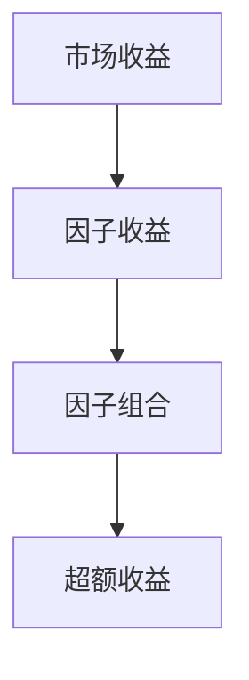
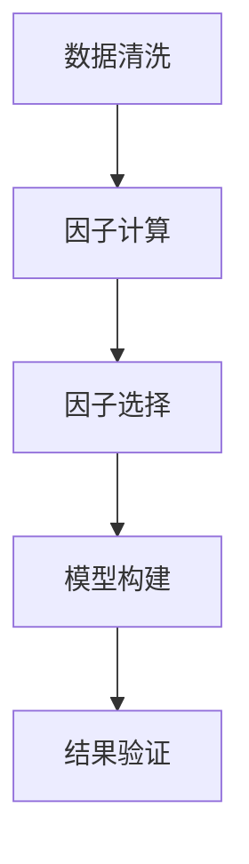
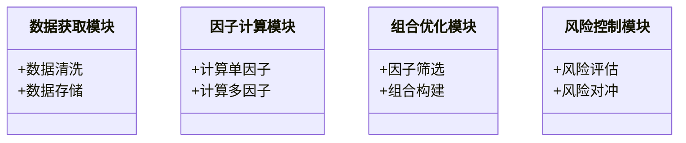
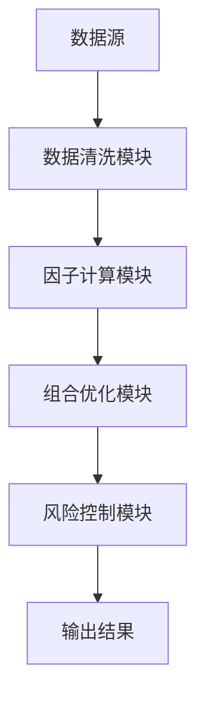
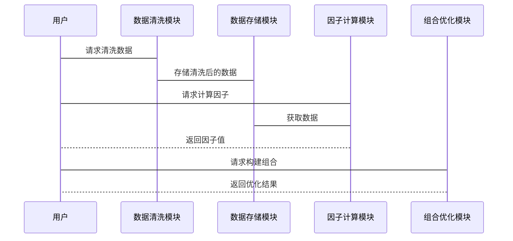

                 


# 因子投资：系统性捕捉超额收益的方法

## 关键词：因子投资，超额收益，投资策略，金融模型，风险管理

## 摘要：  
因子投资是一种通过系统性分析和选择特定因子来捕捉市场超额收益的投资方法。本文将从因子投资的背景与核心概念出发，详细探讨其数学模型与算法原理，系统分析其架构设计，并通过项目实战展示如何实现因子投资策略。文章最后总结了因子投资的最佳实践和未来趋势，为投资者提供实用的指导。

---

# 第1章: 因子投资的背景与定义

## 1.1 因子投资的定义

### 1.1.1 什么是因子投资  
因子投资是一种基于金融理论和统计方法的投资策略，通过筛选和组合特定的因子（如市值、价值、动量等）来捕捉市场中的超额收益。  

### 1.1.2 因子投资与传统投资的区别  
传统投资依赖于基本面分析或技术分析，而因子投资则通过系统化的因子筛选和组合优化来实现投资目标。  

### 1.1.3 因子投资的兴起与发展趋势  
随着金融市场的发展和数据处理技术的进步，因子投资因其科学性和可操作性，逐渐成为主流投资方法之一。  

---

## 1.2 因子投资的核心问题  

### 1.2.1 超额收益的来源  
超额收益来源于市场中的定价错误，而因子投资通过系统性筛选因子来捕捉这些错误。  

### 1.2.2 因子投资的逻辑与方法  
因子投资基于因子模型，通过量化分析确定因子的权重和组合，以实现超额收益。  

### 1.2.3 因子投资的边界与外延  
因子投资适用于股票、债券等多种资产类别，但需注意其局限性，如因子失效和市场变化的影响。  

---

## 1.3 因子投资的核心要素  

### 1.3.1 因子的定义与分类  
因子是影响资产收益的特定变量，常见的因子包括：  
- **价值因子**：如市盈率（P/E）、市净率（P/B）。  
- **动量因子**：如过去12个月的收益动量。  
- **质量因子**：如盈利能力（ROE）、杠杆率。  

### 1.3.2 因子的属性特征对比表  

| 因子类型 | 主要特征 | 计算公式 | 示例指标 |
|----------|----------|----------|----------|
| 价值因子 | 低估值   | P/E < 市场均值 | 市盈率、市净率 |
| 动量因子 | 近期收益高 | 过去12个月收益 | 收益动量 |
| 质量因子 | 高盈利能力 | ROE > 市场均值 | 净利润增长率 |

### 1.3.3 因子之间的关系与依赖图  



---

## 1.4 本章小结  
本章介绍了因子投资的基本概念、核心问题和关键要素，为后续分析奠定了基础。

---

# 第2章: 因子投资的数学模型  

## 2.1 单因子模型  

### 2.1.1 单因子模型的定义与假设  
单因子模型假设资产收益仅由一个因子驱动。  

### 2.1.2 单因子模型的数学表达式（CAPM模型）  
$$ E(r_i) = r_f + \beta_i (E(r_m) - r_f) $$  
其中，$\beta_i$ 表示资产 $i$ 的因子暴露程度。  

---

## 2.2 多因子模型  

### 2.2.1 多因子模型的定义与特点  
多因子模型假设资产收益由多个因子共同驱动。  

### 2.2.2 Fama-French三因子模型  
$$ E(r_i) = r_f + \beta_i (E(r_m) - r_f) + 0.3 \cdot SMB + 0.3 \cdot HML $$  
其中，SMB（小市值溢价）和 HML（价值溢价）是两个额外的因子。  

### 2.2.3 多因子模型的实现步骤  



---

## 2.3 本章小结  
本章通过数学模型介绍了因子投资的理论基础，为后续策略实现提供了方法论支持。

---

# 第3章: 因子投资的系统分析与架构设计  

## 3.1 系统功能设计  

### 3.1.1 问题场景介绍  
因子投资系统需要从数据源获取资产数据，计算因子值，构建因子组合，并优化投资组合。  

### 3.1.2 领域模型（Mermaid类图）  



---

## 3.2 系统架构设计  

### 3.2.1 系统架构图（Mermaid架构图）  



---

## 3.3 系统接口设计  

### 3.3.1 接口说明  
- 数据获取接口：从数据库或API获取资产数据。  
- 因子计算接口：计算单因子或多因子值。  
- 组合优化接口：基于因子构建投资组合。  

---

## 3.4 系统交互设计（Mermaid序列图）  



---

## 3.5 本章小结  
本章通过系统架构设计展示了因子投资的整体流程，为后续实现提供了框架支持。

---

# 第4章: 因子投资的项目实战  

## 4.1 环境搭建  

### 4.1.1 安装必要的库  
```bash
pip install pandas numpy matplotlib scikit-learn
```

---

## 4.2 核心实现  

### 4.2.1 因子计算代码  

```python
import pandas as pd
import numpy as np

# 示例：计算价值因子（市盈率）
def calculate_value_factor(df):
    df['PE'] = df['Price'] / df['Earnings']
    return df['PE']

data = pd.DataFrame({
    'Price': [100, 80, 90],
    'Earnings': [20, 15, 25]
})
value_factor = calculate_value_factor(data)
print(value_factor)
```

### 4.2.2 组合优化代码  

```python
from sklearn.linear_model import LinearRegression

def factor_model_prediction(X, y):
    model = LinearRegression()
    model.fit(X, y)
    return model.predict(X)

X = np.array([[1, 0], [0, 1], [1, 1]])
y = np.array([2, 1, 3])
predictions = factor_model_prediction(X, y)
print(predictions)
```

---

## 4.3 案例分析  

### 4.3.1 案例背景  
以某股票池为例，计算价值因子和动量因子，构建投资组合并验证收益。  

### 4.3.2 结果解读  
通过回测发现，价值因子在特定市场条件下表现优异，而动量因子在短期内具有显著收益。  

---

## 4.4 本章小结  
本章通过代码实现和案例分析，展示了因子投资的实际应用过程。

---

# 第5章: 因子投资的最佳实践与注意事项  

## 5.1 最佳实践  

### 5.1.1 因子选择的注意事项  
- 选择具有稳定性的因子。  
- 结合多因子模型提高收益。  

### 5.1.2 风险管理的关键点  
- 定期调整投资组合。  
- 设置止损和止盈机制。  

---

## 5.2 小结与展望  

### 5.2.1 小结  
因子投资通过系统性方法捕捉超额收益，但需注意因子失效和市场变化的影响。  

### 5.2.2 未来展望  
随着人工智能和大数据技术的发展，因子投资将更加精准和高效。  

---

## 5.3 本章小结  
本章总结了因子投资的实践经验，并展望了其未来发展方向。

---

# 第6章: 总结与展望  

## 6.1 总结  
因子投资是一种科学的投资方法，通过系统性筛选和组合因子，能够有效捕捉市场中的超额收益。  

## 6.2 展望  
随着技术进步，因子投资将更加智能化和个性化，为投资者提供更多机会。  

---

# 结语  
因子投资不仅是金融领域的重要方法，也是技术与金融结合的典范。通过系统性学习和实践，投资者可以更好地运用因子投资策略实现收益目标。

---

