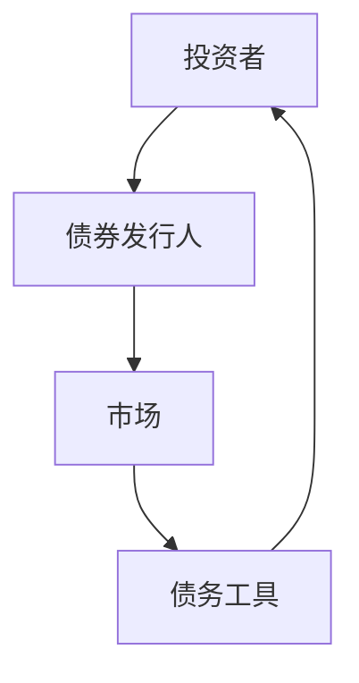
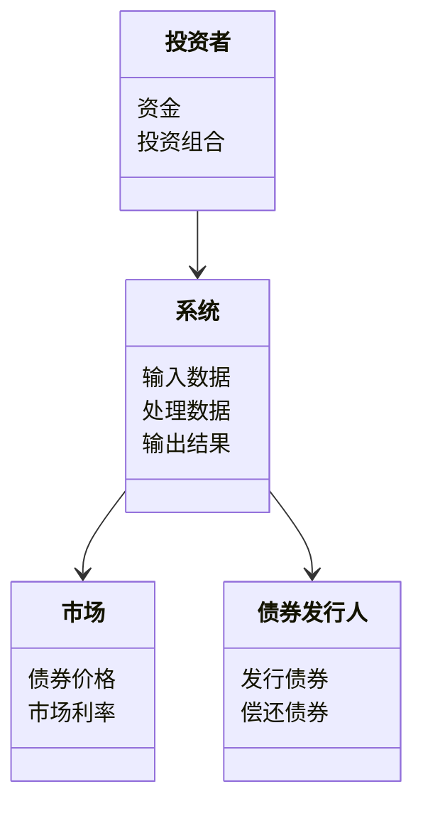
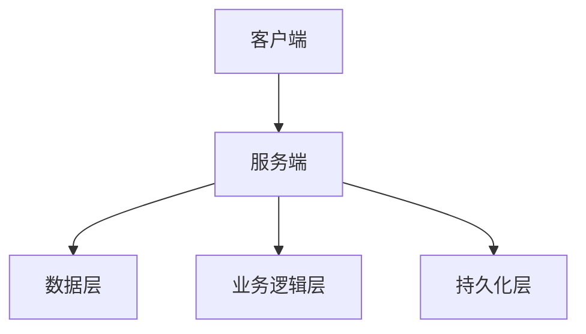
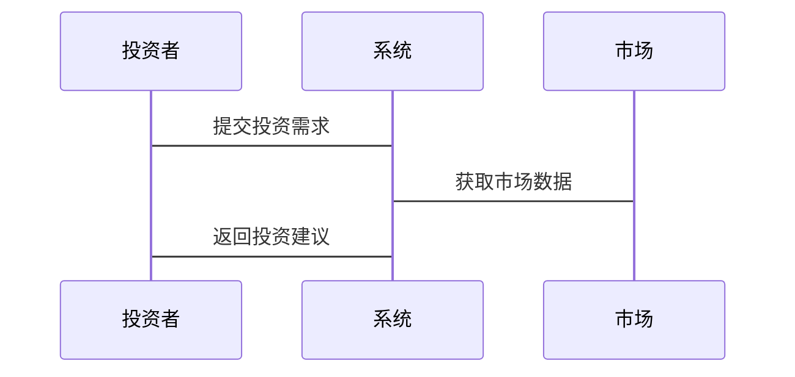

                 


---

# 《固定收益策略：在低利率环境中寻求收益》

---

## 关键词：
低利率、固定收益、债券、收益率、信用风险、利率风险、投资策略

---

## 摘要：
本文深入探讨了低利率环境下固定收益策略的核心概念、算法原理和实践应用。通过分析当前低利率环境的成因及其对固定收益市场的影响，本文详细阐述了固定收益产品的基本概念、利率预测模型、债券定价公式、久期与凸性分析等关键内容。同时，本文通过系统架构设计、项目实战案例分析等方法，为投资者提供了在低利率环境中寻求收益的有效策略。

---

## 第一部分：低利率环境下的固定收益策略背景

### 第1章：低利率环境与固定收益市场的现状

#### 1.1 低利率环境的背景与挑战

- **1.1.1 经济周期与利率政策的演变**
  - 经济周期的波动对利率政策的影响。
  - 中央银行在低利率环境下的角色。

- **1.1.2 当前全球低利率环境的成因**
  - 经济增长放缓与通货膨胀压力。
  - 全球央行的量化宽松政策。

- **1.1.3 低利率对固定收益市场的影响**
  - 债券收益率下降，投资者面临收益压力。
  - 信用风险与流动性风险的加剧。

#### 1.2 固定收益产品的基本概念

- **1.2.1 固定收益产品的定义与分类**
  - 债券、贷款、资产支持证券等。
  - 短期债券与长期债券的区别。

- **1.2.2 主要固定收益工具的特征**
  - 利息支付方式。
  - 债务偿还方式。

- **1.2.3 固定收益市场的参与者与交易机制**
  - 投资者、发行人、经纪商。
  - 一级市场与二级市场的交易机制。

#### 1.3 低利率环境下固定收益策略的核心问题

- **1.3.1 利率下行对债券收益率的影响**
  - 债券价格与收益率的反向关系。
  - 利率波动对债券组合的影响。

- **1.3.2 信用风险与流动性风险的加剧**
  - 低利率环境下企业违约风险上升。
  - 市场流动性不足对交易的影响。

- **1.3.3 寻求收益与风险平衡的策略选择**
  - 如何在低利率环境下优化投资组合。
  - 风险管理策略的制定。

---

### 第2章：固定收益策略的核心概念与联系

#### 2.1 固定收益策略的定义与特点

- **2.1.1 固定收益策略的定义**
  - 通过投资固定收益产品实现稳定收益的策略。

- **2.1.2 固定收益策略的核心要素**
  - 利率预测、信用分析、久期管理。

- **2.1.3 固定收益策略与权益投资的区别**
  - 收益来源不同。
  - 风险特征不同。

#### 2.2 固定收益策略的分类与对比

- **2.2.1 利率策略与信用策略的对比**
  - 利率策略关注市场利率变化。
  - 信用策略关注信用风险。

- **2.2.2 短期策略与长期策略的差异**
  - 短期策略注重流动性管理。
  - 长期策略注重收益最大化。

- **2.2.3 主动管理与被动管理的优劣势**
  - 主动管理灵活性强但成本高。
  - 被动管理风险分散但收益稳定。

#### 2.3 固定收益策略的数学模型与公式

- **2.3.1 利率模型的数学表达**
  - 利率预测模型：
  $$i_t = \alpha + \beta i_{t-1} + \epsilon_t$$

- **2.3.2 债券定价公式**
  - 债券价格计算：
  $$P = \sum_{t=1}^{n} \frac{C}{(1 + y)^t} + \frac{F}{(1 + y)^n}$$

- **2.3.3 久期与凸性的计算公式**
  - 久期：
  $$Duration = \frac{1}{(1 + y)} \frac{\partial P}{\partial y}$$
  - 凸性：
  $$Convexity = \frac{1}{(1 + y)^2} \frac{\partial^2 P}{\partial y^2}$$

#### 2.4 固定收益策略的ER实体关系图



---

## 第二部分：固定收益策略的算法原理

### 第3章：固定收益策略的算法原理

#### 3.1 固定收益策略的主要算法

- **3.1.1 利率预测算法**
  - 使用ARIMA模型预测未来利率走势：
  ```mermaid
  graph TD
      Start --> 输入历史数据
      输入历史数据 --> 训练模型
      训练模型 --> 输出预测结果
      输出预测结果 --> 结束
  ```

- **3.1.2 久期与凸性分析算法**
  - 计算债券组合的久期和凸性，以优化组合的风险敞口。

---

## 第三部分：系统分析与架构设计

### 第4章：系统分析与架构设计方案

#### 4.1 问题场景介绍

- **目标**：构建一个固定收益分析系统，帮助投资者在低利率环境下制定投资策略。

- **项目介绍**：系统将整合利率预测模型、债券定价算法和风险评估模块。

#### 4.2 系统功能设计

- **领域模型**：


- **系统架构设计**：


- **系统接口设计**：
  - 输入接口：接收投资者的请求。
  - 输出接口：返回分析结果。

- **系统交互流程**：


---

## 第四部分：项目实战

### 第5章：项目实战：构建固定收益分析系统

#### 5.1 环境安装

- **Python环境**：安装Python 3.8及以上版本。
- **依赖库**：安装pandas、numpy、scipy、matplotlib。

#### 5.2 系统核心实现源代码

```python
import numpy as np
import pandas as pd
from scipy.optimize import minimize

# 示例：计算债券久期
def calculate_duration(y, c, f, n):
    duration = 0
    for t in range(1, n+1):
        duration += (c / (1 + y)**t) * t
    duration += f * n / (1 + y)**n
    duration = duration / (c * (1 - (1 + y)**-n))
    return duration

# 示例：计算凸性
def calculate_convexity(y, c, f, n):
    convexity = 0
    for t in range(1, n+1):
        convexity += (c / (1 + y)**t) * t * (t + 1) / 2
    convexity += f * n * (n + 1) / (2 * (1 + y)**n)
    convexity = convexity / (c * (1 - (1 + y)**-n))
    return convexity

# 示例：利率预测模型
def interest_rate_forecast(history_rates):
    # 使用简单线性回归预测
    t = np.arange(len(history_rates))
    slope = np.polyfit(t, history_rates, 1)
    return slope[0] * t + slope[1]

# 主程序
if __name__ == "__main__":
    y = 0.02  # 假设年化收益率为2%
    c = 100    # 每期利息
    f = 1000   # 面值
    n = 10     # 剩余期限
    print("久期:", calculate_duration(y, c, f, n))
    print("凸性:", calculate_convexity(y, c, f, n))
    history_rates = [2%, 2.5%, 3%, 3.5%]  # 历史利率
    forecast = interest_rate_forecast(history_rates)
    print("预测利率:", forecast)
```

#### 5.3 案例分析与详细解读

- **案例分析**：
  - 投资者希望投资于10年期债券，当前收益率为2%，每期利息100元，面值1000元。
  - 计算债券的久期和凸性，评估其对利率变化的敏感性。
  - 使用线性回归模型预测未来利率走势，优化投资组合。

#### 5.4 项目小结

- **实现目标**：
  - 成功构建固定收益分析系统。
  - 实现了久期、凸性计算和利率预测功能。

- **经验总结**：
  - 数学模型的选择对系统性能至关重要。
  - 数据的准确性和完整性影响预测结果。

---

## 第五部分：最佳实践、小结、注意事项和拓展阅读

### 5.1 最佳实践

- **分散投资**：避免过度集中在单一债券或发行人。
- **定期再平衡**：根据市场变化调整投资组合。
- **风险管理**：使用久期和凸性等指标控制风险敞口。

### 5.2 小结

- 本文详细探讨了低利率环境下固定收益策略的核心概念、算法原理和系统架构。
- 通过项目实战，展示了如何利用固定收益分析系统优化投资组合。
- 投资者应结合市场环境和自身风险承受能力，制定合理的投资策略。

### 5.3 注意事项

- **数据风险**：确保数据的准确性和及时性。
- **模型风险**：选择合适的数学模型，避免过度拟合。
- **市场风险**：关注宏观经济变化和政策调整。

### 5.4 拓展阅读

- 建议读者进一步学习固定收益市场的高级策略，如信用衍生品、多资产配置等。
- 关注最新的金融科技创新，如人工智能在固定收益投资中的应用。

---

## 结语

在低利率环境下，固定收益策略的制定需要投资者具备扎实的理论基础和实践经验。通过本文的分析，读者可以更好地理解固定收益产品的特性，掌握利率预测和风险评估的方法，并在实际操作中灵活运用这些策略，以实现收益与风险的最优平衡。

