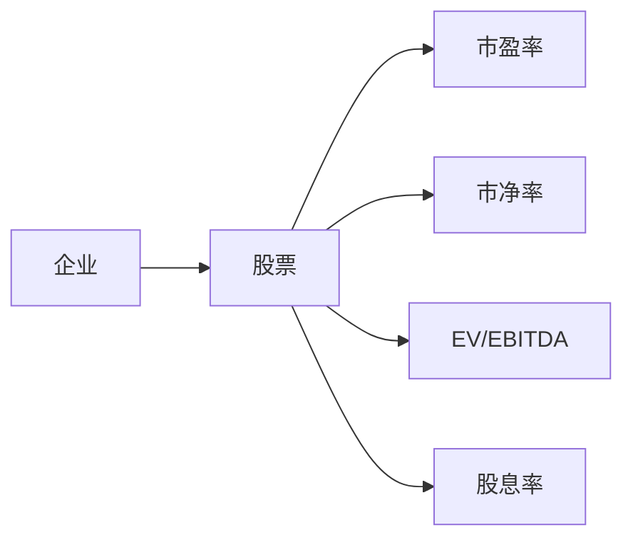
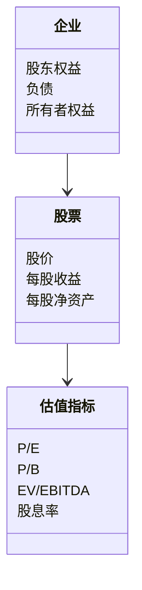
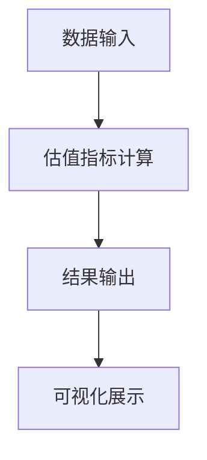

                 


# 国际市场估值指标的局限性探讨

> 关键词：国际市场估值指标、市盈率、市净率、EV/EBITDA、股息率、资本资产定价模型、市场有效性

> 摘要：本文系统探讨了国际市场估值指标的局限性，分析了传统估值方法在不同市场环境下的适用性与不足。通过对市盈率、市净率、EV/EBITDA等主流估值指标的理论基础、计算方法及其局限性的深入分析，结合实际案例，揭示了这些指标在不同经济周期、市场波动和企业特异风险下的不足之处。最后，本文提出了改进建议，并展望了未来研究方向。

---

## 第一部分：国际市场估值指标的背景与现状

### 第1章：国际估值指标的发展历程

#### 1.1 估值指标的起源与演变
国际市场的估值指标起源于20世纪初的金融理论发展。早期的估值方法主要基于基本面分析，如市盈率（P/E）和市净率（P/B）等指标，这些方法在当时主要用于评估企业的内在价值。随着金融理论的深化，资本资产定价模型（CAPM）和套利定价理论（APT）的提出，为现代估值指标的形成奠定了理论基础。

#### 1.2 现代估值指标的演变
20世纪70年代以来，随着金融创新的不断推进，新的估值指标如企业价值倍数（EV/EBITDA）和股息率（Dividend Yield）逐渐兴起。这些指标在不同市场环境下的表现各异，但总体上反映了金融理论与实践的结合。

#### 1.3 国际化背景下的估值指标发展
随着全球化的深入，国际市场间的资本流动日益频繁，不同市场的估值指标逐渐融合。然而，由于各国经济结构、市场环境和监管政策的差异，估值指标的适用性也面临新的挑战。

### 第2章：国际市场估值指标的现状分析

#### 2.1 主流国际估值指标概述
- **市盈率（P/E）**：衡量股票价格与每股收益的比例，反映市场对收益的估值。
- **市净率（P/B）**：衡量股票价格与每股净资产的比例，适用于评估资产密集型企业的价值。
- **企业价值倍数（EV/EBITDA）**：综合考虑企业整体价值的指标，适用于不同资本结构的企业。
- **股息率（Dividend Yield）**：衡量股票派息能力，反映投资者对收益的即时回报需求。

#### 2.2 各国市场估值指标的差异性
- **美国市场**：以市盈率和EV/EBITDA为主，注重企业的成长性和盈利能力。
- **欧洲市场**：市净率和股息率较为常见，反映了对稳健收益的需求。
- **亚洲市场**：新兴市场中，EV/EBITDA和市盈率结合使用，反映了高成长性企业的估值需求。

#### 2.3 当前国际市场估值指标的局限性
- **经济周期影响**：在经济衰退期，市盈率和市净率可能无法准确反映企业的真实价值。
- **市场波动干扰**：短期市场波动可能导致估值指标的短期失真。
- **特异风险忽视**：企业特定风险（如管理风险、行业风险）难以通过单一指标反映。

---

## 第二部分：国际估值指标的核心概念与联系

### 第3章：国际估值指标的理论基础

#### 3.1 资本资产定价模型（CAPM）
- **定义与公式**：CAPM是用于计算资产期望收益的模型，公式为：
  $$ E(R_i) = R_f + \beta_i (R_m - R_f) $$
  其中，$R_f$是无风险利率，$R_m$是市场预期收益率，$\beta_i$是资产的贝塔系数。
- **在估值中的应用**：CAPM常用于计算股权资本成本，进而影响企业价值评估。
- **局限性**：假设市场有效性和无摩擦市场环境，实际中难以满足。

#### 3.2 市场决定价格理论
- **市场有效性的假设**：假设市场价格反映所有可用信息。
- **非理性偏差**：现实中，市场参与者的行为偏差可能导致价格偏离内在价值。

#### 3.3 股权资本成本与资产定价
- **资本成本的计算**：股权资本成本是企业融资成本的重要组成部分，影响整体资产定价。
- **资产定价与市场估值的关系**：资产定价是市场估值的基础，而市场估值反过来影响资产定价。

### 第4章：国际估值指标的核心概念与联系

#### 4.1 估值指标的核心属性对比
| 指标名称 | 计算公式 | 适用场景 | 局限性 |
|----------|----------|----------|--------|
| 市盈率（P/E） | P/E = 价格/每股收益 | 成长型企业 | 受盈利波动影响大 |
| 市净率（P/B） | P/B = 价格/每股净资产 | 资产密集型企业 | 忽略盈利能力 |
| EV/EBITDA | EV/EBITDA = 企业价值/息税折旧及摊销前利润 | 整体价值评估 | 忽略财务杠杆 |
| 股息率 | 股息率 = 每股股息/股价 | 高分红企业 | 忽略成长性 |

#### 4.2 实体关系图


---

## 第三部分：国际估值指标的算法原理

### 第5章：估值指标的计算流程

#### 5.1 市盈率的计算公式
$$ P/E = \frac{\text{股价}}{\text{每股净利润}} $$

#### 5.2 市净率的计算公式
$$ P/B = \frac{\text{股价}}{\text{每股净资产}} $$

#### 5.3 EV/EBITDA的计算公式
$$ EV/EBITDA = \frac{\text{企业价值}}{\text{息税折旧及摊销前利润}} $$

#### 5.4 股息率的计算公式
$$ \text{股息率} = \frac{\text{每股股息}}{\text{股价}} $$

### 第6章：算法原理的数学模型

#### 6.1 市盈率与企业价值的关系
假设企业净利润为$E$，市盈率为$P/E$，则企业价值大致为：
$$ \text{企业价值} = P/E \times E $$

#### 6.2 EV/EBITDA与资本结构的关系
$$ EV = \text{股权价值} + \text{债务价值} $$
$$ EBITDA = \text{息税前利润} + \text{折旧} + \text{摊销} $$

---

## 第四部分：系统分析与架构设计

### 第7章：系统功能设计

#### 7.1 领域模型


#### 7.2 系统架构


---

## 第五部分：项目实战

### 第8章：环境安装与核心实现

#### 8.1 Python代码实现
```python
def calculate_pe_ratio(price, earnings_per_share):
    return price / earnings_per_share

def calculate_pb_ratio(price, book_value_per_share):
    return price / book_value_per_share

def calculate_ev_ebitda(ev, ebitda):
    return ev / ebitda

def calculate_dividend_yield(dividend_per_share, price):
    return dividend_per_share / price
```

#### 8.2 代码应用解读
- `calculate_pe_ratio`：计算市盈率，反映市场对收益的估值。
- `calculate_pb_ratio`：计算市净率，适用于资产密集型企业。
- `calculate_ev_ebitda`：计算企业价值倍数，综合考虑企业整体价值。
- `calculate_dividend_yield`：计算股息率，反映分红能力。

### 第9章：实际案例分析

#### 9.1 案例分析：美国市场中的科技企业
以苹果公司为例，分析市盈率和EV/EBITDA的适用性。

#### 9.2 案例分析：欧洲市场中的传统行业企业
以德国化工企业为例，分析市净率和股息率的适用性。

---

## 第六部分：总结与展望

### 第10章：总结

#### 10.1 核心结论
- 市盈率适用于成长型企业，市净率适用于资产密集型企业，EV/EBITDA适用于整体价值评估，股息率适用于高分红企业。
- 不同市场环境和企业特征下，单一指标可能无法准确反映企业价值。

#### 10.2 局限性总结
- 经济周期波动和市场波动对估值指标的影响难以忽视。
- 企业特异风险难以通过单一指标反映。

### 第11章：展望

#### 11.1 改进建议
- 组合使用多种估值指标，结合行业特征和市场环境进行分析。
- 引入机器学习算法，通过大数据分析提高估值的准确性。

#### 11.2 未来研究方向
- 探讨不同市场环境下估值指标的适用性。
- 研究新的估值方法，如基于人工智能的动态估值模型。

---

## 附录：最佳实践 Tips

- **小结**：国际估值指标的选择应结合企业特征和市场环境。
- **注意事项**：避免单一指标的片面性，注重多维度分析。
- **拓展阅读**：建议阅读《投资学》（书籍名称）深入理解估值理论。

--- 

通过以上分析，本文全面探讨了国际市场估值指标的局限性，结合理论分析和实际案例，为投资者提供了更全面的估值视角。

