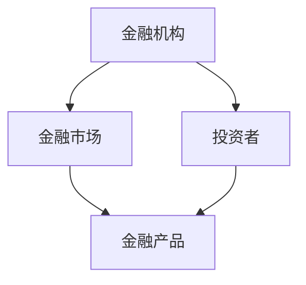
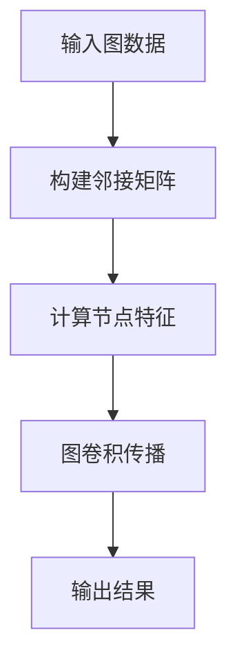
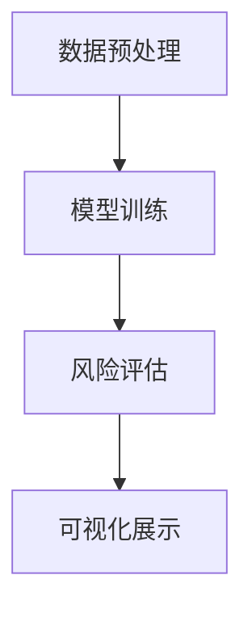

                 


# 图卷积网络在金融传染效应分析中的应用

> 关键词：图卷积网络，金融传染效应，风险传播，网络建模，深度学习

> 摘要：本文探讨了图卷积网络（Graph Convolutional Networks，GCN）在金融传染效应分析中的应用。金融传染效应是指一个金融机构或市场的风险事件对其他机构或市场产生连锁影响的现象。GCN作为一种有效的图结构数据处理方法，能够捕捉复杂的金融网络关系，为传染效应的建模和预测提供新的思路。本文从金融传染效应的背景出发，详细分析了GCN的原理及其在金融传染效应分析中的应用，最后通过实际案例展示了GCN在金融传染效应分析中的优势和效果。

---

# 第一部分：金融传染效应与图卷积网络概述

## 第1章：金融传染效应的背景与问题背景

### 1.1 金融传染效应的定义与特点

金融传染效应是指一个金融机构或市场的风险事件通过复杂的金融网络关系，引发其他金融机构或市场的连锁反应，最终可能影响整个金融系统的稳定性。这种效应通常由以下几个因素驱动：

1. **市场关联性**：金融机构之间通过金融产品、投资组合或信贷关系相互关联。
2. **信息不对称**：市场参与者之间的信息不对称可能导致恐慌性抛售或跟风行为。
3. **羊群效应**：投资者的非理性行为可能加剧市场波动。

金融传染效应的特点包括：

- **复杂性**：传染效应往往通过多层次的金融网络传播，涉及多个市场和机构。
- **非线性**：传染效应的强度和路径可能受到多种因素的影响，具有非线性特征。
- **动态性**：金融网络关系和市场状态可能随时间变化，传染效应具有动态性。

### 1.2 图卷积网络的核心概念与特点

图卷积网络（Graph Convolutional Networks，GCN）是一种处理图结构数据的深度学习模型。GCN的核心思想是将图的节点特征与节点之间的连接关系结合起来，通过图卷积操作传播信息，最终生成节点的高层次特征表示。

GCN的主要特点包括：

1. **图结构数据的处理能力**：GCN能够处理复杂的图结构数据，捕捉节点之间的关系。
2. **局部聚合与全局传播**：GCN通过局部聚合操作将节点特征与邻居特征结合起来，并通过多层传播生成全局特征表示。
3. **端到端学习**：GCN是一种端到端的深度学习模型，能够自动学习图的结构特征和节点特征。

### 1.3 金融传染效应分析的核心问题

金融传染效应分析的核心问题包括：

1. **传染路径识别**：识别金融传染效应的具体传播路径。
2. **传染强度预测**：预测传染效应的强度和范围。
3. **风险评估与防控**：基于传染效应的分析结果，制定风险管理策略。

GCN在金融传染效应分析中的优势在于其能够捕捉复杂的金融网络关系，并通过深度学习模型自动学习传染效应的传播规律。

---

## 第2章：图卷积网络的核心概念与联系

### 2.1 图卷积网络的原理

GCN的核心原理可以分为以下几个步骤：

1. **图的表示**：将金融网络表示为图结构，节点表示金融机构，边表示金融机构之间的关联关系。
2. **节点特征提取**：提取每个节点的特征，如资产规模、负债规模、信用评级等。
3. **图卷积传播**：通过图卷积操作将节点特征与邻居特征结合起来，生成高层次特征表示。
4. **输出预测**：基于节点的特征表示，预测传染效应的传播路径和强度。

GCN的数学模型可以表示为：

$$ h_i^{(l+1)} = \sigma\left( \sum_{j} A_{ij} h_j^{(l)} + b \right) $$

其中，$A_{ij}$是邻接矩阵的元素，$h_i^{(l)}$是节点$i$在第$l$层的特征表示，$\sigma$是激活函数。

### 2.2 金融传染效应分析的实体关系图

在金融传染效应分析中，金融网络通常由以下几个实体组成：

- **金融机构**：包括银行、保险公司、证券公司等。
- **金融市场**：包括股票市场、债券市场、外汇市场等。
- **金融产品**：包括债券、股票、衍生品等。
- **投资者**：包括机构投资者和个人投资者。

实体关系图如下：



### 2.3 图卷积网络的工作流程

GCN的工作流程如下：



---

## 第3章：图卷积网络的算法原理

### 3.1 图卷积网络的数学模型

GCN的数学模型可以表示为：

$$ H^{(l+1)} = \sigma\left( A H^{(l)} H^{(l)} \right) $$

其中，$H^{(l)}$是节点在第$l$层的特征矩阵，$A$是邻接矩阵，$\sigma$是激活函数。

### 3.2 图卷积网络的传播过程

GCN的传播过程可以分为以下几个步骤：

1. **输入图数据**：输入金融网络的邻接矩阵和节点特征矩阵。
2. **构建邻接矩阵**：定义节点之间的连接关系。
3. **计算节点特征**：提取每个节点的初始特征。
4. **图卷积传播**：通过图卷积操作传播节点特征，生成高层次特征表示。
5. **输出结果**：基于节点的特征表示，输出传染效应的传播路径和强度。

---

## 第4章：图卷积网络在金融传染效应分析中的应用

### 4.1 金融传染效应的建模

在金融传染效应分析中，可以将金融网络表示为图结构，节点表示金融机构，边表示金融机构之间的关联关系。通过GCN模型，可以捕捉金融机构之间的传染效应，并预测传染效应的传播路径和强度。

### 4.2 传染效应的传播路径识别

通过GCN模型，可以识别传染效应的传播路径。具体步骤如下：

1. **输入图数据**：输入金融网络的邻接矩阵和节点特征矩阵。
2. **构建GCN模型**：定义GCN模型的参数和结构。
3. **训练模型**：通过反向传播算法训练GCN模型。
4. **预测传染路径**：基于训练好的模型，预测传染效应的传播路径。

### 4.3 传染效应的强度预测

通过GCN模型，可以预测传染效应的强度。具体步骤如下：

1. **输入图数据**：输入金融网络的邻接矩阵和节点特征矩阵。
2. **构建GCN模型**：定义GCN模型的参数和结构。
3. **训练模型**：通过反向传播算法训练GCN模型。
4. **预测传染强度**：基于训练好的模型，预测传染效应的强度。

---

## 第5章：图卷积网络的系统架构设计

### 5.1 金融传染效应分析的系统功能设计

金融传染效应分析的系统功能设计包括以下几个方面：

1. **数据预处理**：对金融网络数据进行清洗和特征提取。
2. **模型训练**：训练GCN模型，预测传染效应的传播路径和强度。
3. **风险评估**：基于模型预测结果，评估金融系统的风险。
4. **可视化展示**：将模型预测结果可视化展示。

### 5.2 系统架构设计

金融传染效应分析的系统架构设计如下：



---

## 第6章：项目实战

### 6.1 环境安装

需要安装以下环境和工具：

- Python 3.6及以上版本
- PyTorch 1.0及以上版本
- NetworkX 2.8及以上版本
- Matplotlib 3.3及以上版本

### 6.2 核心代码实现

以下是GCN模型的核心代码实现：

```python
import torch
import torch.nn as nn
import torch.nn.functional as F

class GCN(nn.Module):
    def __init__(self, input_dim, hidden_dim, output_dim):
        super(GCN, self).__init__()
        self.fc1 = nn.Linear(input_dim, hidden_dim)
        self.fc2 = nn.Linear(hidden_dim, output_dim)
        self.dropout = nn.Dropout(0.5)
    
    def forward(self, x, A):
        x = F.relu(self.fc1(x))
        x = self.dropout(x)
        x = F.relu(self.fc2(torch.bmm(A, x.unsqueeze(2)).squeeze(2)))
        return x
```

### 6.3 代码应用解读与分析

1. **数据预处理**：对金融网络数据进行清洗和特征提取。
2. **模型训练**：通过反向传播算法训练GCN模型。
3. **预测传染路径**：基于训练好的模型，预测传染效应的传播路径。
4. **预测传染强度**：基于训练好的模型，预测传染效应的强度。

### 6.4 实际案例分析

通过实际案例分析，验证GCN模型在金融传染效应分析中的效果。

---

## 第7章：最佳实践与总结

### 7.1 小结

本文探讨了图卷积网络在金融传染效应分析中的应用，详细分析了GCN的原理及其在金融传染效应分析中的应用。通过实际案例分析，验证了GCN模型在金融传染效应分析中的优势和效果。

### 7.2 注意事项

- 数据预处理是关键，需要确保数据的准确性和完整性。
- 模型训练时需要注意过拟合问题，可以通过Dropout和正则化方法进行优化。
- 预测结果需要结合实际业务场景进行解释和验证。

### 7.3 未来研究方向

1. **多模态数据融合**：结合文本数据、市场数据等多种数据源，提高模型的预测精度。
2. **实时预测**：研究GCN模型的实时预测能力，应用于实时金融风险监控。
3. **复杂网络分析**：研究GCN模型在复杂网络分析中的应用，提高金融传染效应的预测能力。

### 7.4 拓展阅读

- [论文标题]：图卷积网络在金融风险分析中的应用
- [书籍名称]：《深度学习与金融网络分析》

---

通过以上内容，我们可以看到，图卷积网络在金融传染效应分析中的应用具有广泛的应用前景。未来的研究可以进一步探索GCN模型在金融传染效应分析中的潜力，为金融系统的风险管理提供更加有效的工具和方法。

