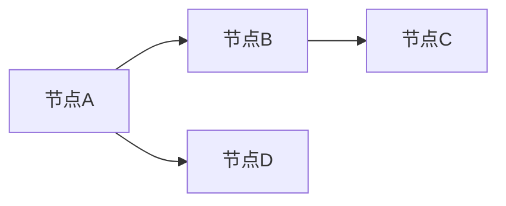
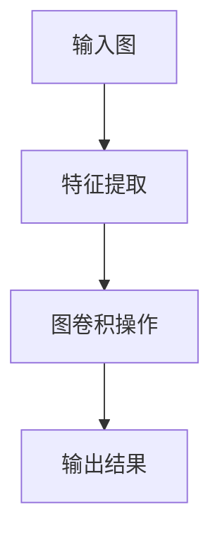
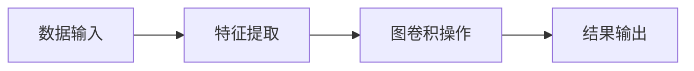

                 


# 图神经网络在金融网络分析中的应用

> 关键词：图神经网络，金融网络分析，网络数据，算法原理，系统设计

> 摘要：图神经网络（Graph Neural Networks, GNN）是一种新兴的深度学习技术，能够有效处理图结构数据，广泛应用于金融领域的网络分析。本文详细探讨了图神经网络在金融网络分析中的应用，包括其核心概念、算法原理、系统架构设计以及项目实战等内容，旨在为读者提供全面的技术指导和实践参考。

---

# 第一部分: 图神经网络在金融网络分析中的应用概述

## 第1章: 问题背景与核心概念

### 1.1 问题背景
#### 1.1.1 传统金融数据分析的局限性
传统金融数据分析主要依赖于统计学方法和时间序列分析，难以处理复杂的网络关系和非结构化数据。例如，在欺诈检测和信用评估中，传统的基于特征的模型难以捕捉节点之间的交互关系。

#### 1.1.2 网络分析在金融中的重要性
金融网络分析通过构建图结构（如交易网络、社交网络）来揭示节点之间的关系，帮助识别隐藏的模式和风险。例如，通过分析交易网络可以发现洗钱行为，通过分析社交网络可以识别欺诈团伙。

#### 1.1.3 图神经网络的优势
图神经网络能够直接处理图结构数据，利用节点的局部特征和全局关系进行建模，具有以下优势：
- **捕捉复杂关系**：能够处理节点之间的复杂连接。
- **全局视角**：可以同时考虑节点的局部特征和全局结构。
- **可扩展性**：适用于大规模图数据。

### 1.2 核心概念
#### 1.2.1 图神经网络的基本定义
图神经网络是一种深度学习模型，能够处理图结构数据，节点之间通过边连接，边可能带有权重和方向属性。图神经网络的目标是通过学习节点的特征和关系来预测节点的标签或属性。

#### 1.2.2 金融网络分析的核心要素
在金融网络分析中，图数据的主要构成包括：
- **节点**：代表实体，如个人、公司、交易等。
- **边**：代表节点之间的关系，如交易、转账、社交联系等。
- **权重**：边的权重可能表示交易金额、互动频率等。
- **标签**：节点的标签可能表示欺诈或非欺诈、信用等级等。

#### 1.2.3 问题解决思路
在金融网络分析中，图神经网络可以解决以下问题：
- **欺诈检测**：识别网络中的欺诈行为。
- **信用评估**：评估个体或企业的信用风险。
- **社交网络分析**：识别社交网络中的影响力节点或欺诈团伙。

---

## 第2章: 图神经网络的核心原理

### 2.1 图神经网络的基本原理
#### 2.1.1 图的表示与特征
图数据可以表示为 $G = (V, E)$，其中 $V$ 是节点集合，$E$ 是边集合。每个节点可能有特征向量 $x_i \in \mathbb{R}^d$，边可能带有权重 $w_{ij} \in \mathbb{R}$ 或方向。

#### 2.1.2 图卷积网络（GCN）的基本原理
图卷积网络通过聚合节点及其邻居的信息来生成节点的表示。具体步骤如下：
1. **邻接矩阵**：构建邻接矩阵 $A$，其中 $A_{ij} = 1$ 如果节点 $i$ 和 $j$ 之间有边，否则 $A_{ij} = 0$。
2. **归一化**：对邻接矩阵进行归一化处理，得到 $\hat{A} = \epsilon I + A D^{-1/2} A D^{-1/2}$，其中 $D$ 是度数矩阵，$\epsilon$ 是防止除以零的参数。
3. **卷积操作**：对输入特征 $X$ 进行卷积操作，得到 $H = \hat{A} X \Theta$，其中 $\Theta$ 是可学习的参数。

#### 2.1.3 图注意力机制
图注意力机制通过计算节点之间的注意力权重来聚合信息。注意力权重 $a_{ij}$ 可以通过以下公式计算：
$$
a_{ij} = \frac{e^{score(i,j)}}{\sum_{k} e^{score(i,k)}}
$$
其中，$score(i,j) = x_i^T \Theta x_j$。

### 2.2 核心概念与联系
#### 2.2.1 实体关系图的 Mermaid 架构


---

## 第3章: 图神经网络的算法原理

### 3.1 图卷积网络（GCN）算法
#### 3.1.1 GCN 的基本流程


#### 3.1.2 GCN 的数学模型
GCN 的数学模型可以表示为：
$$
H = \sigma(\hat{A} X \Theta)
$$
其中，$\sigma$ 是激活函数，$\Theta$ 是可学习的参数。

### 3.2 图注意力机制
#### 3.2.1 注意力机制的数学模型
$$
\alpha_{ij} = \frac{e^{score(i,j)}}{\sum_{k} e^{score(i,k)}}
$$

---

## 第4章: 图神经网络的系统架构设计

### 4.1 系统功能设计
#### 4.1.1 领域模型的 Mermaid 类图
```mermaid
classDia
class 节点 {
    - 特征向量
    - 标签
}
class 边 {
    - 权重
    - 方向
}
class 图 {
    - 节点集合
    - 边集合
}
```

### 4.2 系统架构设计
#### 4.2.1 系统架构的 Mermaid 架构图


---

## 第5章: 图神经网络的项目实战

### 5.1 项目环境安装
#### 5.1.1 安装依赖
```
pip install tensorflow numpy pandas
```

#### 5.1.2 环境配置
```python
import tensorflow as tf
import numpy as np
import pandas as pd
```

### 5.2 系统核心实现源代码
#### 5.2.1 图卷积网络实现
```python
class GCN(tf.keras.Model):
    def __init__(self, input_dim):
        super(GCN, self).__init__()
        self.dense1 = tf.keras.layers.Dense(16, activation='relu')
        self.dense2 = tf.keras.layers.Dense(1, activation='sigmoid')
    
    def call(self, inputs):
        x = self.dense1(inputs)
        x = self.dense2(x)
        return x
```

### 5.3 代码应用解读与分析
#### 5.3.1 代码功能分析
GCN 模型通过两层 Dense 层进行特征提取和分类，输出概率值表示节点的标签。

### 5.4 实际案例分析和详细讲解剖析
#### 5.4.1 案例分析
以欺诈检测为例，输入交易数据，构建交易网络，训练 GCN 模型，输出每个节点的欺诈概率。

---

## 第6章: 最佳实践 tips、小结、注意事项、拓展阅读

### 6.1 小结
图神经网络在金融网络分析中具有广泛的应用前景，能够有效处理图结构数据，捕捉复杂的网络关系。

### 6.2 注意事项
- 数据预处理是关键，需要确保数据的准确性和完整性。
- 模型调参需要结合实际场景，选择合适的超参数。
- 需要注意模型的可解释性，特别是在金融领域。

### 6.3 拓展阅读
建议阅读以下资料：
- [Graph Neural Networks: A Review of the State of the Art](https://arxiv.org/abs/1812.04202)
- [Deep Learning on Graph-Structured Data](https://www.nature.com/articles/s41586-019-1965-8)

---

通过以上目录结构，读者可以系统地学习图神经网络在金融网络分析中的应用，从理论到实践，逐步掌握相关知识和技能。

