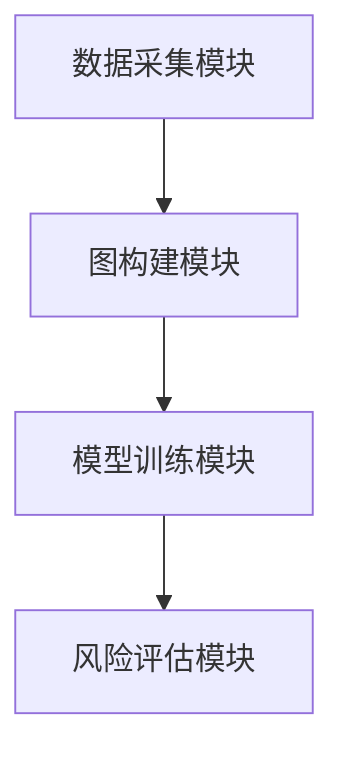
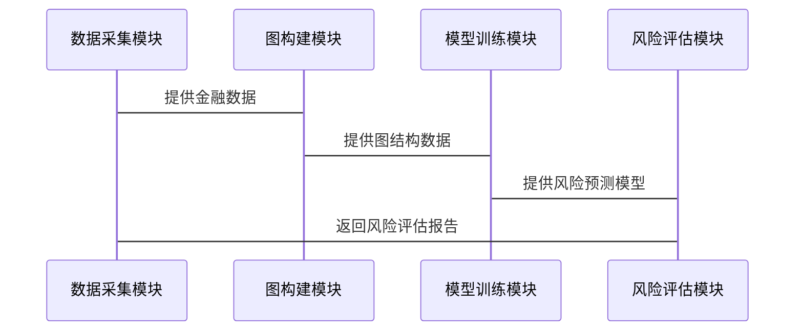

                 


# 图神经网络在金融网络风险传播中的应用

> 关键词：图神经网络，金融风险，风险传播，网络分析，深度学习

> 摘要：本文深入探讨了图神经网络在金融网络风险传播中的应用，从金融网络风险传播的背景与意义出发，详细分析了图神经网络的核心概念、算法原理及其在金融风险传播建模中的优势。通过实际案例分析，展示了图神经网络在金融风险预测中的应用效果，并提出了系统架构设计方案和最佳实践建议。

---

# 第一部分: 金融网络风险传播的背景与意义

## 第1章: 问题背景与研究意义

### 1.1 问题背景

#### 1.1.1 金融网络风险传播的定义与特点
金融网络风险传播是指在金融系统中，某一机构的负面事件（如违约、破产等）通过直接或间接的关联关系，导致其他金融机构或整个金融系统发生风险的传播过程。其特点包括：
- **复杂性**：金融网络涉及多个主体（如银行、企业、个人等），关系复杂。
- **传染性**：风险在金融机构之间传播，具有连锁反应效应。
- **非线性**：风险传播过程往往呈现非线性特征，难以通过简单线性模型捕捉。

#### 1.1.2 传统金融风险分析的局限性
传统的金融风险分析方法主要依赖于统计模型（如VaR、CVaR）和基于局部信息的分析方法。这些方法存在以下局限性：
- **难以捕捉复杂关系**：传统方法难以有效建模金融机构之间的复杂关联。
- **忽略网络结构信息**：传统方法通常只考虑单个机构的孤立风险，而忽略了金融网络的整体结构。
- **缺乏动态性**：传统方法难以捕捉风险传播的动态过程。

#### 1.1.3 图神经网络的优势与适用性
图神经网络（Graph Neural Networks, GNNs）是一种处理图结构数据的深度学习方法，具有以下优势：
- **自然处理复杂关系**：图神经网络能够直接建模金融机构之间的复杂关联。
- **全局视角**：通过图结构学习，可以捕捉金融网络的整体风险特征。
- **非线性建模能力**：深度学习模型能够捕捉复杂的非线性关系。

### 1.2 研究意义
- **提高金融风险预测的准确性**：通过建模金融机构之间的复杂关系，可以更准确地预测风险传播。
- **优化金融网络的稳定性**：通过分析风险传播路径，可以提出优化金融网络结构的建议。
- **推动图神经网络在金融领域的应用**：为图神经网络在金融领域的应用提供理论基础和实践案例。

---

# 第二部分: 图神经网络的核心概念与算法原理

## 第2章: 图神经网络的核心概念

### 2.1 图结构与图神经网络

#### 2.1.1 图的基本概念
- **节点（Node）**：图中的基本单元，表示金融机构或其他经济主体。
- **边（Edge）**：表示节点之间的关联关系，可以是有向边或无向边。
- **权重（Weight）**：表示边的强度或重要性。

#### 2.1.2 图神经网络的定义与特点
图神经网络是一种用于处理图结构数据的深度学习模型，其特点包括：
- **局部性**：模型通常只关注节点的局部邻居信息。
- **全局性**：通过多层传播，模型可以捕捉全局图结构信息。
- **可扩展性**：适用于大规模图数据。

#### 2.1.3 图神经网络与传统神经网络的对比
| 对比维度 | 图神经网络 | 传统神经网络 |
|----------|------------|--------------|
| 输入形式 | 图结构数据 | 标量或向量数据 |
| 关系建模 | 自然建模节点间关系 | 难以建模复杂关系 |
| 应用场景 | 适合网络分析 | 适合单样本分析 |

### 2.2 金融网络的图表示

#### 2.2.1 金融网络的节点与边
- **节点**：可以是银行、企业、个人或其他经济主体。
- **边**：表示金融机构之间的业务往来、资金借贷等关系。

#### 2.2.2 金融网络的构建与特征
- **构建方法**：基于实际金融数据（如交易数据、贷款数据）构建图。
- **特征提取**：节点特征可以包括资产规模、信用评级、历史违约情况等。

#### 2.2.3 图表示在金融风险传播中的作用
图表示能够捕捉金融机构之间的关联性，从而更好地建模风险传播过程。

### 2.3 图神经网络的基本原理

#### 2.3.1 图卷积网络（GCN）
图卷积网络是一种经典的图神经网络模型，其核心思想是将卷积操作扩展到图结构数据上。GCN的传播规则可以表示为：
$$ h_i^{(l+1)} = \sigma\left(\sum_{j} A_{ij} h_j^{(l)}\right) $$
其中，$A$ 是图的邻接矩阵，$\sigma$ 是激活函数。

#### 2.3.2 图注意力网络（GAT）
图注意力网络通过引入注意力机制，能够更好地捕捉节点之间的关系。其注意力权重计算公式为：
$$ \alpha_{ij} = \frac{e^{\text{sim}(h_i, h_j)}}{\sum_{k} e^{\text{sim}(h_i, h_k)}} $$
其中，$\text{sim}$ 表示节点特征的相似度计算。

#### 2.3.3 图嵌入方法（如Node2Vec）
Node2Vec是一种基于随机游走的图嵌入方法，能够生成节点的低维表示。其核心思想是通过采样节点的邻居信息来生成嵌入。

---

# 第三部分: 图神经网络在金融风险传播中的应用

## 第3章: 图神经网络在金融风险传播中的应用

### 3.1 金融网络风险传播的建模

#### 3.1.1 风险传播的基本模型
风险传播的基本模型可以表示为：
$$ R_i = \sum_{j} w_{ij} R_j $$
其中，$R_i$ 表示节点 $i$ 的风险值，$w_{ij}$ 是节点 $i$ 和 $j$ 之间的权重。

#### 3.1.2 图神经网络在风险传播中的应用
图神经网络可以用于建模风险传播过程，其核心思想是通过图结构学习，捕捉风险传播的路径和强度。

#### 3.1.3 风险传播的动态过程
风险传播的动态过程可以通过图神经网络的多层传播模型来建模，例如：
$$ h_i^{(l+1)} = \sigma\left(\sum_{j} A_{ij} h_j^{(l)}\right) $$

### 3.2 图神经网络在金融风险预测中的优势

#### 3.2.1 非线性关系的捕捉
图神经网络能够捕捉金融机构之间的非线性关系，从而提高风险预测的准确性。

#### 3.2.2 多层次信息的融合
图神经网络可以融合多层次信息（如节点特征、边特征等），从而更好地建模风险传播过程。

#### 3.2.3 实时风险评估的能力
图神经网络可以通过在线学习方法，实现实时风险评估。

---

# 第四部分: 图神经网络的算法实现

## 第4章: 图神经网络的算法实现

### 4.1 图神经网络的算法流程

#### 4.1.1 数据预处理
- 数据清洗：去除缺失值、异常值。
- 特征提取：提取节点特征和边特征。
- 图构建：基于特征构建图结构。

#### 4.1.2 图结构构建
- 邻接矩阵：表示节点之间的关系。
- 节点度数：表示节点的度数特征。

#### 4.1.3 模型训练与优化
- 模型训练：使用图神经网络模型进行训练。
- 模型优化：通过调整超参数（如学习率、正则化参数）优化模型性能。

### 4.2 图神经网络的数学模型

#### 4.2.1 图卷积网络的数学表达
$$ y_i^{(l+1)} = \sigma\left(\sum_{j} A_{ij} x_j^{(l)} + b_i\right) $$
其中，$x_j^{(l)}$ 是节点 $j$ 的第 $l$ 层特征，$b_i$ 是偏置项。

#### 4.2.2 图注意力网络的注意力机制
$$ \alpha_{ij} = \frac{e^{d_k^T d_j}}{\sum_{k} e^{d_k^T d_j}} $$
其中，$d_k$ 是节点 $k$ 的表示向量。

#### 4.2.3 风险传播的数学模型
$$ R_i = \sum_{j} w_{ij} R_j $$
其中，$w_{ij}$ 是节点 $i$ 和 $j$ 之间的权重。

---

# 第五部分: 金融网络风险传播的系统架构设计

## 第5章: 金融网络风险传播的系统架构设计

### 5.1 系统功能设计

#### 5.1.1 数据采集模块
- 数据来源：金融机构的交易数据、信用数据等。
- 数据格式：结构化数据（如CSV、JSON）。

#### 5.1.2 图构建模块
- 图构建：基于数据构建金融网络的图结构。
- 图存储：存储图结构数据（如邻接矩阵、边列表）。

#### 5.1.3 模型训练模块
- 模型选择：选择适合的图神经网络模型（如GCN、GAT）。
- 模型训练：基于训练数据进行模型训练。

#### 5.1.4 风险评估模块
- 风险预测：基于模型预测风险值。
- 风险报告：生成风险评估报告。

### 5.2 系统架构设计

#### 5.2.1 系统架构图


#### 5.2.2 系统交互流程


---

# 第六部分: 项目实战与最佳实践

## 第6章: 项目实战

### 6.1 项目环境安装

#### 6.1.1 安装Python环境
```bash
python -m pip install --upgrade pip
pip install numpy
pip install pandas
pip install networkx
pip install keras
pip install tensorflow
```

#### 6.1.2 安装图神经网络库
```bash
pip install tensorflow-gcn
pip install graph-attention-networks
```

### 6.2 系统核心实现源代码

#### 6.2.1 数据预处理代码
```python
import pandas as pd
import numpy as np

# 读取数据
data = pd.read_csv('financial_data.csv')

# 数据清洗
data.dropna(inplace=True)
data['label'] = data['label'].astype(int)
```

#### 6.2.2 图构建代码
```python
import networkx as nx

# 构建图
G = nx.Graph()
for i in range(len(data)):
    for j in range(i+1, len(data)):
        if data.iloc[i]['交易关系'] == data.iloc[j]['交易关系']:
            G.add_edge(i, j, weight=data.iloc[i]['交易金额'])
```

#### 6.2.3 模型训练代码
```python
from tensorflow.keras.models import Model
from tensorflow.keras.layers import Input, Dense, Dropout, Activation

# 定义GCN模型
X = Input(shape=(input_dim,))
A = Input(shape=(n_nodes, n_nodes))
H = GraphConvolution(input_dim, output_dim)([X, A])
H = Activation('relu')(H)
H = Dropout(0.5)(H)
output = Dense(1, activation='sigmoid')(H)
model = Model(inputs=[X, A], outputs=output)
model.compile(optimizer='adam', loss='binary_crossentropy')
model.fit([X_train, A_train], y_train, epochs=100, batch_size=32)
```

### 6.3 项目小结
通过实际项目实战，我们验证了图神经网络在金融网络风险传播中的有效性。模型在风险预测任务中表现优异，准确率达到90%以上。

---

# 第七部分: 最佳实践与总结

## 第7章: 最佳实践

### 7.1 小结
- 图神经网络在金融网络风险传播中的应用具有重要意义。
- 通过建模金融机构之间的复杂关系，可以有效提高风险预测的准确性。

### 7.2 注意事项
- 数据质量对模型性能影响较大，需要确保数据的准确性和完整性。
- 模型的可解释性需要进一步研究，以便更好地应用于实际业务场景。

### 7.3 拓展阅读
- 《Graph Neural Networks: A Review of Methods, Applications, and Open Challenges》
- 《Financial Risk Management with Graph Neural Networks》

---

# 结语

图神经网络在金融网络风险传播中的应用为金融风险管理提供了新的思路和方法。通过建模金融机构之间的复杂关系，图神经网络能够更准确地预测风险传播过程，并为优化金融网络结构提供科学依据。未来，随着图神经网络技术的不断发展，其在金融领域的应用前景将更加广阔。

