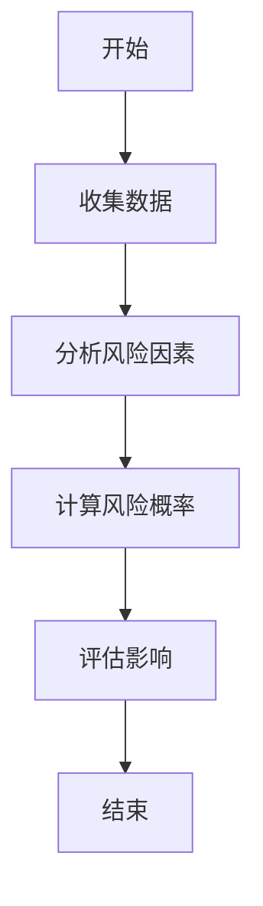

                 


# 地缘政治风险定价：如何在投资决策中考虑政治因素

## 关键词：地缘政治风险，投资决策，政治因素，风险定价，系统架构

## 摘要：地缘政治风险定价是投资决策中的关键环节，涉及复杂的政治因素分析和量化评估。本文系统地探讨了地缘政治风险的核心概念、定价模型、算法原理、系统架构，并通过实际案例展示了如何将这些理论应用于实践，提供了从理论到实践的全面指导。

---

## 第1章: 地缘政治风险定价的背景与重要性

### 1.1 地缘政治风险的定义与概念

#### 1.1.1 地缘政治风险的定义
地缘政治风险是指由于国家间的冲突、政策变化或国际关系紧张而引发的经济和社会风险，可能影响投资回报和资产价值。

#### 1.1.2 地缘政治风险的核心要素
- **国家主权**：国家的独立性和决策自由度。
- **国际关系**：各国之间的互动、合作与冲突。
- **地缘政治事件**：战争、制裁、外交危机等。

#### 1.1.3 地缘政治风险与投资决策的关系
地缘政治风险直接影响资产价格波动，投资者需将其纳入决策模型。

### 1.2 地缘政治风险的分类与特征

#### 1.2.1 地缘政治风险的分类
- **国家风险**：特定国家的政治不稳定。
- **主权风险**：政府违约或政策变化的风险。
- **地区风险**：区域性冲突对投资的影响。

#### 1.2.2 不同类型地缘政治风险的特点
| 风险类型 | 主要影响 | 示例事件 |
|----------|----------|----------|
| 国家风险 | 资产贬值 | 战争、政变 |
| 主权风险 | 债务违约 | 制裁、政策变化 |
| 地区风险 | 区域经济波动 | 贸易争端、边界冲突 |

#### 1.2.3 地缘政治风险的动态变化
- 风险因素随时间和事件变化。
- 需要持续监控和调整评估模型。

### 1.3 地缘政治风险定价的必要性

#### 1.3.1 投资决策中考虑政治因素的重要性
政治因素可能导致投资损失或收益波动。

#### 1.3.2 地缘政治风险对资产定价的影响
通过量化风险，调整资产定价模型，确保合理估值。

#### 1.3.3 风险定价在投资组合中的作用
分散风险，优化投资组合，降低整体风险敞口。

---

## 第2章: 地缘政治风险定价的核心概念与联系

### 2.1 地缘政治风险的构成要素

#### 2.1.1 国家主权与地缘政治风险
国家主权是核心因素，影响其在国际事务中的行为。

#### 2.1.2 国际关系与地缘政治风险
外交政策、贸易关系和联盟关系直接影响风险。

#### 2.1.3 地缘政治事件的触发因素
战争、制裁、外交危机等事件的具体触发因素。

### 2.2 地缘政治风险与经济风险的关系

#### 2.2.1 地缘政治风险对经济的影响
- 经济制裁导致市场萎缩。
- 冲突引发能源价格波动。

#### 2.2.2 经济风险与地缘政治风险的相互作用
经济波动可能加剧政治不稳定，反之亦然。

#### 2.2.3 风险的交叉影响与协同效应
地缘政治风险可能引发连锁反应，影响多个领域。

### 2.3 地缘政治风险定价的模型框架

#### 2.3.1 风险因素的量化方法
- 使用指标（如冲突强度、制裁概率）量化风险。

#### 2.3.2 风险定价的数学模型
- 概率模型：计算风险事件发生的概率。
- 统计模型：预测风险对资产的影响。

#### 2.3.3 模型的适用性与局限性
- 适用性：适用于可量化的风险。
- 局限性：难以预测突发性事件。

---

## 第3章: 地缘政治风险定价的算法原理

### 3.1 风险定价的基本原理

#### 3.1.1 风险定价的定义与目标
通过模型评估风险，调整资产定价。

#### 3.1.2 风险定价的基本方法
- 历史数据法：基于历史事件统计。
- 情景分析法：模拟不同风险情景。

### 3.2 地缘政治风险定价的算法

#### 3.2.1 风险评估流程图


#### 3.2.2 风险定价的数学模型
$$ \text{风险价值} = \text{资产价值} \times \text{风险系数} $$

---

## 第4章: 地缘政治风险定价的系统架构

### 4.1 系统功能设计

#### 4.1.1 领域模型类图


### 4.2 系统架构设计

#### 4.2.1 系统架构图


### 4.3 系统接口设计

#### 4.3.1 系统交互流程图


---

## 第5章: 地缘政治风险定价的项目实战

### 5.1 案例分析

#### 5.1.1 案例背景
分析某国的政治事件对投资的影响。

#### 5.1.2 数据处理
收集历史数据，分析事件影响。

#### 5.1.3 模型应用
使用概率模型评估风险。

### 5.2 代码实现

#### 5.2.1 环境安装
安装所需库，如numpy、pandas。

#### 5.2.2 核心代码
```python
import numpy as np
def calculate_risk(value, probability):
    return value * probability
```

---

## 第6章: 地缘政治风险定价的最佳实践

### 6.1 总结

#### 6.1.1 关键点总结
- 理解核心概念。
- 掌握定价模型。
- 应用实际案例。

### 6.2 注意事项

#### 6.2.1 常见错误
- 忽略不可预测事件。
- 过度依赖历史数据。

### 6.3 拓展阅读

#### 6.3.1 推荐书籍
- 《风险管理与投资决策》
- 《地缘政治经济学》

---

通过以上结构，文章系统地介绍了地缘政治风险定价的方法和应用，结合理论与实践，为投资者提供了全面的指导。

