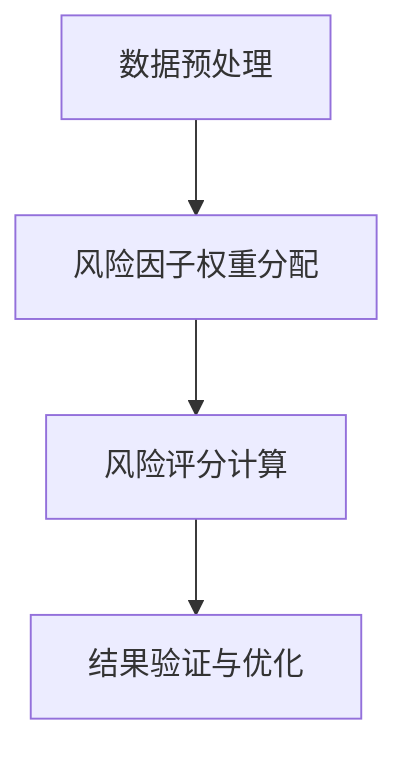
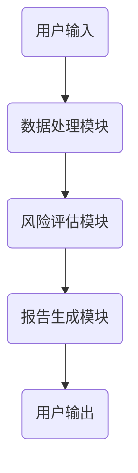

                 


# 地缘政治风险评估：全球投资的关键考量

> 关键词：地缘政治风险评估，全球投资，风险模型，系统架构，项目实战

> 摘要：地缘政治风险评估是全球投资中不可忽视的关键因素。本文从地缘政治的基本概念出发，深入分析其对投资决策的影响，详细介绍风险评估的数学模型、系统架构设计和实际项目案例，帮助投资者有效降低风险。

---

# 第1章: 地缘政治风险评估概述

## 1.1 地缘政治的基本概念

### 1.1.1 地缘政治的定义

地缘政治是指地理位置、资源分布、国际关系等因素对政治格局和国家行为的影响。它关注国家间的权力斗争、资源争夺以及地缘战略的制定。

### 1.1.2 地缘政治的核心要素

| 核心要素 | 描述 |
|----------|------|
| 政治稳定性 | 政府的稳定性和政策连续性 |
| 经济依赖性 | 关键资源和贸易伙伴的依赖程度 |
| 社会文化因素 | 民族主义、宗教冲突等社会因素 |
| 国际关系 | 国际组织、盟友关系、地缘战略 |

### 1.1.3 地缘政治与全球投资的关系

地缘政治风险直接影响投资环境的稳定性。例如，地区冲突可能导致投资损失，政策变化可能影响市场准入。

---

## 1.2 地缘政治风险的类型

### 1.2.1 政治风险

包括政权更迭、政策变化、法律风险等。

### 1.2.2 经济风险

涉及经济波动、货币贬值、贸易限制等。

### 1.2.3 社会风险

如社会动荡、罢工、抗议活动等。

### 1.2.4 技术风险

技术封锁、制裁对科技投资的影响。

---

## 1.3 地缘政治风险评估的重要性

### 1.3.1 全球化背景下的投资风险

全球化使得跨国投资面临更多不确定性。

### 1.3.2 地缘政治风险对投资决策的影响

高风险地区可能带来高回报，但也可能引发重大损失。

### 1.3.3 如何通过评估降低风险

通过建立模型和系统，提前识别和规避潜在风险。

---

## 1.4 本章小结

地缘政治风险是全球投资的重要考量因素，了解其类型和影响是制定投资策略的基础。

---

# 第2章: 地缘政治风险评估的核心概念

## 2.1 风险评估的基本原理

### 2.1.1 风险的定义与分类

风险是未来结果的不确定性，可分为系统性风险和非系统性风险。

### 2.1.2 风险评估的步骤与方法

1. 数据收集
2. 风险识别
3. 风险量化
4. 风险排序

### 2.1.3 地缘政治风险的独特性

具有高度不确定性和复杂性，受多种因素影响。

---

## 2.2 地缘政治风险的关键因素

### 2.2.1 政治稳定性分析

政权更迭、政策变化对投资的影响。

### 2.2.2 经济依赖性评估

资源依赖和贸易伙伴的稳定性。

### 2.2.3 社会文化因素

民族主义、宗教冲突对投资环境的影响。

### 2.2.4 国际关系网络

盟友关系和地缘战略对投资的影响。

---

## 2.3 地缘政治风险评估的框架

### 2.3.1 宏观层面的分析框架

关注全球政治经济趋势。

### 2.3.2 中观层面的分析框架

分析特定国家或地区的风险。

### 2.3.3 微观层面的分析框架

评估具体项目的可行性。

---

## 2.4 本章小结

地缘政治风险评估需要综合考虑多个层面的因素，建立全面的分析框架。

---

# 第3章: 地缘政治风险评估的数学模型与算法

## 3.1 风险评估的数学模型

### 3.1.1 风险评分模型

通过加权平均法对风险因素进行评分。

公式：$$ \text{风险评分} = \sum (\text{因素权重} \times \text{因素得分}) $$

### 3.1.2 风险概率模型

预测风险发生的概率。

### 3.1.3 综合风险指数模型

将多个风险因素综合成一个指数。

---

## 3.2 算法原理与实现

### 3.2.1 数据预处理

清洗和标准化数据。

### 3.2.2 风险因子权重分配

根据经验或统计方法确定权重。

### 3.2.3 风险评分计算

使用加权平均法计算综合风险评分。

### 3.2.4 结果验证与优化

通过历史数据验证模型准确性。

---

## 3.3 算法实现的Python代码示例

```python
import numpy as np

def calculate_risk_score(factors):
    weights = np.array([0.3, 0.2, 0.2, 0.1, 0.2])
    risk_score = np.dot(factors, weights)
    return risk_score

# 示例数据
factors = np.array([0.8, 0.7, 0.6, 0.5, 0.9])
score = calculate_risk_score(factors)
print("风险评分:", score)
```

---

## 3.4 算法流程图（使用Mermaid）



---

# 第4章: 地缘政治风险评估的系统架构设计

## 4.1 系统功能设计

### 4.1.1 领域模型


### 4.1.2 系统架构设计



---

## 4.2 项目实战

### 4.2.1 环境安装

安装Python、numpy、pandas等库。

### 4.2.2 数据处理

收集相关国家的政治、经济数据。

### 4.2.3 模型实现

使用Python代码实现风险评分模型。

### 4.2.4 结果分析

根据评分结果制定投资策略。

---

## 4.3 本章小结

通过系统架构设计和实际项目案例，展示了如何将地缘政治风险评估应用于投资决策。

---

# 第5章: 地缘政治风险评估的最佳实践与小结

## 5.1 最佳实践

### 5.1.1 数据来源的可靠性

选择权威的数据源。

### 5.1.2 模型的可解释性

确保模型易于理解和优化。

### 5.1.3 定期更新

根据最新数据调整模型。

---

## 5.2 小结

地缘政治风险评估是全球投资的关键考量，通过科学的模型和系统架构设计，可以有效降低投资风险。

---

## 5.3 注意事项

1. 风险评估结果仅供参考，需结合实际情况。
2. 定期更新模型以适应变化。
3. 考虑多种因素的综合影响。

---

## 5.4 拓展阅读

推荐相关书籍和论文，深入学习地缘政治风险评估的理论与实践。

---

# 结语

地缘政治风险评估是全球投资中的重要环节，通过系统的分析和科学的模型，投资者可以更好地应对风险，抓住机遇。

--- 

* 每个章节的详细内容需要根据上述大纲进一步扩展，确保每部分内容充实、逻辑清晰。

