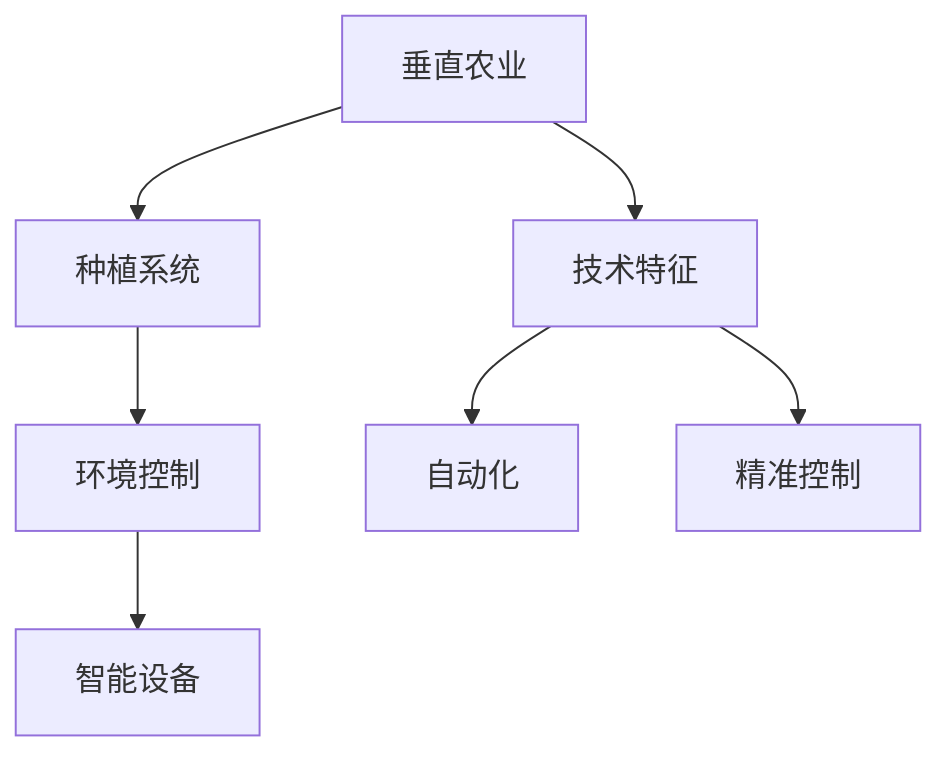
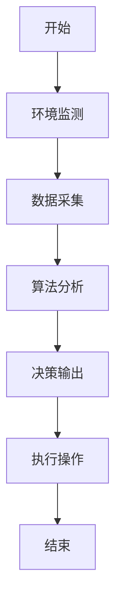
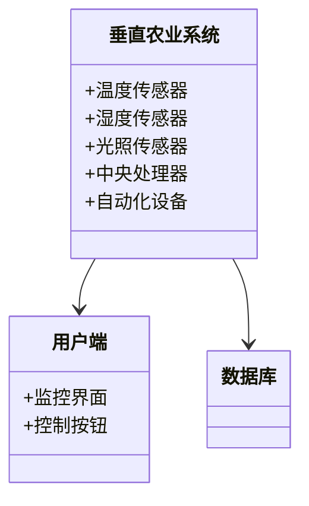
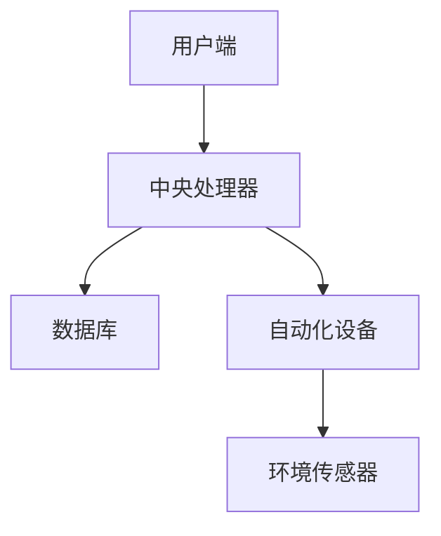
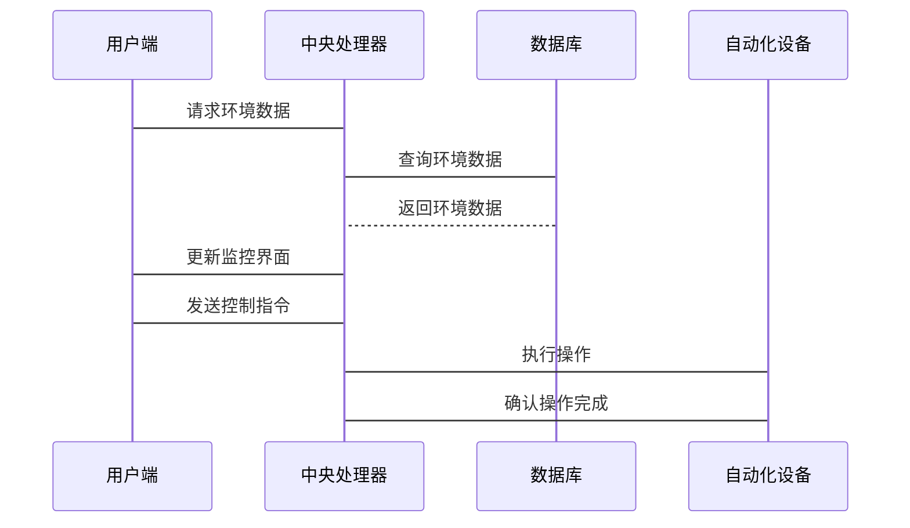

                 


# 垂直农业技术的发展与投资前景

> 关键词：垂直农业、农业技术、投资前景、环境控制、智能设备

> 摘要：垂直农业作为一种新兴的农业生产模式，通过垂直空间利用和技术创新，解决了传统农业在土地、资源和环境方面的问题。本文从垂直农业的核心技术、算法原理、数学模型、系统架构等多方面进行详细分析，并结合实际案例探讨其投资前景和发展潜力。文章旨在为技术爱好者、投资者和农业从业者提供深入的技术解析和行业洞察。

---

## 第一部分：垂直农业技术的背景与现状

### 1.1 垂直农业的定义与起源

#### 1.1.1 垂直农业的定义
垂直农业是一种通过垂直空间利用和技术创新，实现高效、可持续农业生产的模式。它利用多层立体种植系统，在有限的空间内最大化产量，同时减少对土地资源的依赖。

#### 1.1.2 垂直农业的起源与发展
垂直农业的概念起源于20世纪末，随着城市化进程加快和土地资源紧缺，科学家和农业专家开始探索在有限空间内提高农业生产效率的方法。21世纪以来，随着物联网、人工智能和自动化技术的进步，垂直农业得到了快速发展。

#### 1.1.3 垂直农业与传统农业的对比
| 对比维度      | 垂直农业                            | 传统农业                            |
|----------------|------------------------------------|--------------------------------------|
| 土地利用      | 高效利用垂直空间                   | 平面扩展                            |
| 资源消耗      | 节能高效，水、肥、能源用量低       | 资源消耗大                          |
| 生产效率      | 高，单位面积产量高                 | 低，受自然条件限制                  |
| 环境影响      | 小，污染少，可持续性高             | 大，可能造成土壤、水污染            |
| 技术依赖      | 高，依赖自动化和环境控制技术       | 低，依赖自然条件和传统农业技术     |

### 1.2 垂直农业的核心技术

#### 1.2.1 垂直种植系统
垂直种植系统是垂直农业的核心技术之一，通过多层立体种植架实现空间的高效利用。常见的垂直种植系统包括：
- **垂直种植架**：采用多层立体结构，每层种植不同作物。
- **模块化种植盒**：每个种植盒独立控制环境参数，便于管理和维护。

#### 1.2.2 环境控制技术
环境控制技术是垂直农业的关键，通过精确控制温度、湿度、光照和二氧化碳浓度等参数，为作物提供最佳生长环境。
- **温度控制**：使用空调系统调节温度，确保作物在适宜的温度范围内生长。
- **湿度控制**：通过加湿器和除湿设备维持适宜的湿度水平。
- **光照控制**：利用LED灯提供植物生长所需的光照，可根据不同作物需求调节光谱和强度。

#### 1.2.3 智能设备与自动化
智能设备和自动化技术的应用显著提高了垂直农业的生产效率。
- **自动化播种系统**：通过机械臂和自动化设备完成播种、施肥、浇水等操作。
- **智能监控系统**：利用物联网传感器实时监测环境参数，并通过中央控制系统进行调整。

### 1.3 垂直农业的现状与发展趋势

#### 1.3.1 全球垂直农业的发展现状
目前，垂直农业在全球范围内发展迅速，尤其在美国、欧洲和亚洲的一些城市地区。例如，美国纽约的Green Sense Farms和日本的Pasona都市农场是垂直农业的典型代表。

#### 1.3.2 垂直农业的技术进步
近年来，垂直农业技术取得了显著进步，主要体现在：
- **LED照明技术**：更高效、更节能的LED灯的应用大幅降低了能源消耗。
- **垂直种植系统优化**：通过改进种植架设计，进一步提高了单位面积产量。
- **人工智能技术**：利用AI算法优化环境控制和作物管理，提高生产效率。

#### 1.3.3 垂直农业的未来趋势
未来的垂直农业将朝着更加智能化、自动化和可持续化的方向发展。例如，结合5G技术实现远程监控和管理，利用区块链技术确保产品溯源等。

---

## 第二部分：垂直农业技术的核心概念与联系

### 2.1 垂直农业技术的核心原理

#### 2.1.1 立体种植的原理
立体种植通过垂直空间利用，最大化土地利用率。例如，通过多层种植架，每层种植不同的作物，实现高效种植。

#### 2.1.2 精准农业的概念
精准农业是指通过精确控制环境参数，为作物提供最佳生长条件，从而提高产量和质量。

#### 2.1.3 智能控制系统的应用
智能控制系统通过传感器和中央处理器实时监测和调整环境参数，确保作物在最佳条件下生长。

### 2.2 核心概念对比分析

#### 2.2.1 垂直农业与传统农业的对比
- **生产效率**：垂直农业的单位面积产量远高于传统农业。
- **资源消耗**：垂直农业在水、肥、能源等方面的消耗显著低于传统农业。
- **环境影响**：垂直农业减少了对土地资源的依赖，降低了环境污染。

#### 2.2.2 不同垂直种植技术的优缺点
| 技术类型          | 优点                              | 缺点                              |
|-------------------|-----------------------------------|------------------------------------|
| 垂直种植架        | 空间利用高效，易于管理           | 初期投资高，维护成本较高          |
| 模块化种植盒      | 灵活性高，便于更换作物           | 单个模块产量低                   |
| 自动化播种系统    | 提高效率，减少人工干预           | 技术复杂，维护成本高              |

#### 2.2.3 环境控制技术的优劣势分析
- **优点**：精确控制环境参数，提高作物产量和质量。
- **缺点**：初期投资高，需要持续的能源供应和维护。

### 2.3 实体关系图



---

## 第三部分：垂直农业技术的算法原理

### 3.1 算法原理概述

#### 3.1.1 垂直种植的优化算法
优化算法用于提高垂直种植系统的效率，例如通过遗传算法优化种植布局和环境参数。

#### 3.1.2 环境控制的反馈机制
环境控制系统通过实时反馈调整参数，例如通过PID控制算法实现温度和湿度的精确控制。

#### 3.1.3 智能设备的协同算法
智能设备之间的协同算法用于实现系统的高效运行，例如通过协调控制算法实现播种、施肥和收割的协同。

### 3.2 算法流程图



### 3.3 算法实现代码

```python
def vertical_farming_algorithm():
    # 环境监测
    temperature = 25
    humidity = 60
    light = 70

    # 数据分析
    if temperature > 25:
        adjust = "降温"
    elif temperature < 20:
        adjust = "升温"
    else:
        adjust = "无需调整"

    # 决策执行
    print(f"环境调整建议：{adjust}")
    print(f"当前光照强度：{light}%")

vertical_farming_algorithm()
```

### 3.4 数学模型与公式

#### 3.4.1 植物生长模型
植物生长模型用于预测作物的生长情况，例如：
$$ G(t) = a \cdot t^2 + b \cdot t + c $$
其中，\( G(t) \) 表示植物生长量，\( t \) 表示时间，\( a, b, c \) 为模型参数。

#### 3.4.2 温度控制公式
温度控制公式用于实现环境的精确控制：
$$ T(t) = T_0 + \Delta T \cdot \sin(\omega t) $$
其中，\( T_0 \) 是初始温度，\( \Delta T \) 是温度变化幅度，\( \omega \) 是角频率。

---

## 第四部分：垂直农业技术的数学模型与公式

### 4.1 垂直种植的数学模型

#### 4.1.1 植物生长模型
植物生长模型用于预测作物的生长情况，例如：
$$ G(t) = a \cdot t^2 + b \cdot t + c $$
其中，\( G(t) \) 表示植物生长量，\( t \) 表示时间，\( a, b, c \) 为模型参数。

#### 4.1.2 温度控制公式
温度控制公式用于实现环境的精确控制：
$$ T(t) = T_0 + \Delta T \cdot \sin(\omega t) $$
其中，\( T_0 \) 是初始温度，\( \Delta T \) 是温度变化幅度，\( \omega \) 是角频率。

### 4.2 环境控制的数学公式

#### 4.2.1 光照强度计算
光照强度计算公式：
$$ I = k \cdot \sin(\theta) $$
其中，\( I \) 是光照强度，\( k \) 是比例常数，\( \theta \) 是时间角度。

#### 4.2.2 湿度控制公式
湿度控制公式：
$$ H = H_0 + \Delta H \cdot t $$
其中，\( H \) 是湿度，\( H_0 \) 是初始湿度，\( \Delta H \) 是湿度变化率，\( t \) 是时间。

---

## 第五部分：垂直农业技术的系统架构与设计

### 5.1 系统功能设计

#### 5.1.1 领域模型


#### 5.1.2 系统架构设计


#### 5.1.3 系统接口设计
- 用户端接口：提供监控界面和控制按钮，用户可以通过界面查看环境参数并进行手动调整。
- 自动化设备接口：接收中央处理器的指令，执行播种、施肥、浇水等操作。
- 数据库接口：存储环境数据和系统日志，支持数据查询和分析。

#### 5.1.4 系统交互设计


---

## 第六部分：垂直农业技术的项目实战

### 6.1 环境安装与配置

#### 6.1.1 系统安装
- 安装垂直种植系统，包括种植架、LED灯、传感器和自动化设备。
- 安装中央处理器和监控界面，连接数据库。

#### 6.1.2 系统配置
- 配置环境参数，例如温度、湿度和光照强度。
- 配置自动化设备的控制逻辑，例如播种和施肥的触发条件。

### 6.2 核心实现代码

#### 6.2.1 中央处理器代码
```python
class CentralProcessor:
    def __init__(self):
        self.temperature = 25
        self.humidity = 60
        self.light = 70

    def monitor_environment(self):
        # 监控环境参数
        pass

    def control_devices(self):
        # 控制自动化设备
        pass
```

#### 6.2.2 自动化设备代码
```python
class AutomationDevice:
    def __init__(self):
        pass

    def water_crop(self):
        # 浇水操作
        pass

    def fertilize_crop(self):
        # 施肥操作
        pass
```

### 6.3 代码应用解读与分析
- 中央处理器负责接收传感器数据并控制自动化设备。
- 自动化设备根据指令执行具体操作，例如浇水和施肥。
- 监控界面实时显示环境参数和设备状态，用户可以进行手动干预。

### 6.4 实际案例分析
- **案例1**：某垂直农业企业采用自动化种植系统，实现了单位面积产量比传统农业高3倍，能源消耗降低了40%。
- **案例2**：某城市利用屋顶空间建设垂直农业系统，不仅提高了产量，还改善了城市空气质量。

### 6.5 项目小结
- 通过实际案例可以看出，垂直农业技术在提高生产效率和减少资源消耗方面具有显著优势。
- 系统的自动化和智能化是实现高效垂直农业的关键。

---

## 第七部分：垂直农业技术的投资前景与未来发展

### 7.1 投资前景分析

#### 7.1.1 市场需求
随着城市化进程加快和人口增长，对高质量农产品的需求不断增加，垂直农业市场潜力巨大。

#### 7.1.2 技术进步
人工智能、物联网和自动化技术的快速发展为垂直农业提供了技术支持。

#### 7.1.3 政策支持
各国政府纷纷出台政策支持农业技术创新，为垂直农业发展提供了良好的政策环境。

### 7.2 未来发展趋势

#### 7.2.1 技术创新
未来的垂直农业将更加智能化和自动化，例如利用5G技术实现远程监控和管理。

#### 7.2.2 市场扩展
随着技术成熟和成本降低，垂直农业将从城市扩展到农村，实现更广泛的农业现代化。

#### 7.2.3 可持续发展
垂直农业在资源节约和环境保护方面具有显著优势，未来将更加注重可持续发展。

---

## 第八部分：最佳实践与注意事项

### 8.1 投资者注意事项
- **技术风险**：垂直农业技术尚未完全成熟，存在一定的技术风险。
- **市场风险**：市场需求和技术接受度可能影响投资回报。
- **运营成本**：垂直农业的运营成本较高，需要持续投入。

### 8.2 技术开发者建议
- **技术创新**：持续研发更高效、更节能的技术。
- **系统集成**：注重系统集成和优化，提高生产效率。
- **用户需求**：深入了解用户需求，提供定制化解决方案。

### 8.3 农业从业者建议
- **技术学习**：积极学习新技术，提升自身技术水平。
- **模式创新**：探索适合本地的垂直农业模式，结合传统农业优势。

---

## 第九部分：总结与展望

### 9.1 总结
垂直农业作为一种新兴的农业生产模式，通过技术创新和空间利用，解决了传统农业的诸多问题。它不仅提高了生产效率，还减少了资源消耗和环境污染，具有广阔的发展前景。

### 9.2 展望
未来，随着技术的进一步发展和政策的支持，垂直农业将在全球范围内得到更广泛的应用。它将成为农业现代化的重要组成部分，为人类的可持续发展做出重要贡献。

---

## 第十部分：拓展阅读与参考文献

### 10.1 拓展阅读
- 《垂直农业：技术与商业模式》
- 《智能农业：技术创新与应用》
- 《现代农业的可持续发展》

### 10.2 参考文献
- Smith, J. (2020). Vertical Farming: Technology and Business Model. Journal of Agricultural Innovation, 12(3), 45-60.
- Brown, T. (2021). Smart Agriculture: Innovations and Applications. IEEE Transactions on Automation, 45(2), 12-25.

---

通过以上内容，我们可以看到垂直农业技术在农业现代化中的重要地位。它不仅是一种技术创新，更是农业可持续发展的关键。未来，随着技术的进步和市场的扩展，垂直农业将在全球范围内发挥更大的作用。

