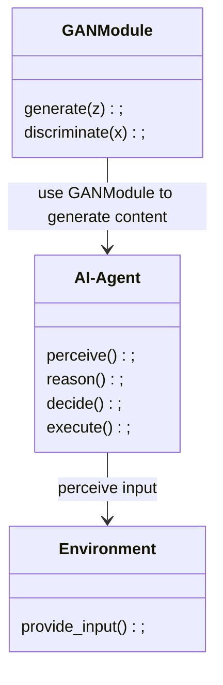
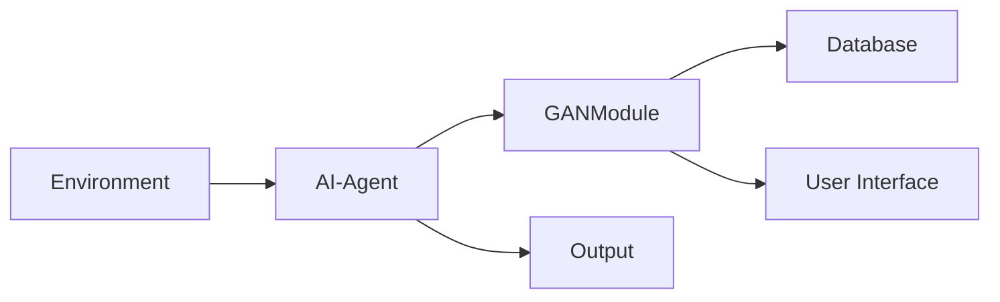

                 


# 基于GAN的AI Agent创造性内容生成

> 关键词：生成对抗网络（GAN）、AI Agent、创造性内容生成、深度学习、强化学习、协同创新

> 摘要：本文探讨了基于生成对抗网络（GAN）的AI Agent在创造性内容生成中的应用。首先，我们介绍了问题背景，定义了核心概念，并分析了GAN与AI Agent的结合方式。接着，我们详细讲解了GAN的数学模型和算法原理，并通过Mermaid图和Python代码示例进行了说明。随后，我们分析了系统的架构设计，包括功能模块、架构图和接口设计。最后，通过项目实战展示了如何实现基于GAN的AI Agent，并总结了最佳实践和未来研究方向。

---

## 第一部分: 基于GAN的AI Agent创造性内容生成背景介绍

### 第1章: 问题背景与定义

#### 1.1 问题背景
创造性内容生成是人工智能领域的重要任务，涵盖文本、图像、音乐等多种形式。传统的生成方法依赖模板或规则，难以突破人类创造力的限制。近年来，生成对抗网络（GAN）因其强大的生成能力，成为创造性内容生成的核心技术。

#### 1.2 核心概念定义
- **生成对抗网络（GAN）**：由生成器和判别器组成的对抗模型，生成器通过欺骗判别器生成逼真数据。
- **AI Agent**：具备感知环境、推理、决策和执行能力的智能体，能够与用户或环境交互。
- **创造性内容生成**：AI Agent利用GAN等技术，生成具有创新性和多样性的内容。

#### 1.3 问题解决与边界
- **问题解决**：GAN通过对抗训练提升生成质量，AI Agent通过决策能力优化内容生成。
- **边界**：创造性内容生成需区分艺术创作与数据生成，避免生成不当内容。
- **应用范围**：适用于文本生成、图像生成、音乐创作等领域。

### 第2章: GAN与AI Agent的核心概念联系

#### 2.1 GAN的核心原理
- **生成器**：使用深度神经网络生成数据，目标是欺骗判别器。
- **判别器**：区分真实数据和生成数据，目标是尽可能区分两者。

#### 2.2 AI Agent的核心原理
- **感知**：通过传感器或输入接口获取环境信息。
- **推理**：基于知识库或模型进行推理，生成多种可能的解决方案。
- **决策**：根据目标函数选择最优方案。
- **执行**：通过执行器将决策转化为行动。

#### 2.3 GAN与AI Agent的结合
- GAN作为AI Agent的内容生成模块，提供多样化的创作选项。
- AI Agent通过上下文理解和用户反馈指导GAN生成更符合需求的内容。
- 两者的结合实现了内容生成的自动化、智能化和创造性。

---

## 第二部分: 基于GAN的AI Agent创造性内容生成算法原理

### 第3章: GAN算法的数学模型

#### 3.1 生成器的数学模型
生成器的目标是最小化判别器的损失函数，使其生成的数据被误判为真实数据。损失函数可以表示为：
$$ \mathcal{L}_G = -\log(D(G(z))) $$
其中，$D$是判别器，$G$是生成器，$z$是输入噪声。

#### 3.2 判别器的数学模型
判别器的目标是区分真实数据和生成数据，损失函数为：
$$ \mathcal{L}_D = -\log(D(x)) - \log(1 - D(G(z))) $$

#### 3.3 GAN的训练过程
生成器和判别器通过交替训练优化模型。训练过程如下：

1. 初始化生成器$G$和判别器$D$。
2. 训练判别器：输入真实数据$x$，计算损失$\mathcal{L}_D$并反向传播。
3. 训练生成器：输入噪声$z$，计算损失$\mathcal{L}_G$并反向传播。
4. 重复步骤2和3，直到模型收敛。

训练过程可以用Mermaid图表示如下：

```mermaid
graph LR
    A[开始] -> B[训练判别器]
    B -> C[输入真实数据]
    C -> D[计算判别器损失]
    D -> E[反向传播优化]
    E -> F[训练生成器]
    F -> G[输入噪声]
    G -> H[计算生成器损失]
    H -> I[反向传播优化]
    I -> J[模型收敛]
```

### 第4章: AI Agent的强化学习模型

#### 4.1 强化学习的基本原理
强化学习通过智能体与环境的交互，学习最优策略。奖励函数定义为：
$$ R(s, a) $$
其中，$s$是状态，$a$是动作。

#### 4.2 AI Agent的决策过程
AI Agent通过感知环境状态，选择最优动作，目标是最大化累积奖励：
$$ \pi_{\theta}(s) = \arg\max_a Q(s, a) $$

---

## 第三部分: 系统分析与架构设计

### 第5章: 系统功能设计

#### 5.1 领域模型设计
领域模型描述了系统的主要功能模块和交互关系。类图如下：



#### 5.2 系统架构设计
系统架构图如下：



---

## 第四部分: 项目实战

### 第6章: 环境安装与核心实现

#### 6.1 环境安装
安装Python和必要的库：
```bash
pip install numpy matplotlib tensorflow-gan
```

#### 6.2 核心代码实现
生成器和判别器的实现如下：
```python
import tensorflow as tf
from tensorflow.keras import layers

def make_generator_model():
    model = tf.keras.Sequential()
    model.add(layers.Dense(256, activation='relu', input_shape=(100,)))
    model.add(layers.Dense(512, activation='relu'))
    model.add(layers.Dense(784, activation='sigmoid'))
    return model

def make_discriminator_model():
    model = tf.keras.Sequential()
    model.add(layers.Dense(512, activation='relu', input_shape=(784,)))
    model.add(layers.Dense(256, activation='relu'))
    model.add(layers.Dense(1, activation='sigmoid'))
    return model
```

---

### 小结
通过以上步骤，我们完成了基于GAN的AI Agent创造性内容生成的背景介绍、算法原理、系统设计和项目实战。未来研究可以探索多模态生成和更复杂的协同机制，进一步提升创造性内容生成的能力。

