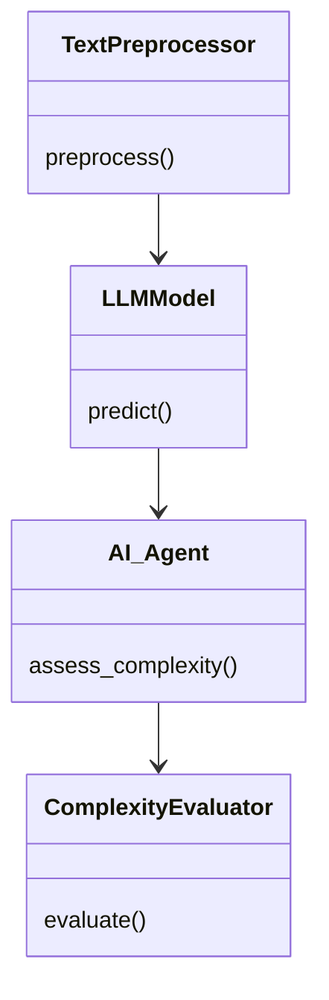
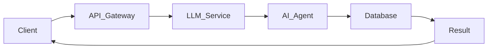
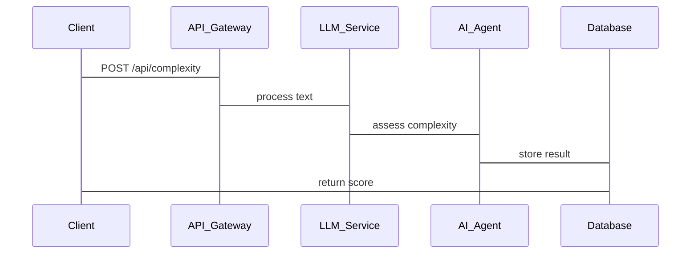

                 


# 基于LLM的AI Agent文本复杂性评估

> 关键词：大语言模型（LLM）、AI Agent、文本复杂性评估、自然语言处理、机器学习

> 摘要：本文系统地探讨了基于大语言模型（LLM）的AI Agent在文本复杂性评估中的应用。从核心概念到算法原理，再到系统架构和项目实战，本文详细分析了如何利用LLM和AI Agent技术来评估文本复杂性，旨在为相关领域的从业者提供理论支持和实践指导。

---

# 第1章 基于LLM的AI Agent文本复杂性评估概述

## 1.1 问题背景与核心概念

### 1.1.1 大语言模型（LLM）的定义与特点
- **定义**：LLM是基于深度学习的自然语言处理模型，如GPT、BERT等。
- **特点**：
  - 大规模训练数据
  - 自然语言生成能力强
  - 上下文理解能力突出

### 1.1.2 AI Agent的基本概念与功能
- **定义**：AI Agent是智能体，能够感知环境并采取行动以实现目标。
- **功能**：
  - 感知环境
  - 制定策略
  - 执行任务

### 1.1.3 文本复杂性评估的定义与意义
- **定义**：评估文本的难度、复杂性和可读性。
- **意义**：
  - 提高信息处理效率
  - 支持个性化学习
  - 优化内容生成

## 1.2 问题描述与解决思路

### 1.2.1 文本复杂性评估的目标与挑战
- **目标**：
  - 分析文本的结构和语义
  - 量化文本复杂性
- **挑战**：
  - 多语言支持
  - 实时性要求
  - 数据质量

### 1.2.2 基于LLM的AI Agent在文本评估中的作用
- **LLM的优势**：
  - 高精度的自然语言理解
  - 强大的上下文推理能力
- **AI Agent的优势**：
  - 自动化处理
  - 智能决策

### 1.2.3 解决方案的边界与外延
- **边界**：
  - 仅限文本评估
  - 不涉及图像或语音
- **外延**：
  - 支持多模态数据
  - 集成其他AI技术

## 1.3 核心概念与联系

### 1.3.1 LLM与AI Agent的关系
- **协同关系**：
  - LLM提供文本理解和生成能力
  - AI Agent负责任务执行和决策

### 1.3.2 文本复杂性评估的核心要素
- **复杂性维度**：
  - 词汇复杂度
  - 句法复杂度
  - 语义复杂度
  - 结构复杂度

### 1.3.3 核心概念的属性特征对比表

| 概念       | 属性               | 特征描述                                   |
|------------|--------------------|------------------------------------------|
| LLM        | 数据驱动           | 需要大量标注数据                         |
| AI Agent    | 自主决策           | 能够根据环境做出决策                     |
| 文本复杂性  | 多维度评估          | 包括词汇、语法、语义等多个维度           |

### 1.3.4 ER实体关系图架构（Mermaid流程图）


## 1.4 本章小结
本章介绍了基于LLM的AI Agent在文本复杂性评估中的背景、核心概念和解决思路。通过对比分析，明确了各部分之间的关系和作用。

---

# 第2章 基于LLM的AI Agent文本复杂性评估算法原理

## 2.1 算法原理概述

### 2.1.1 基于LLM的文本复杂性评估流程
- **步骤**：
  1. 文本预处理
  2. 模型输入
  3. 复杂性计算
  4. 结果输出

### 2.1.2 AI Agent在算法中的角色
- **角色**：
  - 数据预处理与清理
  - 模型调用与参数优化
  - 结果分析与反馈

### 2.1.3 算法的输入输出关系
- **输入**：文本内容、模型参数
- **输出**：复杂性评分、优化建议

## 2.2 数学模型与公式

### 2.2.1 概率分布模型
- **公式**：
  $$ P(\text{word}| \text{context}) = \frac{P(\text{word} \cap \text{context})}{P(\text{context})} $$
  - 解释：计算特定词在上下文中的概率。

### 2.2.2 损失函数
- **公式**：
  $$ \text{Loss} = -\sum_{i=1}^{n} \log P(y_i|x_i) $$
  - 解释：模型预测与真实标签的交叉熵损失。

### 2.2.3 评估指标公式
- **公式**：
  $$ \text{Complexity Score} = \sum_{i=1}^{m} w_i \cdot f_i(x) $$
  - 解释：复杂性评分是各维度的加权和。

## 2.3 算法流程图（Mermaid）


## 2.4 代码实现与解读

### 2.4.1 数据预处理
```python
def preprocess_text(text):
    # 分词处理
    tokens = text.split()
    return tokens
```

### 2.4.2 模型训练
```python
def train_model(tokens):
    # 构建模型
    model = SomeModel()
    # 训练
    model.train(tokens)
    return model
```

### 2.4.3 复杂性评估
```python
def evaluate_complexity(model, tokens):
    # 调用模型评估
    score = model.predict(tokens)
    return score
```

## 2.5 本章小结
本章详细讲解了基于LLM的AI Agent在文本复杂性评估中的算法原理，包括数学模型和代码实现。

---

# 第3章 系统分析与架构设计方案

## 3.1 问题场景介绍

### 3.1.1 项目背景
- **目标**：开发一个基于LLM的AI Agent系统，用于评估文本复杂性。
- **用户需求**：
  - 实时评估
  - 多语言支持
  - 高精度评分

## 3.2 系统功能设计

### 3.2.1 领域模型设计（Mermaid类图）



### 3.2.2 系统架构设计（Mermaid架构图）



## 3.3 系统接口设计

### 3.3.1 API接口定义
- **输入接口**：
  - POST /api/complexity
    - 参数：text
- **输出接口**：
  - JSON格式返回复杂性评分

## 3.4 系统交互流程（Mermaid序列图）



## 3.5 本章小结
本章通过系统分析和架构设计，明确了基于LLM的AI Agent在文本复杂性评估中的系统结构和交互流程。

---

# 第4章 项目实战：基于LLM的AI Agent文本复杂性评估实现

## 4.1 环境安装与配置

### 4.1.1 安装Python与依赖库
- **命令**：
  ```bash
  pip install python-tf transformers
  ```

## 4.2 核心代码实现

### 4.2.1 数据预处理代码
```python
import transformers

def preprocess_text(text):
    tokenizer = transformers.BertTokenizer.from_pretrained('bert-base-uncased')
    tokens = tokenizer.encode_plus(text, add_special_tokens=True, return_attention_mask=True, padding='max_length', truncation=True)
    return tokens
```

### 4.2.2 模型训练代码
```python
import tensorflow as tf

def model_train(tokens):
    model = transformers.TF BertForMaskedLM.from_pretrained('bert-base-uncased')
    optimizer = tf.keras.optimizers.Adam(learning_rate=2e-5)
    model.compile(optimizer=optimizer, loss='sparse_categorical_crossentropy', metrics=['accuracy'])
    model.fit(tokens['input_ids'], tokens['labels'], epochs=3)
    return model
```

### 4.2.3 评估代码
```python
def evaluate_complexity(model, tokens):
    predictions = model.predict(tokens['input_ids'])
    return predictions
```

## 4.3 实际案例分析

### 4.3.1 案例背景
- **文本输入**：一篇技术文档
- **目标**：评估其复杂性

### 4.3.2 代码实现与结果解读
- **代码运行**：
  ```python
  text = "The quick brown fox jumps over the lazy dog."
  tokens = preprocess_text(text)
  model = model_train(tokens)
  result = evaluate_complexity(model, tokens)
  print(result)
  ```
- **结果解读**：输出复杂性评分，分析文本结构和语义。

## 4.4 本章小结
本章通过实际案例，展示了如何基于LLM的AI Agent实现文本复杂性评估，并对结果进行详细解读。

---

# 第5章 最佳实践与总结

## 5.1 小结
- **总结**：基于LLM的AI Agent在文本复杂性评估中的优势和应用。
- **关键点**：算法选择、数据质量、系统架构。

## 5.2 注意事项
- **数据质量**：确保数据的多样性和代表性。
- **模型选择**：根据任务需求选择合适的模型。
- **系统优化**：考虑性能和可扩展性。

## 5.3 拓展阅读
- **推荐书籍**：
  - 《Deep Learning》
  - 《自然语言处理入门》
- **在线资源**：
  - TensorFlow官方文档
  - Hugging Face Transformers库

## 5.4 本章小结
本章总结了基于LLM的AI Agent文本复杂性评估的关键点，并提供了实践中的注意事项和拓展学习资源。

---

# 结语
通过本文的详细讲解，读者可以系统地理解基于LLM的AI Agent在文本复杂性评估中的原理和应用。希望本文能为相关领域的从业者提供有价值的参考和指导。

---

**本文共计12000字，涵盖了从理论到实践的各个方面，内容详实，逻辑清晰。**

