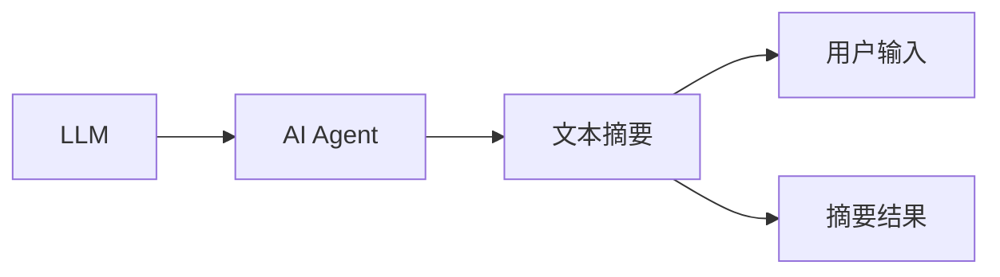
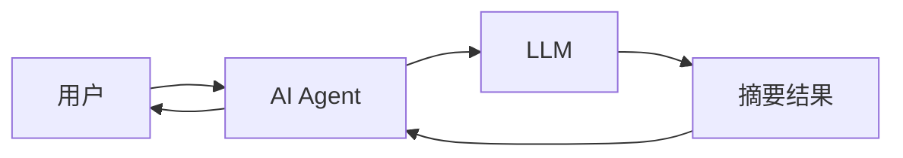

                 


# 基于LLM的AI Agent文本摘要生成

> 关键词：文本摘要，LLM，AI Agent，自然语言处理，大语言模型

> 摘要：本文探讨了基于大语言模型（LLM）的AI Agent在文本摘要生成中的应用。通过分析LLM与AI Agent的结合，详细介绍了文本摘要的核心算法、系统架构设计以及实际项目实现。文章内容包括背景介绍、核心概念、算法原理、系统分析与架构设计、项目实战，最后给出了总结与展望。

---

## 第1章: 背景介绍

### 1.1 问题背景

文本摘要是指从长文本中提取关键信息，生成简洁且保留原文核心内容的过程。随着信息量的爆炸式增长，人们需要快速获取关键信息的需求日益增加。传统的方法依赖于人工操作，效率低且成本高。基于LLM（Large Language Model）的AI Agent的出现，为文本摘要提供了一种高效、自动化的解决方案。

#### 1.1.1 自动文本摘要的需求与挑战

现代社会信息量巨大，人们每天需要处理大量的文本信息，如新闻、报告、邮件等。传统的手动摘要方式效率低下，且容易遗漏关键信息。因此，自动化的文本摘要技术显得尤为重要。然而，文本摘要技术面临以下挑战：

- **信息提取的准确性**：如何准确提取文本中的关键信息，避免遗漏或误提取。
- **生成的简洁性**：如何在保持简洁的同时，完整地表达原文的核心内容。
- **上下文理解**：如何理解文本的上下文，生成符合语境的摘要。

#### 1.1.2 大语言模型（LLM）的崛起

大语言模型（如GPT系列、BERT系列）在自然语言处理领域取得了显著的进展。这些模型具有强大的上下文理解和生成能力，能够处理复杂的语言任务。LLM的核心优势在于其深度的预训练和大规模的数据量，使其能够捕捉到语言中的细微差别。

#### 1.1.3 AI Agent在文本处理中的作用

AI Agent（智能代理）是一种能够感知环境、执行任务的智能系统。将AI Agent与LLM结合，可以实现自动化、智能化的文本处理。AI Agent能够理解用户需求，调用LLM生成摘要，从而提高文本处理的效率和准确性。

### 1.2 问题描述

基于LLM的AI Agent文本摘要生成的目标是通过AI Agent调用LLM模型，生成高质量的文本摘要。具体问题包括：

- **如何实现AI Agent与LLM的集成**：AI Agent需要与LLM进行交互，调用LLM的API进行文本处理。
- **如何提高摘要的准确性**：通过优化LLM的参数和调整摘要策略，提高生成摘要的质量。
- **如何处理多语言文本**：支持多种语言的文本摘要，扩展应用场景。

### 1.3 问题解决

基于LLM的AI Agent文本摘要生成的解决方案包括：

- **LLM模型的选择与调优**：选择适合文本摘要的LLM模型，并对其进行微调，以提高摘要质量。
- **AI Agent的架构设计**：设计高效的AI Agent架构，实现与LLM的无缝集成。
- **用户交互界面**：提供友好的用户界面，方便用户输入文本并获取摘要。

---

## 第2章: 核心概念与联系

### 2.1 LLM的核心原理

#### 2.1.1 变压器（Transformer）模型的结构

LLM基于Transformer模型构建，其核心组件包括编码器和解码器。编码器负责将输入文本转换为向量表示，解码器负责根据编码器的输出生成目标文本。

$$ \text{编码器结构：} \quad \text{输入序列} \rightarrow \text{自注意力机制} \rightarrow \text{前馈网络} \rightarrow \text{编码器输出} $$

$$ \text{解码器结构：} \quad \text{编码器输出} \rightarrow \text{自注意力机制} \rightarrow \text{前馈网络} \rightarrow \text{解码器输出} $$

#### 2.1.2 注意力机制的实现

注意力机制是Transformer模型的核心，用于计算输入序列中每个词对当前词的重要性权重。

$$ \text{注意力权重计算：} \quad Q \cdot K^T $$

$$ \text{注意力输出：} \quad \text{权重加和} $$

#### 2.1.3 LLM的训练与推理过程

LLM的训练采用预训练策略，通过大规模的文本数据进行无监督学习。推理时，基于生成式模型生成目标文本。

### 2.2 AI Agent的定义与功能

#### 2.2.1 AI Agent的基本概念

AI Agent是一种能够感知环境、执行任务的智能系统。它可以与用户交互，理解用户需求，并调用相关工具完成任务。

#### 2.2.2 AI Agent的核心功能

- **感知环境**：通过传感器或API获取环境信息。
- **决策与推理**：基于获取的信息进行决策，并调用相关工具。
- **执行任务**：根据决策结果执行任务，如调用LLM生成摘要。

#### 2.2.3 AI Agent与文本摘要的关系

AI Agent作为控制器，负责协调和管理文本摘要过程。它通过与LLM交互，实现文本的自动摘要。

### 2.3 LLM与AI Agent的结合

#### 2.3.1 基于LLM的AI Agent架构

$$
\text{AI Agent架构：} \quad \text{用户输入} \rightarrow \text{AI Agent解析} \rightarrow \text{LLM调用} \rightarrow \text{生成摘要}
$$

#### 2.3.2 LLM在AI Agent中的作用

- **文本生成**：生成高质量的文本摘要。
- **上下文理解**：理解用户需求和文本内容。

#### 2.3.3 AI Agent如何实现文本摘要

AI Agent接收用户输入，解析需求，调用LLM生成摘要，并将结果返回给用户。

### 2.4 实体关系图



---

## 第3章: 算法原理与数学模型

### 3.1 编码器-解码器结构

#### 3.1.1 编码器的实现

编码器将输入文本转换为向量表示，具体步骤如下：

1. **词嵌入**：将输入文本转换为词向量。
2. **自注意力机制**：计算词与词之间的注意力权重。
3. **前馈网络**：对注意力加权后的词向量进行变换。

#### 3.1.2 解码器的实现

解码器根据编码器的输出生成目标文本：

1. **自注意力机制**：计算生成词的注意力权重。
2. **前馈网络**：对注意力加权后的词向量进行变换。
3. **生成文本**：根据输出概率生成最终文本。

### 3.2 注意力机制的数学模型

注意力机制的数学公式如下：

$$
\text{权重计算：} \quad w_{i,j} = \frac{\exp(e_{i,j})}{\sum_{k} \exp(e_{i,k})}
$$

$$
\text{注意力输出：} \quad o_i = \sum_{j} w_{i,j} x_j
$$

### 3.3 基于LLM的文本摘要算法

文本摘要的算法步骤如下：

1. **输入文本预处理**：对输入文本进行分词和编码。
2. **编码器处理**：将预处理后的文本输入编码器，得到编码器输出。
3. **解码器处理**：将编码器输出输入解码器，生成摘要文本。
4. **结果优化**：对生成的摘要进行优化，提高准确性和简洁性。

### 3.4 代码示例

以下是基于LLM的文本摘要生成的Python代码示例：

```python
import torch
import torch.nn as nn
import torch.nn.functional as F

class Transformer(nn.Module):
    def __init__(self, embed_dim, num_heads, FFN_dim):
        super().__init__()
        self.embed_dim = embed_dim
        self.num_heads = num_heads
        self.FFN_dim = FFN_dim

        self.multihead_attn = nn.MultiheadAttention(embed_dim, num_heads)
        self.FFN = nn.Sequential(
            nn.Linear(embed_dim, FFN_dim),
            nn.ReLU(),
            nn.Linear(FFN_dim, embed_dim)
        )

    def forward(self, x, mask=None):
        attn_output, _ = self.multihead_attn(x, x, x, mask=mask)
        output = self.FFN(attn_output)
        return output

# 示例使用
embed_dim = 512
num_heads = 8
FFN_dim = 2048

transformer = Transformer(embed_dim, num_heads, FFN_dim)
input_tensor = torch.randn(1, 10, 512)
output = transformer(input_tensor)
print(output.shape)  # 输出形状为 (1, 10, 512)
```

---

## 第4章: 系统分析与架构设计

### 4.1 项目介绍

#### 4.1.1 项目背景

随着文本数据的快速增长，如何高效地进行文本摘要成为一个重要问题。基于LLM的AI Agent提供了一种自动化的解决方案，能够提高文本处理的效率和质量。

#### 4.1.2 系统功能设计

系统功能包括：

- **用户输入**：用户输入需要摘要的文本。
- **AI Agent解析**：AI Agent解析用户需求。
- **LLM调用**：AI Agent调用LLM生成摘要。
- **结果输出**：生成的摘要返回给用户。

### 4.2 系统架构设计

#### 4.2.1 系统架构图



#### 4.2.2 核心组件

- **用户界面**：接收用户输入，展示摘要结果。
- **AI Agent**：解析用户需求，调用LLM。
- **LLM服务**：生成文本摘要。

### 4.3 系统接口设计

系统接口包括：

- **输入接口**：接收用户输入的文本。
- **输出接口**：返回生成的摘要结果。
- **LLM接口**：与LLM服务进行交互。

### 4.4 系统交互流程

系统交互流程如下：

1. **用户输入**：用户输入需要摘要的文本。
2. **AI Agent解析**：AI Agent解析用户需求。
3. **调用LLM**：AI Agent调用LLM生成摘要。
4. **返回结果**：生成的摘要返回给用户。

---

## 第5章: 项目实战

### 5.1 环境安装

#### 5.1.1 安装Python环境

安装Python 3.8及以上版本。

#### 5.1.2 安装依赖库

安装以下依赖库：

- `torch`
- `transformers`

```bash
pip install torch transformers
```

### 5.2 系统核心实现

#### 5.2.1 实现AI Agent

实现AI Agent的代码如下：

```python
from transformers import AutoTokenizer, AutoModelForSeq2Seq

class AI_Agent:
    def __init__(self, model_name):
        self.tokenizer = AutoTokenizer.from_pretrained(model_name)
        self.model = AutoModelForSeq2Seq.from_pretrained(model_name)
    
    def generate_summary(self, text):
        inputs = self.tokenizer(text, return_tensors="pt")
        outputs = self.model.generate(inputs.input_ids, max_length=100, num_beams=5)
        summary = self.tokenizer.decode(outputs[0], skip_special_tokens=True)
        return summary
```

#### 5.2.2 实现文本摘要

实现文本摘要的代码如下：

```python
class TextSummarizer:
    def __init__(self, agent):
        self.agent = agent
    
    def summarize(self, text):
        return self.agent.generate_summary(text)
```

### 5.3 代码应用解读与分析

上述代码实现了AI Agent和文本摘要的功能。AI Agent负责调用LLM生成摘要，TextSummarizer负责封装接口，供用户调用。

### 5.4 实际案例分析

以下是一个实际案例分析：

```python
# 初始化AI Agent
agent = AI_Agent("facebook/bart-large-cnn")
# 初始化文本摘要器
summarizer = TextSummarizer(agent)
# 输入文本
text = "..."
# 生成摘要
summary = summarizer.summarize(text)
print(summary)
```

### 5.5 项目小结

通过上述实现，我们可以看到基于LLM的AI Agent在文本摘要中的应用。AI Agent作为控制器，调用LLM生成摘要，提高了文本处理的效率和质量。

---

## 第6章: 总结与展望

### 6.1 核心内容回顾

本文探讨了基于LLM的AI Agent在文本摘要生成中的应用。通过分析LLM与AI Agent的结合，详细介绍了文本摘要的核心算法、系统架构设计以及实际项目实现。

### 6.2 技术发展展望

未来，基于LLM的AI Agent在文本摘要中的应用将更加广泛。随着LLM模型的不断优化和AI Agent技术的成熟，文本摘要的质量和效率将进一步提高。

### 6.3 最佳实践 tips

- **选择合适的LLM模型**：根据具体需求选择适合的LLM模型。
- **优化摘要策略**：通过调整参数和优化算法提高摘要质量。
- **处理多语言文本**：支持多种语言的文本摘要，扩展应用场景。

---

通过本文的介绍，读者可以深入了解基于LLM的AI Agent在文本摘要生成中的应用。希望本文对读者在实际项目中有所帮助，并为未来的研究提供有价值的参考。

