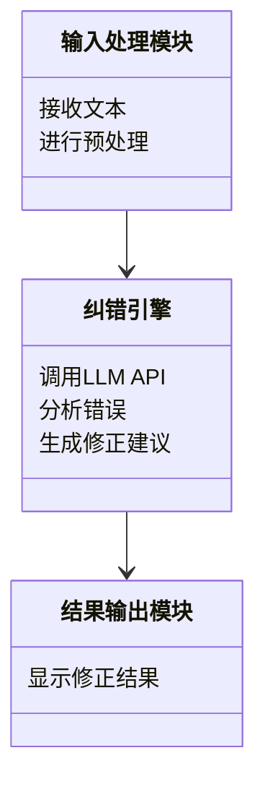

                 


# 基于LLM的AI Agent文本纠错系统

> 关键词：AI Agent，LLM，文本纠错，自然语言处理，系统架构

> 摘要：本文详细介绍了如何基于大语言模型（LLM）构建一个智能文本纠错系统。通过分析AI Agent的核心概念，探讨了LLM在文本纠错中的应用，详细讲解了算法原理、系统架构设计，并通过实际案例展示了系统的实现过程，最后给出了优化建议和未来发展方向。

---

## 第一部分: 系统概述

### 第1章: 系统背景与目标

#### 1.1 AI Agent与文本纠错的背景
AI Agent是一种能够自主执行任务的智能体，通过与环境交互，实现特定目标。文本纠错是自然语言处理中的重要任务，传统方法依赖规则和统计模型，存在效率低、覆盖面有限的问题。随着LLM的发展，文本纠错的准确性和效率得到了显著提升。

#### 1.2 系统目标
本系统旨在开发一个基于LLM的AI Agent，实现高效、准确的文本纠错功能。主要目标包括：
1. 提供实时文本纠错服务。
2. 支持多种语言和文本类型。
3. 理解上下文，提供语义层面的纠错。

#### 1.3 核心问题
- 如何利用LLM进行错误检测和修正。
- 如何处理歧义词和上下文依赖的错误。
- 系统的可扩展性和维护性。

---

## 第二部分: 核心概念与联系

### 第2章: LLM与AI Agent的核心概念

#### 2.1 LLM的基本原理
LLM通过大量数据训练，掌握了语言的规律和上下文信息。其核心是转换器模型（如Transformer），利用自注意力机制捕捉文本中的长距离依赖关系。

#### 2.2 AI Agent的特征与属性
AI Agent具备自主性、反应性、目标导向等特征。在文本纠错系统中，AI Agent接收输入、分析错误、生成修正结果。

#### 2.3 LLM与AI Agent的关系
LLM作为AI Agent的核心模块，负责处理文本输入，生成纠错结果。AI Agent则通过调用LLM API，实现与用户的交互。

---

## 第三部分: 算法原理与数学模型

### 第3章: 基于LLM的文本纠错算法原理

#### 3.1 算法流程
1. **输入处理**：接收用户输入的文本。
2. **错误检测**：LLM分析文本，识别潜在错误。
3. **结果生成**：生成修正建议并返回给用户。

#### 3.2 数学模型
- **条件概率模型**：用于错误检测，计算某个词在特定上下文中出现的概率。
  $$ P(word | context) $$
- **注意力机制**：用于捕捉文本中的长距离依赖关系。

#### 3.3 算法流程图（Mermaid）


---

## 第四部分: 系统架构与实现

### 第4章: 系统架构设计

#### 4.1 系统组成模块
- **输入处理模块**：接收用户输入，进行预处理。
- **纠错引擎**：利用LLM进行错误检测和修正。
- **结果输出模块**：展示修正结果。

#### 4.2 系统架构图（Mermaid）


#### 4.3 系统接口设计
- **输入接口**：接收用户输入文本。
- **输出接口**：返回修正后的文本。

---

## 第五部分: 项目实战

### 第5章: 项目实现与测试

#### 5.1 环境配置
- 安装Python和相关库（如transformers）。
- 配置LLM API（如OpenAI）。

#### 5.2 核心代码实现
```python
from transformers import pipeline

class TextCorrector:
    def __init__(self):
        self.summarizer = pipeline("text-generation", model="gpt2")
    
    def correct_text(self, text):
        # 调用LLM进行纠错
        corrected = self.summarizer(text, max_length=50, num_return_sequences=1)
        return corrected[0]['generated_text']
```

#### 5.3 测试案例
测试输入：“Hello wold, how are you?”，系统应返回：“Hello world, how are you?”

---

## 第六部分: 总结与展望

### 第6章: 总结与优化建议

#### 6.1 系统总结
本系统基于LLM构建了高效的文本纠错系统，具备高准确性和实时性。系统架构清晰，易于扩展。

#### 6.2 优化建议
- 增加多语言支持。
- 提供错误优先级排序功能。
- 优化模型训练数据，提升纠错准确率。

#### 6.3 未来展望
随着LLM技术的不断进步，文本纠错系统将更加智能化，支持更多复杂场景。

---

通过以上结构化的内容，文章系统地介绍了基于LLM的AI Agent文本纠错系统的构建过程，从理论到实践，为读者提供了全面的指导和深入的分析。

