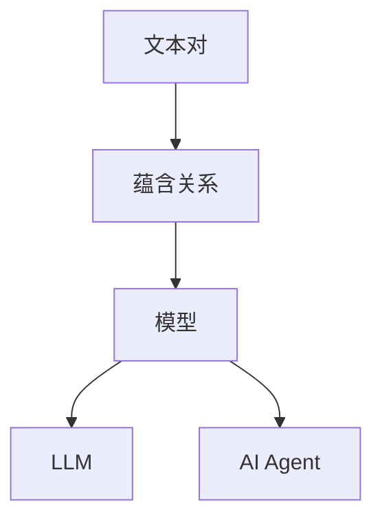
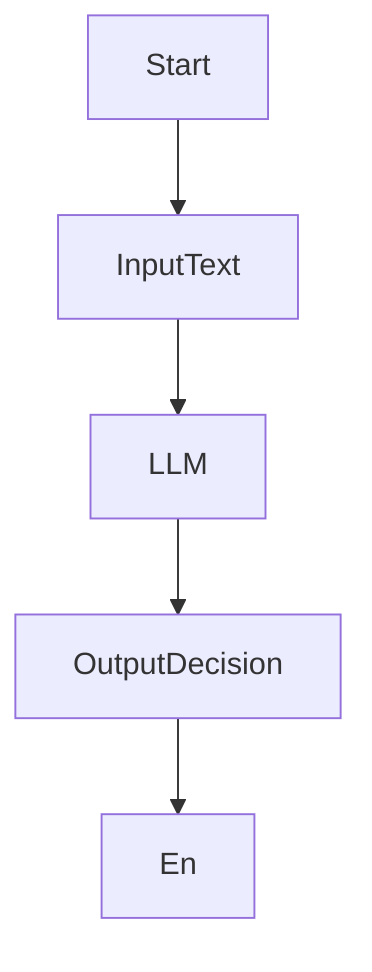
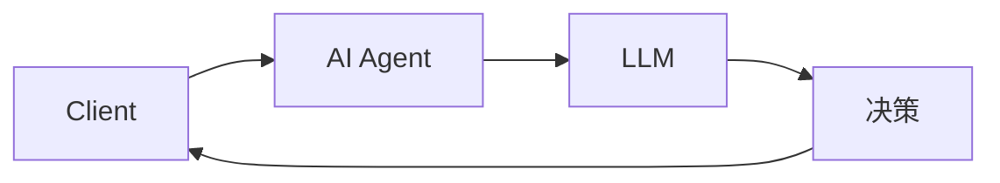

                 


# 基于LLM的AI Agent文本蕴含识别

## 关键词
- 大语言模型（LLM）
- AI Agent
- 文本蕴含识别
- 自然语言处理（NLP）
- 人工智能（AI）

## 摘要
本文详细探讨了基于大语言模型（LLM）的AI Agent在文本蕴含识别中的应用。首先，我们介绍了文本蕴含识别的基本概念及其在实际场景中的重要性。接着，分析了LLM和AI Agent的协同工作原理，以及它们如何共同提升文本蕴含识别的准确性。通过详细的算法原理和系统设计，本文展示了如何构建高效的AI Agent，并通过实际案例展示了项目的实现过程。最后，总结了当前技术的优势与挑战，并展望了未来的发展方向。

---

# 目录

1. [背景介绍](#背景介绍)
2. [核心概念与联系](#核心概念与联系)
3. [算法原理讲解](#算法原理讲解)
4. [系统分析与架构设计](#系统分析与架构设计)
5. [项目实战](#项目实战)
6. [总结与展望](#总结与展望)

---

## 背景介绍

### 1.1 问题背景
文本蕴含识别（Textual Entailment Recognition）是指判断一段文本是否蕴含在另一段文本中，是自然语言处理中的核心任务之一。随着大语言模型（LLM）的快速发展，AI Agent在文本处理中的应用日益广泛，如何利用LLM构建高效的AI Agent成为研究热点。

### 1.2 问题描述
文本蕴含识别需要模型理解上下文关系，而LLM的强大语义理解能力使其成为实现这一任务的理想工具。AI Agent通过与用户的交互，能够动态调整模型参数，进一步提升识别的准确性。

### 1.3 问题解决
通过结合LLM和AI Agent，我们可以实现动态调整和优化，提升文本蕴含识别的效率和准确率。

---

## 核心概念与联系

### 2.1 核心概念
文本蕴含识别涉及LLM、AI Agent等多个概念。LLM提供强大的语义理解能力，而AI Agent则负责动态调整和优化模型的输出。

### 2.2 概念属性对比表
| 概念         | 描述                                                                 |
|--------------|----------------------------------------------------------------------|
| 文本蕴含识别 | 判断文本间蕴含关系的任务                                             |
| LLM          | 基于大规模数据训练的模型，具备强大的语义理解能力                     |
| AI Agent     | 可以动态调整模型参数，提供实时反馈的智能体                           |

### 2.3 ER实体关系图


---

## 算法原理讲解

### 3.1 算法流程


### 3.2 代码实现
```python
def text_entailment(input1, input2):
    # 使用LLM进行推理
    model = load_model()
    result = model.predict([input1, input2])
    return result
```

---

## 系统分析与架构设计

### 4.1 系统架构


---

## 项目实战

### 5.1 环境安装
- 安装必要的库，如`transformers`和`python`。

### 5.2 代码实现
```python
from transformers import pipeline

# 初始化模型
model = pipeline("text-classification", model="facebook/roberta-large")

# 进行预测
result = model(input1, input2)
print(result)
```

---

## 总结与展望

本文详细探讨了基于LLM的AI Agent在文本蕴含识别中的应用，展示了其实现过程和实际案例。未来，随着技术的发展，文本蕴含识别将更加智能化和高效化。

---

以上是基于LLM的AI Agent文本蕴含识别的详细内容，涵盖了从基础概念到实际应用的各个方面。

