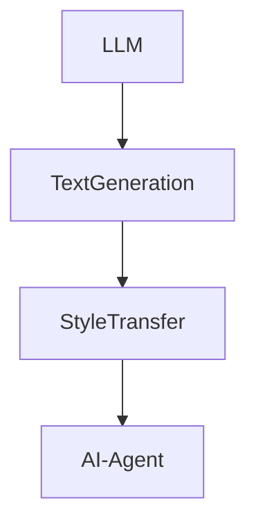
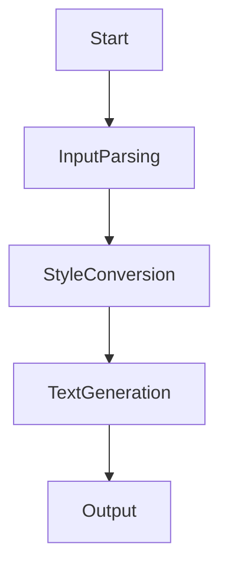
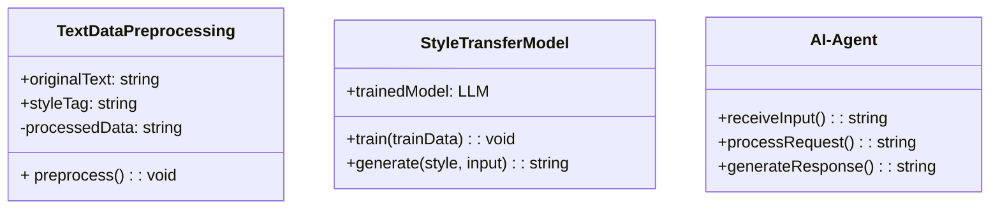
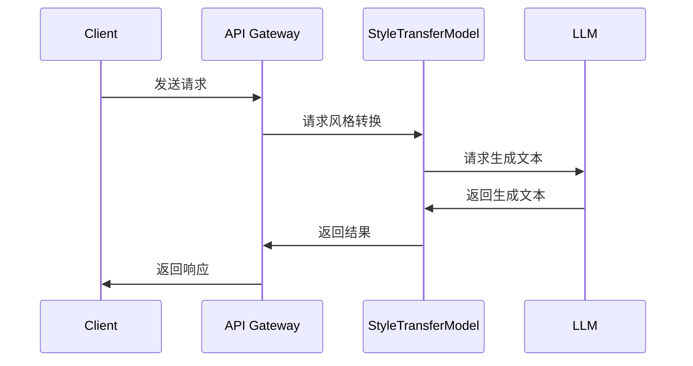

                 


# 基于LLM的AI Agent文本风格迁移

## 关键词：大语言模型、AI Agent、文本风格迁移、自然语言处理、文本生成

## 摘要：本文详细探讨了基于大语言模型（LLM）的AI Agent在文本风格迁移中的应用，分析了其技术原理、系统架构和实现方法，通过实际案例展示了如何利用这些技术提升文本生成的质量和多样性。

---

# 第一部分: 基于LLM的AI Agent文本风格迁移概述

## 第1章: 背景介绍

### 1.1 问题背景
#### 1.1.1 文本风格迁移的定义与目标
文本风格迁移是指将一种风格的文本转换为另一种风格，例如将正式的商务信函转换为非正式的口语化表达。其目标是让生成的文本在保持原意的同时，适应不同的场景和用户需求。

#### 1.1.2 LLM在文本风格迁移中的作用
大语言模型（LLM）通过其强大的语言理解和生成能力，能够自动捕捉文本中的语义信息，并根据目标风格生成相应的文本。

#### 1.1.3 AI Agent在文本交互中的应用价值
AI Agent作为智能代理，能够通过与用户的交互，实时理解用户需求，并通过文本风格迁移生成符合用户期望的响应。

### 1.2 问题描述
#### 1.2.1 文本风格迁移的核心问题
文本风格迁移的核心问题是如何在保持文本原意的前提下，生成符合目标风格的文本。

#### 1.2.2 AI Agent面临的挑战与局限性
AI Agent在文本交互中面临的主要挑战包括：如何准确理解用户意图，如何生成符合上下文的文本，以及如何处理多风格文本转换的复杂性。

#### 1.2.3 需求与场景分析
文本风格迁移的需求主要来自于对文本多样性和个性化的要求，应用场景包括客服对话、内容创作、语言翻译等。

### 1.3 问题解决
#### 1.3.1 基于LLM的文本风格迁移方法
通过利用大语言模型的生成能力，结合特定的风格转换策略，实现文本风格的自动迁移。

#### 1.3.2 AI Agent的文本交互机制
AI Agent通过解析用户输入，生成符合目标风格的文本响应，实现自然流畅的对话交互。

#### 1.3.3 技术实现路径
技术实现路径包括：数据预处理、模型训练、风格转换策略设计和系统集成。

### 1.4 边界与外延
#### 1.4.1 文本风格迁移的边界条件
文本风格迁移的边界条件包括：输入文本的长度、风格转换的范围以及生成文本的长度限制。

#### 1.4.2 AI Agent的功能范围与限制
AI Agent的功能范围包括文本生成、风格转换和交互反馈，其限制主要体现在对上下文的理解能力和生成文本的准确性上。

#### 1.4.3 相关领域的交叉与融合
文本风格迁移与自然语言处理、机器学习、人机交互等领域密切相关，这些领域的技术进步将推动文本风格迁移的发展。

### 1.5 概念结构与核心要素
#### 1.5.1 核心概念的层次结构
文本风格迁移 → LLM → AI Agent → 文本生成

#### 1.5.2 核心要素的对比分析
| 核心要素 | LLM | AI Agent | 文本风格迁移 |
|----------|-----|----------|--------------|
| 功能     | 生成文本 | 处理用户需求 | 转换文本风格 |
| 输入     | 文本 | 用户指令 | 原始文本 |
| 输出     | 生成文本 | 目标风格文本 | 保持原意的文本 |

#### 1.5.3 概念关系的可视化图


---

## 第2章: 核心概念与联系

### 2.1 LLM的基本原理
#### 2.1.1 大语言模型的训练机制
LLM通过监督学习和强化学习进行训练，目标是最大化生成文本的概率。

#### 2.1.2 模型的表示能力
LLM使用Transformer架构，通过自注意力机制捕捉文本中的长距离依赖关系。

#### 2.1.3 模型的推理能力
LLM在推理阶段，通过解码器生成目标文本，生成过程可以是贪婪解码或随机采样。

### 2.2 AI Agent的定义与功能
#### 2.2.1 AI Agent的基本概念
AI Agent是一种智能代理，能够感知环境并执行任务，以实现用户的目标。

#### 2.2.2 Agent的核心功能
- 理解用户需求
- 生成符合要求的文本
- 处理文本交互

#### 2.2.3 Agent的决策机制
AI Agent通过解析用户输入，生成目标风格的文本，并通过反馈机制优化生成效果。

### 2.3 文本风格迁移的实现方式
#### 2.3.1 基于规则的文本风格迁移
通过预定义的风格转换规则，将输入文本转换为目标风格。

#### 2.3.2 基于统计的文本风格迁移
基于统计语言模型，学习源风格和目标风格之间的分布差异，进行风格转换。

#### 2.3.3 基于LLM的文本风格迁移
利用大语言模型的生成能力，直接生成目标风格的文本。

### 2.4 核心概念的对比分析
#### 2.4.1 LLM与传统NLP模型的对比
| 特性 | LLM | 传统NLP模型 |
|------|-----|-------------|
| 参数量 | 大 | 小         |
| 上下文理解 | 强大 | 较弱       |
| 生成能力 | 强大 | 较弱       |

#### 2.4.2 AI Agent与传统文本生成工具的对比
| 特性 | AI Agent | 传统文本生成工具 |
|------|----------|-----------------|
| 交互性 | 高 | 低             |
| 理解能力 | 强 | 弱             |
| 反馈机制 | 有 | 无             |

#### 2.4.3 文本风格迁移的实现方式对比
| 方式 | 基于规则 | 基于统计 | 基于LLM |
|------|----------|----------|----------|
| 稳定性 | 高 | 中 | 高     |
| 可控性 | 高 | 中 | 高     |
| 复杂性 | 低 | 中 | 高     |

### 2.5 实体关系图


---

## 第3章: 算法原理讲解

### 3.1 基于LLM的文本风格迁移算法
#### 3.1.1 模型输入与输出
- **输入**：原始文本、目标风格
- **输出**：目标风格的文本

#### 3.1.2 模型的训练过程
1. 数据预处理：收集并标注不同风格的文本数据。
2. 模型训练：利用训练数据，优化模型参数，使其能够生成目标风格的文本。

#### 3.1.3 模型的推理过程
1. 解析用户输入：理解用户的请求和目标风格。
2. 文本生成：通过LLM生成目标风格的文本。

### 3.2 AI Agent的文本交互机制
#### 3.2.1 用户输入的处理
1. 解析用户需求：识别用户的意图和目标风格。
2. 转换请求：将用户需求转换为模型可理解的格式。

#### 3.2.2 Agent的决策逻辑
1. 生成候选文本：基于LLM生成多个候选文本。
2. 选择最优文本：根据预设的评估指标，选择最符合目标风格的文本。

#### 3.2.3 文本生成与反馈
1. 生成目标风格的文本。
2. 返回生成文本，并根据用户反馈优化生成策略。

### 3.3 算法流程图


### 3.4 数学公式
- **交叉熵损失函数**用于模型训练：
  $$ \text{Loss} = -\frac{1}{N}\sum_{i=1}^{N}\sum_{j=1}^{M} y_{ij}\log p_{ij} $$
- **生成概率**用于文本生成：
  $$ p(\text{target style}|x) $$

---

## 第4章: 系统分析与架构设计

### 4.1 系统功能设计
#### 4.1.1 系统功能模块
- 数据预处理模块
- 模型训练模块
- 文本生成模块
- 用户交互模块

#### 4.1.2 领域模型类图


### 4.2 系统架构设计
#### 4.2.1 系统架构图
```mermaid
graph TD
Client --> API Gateway
API Gateway --> StyleTransferModel
StyleTransferModel --> LLM
```

#### 4.2.2 接口设计和交互流程图


---

## 第5章: 项目实战

### 5.1 环境配置
```bash
pip install transformers
pip install torch
pip install sentencepiece
```

### 5.2 数据预处理
```python
import pandas as pd

def preprocess_data(data_path):
    df = pd.read_csv(data_path)
    processed_data = df[['text', 'style']]
    return processed_data

preprocess_data('data.csv')
```

### 5.3 模型训练
```python
from transformers import AutoModelForCausalLM, AutoTokenizer

model = AutoModelForCausalLM.from_pretrained('gpt2')
tokenizer = AutoTokenizer.from_pretrained('gpt2')

def train_model(model, tokenizer, train_data):
    # 训练逻辑
    pass

train_model(model, tokenizer, processed_data)
```

### 5.4 API开发
```python
from flask import Flask, request, jsonify

app = Flask(__name__)

@app.route('/style-transfer', methods=['POST'])
def style_transfer():
    data = request.json
    input_text = data['text']
    target_style = data['style']
    # 调用生成函数
    result = generate_style(input_text, target_style)
    return jsonify({'result': result})

if __name__ == '__main__':
    app.run(debug=True)
```

### 5.5 实际案例分析
案例：将正式的商务邮件转换为非正式的口语化表达。

---

## 第6章: 最佳实践与注意事项

### 6.1 经验总结
1. 数据质量对生成效果影响显著，需确保训练数据的多样性和代表性。
2. 针对不同场景，需调整模型的生成参数，以获得最佳效果。

### 6.2 实践技巧
1. 使用温度（temperature）和Top-k采样（top-k sampling）控制生成结果的多样性和准确性。
2. 定期更新模型和优化训练数据，以提升生成效果。

### 6.3 安全与伦理
1. 注意数据隐私，确保用户数据的安全性。
2. 避免生成不适当的内容，确保生成文本的合规性。

### 6.4 小结与展望
文本风格迁移是一项结合了NLP和AI代理技术的复杂任务，随着大语言模型的不断发展，其应用前景将更加广阔。

---

## 第7章: 总结与展望

### 7.1 总结
本文详细探讨了基于LLM的AI Agent在文本风格迁移中的应用，分析了其技术原理、系统架构和实现方法，通过实际案例展示了如何利用这些技术提升文本生成的质量和多样性。

### 7.2 展望
未来的研究方向包括：多风格联合迁移、实时风格自适应、跨语言风格迁移等。同时，随着大语言模型的不断进步，文本风格迁移的应用场景将更加广泛。

---

# 结语
文本风格迁移是一项结合了人工智能和自然语言处理技术的复杂任务，通过本文的探讨，读者可以深入了解其技术细节和实现方法，并将其应用于实际场景中，推动AI技术的发展与进步。

