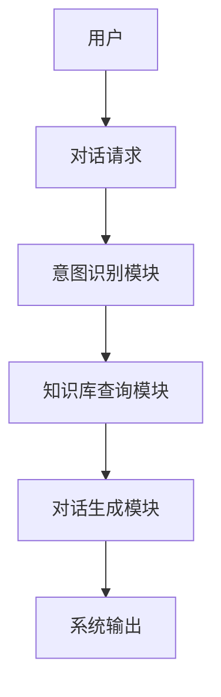

                 

# 基于LLM的金融对话系统开发实践

## 关键词：大语言模型（LLM）、金融对话系统、自然语言处理（NLP）、对话生成、系统架构设计

## 摘要：  
本文详细探讨了基于大语言模型（LLM）的金融对话系统的开发实践。从背景介绍到核心概念，从算法原理到系统架构设计，再到项目实战，系统性地分析了如何利用LLM技术构建高效、智能的金融对话系统。文章通过详细的理论分析和实践案例，揭示了LLM在金融对话任务中的独特优势，并提供了可操作的开发指导和最佳实践。

---

# 第一部分: 基于LLM的金融对话系统开发背景与基础

# 第1章: 问题背景与核心概念

## 1.1 问题背景介绍

### 1.1.1 传统金融对话系统的局限性  
传统金融对话系统主要依赖规则引擎和关键词匹配，难以应对复杂的金融场景和多样化的用户需求。例如，用户提问可能涉及多个金融产品或概念，传统系统难以准确理解并提供有效的解决方案。此外，规则引擎的维护成本高，且难以扩展应对新的业务需求。

### 1.1.2 大语言模型的崛起与应用潜力  
近年来，大语言模型（LLM）如GPT-3、GPT-4等的出现，为对话系统带来了革命性的变化。LLM具有强大的自然语言理解能力和生成能力，能够处理复杂、模糊的对话场景。在金融领域，LLM可以用于客户咨询、投资建议、风险提示等多种场景，显著提升了对话系统的智能化水平。

### 1.1.3 金融领域对话系统的独特需求  
金融对话系统需要处理涉及大量专业术语、复杂业务逻辑的对话。例如，用户可能询问基金的投资策略、股票市场的走势分析，或者需要个性化的财务建议。这些需求要求对话系统不仅要理解用户的意图，还要具备专业的金融知识储备和逻辑推理能力。

---

## 1.2 问题描述与目标

### 1.2.1 金融对话系统的核心功能需求  
- **意图识别**：准确理解用户的对话意图。  
- **知识库调用**：基于意图调用金融知识库提供信息。  
- **对话生成**：生成自然、专业的对话回复。  
- **上下文管理**：处理多轮对话中的上下文信息。  

### 1.2.2 用户痛点与现有解决方案的不足  
- **用户体验差**：传统系统难以应对复杂对话，用户感受较差。  
- **维护成本高**：规则引擎需要频繁调整和优化。  
- **知识更新慢**：传统系统难以快速适应金融市场的变化。  

### 1.2.3 本项目的目标与预期成果  
本项目旨在开发一个基于LLM的金融对话系统，实现以下目标：  
- 提供自然、流畅的对话体验。  
- 支持复杂金融场景的对话需求。  
- 具备快速知识更新和扩展能力。  
预期成果是一个高效、智能、可扩展的金融对话系统，能够显著提升用户体验和业务效率。

---

## 1.3 解决方案与技术路线

### 1.3.1 基于LLM的对话系统技术路线  
1. **LLM模型选择与微调**：选择适合金融领域的LLM模型，并进行微调以适应特定需求。  
2. **对话生成机制**：利用LLM生成对话回复，并结合领域知识进行优化。  
3. **系统架构设计**：设计高效的系统架构，确保系统的可扩展性和灵活性。  

### 1.3.2 系统架构设计概述  
系统架构包括前端交互界面、后端业务逻辑、LLM服务、知识库等模块。各模块协作完成对话的发起、处理和反馈。

### 1.3.3 关键技术选型与实现思路  
- **LLM选型**：选择适合金融领域的开源或商业模型（如GPT-3、GPT-4）。  
- **对话生成**：基于LLM的生成式对话，结合领域知识进行调优。  
- **知识库集成**：构建金融领域的知识库，并与对话系统无缝对接。  

---

## 1.4 系统边界与外延

### 1.4.1 系统功能边界  
- 系统仅处理金融相关的对话请求。  
- 不支持非金融领域的对话交互。  

### 1.4.2 与外部系统的交互范围  
- 与知识库系统的对接：获取实时金融数据和产品信息。  
- 与用户身份验证系统对接：提供个性化服务。  

### 1.4.3 系统的可扩展性与灵活性  
- 支持新金融产品的快速接入。  
- 支持多语言对话能力的扩展。  

---

## 1.5 核心概念与组成要素

### 1.5.1 对话系统的组成模块  
1. **输入模块**：接收用户的对话请求。  
2. **意图识别模块**：分析用户的意图。  
3. **知识库查询模块**：基于意图查询知识库。  
4. **对话生成模块**：生成回复内容。  
5. **输出模块**：将回复返回给用户。  

### 1.5.2 LLM在系统中的角色与作用  
- LLM作为对话生成的核心引擎，负责生成自然流畅的回复。  
- LLM还用于辅助意图识别和知识库优化。  

### 1.5.3 系统核心要素的结构化分析  
- **用户输入**：对话请求。  
- **意图识别**：用户需求解析。  
- **知识库**：金融领域知识储备。  
- **对话生成**：基于LLM的回复生成。  
- **系统输出**：对话结果反馈给用户。  

---

## 1.6 本章小结  
本章详细介绍了基于LLM的金融对话系统的背景、目标、技术路线和系统架构。通过对问题背景的分析，明确了系统的核心功能和实现目标。后续章节将围绕这些核心概念展开深入探讨。

---

# 第二部分: 基于LLM的金融对话系统核心概念与联系

# 第2章: 大语言模型与对话系统原理

## 2.1 LLM的核心原理

### 2.1.1 大语言模型的基本概念  
大语言模型是一种基于深度学习的自然语言处理模型，具有强大的文本生成和理解能力。它通过大量数据的训练，掌握了语言的语义和语境信息。

### 2.1.2 模型的训练过程与特点  
1. **训练数据**：包括书籍、网页、金融文档等。  
2. **训练目标**：最小化预测词与真实词的交叉熵损失。  
3. **模型特点**：参数量大、语义理解能力强、生成能力优秀。  

### 2.1.3 LLM在对话任务中的优势  
- **语义理解**：能够准确理解对话的上下文和意图。  
- **生成能力**：能够生成自然、流畅的对话回复。  
- **可扩展性**：支持多种对话场景和领域扩展。  

---

## 2.2 对话系统的实现原理

### 2.2.1 对话系统的整体架构  
对话系统由输入模块、意图识别模块、知识库查询模块、对话生成模块和输出模块组成。

### 2.2.2 基于LLM的对话生成机制  
- **输入处理**：将用户输入的文本转化为模型可处理的格式。  
- **生成过程**：通过LLM生成回复内容。  
- **输出优化**：对生成内容进行优化和校验。  

### 2.2.3 对话历史与上下文的处理方式  
- **对话历史存储**：记录多轮对话的历史内容。  
- **上下文分析**：基于历史内容进行意图分析和内容生成。  

---

## 2.3 LLM与对话系统的联系

### 2.3.1 LLM在对话任务中的应用模式  
- **直接生成**：LLM直接生成对话回复。  
- **知识增强**：结合知识库优化生成内容。  

### 2.3.2 对话系统的性能依赖于LLM的能力  
- **模型性能**：LLM的参数量和训练数据影响对话质量。  
- **训练优化**：针对金融领域进行微调，提升模型的领域适应性。  

### 2.3.3 LLM的可解释性对对话系统的影响  
- **可解释性**：LLM的决策过程需要透明化，以提升系统的可信度。  
- **调试优化**：通过分析LLM的生成过程，优化对话系统的性能。  

---

## 2.4 核心概念对比分析

### 2.4.1 核心概念属性对比表格  
| **核心概念** | **传统对话系统** | **基于LLM的对话系统** |  
|--------------|------------------|------------------------|  
| **意图识别** | 基于规则匹配 | 基于上下文语义分析 |  
| **对话生成** | 生成固定回复 | 自动生成自然对话 |  
| **扩展能力** | 扩展性差 | 扩展性强，支持多领域 |  

### 2.4.2 实体关系图（ER图）  

---

## 2.5 本章小结  
本章从LLM的核心原理出发，分析了其在对话系统中的应用模式和优势。通过对比传统对话系统和基于LLM的对话系统，明确了LLM在金融对话任务中的独特价值。后续章节将结合算法原理和系统架构设计，进一步探讨系统的实现细节。

---

接下来，我将继续撰写后续章节的内容，涵盖算法原理讲解、系统分析与架构设计、项目实战等部分。如需进一步扩展或调整，请随时告知！

