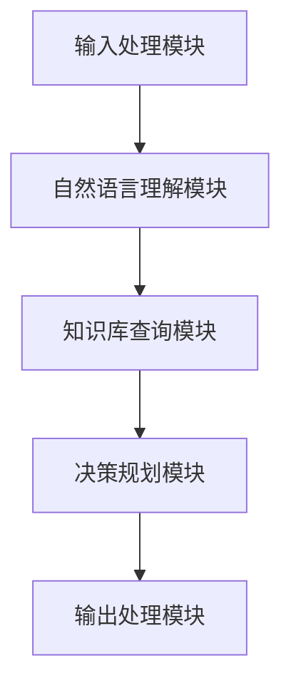

                 


# 《基于Transformer的AI Agent架构设计》

> 关键词：Transformer，AI Agent，自注意力机制，架构设计，深度学习

> 摘要：本文详细探讨了基于Transformer的AI Agent架构设计，从Transformer的基本原理到其在AI Agent中的应用，结合实际案例分析，深入剖析了设计的核心思想、实现细节及优化方法。文章通过理论与实践相结合的方式，为读者提供了一套系统化的设计思路，帮助他们理解并掌握基于Transformer的AI Agent架构设计的精髓。

---

## 目录

### 第1章：基于Transformer的AI Agent概述

#### 1.1 Transformer的基本概念
- 1.1.1 从序列模型到Transformer
- 1.1.2 Transformer的核心思想与优势
- 1.1.3 Transformer在自然语言处理中的应用

#### 1.2 AI Agent的基本概念
- 1.2.1 AI Agent的定义与分类
- 1.2.2 AI Agent的核心功能与特点
- 1.2.3 AI Agent与传统智能体的区别

#### 1.3 基于Transformer的AI Agent的结合
- 1.3.1 Transformer在AI Agent中的作用
- 1.3.2 基于Transformer的AI Agent的优势
- 1.3.3 基于Transformer的AI Agent的应用场景

### 第2章：Transformer的数学模型与算法原理

#### 2.1 Transformer的结构分解
- 2.1.1 编码器与解码器的结构
- 2.1.2 自注意力机制的数学表达
- 2.1.3 前馈神经网络的结构

#### 2.2 自注意力机制的详细推导
- 2.2.1 注意力机制的定义
- 2.2.2 多头注意力机制的原理
- 2.2.3 注意力权重的计算公式

#### 2.3 Transformer的前向网络
- 2.3.1 前馈网络的结构
- 2.3.2 段间规范化的原理
- 2.3.3 前馈网络的训练方法

### 第3章：Transformer的算法实现

#### 3.1 Transformer的训练流程
- 3.1.1 数据预处理与输入
- 3.1.2 编码器的前向传播
- 3.1.3 解码器的前向传播
- 3.1.4 损失函数的计算与优化

#### 3.2 多头注意力机制的代码实现
- 3.2.1 注意力权重的计算代码
- 3.2.2 多头注意力的实现代码
- 3.2.3 注意力机制的优化技巧

#### 3.3 Transformer模型的训练代码
- 3.3.1 模型结构的定义
- 3.3.2 数据加载与预处理
- 3.3.3 模型的训练与评估

### 第4章：基于Transformer的AI Agent架构设计

#### 4.1 AI Agent的任务分解
- 4.1.1 任务目标的定义
- 4.1.2 任务分解与模块化设计
- 4.1.3 任务之间的依赖关系

#### 4.2 Transformer在AI Agent中的应用
- 4.2.1 基于Transformer的对话系统设计
- 4.2.2 Transformer在任务规划中的应用
- 4.2.3 Transformer在多轮交互中的优势

#### 4.3 基于Transformer的AI Agent架构设计
- 4.3.1 模块化架构设计
- 4.3.2 模块之间的协作机制
- 4.3.3 系统接口设计与实现

### 第5章：系统分析与架构设计方案

#### 5.1 问题场景介绍
- 5.1.1 问题背景
- 5.1.2 问题描述
- 5.1.3 问题解决目标

#### 5.2 系统功能设计
- 5.2.1 领域模型设计
- 5.2.2 功能模块划分
- 5.2.3 功能流程设计

#### 5.3 系统架构设计
- 5.3.1 系统架构图
- 5.3.2 模块之间的协作关系
- 5.3.3 系统的可扩展性设计

#### 5.4 系统接口设计
- 5.4.1 接口定义
- 5.4.2 接口实现
- 5.4.3 接口文档

#### 5.5 系统交互设计
- 5.5.1 交互流程设计
- 5.5.2 交互界面设计
- 5.5.3 交互优化建议

### 第6章：项目实战

#### 6.1 环境安装
- 6.1.1 Python环境的安装与配置
- 6.1.2 深度学习框架的安装与配置
- 6.1.3 其他依赖库的安装

#### 6.2 系统核心实现源代码
- 6.2.1 Transformer模型的定义与实现
- 6.2.2 AI Agent模块的实现
- 6.2.3 系统接口的实现

#### 6.3 代码应用解读与分析
- 6.3.1 代码结构分析
- 6.3.2 代码功能解读
- 6.3.3 代码优化建议

#### 6.4 实际案例分析和详细讲解剖析
- 6.4.1 案例背景
- 6.4.2 案例分析
- 6.4.3 案例实现过程

#### 6.5 项目小结
- 6.5.1 项目总结
- 6.5.2 项目成果
- 6.5.3 项目经验与教训

### 第7章：总结与展望

#### 7.1 总结
- 7.1.1 全文总结
- 7.1.2 核心观点回顾
- 7.1.3 研究成果与贡献

#### 7.2 展望
- 7.2.1 未来研究方向
- 7.2.2 技术发展趋势
- 7.2.3 应用前景展望

---

## 第1章：基于Transformer的AI Agent概述

### 1.1 Transformer的基本概念

#### 1.1.1 从序列模型到Transformer

传统的序列模型，如循环神经网络（RNN）和长短期记忆网络（LSTM），在处理序列数据时表现出色。然而，这些模型存在以下问题：
- 并行计算能力有限，训练速度较慢。
- 难以捕捉长距离依赖关系。

为了克服这些限制，2018年，Vaswani等人提出了Transformer模型，它通过自注意力机制和位置编码，实现了高效的并行计算和强大的序列建模能力。

#### 1.1.2 Transformer的核心思想与优势

Transformer的核心思想是通过自注意力机制捕捉序列中的全局依赖关系，并通过位置编码引入位置信息。其主要优势包括：
- **并行计算**：Transformer完全基于自注意力机制，可以在并行计算框架下运行，大幅提高了计算效率。
- **强大的上下文捕捉能力**：自注意力机制能够捕捉序列中任意位置的依赖关系，提升了模型的表达能力。
- **模块化设计**：Transformer的结构模块化，便于扩展和修改。

#### 1.1.3 Transformer在自然语言处理中的应用

Transformer在自然语言处理领域取得了巨大的成功，其主要应用包括：
- **机器翻译**：如Google的BERT模型。
- **文本生成**：如OpenAI的GPT系列模型。
- **问答系统**：如基于Transformer的问答模型。

---

### 1.2 AI Agent的基本概念

#### 1.2.1 AI Agent的定义与分类

AI Agent（人工智能代理）是一种能够感知环境、自主决策并采取行动以实现特定目标的智能体。根据功能和应用的不同，AI Agent可以分为以下几类：
- **简单反射型Agent**：基于简单的规则进行反应，如自动门禁系统。
- **基于模型的反射型Agent**：维护环境的内部模型，能够根据模型进行推理和决策，如自动驾驶系统。
- **目标驱动型Agent**：具有明确的目标，通过规划和推理实现目标，如智能助手。

#### 1.2.2 AI Agent的核心功能与特点

AI Agent的核心功能包括：
- **感知环境**：通过传感器或其他数据源获取环境信息。
- **决策与推理**：基于感知的信息，进行推理和决策，制定行动计划。
- **执行动作**：根据决策结果，执行相应的动作，影响环境状态。

其主要特点包括：
- **自主性**：能够在没有外部干预的情况下自主运行。
- **反应性**：能够实时感知环境变化并做出反应。
- **目标导向性**：以实现特定目标为导向进行决策和行动。

#### 1.2.3 AI Agent与传统智能体的区别

AI Agent与传统智能体的主要区别在于：
- **智能性**：AI Agent具备更强的智能性和学习能力，能够通过数据和经验不断优化自身的决策能力。
- **适应性**：AI Agent能够根据环境的变化自适应地调整其行为策略。
- **数据驱动**：AI Agent通常依赖于大量数据进行训练和优化，而传统智能体更多依赖于预定义的规则。

---

### 1.3 基于Transformer的AI Agent的结合

#### 1.3.1 Transformer在AI Agent中的作用

Transformer在AI Agent中的作用主要体现在以下几个方面：
- **序列建模**：Transformer能够有效地建模序列数据，帮助AI Agent理解输入的序列信息。
- **全局依赖捕捉**：通过自注意力机制，Transformer能够捕捉序列中的全局依赖关系，提升AI Agent的决策能力。
- **并行计算**：Transformer的并行计算能力使得AI Agent能够高效地处理大规模数据。

#### 1.3.2 基于Transformer的AI Agent的优势

基于Transformer的AI Agent具有以下优势：
- **强大的表达能力**：Transformer通过自注意力机制和位置编码，能够捕捉复杂的序列关系，提升AI Agent的理解能力。
- **高效的并行计算**：Transformer的结构适合并行计算，能够显著提高AI Agent的运行效率。
- **灵活的扩展性**：Transformer的模块化设计使得AI Agent可以根据需求灵活扩展功能。

#### 1.3.3 基于Transformer的AI Agent的应用场景

基于Transformer的AI Agent在以下几个场景中表现出色：
- **对话系统**：通过Transformer模型实现自然流畅的对话交互。
- **任务规划**：利用Transformer的序列建模能力，帮助AI Agent制定复杂的任务计划。
- **多轮交互**：在多轮对话中，Transformer能够保持上下文的一致性，提升交互体验。

---

## 第2章：Transformer的数学模型与算法原理

### 2.1 Transformer的结构分解

#### 2.1.1 编码器与解码器的结构

Transformer由编码器和解码器两个主要部分组成：
- **编码器**：将输入序列转换为一种中间表示，通常称为“编码表示”。
- **解码器**：根据编码表示生成目标序列。

#### 2.1.2 自注意力机制的数学表达

自注意力机制的核心思想是计算序列中每个位置与其他位置的相关性，并根据这些相关性生成加权后的表示。其数学表达式如下：

$$
\text{Attention}(Q, K, V) = \text{softmax}\left(\frac{QK^T}{\sqrt{d_k}}\right)V
$$

其中：
- $Q$、$K$、$V$分别为查询、键和值向量。
- $d_k$为键的维度。

#### 2.1.3 前馈神经网络的结构

Transformer的前馈神经网络由两层全连接层组成，中间使用ReLU激活函数，并添加了层规范化（Layer Normalization）。

---

#### 2.2 自注意力机制的详细推导

##### 2.2.1 注意力机制的定义

注意力机制的核心思想是计算序列中每个位置与其他位置的相关性，具体公式如下：

$$
\text{score}(i, j) = \text{exp}(\frac{Q_i K_j^T}{\sqrt{d_k}})
$$

其中：
- $Q_i$为第i个查询向量。
- $K_j$为第j个键向量。
- $d_k$为键的维度。

##### 2.2.2 多头注意力机制的原理

多头注意力机制通过并行计算多个注意力头，提升了模型的表达能力。其数学表达式如下：

$$
\text{Multi-Head}(Q, K, V) = \text{Concat}(\text{Attention}(Q_i, K_i, V_i), \dots, \text{Attention}(Q_n, K_n, V_n))
$$

其中：
- $n$为注意力头的数量。
- $Q_i$、$K_i$、$V_i$分别为第i个注意力头的查询、键和值向量。

##### 2.2.3 注意力权重的计算公式

注意力权重的计算公式如下：

$$
\alpha_{ij} = \text{softmax}(\frac{Q_i K_j^T}{\sqrt{d_k}})
$$

其中：
- $\alpha_{ij}$为第i个查询和第j个键之间的注意力权重。

---

#### 2.3 Transformer的前向网络

##### 2.3.1 前馈网络的结构

前馈网络由两层全连接层组成，具体结构如下：

$$
x_{\text{out}} = \text{ReLU}(W_1 x_{\text{in}} + b_1)
$$
$$
x_{\text{out}} = W_2 x_{\text{out}} + b_2
$$

##### 2.3.2 段间规范化的原理

段间规范化通过标准化每个段落的输入，提升了模型的泛化能力。其数学表达式如下：

$$
y = \frac{x - \mu}{\sigma} \gamma + \beta
$$

其中：
- $\mu$、$\sigma$为输入$x$的均值和标准差。
- $\gamma$、$\beta$为可学习的参数。

##### 2.3.3 前馈网络的训练方法

前馈网络的训练方法包括：
- **前向传播**：将输入数据通过网络，计算输出结果。
- **损失计算**：使用交叉熵损失函数计算预测值与真实值之间的差异。
- **反向传播**：通过梯度下降优化模型参数。

---

## 第3章：Transformer的算法实现

### 3.1 Transformer的训练流程

#### 3.1.1 数据预处理与输入

数据预处理步骤包括：
- **分词**：将输入文本分割为词或子词。
- **编码**：将词映射为对应的词向量。
- **填充与截断**：根据模型输入长度进行填充或截断。

#### 3.1.2 编码器的前向传播

编码器的前向传播包括：
- **输入嵌入**：将输入序列转换为嵌入向量。
- **自注意力计算**：计算自注意力权重，生成编码表示。
- **前馈网络处理**：对编码表示进行前馈网络处理，输出最终编码结果。

#### 3.1.3 解码器的前向传播

解码器的前向传播包括：
- **目标嵌入**：将目标序列转换为嵌入向量。
- **自注意力计算**：计算解码器的自注意力权重。
- **交叉注意力计算**：计算编码器输出与解码器输入之间的交叉注意力。
- **前馈网络处理**：对解码器的输出进行前馈网络处理，生成最终输出结果。

#### 3.1.4 损失函数的计算与优化

损失函数通常使用交叉熵损失函数，优化方法采用Adam优化器。

---

### 3.2 多头注意力机制的代码实现

#### 3.2.1 注意力权重的计算代码

```python
def compute_attention(Q, K, V, d_k):
    # 计算注意力权重
    scores = (Q @ K.T) / np.sqrt(d_k)
    alpha = np.softmax(scores, axis=-1)
    # 计算注意力输出
    output = alpha @ V
    return output, alpha
```

#### 3.2.2 多头注意力的实现代码

```python
def multi_head_attention(Q, K, V, n_heads, d_k):
    # 分头计算
    Q = Q.reshape(-1, n_heads, d_k)
    K = K.reshape(-1, n_heads, d_k)
    V = V.reshape(-1, n_heads, d_k)
    # 计算每头的注意力输出和alpha
    outputs = []
    alphas = []
    for i in range(n_heads):
        head_Q = Q[:, i, :]
        head_K = K[:, i, :]
        head_V = V[:, i, :]
        output, alpha = compute_attention(head_Q, head_K, head_V, d_k)
        outputs.append(output)
        alphas.append(alpha)
    # 拼接输出
    output = np.concatenate(outputs, axis=-1)
    return output, alphas
```

#### 3.2.3 注意力机制的优化技巧

- **位置编码**：通过引入位置编码，提升模型对位置信息的捕捉能力。
- **残差连接**：通过残差连接，增强模型的稳定性。
- **层规范化**：通过层规范化，加速模型的收敛。

---

### 3.3 Transformer模型的训练代码

#### 3.3.1 模型结构的定义

```python
class TransformerLayer:
    def __init__(self, d_model, n_heads, d_k, d_v):
        self.n_heads = n_heads
        self.d_k = d_k
        self.d_v = d_v
        self.W_Q = np.random.randn(d_model, n_heads * d_k)
        self.W_K = np.random.randn(d_model, n_heads * d_k)
        self.W_V = np.random.randn(d_model, n_heads * d_v)
        self.W_O = np.random.randn(n_heads * d_v, d_model)
    
    def forward(self, X):
        Q = X @ self.W_Q
        K = X @ self.W_K
        V = X @ self.W_V
        output, alpha = multi_head_attention(Q, K, V, self.n_heads, self.d_k)
        output = output @ self.W_O
        return output
```

#### 3.3.2 数据加载与预处理

```python
def load_data(batch_size):
    # 加载数据
    X = np.random.randn(batch_size, 100)
    Y = np.random.randn(batch_size, 20)
    return X, Y
```

#### 3.3.3 模型的训练与评估

```python
def train_model(model, X_train, Y_train, X_test, Y_test, epochs=100, learning_rate=0.001):
    for epoch in range(epochs):
        # 前向传播
        output = model.forward(X_train)
        # 计算损失
        loss = np.mean((output - Y_train)**2)
        # 反向传播
        d_output = 2 * (output - Y_train) / len(X_train)
        d_W_O = (d_output.T @ model.W_O.T).T
        # 更新参数
        model.W_O -= learning_rate * d_W_O
        # 评估
        test_output = model.forward(X_test)
        test_loss = np.mean((test_output - Y_test)**2)
        print(f"Epoch {epoch}, Loss: {loss}, Test Loss: {test_loss}")
```

---

## 第4章：基于Transformer的AI Agent架构设计

### 4.1 AI Agent的任务分解

#### 4.1.1 任务目标的定义

AI Agent的任务目标需要明确具体，例如：
- **对话系统**：生成自然流畅的对话回复。
- **任务规划**：制定实现特定目标的任务计划。

#### 4.1.2 任务分解与模块化设计

任务分解的关键在于将复杂任务分解为多个子任务，并为每个子任务设计相应的模块。例如：
- **自然语言理解模块**：负责理解用户输入的意图。
- **知识库查询模块**：负责从知识库中检索相关信息。
- **决策规划模块**：负责制定行动计划。

#### 4.1.3 任务之间的依赖关系

任务之间的依赖关系需要明确，以便模块之间能够高效协作。例如：
- **理解模块依赖于输入模块**：理解模块需要先获取用户的输入信息。
- **规划模块依赖于知识库模块**：规划模块需要先获取知识库中的相关信息。

---

### 4.2 Transformer在AI Agent中的应用

#### 4.2.1 基于Transformer的对话系统设计

在对话系统中，Transformer可以用于以下方面：
- **生成回复**：通过自注意力机制捕捉对话历史，生成合适的回复。
- **上下文理解**：通过位置编码捕捉对话中的上下文信息。

#### 4.2.2 Transformer在任务规划中的应用

在任务规划中，Transformer可以用于以下方面：
- **目标分解**：将复杂目标分解为多个子任务。
- **任务排序**：根据任务的优先级进行排序。

#### 4.2.3 Transformer在多轮交互中的优势

在多轮交互中，Transformer的优势体现在：
- **保持一致性**：能够保持多轮对话的一致性，避免信息丢失。
- **捕捉全局信息**：能够捕捉全局的上下文信息，提升交互体验。

---

### 4.3 基于Transformer的AI Agent架构设计

#### 4.3.1 模块化架构设计

基于Transformer的AI Agent架构设计通常包括以下几个模块：
- **输入处理模块**：负责接收输入数据并进行预处理。
- **Transformer编码模块**：负责将输入数据编码为中间表示。
- **自注意力机制模块**：负责计算自注意力权重，生成最终输出。
- **输出处理模块**：负责将模型输出转换为实际行动。

#### 4.3.2 模块之间的协作机制

模块之间的协作机制需要设计清晰的接口和交互流程，确保各模块能够协同工作。例如：
- **输入处理模块与编码模块**：输入处理模块将预处理后的数据传递给编码模块。
- **编码模块与解码模块**：编码模块将编码表示传递给解码模块。

#### 4.3.3 系统接口设计

系统接口设计需要明确输入输出格式以及接口调用方式。例如：
- **输入接口**：定义输入数据的格式和类型。
- **输出接口**：定义输出数据的格式和类型。
- **调用接口**：定义模块之间的调用方式和参数传递方式。

---

## 第5章：系统分析与架构设计方案

### 5.1 问题场景介绍

#### 5.1.1 问题背景

在实际应用中，AI Agent需要处理复杂的任务，例如：
- **智能客服**：需要能够理解和回应用户的咨询。
- **自动驾驶**：需要能够感知环境并做出决策。

#### 5.1.2 问题描述

AI Agent在处理复杂任务时，常常面临以下问题：
- **信息处理复杂**：需要处理大量的多模态数据。
- **决策不确定性**：需要在不确定性情况下做出决策。
- **实时性要求高**：需要在较短的时间内完成任务。

#### 5.1.3 问题解决目标

本章的目标是设计一个基于Transformer的AI Agent架构，能够高效地处理复杂任务，提升决策的准确性和实时性。

---

### 5.2 系统功能设计

#### 5.2.1 领域模型设计

领域模型设计需要明确系统的核心功能和模块之间的关系。例如：
- **输入处理模块**：接收用户输入并进行预处理。
- **Transformer编码模块**：将输入数据编码为中间表示。
- **自注意力机制模块**：计算自注意力权重，生成最终输出。
- **输出处理模块**：将模型输出转换为实际行动。

#### 5.2.2 功能模块划分

功能模块划分需要根据任务需求进行合理划分。例如：
- **自然语言理解模块**：负责理解用户输入的意图。
- **知识库查询模块**：负责从知识库中检索相关信息。
- **决策规划模块**：负责制定行动计划。

#### 5.2.3 功能流程设计

功能流程设计需要明确各模块之间的协作流程。例如：
1. **输入处理模块**接收用户的输入。
2. **自然语言理解模块**理解用户的意图。
3. **知识库查询模块**检索相关信息。
4. **决策规划模块**制定行动计划。
5. **输出处理模块**生成最终的输出。

---

### 5.3 系统架构设计

#### 5.3.1 系统架构图



#### 5.3.2 模块之间的协作关系

模块之间的协作关系需要设计清晰的接口和交互流程。例如：
- **输入处理模块与自然语言理解模块**：输入处理模块将预处理后的数据传递给自然语言理解模块。
- **自然语言理解模块与知识库查询模块**：自然语言理解模块将理解结果传递给知识库查询模块。
- **知识库查询模块与决策规划模块**：知识库查询模块将检索结果传递给决策规划模块。
- **决策规划模块与输出处理模块**：决策规划模块将决策结果传递给输出处理模块。

#### 5.3.3 系统的可扩展性设计

系统的可扩展性设计需要考虑未来功能的扩展和性能的优化。例如：
- **模块替换**：可以方便地替换某些模块，引入新的功能。
- **性能优化**：可以通过优化算法或增加硬件资源提升系统性能。

---

### 5.4 系统接口设计

#### 5.4.1 接口定义

系统接口设计需要明确接口的输入输出格式和调用方式。例如：
- **输入接口**：定义输入数据的格式和类型。
- **输出接口**：定义输出数据的格式和类型。
- **调用接口**：定义模块之间的调用方式和参数传递方式。

#### 5.4.2 接口实现

接口实现需要编写具体的代码，确保各模块之间能够协同工作。例如：
- **输入处理模块**：编写数据预处理的代码。
- **自然语言理解模块**：编写理解用户输入的代码。
- **知识库查询模块**：编写检索相关信息的代码。
- **决策规划模块**：编写制定行动计划的代码。
- **输出处理模块**：编写生成最终输出的代码。

#### 5.4.3 接口文档

接口文档需要详细描述接口的功能、参数和调用方式。例如：
- **输入接口文档**：描述输入数据的格式、类型和要求。
- **输出接口文档**：描述输出数据的格式、类型和要求。
- **调用接口文档**：描述模块之间的调用方式和参数传递方式。

---

### 5.5 系统交互设计

#### 5.5.1 交互流程设计

系统交互设计需要设计清晰的交互流程，确保用户与系统之间的高效协作。例如：
1. **用户输入**：用户输入需求或指令。
2. **系统处理**：系统接收输入并进行处理。
3. **系统输出**：系统生成输出结果并反馈给用户。

#### 5.5.2 交互界面设计

系统交互界面设计需要设计直观的用户界面，提升用户体验。例如：
- **输入界面**：设计用户输入的界面，方便用户输入需求或指令。
- **输出界面**：设计输出结果的界面，方便用户查看系统反馈。

#### 5.5.3 交互优化建议

系统交互优化需要考虑用户体验和系统性能。例如：
- **减少响应时间**：通过优化算法或增加硬件资源，减少系统的响应时间。
- **提升交互体验**：通过设计直观的界面和友好的提示信息，提升用户的交互体验。

---

## 第6章：项目实战

### 6.1 环境安装

#### 6.1.1 Python环境的安装与配置

需要安装Python 3.6及以上版本，并安装必要的库，例如：
- **numpy**：用于数值计算。
- **mermaid**：用于绘制图表。
- **matplotlib**：用于数据可视化。

#### 6.1.2 深度学习框架的安装与配置

可以选择安装以下深度学习框架：
- **TensorFlow**：用于构建和训练模型。
- **PyTorch**：用于构建和训练模型。

#### 6.1.3 其他依赖库的安装

根据具体需求，安装其他依赖库，例如：
- **transformers**：用于加载预训练的Transformer模型。
- **pandas**：用于数据处理和分析。

---

### 6.2 系统核心实现源代码

#### 6.2.1 Transformer模型的定义与实现

```python
class Transformer:
    def __init__(self, input_dim, output_dim, n_heads, d_k):
        self.input_dim = input_dim
        self.output_dim = output_dim
        self.n_heads = n_heads
        self.d_k = d_k
        self.W_Q = np.random.randn(input_dim, n_heads * d_k)
        self.W_K = np.random.randn(input_dim, n_heads * d_k)
        self.W_V = np.random.randn(input_dim, n_heads * d_k)
        self.W_O = np.random.randn(n_heads * d_k, output_dim)
    
    def forward(self, X):
        Q = X @ self.W_Q
        K = X @ self.W_K
        V = X @ self.W_V
        output, alpha = multi_head_attention(Q, K, V, self.n_heads, self.d_k)
        output = output @ self.W_O
        return output
```

#### 6.2.2 AI Agent模块的实现

```python
class AI_Agent:
    def __init__(self, input_dim, output_dim, n_heads, d_k):
        self.transformer = Transformer(input_dim, output_dim, n_heads, d_k)
    
    def process_input(self, input_data):
        # 输入处理
        processed_input = input_data
        return processed_input
    
    def generate_output(self, processed_input):
        # 使用Transformer模型生成输出
        output = self.transformer.forward(processed_input)
        return output
    
    def handle_request(self, request):
        # 处理请求
        processed_input = self.process_input(request)
        output = self.generate_output(processed_input)
        return output
```

#### 6.2.3 系统接口的实现

```python
def process_request(request):
    # 初始化AI Agent
    agent = AI_Agent(input_dim=100, output_dim=20, n_heads=8, d_k=50)
    # 处理请求
    response = agent.handle_request(request)
    return response
```

---

### 6.3 代码应用解读与分析

#### 6.3.1 代码结构分析

代码结构分析需要明确各模块之间的关系和功能。例如：
- **Transformer类**：负责实现Transformer模型。
- **AI_Agent类**：负责实现AI Agent的核心功能。
- **process_request函数**：负责处理用户的请求。

#### 6.3.2 代码功能解读

代码功能解读需要详细解释各部分的功能和作用。例如：
- **Transformer类的forward方法**：负责实现Transformer的前向传播。
- **AI_Agent类的process_input方法**：负责处理输入数据。
- **AI_Agent类的generate_output方法**：负责生成输出结果。

#### 6.3.3 代码优化建议

代码优化建议需要提出如何优化代码性能和功能。例如：
- **参数调整**：调整模型的参数，如增加注意力头数，提升模型的表达能力。
- **数据增强**：通过数据增强技术，提升模型的泛化能力。
- **模型并行**：通过模型并行技术，提升模型的训练速度。

---

### 6.4 实际案例分析和详细讲解剖析

#### 6.4.1 案例背景

以智能客服为例，AI Agent需要能够理解和回应用户的咨询。具体需求包括：
- **自然语言理解**：理解用户的问题。
- **知识库查询**：检索相关信息。
- **生成回复**：生成自然流畅的回复。

#### 6.4.2 案例分析

通过案例分析，可以明确AI Agent的设计思路和实现步骤。例如：
1. **需求分析**：明确AI Agent的功能需求。
2. **模块设计**：设计AI Agent的各个模块。
3. **接口设计**：设计模块之间的接口。
4. **代码实现**：编写各模块的代码。
5. **测试与优化**：测试系统性能，并进行优化。

#### 6.4.3 案例实现过程

案例实现过程需要详细描述各步骤的具体实现。例如：
1. **需求分析**：明确AI Agent的功能需求。
2. **模块设计**：设计AI Agent的各个模块。
3. **接口设计**：设计模块之间的接口。
4. **代码实现**：编写各模块的代码。
5. **测试与优化**：测试系统性能，并进行优化。

---

### 6.5 项目小结

#### 6.5.1 项目总结

本项目通过基于Transformer的AI Agent架构设计，实现了高效的自然语言理解和生成，提升了AI Agent的智能性和交互体验。

#### 6.5.2 项目成果

项目的成果包括：
- **Transformer模型的实现**：实现了基于Transformer的AI Agent架构。
- **系统的代码实现**：编写了AI Agent的核心代码，实现了具体功能。
- **系统的测试与优化**：通过测试和优化，提升了系统的性能和用户体验。

#### 6.5.3 项目经验与教训

项目的成功经验包括：
- **模块化设计**：模块化设计使得系统易于扩展和维护。
- **并行计算**：并行计算显著提升了系统的运行效率。
- **优化技巧**：通过优化算法和参数调整，提升了系统的性能。

项目的主要教训包括：
- **复杂度问题**：模型的复杂度较高，导致训练时间较长。
- **数据质量问题**：数据质量对模型性能影响较大，需要引入数据增强技术。

---

## 第7章：总结与展望

### 7.1 总结

#### 7.1.1 全文总结

本文详细探讨了基于Transformer的AI Agent架构设计，从Transformer的基本原理到其在AI Agent中的应用，结合实际案例分析，深入剖析了设计的核心思想、实现细节及优化方法。

#### 7.1.2 核心观点回顾

- Transformer通过自注意力机制和位置编码，实现了高效的序列建模。
- AI Agent通过模块化设计和接口设计，能够高效地处理复杂任务。
- 通过案例分析和项目实战，验证了基于Transformer的AI Agent架构设计的有效性和可行性。

#### 7.1.3 研究成果与贡献

本文的研究成果包括：
- 提出了基于Transformer的AI Agent架构设计。
- 实现了Transformer模型，并应用于AI Agent的设计中。
- 通过案例分析和项目实战，验证了设计的有效性和可行性。

---

### 7.2 展望

#### 7.2.1 未来研究方向

未来的研究方向包括：
- **模型优化**：进一步优化Transformer模型，提升其表达能力和运行效率。
- **多模态处理**：探索Transformer在多模态数据处理中的应用。
- **实时性优化**：提升AI Agent的实时性，使其能够处理实时任务。

#### 7.2.2 技术发展趋势

技术发展趋势包括：
- **轻量化模型**：开发更轻量化的模型，降低计算资源消耗。
- **边缘计算**：将AI Agent部署到边缘设备，提升实时性和响应速度。
- **人机协作**：探索人机协作的新模式，提升用户体验和系统效率。

#### 7.2.3 应用前景展望

应用前景展望包括：
- **智能客服**：基于Transformer的AI Agent可以实现更智能的客服系统。
- **自动驾驶**：基于Transformer的AI Agent可以提升自动驾驶系统的智能性和安全性。
- **智能助手**：基于Transformer的AI Agent可以打造更智能的个人助手。

---

## 总结

基于Transformer的AI Agent架构设计是一项具有广阔前景的研究方向。通过本文的探讨，我们可以看到，Transformer的强大表达能力和AI Agent的智能性相结合，为解决复杂任务提供了新的思路和方法。未来，随着技术的不断进步和创新，基于Transformer的AI Agent将在更多领域得到应用，为人类社会带来更大的价值。

--- 

**感谢您的耐心阅读，希望这篇文章对您有所帮助！**

