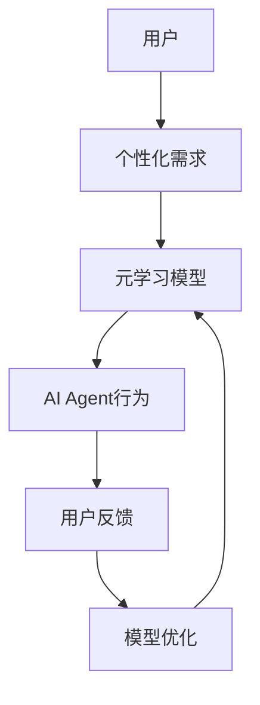

                 


# 基于元学习的个性化AI Agent定制

> 关键词：元学习、个性化AI Agent、自适应系统、智能体定制、算法原理

> 摘要：本文深入探讨了基于元学习的个性化AI Agent定制方法，分析了元学习的核心概念、算法原理及其在个性化AI Agent中的应用。通过实际案例和系统设计，展示了如何利用元学习技术实现AI Agent的快速适应和个性化定制。

---

# 第1章: 元学习与个性化AI Agent概述

## 1.1 元学习的定义与背景

### 1.1.1 元学习的定义

元学习（Meta-Learning）是一种机器学习技术，旨在通过学习如何学习，使得模型能够快速适应新任务或数据。与传统机器学习不同，元学习关注的是模型的泛化能力和快速适应能力。

### 1.1.2 元学习的背景与重要性

随着人工智能的快速发展，传统的机器学习方法在面对新任务时需要重新训练整个模型，耗时且效率低下。元学习的出现，为模型的快速适应提供了新的解决方案，尤其是在个性化需求日益增长的今天，元学习的重要性愈发凸显。

### 1.1.3 元学习的核心思想

元学习的核心思想是通过在元任务（meta-tasks）上进行训练，使得模型能够快速适应新的任务。元任务通常是一组与目标任务相关但不同的任务，模型在这些任务上学习到如何调整参数以适应新的任务。

---

## 1.2 个性化AI Agent的定义与特点

### 1.2.1 个性化AI Agent的定义

个性化AI Agent是指能够根据用户的个性化需求，动态调整自身行为和决策的智能体。它不仅能够理解用户的需求，还能根据反馈不断优化自身的服务策略。

### 1.2.2 个性化AI Agent的核心特点

- **自适应性**：能够根据用户的行为和反馈动态调整。
- **个性化服务**：提供针对不同用户的定制化服务。
- **高效性**：能够在较短时间内适应新的任务或场景。

### 1.2.3 个性化AI Agent与传统AI Agent的区别

| 特性                | 个性化AI Agent          | 传统AI Agent         |
|---------------------|-------------------------|----------------------|
| 自适应性             | 强                    | 弱或无               |
| 个性化服务           | 高                    | 低或无               |
| 任务适应速度         | 快                    | 慢或需要重新训练     |

---

## 1.3 元学习在个性化AI Agent中的应用

### 1.3.1 元学习在AI Agent定制中的作用

元学习通过在元任务上进行预训练，使得AI Agent能够在面对新任务时快速调整参数，从而实现个性化服务。

### 1.3.2 元学习如何实现个性化

元学习通过学习任务之间的共性，使得模型能够在新任务上线时快速适应，从而实现个性化的服务。

### 1.3.3 元学习与个性化AI Agent的结合

元学习为个性化AI Agent提供了快速适应新任务的能力，而个性化AI Agent为元学习提供了丰富的应用场景。

---

## 1.4 本章小结

本章主要介绍了元学习和个性化AI Agent的基本概念、特点及其结合应用。元学习通过快速适应新任务的能力，为个性化AI Agent的定制提供了强有力的技术支持。

---

# 第2章: 元学习的核心概念

## 2.1 元学习的基本原理

### 2.1.1 元任务与目标

元任务是一组与目标任务相关但不同的任务，目标是通过在这些任务上训练模型，使得模型能够在新的任务上快速适应。

### 2.1.2 元模型与元训练

元模型是一个用于元训练的模型，它通过在元任务上调整参数，使得模型能够在新的任务上快速适应。

### 2.1.3 适应性与泛化能力

元学习的核心目标是提高模型的适应性和泛化能力，使得模型能够在不同的任务和场景中表现出色。

---

## 2.2 个性化AI Agent的核心要素

### 2.2.1 用户需求的多样性

个性化AI Agent需要能够处理不同用户的需求，包括不同的偏好、行为模式等。

### 2.2.2 AI Agent的自适应能力

个性化AI Agent需要具备根据用户反馈快速调整自身行为的能力。

### 2.2.3 元学习的快速适应机制

元学习通过在元任务上的预训练，使得AI Agent能够在新任务上线时快速调整参数。

---

## 2.3 元学习与个性化AI Agent的关系

### 2.3.1 元学习如何赋能个性化AI Agent

元学习通过快速适应机制，使得个性化AI Agent能够在新任务上线时快速调整参数。

### 2.3.2 个性化AI Agent如何推动元学习的发展

个性化AI Agent的应用场景丰富，为元学习提供了大量实际应用的案例，推动了元学习技术的发展。

### 2.3.3 两者的结合与协同

元学习与个性化AI Agent的结合，使得AI Agent能够快速适应新任务，同时个性化需求的多样性也推动了元学习技术的进步。

---

## 2.4 核心概念对比表

| 特性                | 元学习               | 个性化AI Agent       |
|---------------------|----------------------|-----------------------|
| 核心目标             | 快速适应新任务       | 提供个性化服务         |
| 技术基础             | 元任务、元模型       | 用户需求、自适应能力   |
| 应用场景             | 新任务快速适应       | 个性化服务需求         |

---

## 2.5 本章小结

本章详细介绍了元学习的核心概念，包括元任务、元模型、适应性与泛化能力等，并探讨了元学习与个性化AI Agent的关系。通过对比表，进一步明确了两者的区别与联系。

---

# 第3章: 元学习算法原理

## 3.1 基于梯度的元学习算法

### 3.1.1 MAML算法

MAML（Meta-Anti-gradient Descent Learning）是一种基于梯度的元学习算法，通过在元任务上进行两次梯度下降，使得模型能够在新任务上线时快速适应。

#### MAML算法步骤

1. 在元任务上进行第一次梯度下降，更新模型参数。
2. 在目标任务上进行第二次梯度下降，进一步优化模型参数。

### 3.1.2 ReMAML算法

ReMAML（Reparameterization-based Meta-Learning）是一种通过重新参数化来实现元学习的算法，适用于参数化任务。

---

## 3.2 元学习算法的数学模型

### 3.2.1 MAML算法的数学公式

$$ \text{MAML的目标是最小化元任务上的损失函数，同时使得目标任务上的损失函数最小化。} $$

### 3.2.2 ReMAML算法的数学公式

$$ \text{ReMAML通过重新参数化来优化元任务和目标任务的损失函数。} $$

---

## 3.3 本章小结

本章详细介绍了两种经典的元学习算法：MAML和ReMAML，并通过数学公式展示了它们的原理和实现方式。

---

# 第4章: 系统分析与架构设计

## 4.1 系统架构设计

### 4.1.1 系统整体架构



### 4.1.2 功能模块设计

- 用户输入模块
- 元学习模型模块
- AI Agent行为模块
- 用户反馈模块
- 模型优化模块

---

## 4.2 系统接口设计

### 4.2.1 元学习模型接口

```python
class MetaLearningModel:
    def __init__(self):
        # 初始化模型参数
        pass

    def meta_train(self, tasks):
        # 在元任务上进行训练
        pass

    def adapt(self, task):
        # 根据新任务调整参数
        pass
```

### 4.2.2 AI Agent接口

```python
class AIAssistant:
    def __init__(self, model):
        self.model = model

    def process_query(self, query):
        # 根据用户查询生成响应
        pass
```

---

## 4.3 本章小结

本章详细设计了基于元学习的个性化AI Agent系统的架构和接口，为实际实现提供了指导。

---

# 第5章: 项目实战

## 5.1 环境安装

### 5.1.1 安装Python和相关库

```bash
pip install numpy
pip install torch
pip install matplotlib
```

### 5.1.2 安装元学习框架

```bash
pip install meta-learning-framework
```

---

## 5.2 代码实现

### 5.2.1 元学习模型实现

```python
import torch
import torch.nn as nn

class MetaLearningModel(nn.Module):
    def __init__(self):
        super().__init__()
        self.conv = nn.Conv2d(1, 1, kernel_size=3, stride=1, padding=1)
        self.fc = nn.Linear(16, 10)

    def forward(self, x):
        x = self.conv(x)
        x = x.view(-1, 16)
        x = self.fc(x)
        return x
```

### 5.2.2 AI Agent实现

```python
class AIAssistant:
    def __init__(self, model):
        self.model = model

    def process_query(self, query):
        with torch.no_grad():
            output = self.model(query)
            return output
```

---

## 5.3 案例分析

### 5.3.1 训练过程

```python
model = MetaLearningModel()
optimizer = torch.optim.Adam(model.parameters(), lr=0.001)

for task in tasks:
    optimizer.zero_grad()
    loss = model.loss(task)
    loss.backward()
    optimizer.step()
```

### 5.3.2 应用过程

```python
assistant = AIAssistant(model)
response = assistant.process_query(user_input)
print(response)
```

---

## 5.4 本章小结

本章通过实际案例展示了如何利用元学习技术实现个性化AI Agent的定制，并提供了详细的代码实现和案例分析。

---

# 第6章: 总结与展望

## 6.1 总结

本文详细探讨了基于元学习的个性化AI Agent定制方法，介绍了元学习的核心概念、算法原理及其在个性化AI Agent中的应用。通过实际案例和系统设计，展示了如何利用元学习技术实现AI Agent的快速适应和个性化定制。

## 6.2 未来展望

随着元学习技术的不断发展，个性化AI Agent的应用场景将更加广泛。未来的研究方向包括优化元学习算法、探索新的元任务设计以及提升模型的泛化能力。

---

## 6.3 最佳实践 tips

- 在实际应用中，建议根据具体需求选择合适的元学习算法。
- 定期更新模型参数，以保持模型的适应性和个性化能力。
- 注意数据隐私和安全问题，确保用户数据的保护。

---

# 结语

通过本文的探讨，我们深入了解了基于元学习的个性化AI Agent定制方法。希望本文能够为相关领域的研究和应用提供有价值的参考和指导。

--- 

> **【文章结语】**  
> 希望您能从这篇技术博客文章中获得启发，探索更多基于元学习的个性化AI Agent的创新应用，并将其成功实践于实际业务场景中。感谢您的耐心阅读！

