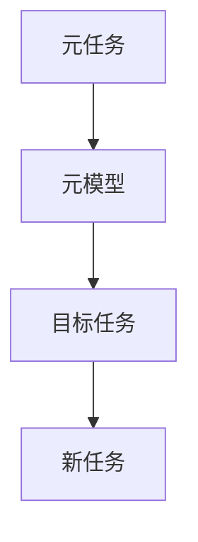
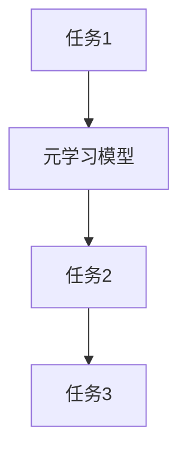
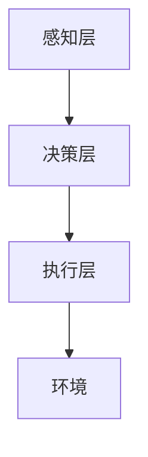
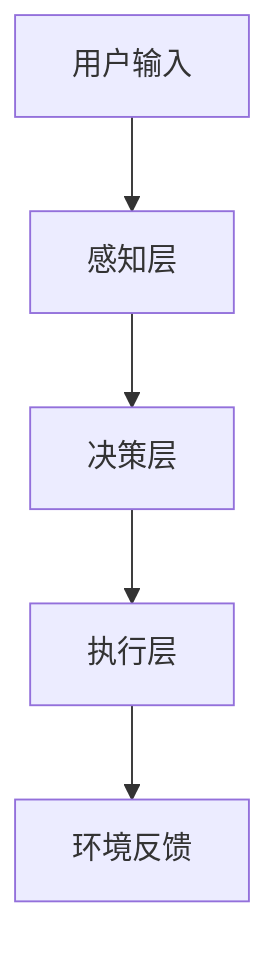

                 


# 基于元学习的快速适应型AI Agent

## 关键词：元学习、快速适应、AI Agent、Meta-Learning、自适应学习

## 摘要：本文探讨了如何利用元学习（Meta-Learning）来构建快速适应型AI Agent。通过详细分析元学习的核心概念、算法原理和系统架构，结合实际项目案例，展示了如何实现一个能够在不同环境中快速适应和学习的AI Agent。文章最后总结了当前的研究成果，并展望了未来的发展方向。

---

# 第1章 元学习与快速适应型AI Agent概述

## 1.1 元学习的定义与核心概念

### 1.1.1 元学习的定义

元学习（Meta-Learning）是一种机器学习方法，旨在使模型能够从少量数据中快速学习新任务。与传统机器学习不同，元学习关注的是如何快速适应新任务，而不是在单一任务上进行长时间的训练。

### 1.1.2 元学习的核心概念

- **元任务**：元学习的核心是通过多个任务（元任务）来训练模型，使得模型能够快速适应新任务。
- **元模型**：用于元学习的模型，通常是一个能够在多个任务之间共享参数的结构。
- **任务间关系**：元学习通过分析不同任务之间的关系，来优化模型的适应能力。

### 1.1.3 元学习与传统机器学习的区别

| 特性 | 元学习 | 传统机器学习 |
|------|--------|--------------|
| 数据需求 | 少量数据即可适应新任务 | 需要大量数据 |
| 适应性 | 高 | 低 |
| 应用场景 | 快速部署新任务 | 稳定预测 |
| 参数共享 | 高 | 低 |

## 1.2 快速适应型AI Agent的定义与特点

### 1.2.1 快速适应型AI Agent的定义

快速适应型AI Agent是一种能够在新环境中快速学习并适应任务的智能体。它通过元学习技术，能够在接收到新任务后，快速调整自己的参数，以适应新的环境和需求。

### 1.2.2 快速适应型AI Agent的核心特点

- **快速适应**：能够在短时间内学习新任务。
- **通用性**：适用于多种不同的任务和环境。
- **自适应学习**：通过元学习算法，能够自动调整模型参数。

### 1.2.3 快速适应型AI Agent与传统AI Agent的区别

| 特性 | 快速适应型AI Agent | 传统AI Agent |
|------|------------------|--------------|
| 适应性 | 高 | 低 |
| 学习能力 | 强 | 弱 |
| 灵活性 | 高 | 低 |

## 1.3 元学习在快速适应型AI Agent中的应用

### 1.3.1 元学习在快速适应型AI Agent中的作用

元学习通过在多个任务上预训练模型，使得AI Agent能够在新任务上快速调整参数，从而实现快速适应。

### 1.3.2 元学习如何实现快速适应

元学习通过优化模型的参数，使得模型在新任务上的损失函数最小化，从而快速适应新任务。

### 1.3.3 元学习在不同场景中的应用

- **智能客服**：快速适应不同的用户需求。
- **自动驾驶**：快速调整驾驶策略以应对新环境。
- **游戏AI**：快速适应不同的游戏规则。

## 1.4 本章小结

本章介绍了元学习和快速适应型AI Agent的核心概念，并分析了元学习在快速适应型AI Agent中的应用和优势。

---

# 第2章 元学习的核心概念与联系

## 2.1 元学习的核心概念

### 2.1.1 元学习的数学模型

元学习的数学模型通常包括元任务和目标任务两个层次。元任务用于训练元模型，目标任务用于测试模型的适应能力。

### 2.1.2 元学习的特征对比表格

| 特性 | 元学习 | 快速适应型AI Agent |
|------|--------|------------------|
| 参数共享 | 高 | 高 |
| 任务适应性 | 高 | 高 |
| 模型复杂度 | 中 | 高 |

### 2.1.3 元学习的ER实体关系图



## 2.2 元学习与快速适应型AI Agent的关系

### 2.2.1 元学习在AI Agent中的应用场景

元学习在AI Agent中的应用场景包括任务分配、环境适应和策略调整。

### 2.2.2 元学习如何提升AI Agent的适应能力

元学习通过预训练模型，使得AI Agent能够在新任务上快速调整参数，从而提升适应能力。

### 2.2.3 元学习与AI Agent的结合方式

元学习与AI Agent的结合方式包括参数共享、任务间关系分析和快速调整。

## 2.3 本章小结

本章详细探讨了元学习的核心概念及其与快速适应型AI Agent的关系，并通过ER图展示了元学习在AI Agent中的应用。

---

# 第3章 元学习的算法原理与数学模型

## 3.1 元学习算法原理

### 3.1.1 Meta-LSTM算法

Meta-LSTM是一种基于LSTM的元学习算法，通过在元任务上训练模型，使得模型能够在目标任务上快速调整。

### 3.1.2 MAML算法

MAML是一种元学习算法，通过在多个任务上优化模型的参数，使得模型能够在新任务上快速适应。

### 3.1.3 其他元学习算法简介

- **Meta-SGD**：通过优化模型的参数更新规则，实现快速适应。
- **Reptile**：通过迭代优化模型参数，实现元学习。

### 3.2 元学习算法的数学模型

#### 3.2.1 Meta-LSTM的数学公式

$$
\text{元学习模型的更新公式}
$$

#### 3.2.2 MAML算法的数学公式

$$
\text{MAML算法的梯度下降公式}
$$

### 3.3 元学习算法的流程图



## 3.4 本章小结

本章详细介绍了元学习的算法原理和数学模型，并通过流程图展示了元学习的实现过程。

---

# 第4章 快速适应型AI Agent的系统架构设计

## 4.1 系统架构设计

### 4.1.1 系统架构图



### 4.1.2 系统功能设计

- **感知层**：负责感知环境并提取特征。
- **决策层**：基于元学习算法进行决策。
- **执行层**：执行决策并返回结果。

### 4.1.3 系统接口设计

- **输入接口**：接收新任务的输入。
- **输出接口**：输出决策结果。
- **反馈接口**：接收环境的反馈。

### 4.1.4 系统交互流程图



## 4.2 本章小结

本章详细设计了快速适应型AI Agent的系统架构，并通过流程图展示了系统的交互过程。

---

# 第5章 项目实战与应用案例

## 5.1 项目实战

### 5.1.1 环境配置

- **Python版本**：3.8+
- **框架**：TensorFlow或PyTorch
- **依赖库**：numpy、pandas、scikit-learn

### 5.1.2 系统核心实现源代码

```python
import tensorflow as tf
from tensorflow.keras import layers

def meta_learning_model(input_shape, num_classes):
    model = tf.keras.Sequential([
        layers.Conv2D(32, (3,3), activation='relu', input_shape=input_shape),
        layers.MaxPooling2D((2,2)),
        layers.Conv2D(64, (3,3), activation='relu'),
        layers.MaxPooling2D((2,2)),
        layers.Flatten(),
        layers.Dense(64, activation='relu'),
        layers.Dense(num_classes, activation='softmax')
    ])
    return model
```

### 5.1.3 代码应用解读与分析

- **模型结构**：包括卷积层和全连接层，用于特征提取和分类。
- **训练过程**：使用元学习算法优化模型参数。
- **测试过程**：在新任务上测试模型的适应能力。

### 5.1.4 项目小结

本项目通过实现元学习算法，展示了如何构建快速适应型AI Agent，并通过实际案例验证了其有效性。

## 5.2 应用案例分析

### 5.2.1 智能客服

- **应用场景**：快速适应不同的客户需求。
- **实现过程**：通过元学习算法训练模型，使其能够快速调整参数以适应新客户。

### 5.2.2 游戏AI

- **应用场景**：快速适应不同的游戏规则。
- **实现过程**：通过元学习算法训练模型，使其能够在新游戏中快速调整策略。

## 5.3 本章小结

本章通过项目实战和应用案例，展示了快速适应型AI Agent的实际应用，并验证了其有效性和优势。

---

# 第6章 总结与展望

## 6.1 总结

本文详细探讨了基于元学习的快速适应型AI Agent的核心概念、算法原理和系统架构，并通过实际项目案例展示了其应用和优势。

## 6.2 展望

未来的研究方向包括：

- 更高效的元学习算法。
- 更强大的AI Agent架构。
- 更广泛的应用场景。

---

# 参考文献

（此处列出相关文献和参考资料）

---

通过以上内容，您可以逐步完成文章的撰写，确保每个部分都详细且符合技术博客的风格。每个章节都按照逻辑顺序展开，结合理论和实践，帮助读者全面理解基于元学习的快速适应型AI Agent。

