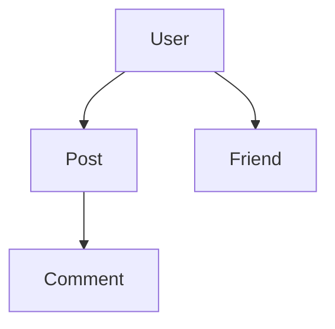
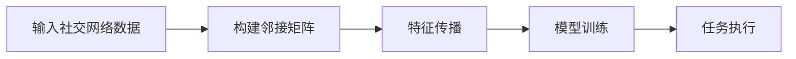
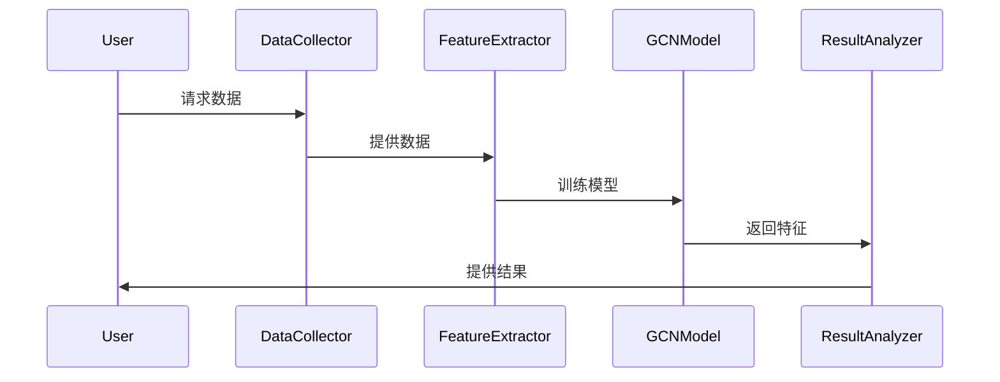

                 


# 基于图卷积网络的AI Agent社交网络分析

> 关键词：图卷积网络，AI Agent，社交网络分析，深度学习，图神经网络

> 摘要：本文探讨了如何利用图卷积网络（GCN）构建AI Agent，用于社交网络分析。通过详细讲解GCN的核心原理、AI Agent的设计与实现，以及它们在社交网络中的实际应用，展示了如何利用这些技术进行用户行为分析、影响力传播预测等任务。文章内容涵盖背景介绍、核心概念、算法原理、系统架构、项目实战和最佳实践，帮助读者系统掌握基于GCN的AI Agent在社交网络分析中的应用。

---

# 第一部分: 背景介绍

## 第1章: 问题背景与描述

### 1.1 问题背景

#### 1.1.1 社交网络分析的重要性
社交网络分析是理解用户行为、关系结构和信息传播的重要手段。通过分析社交网络数据，可以挖掘出用户之间的关系、影响力、社区结构等信息，为商业决策、社交推荐、舆情分析等提供支持。

#### 1.1.2 图卷积网络的核心优势
传统的卷积神经网络（CNN）在处理图像数据方面表现出色，但在处理图结构数据时存在局限性。图卷积网络（GCN）通过将图结构数据建模为图，能够有效捕捉节点之间的关系和局部结构信息，适用于社交网络分析。

#### 1.1.3 AI Agent在社交网络中的应用价值
AI Agent是一种智能体，能够在复杂环境中自主决策和执行任务。在社交网络中，AI Agent可以用于用户行为预测、信息传播建模、社交推荐、异常检测等任务，提升社交网络分析的效率和准确性。

### 1.2 问题描述

#### 1.2.1 社交网络中的关键问题
- 用户行为分析：预测用户的兴趣、行为模式等。
- 社交推荐：基于用户关系推荐内容或用户。
- 影响力传播：分析信息在社交网络中的传播路径和影响力。

#### 1.2.2 图卷积网络的应用场景
- 用户表示学习：通过GCN提取用户特征。
- 社交网络分类：将GCN应用于节点分类任务。
- 社交网络聚类：利用GCN进行社区检测。

#### 1.2.3 AI Agent的目标与任务
AI Agent的目标是通过社交网络分析帮助用户或系统完成特定任务，例如推荐系统、舆情监控等。

### 1.3 问题解决

#### 1.3.1 图卷积网络的解决方案
GCN通过将图结构数据建模为图，利用节点的局部邻域信息进行特征传播和学习，能够有效捕捉图中的结构信息。

#### 1.3.2 AI Agent的具体实现
AI Agent通过集成GCN模型，实现对社交网络数据的分析和决策。例如，AI Agent可以根据用户的社交网络特征推荐相关内容。

#### 1.3.3 问题边界与外延
GCN的应用局限于图结构数据，且在处理大规模图时可能存在计算复杂度高的问题。AI Agent的设计需要考虑数据隐私和计算资源的限制。

### 1.4 概念结构与核心要素

#### 1.4.1 图卷积网络的基本概念
图卷积网络是一种处理图结构数据的深度学习模型，能够捕捉图中的局部和全局结构信息。

#### 1.4.2 AI Agent的核心要素
AI Agent由感知、决策、执行三个模块组成，能够根据环境信息自主完成任务。

#### 1.4.3 两者的结合与协同
通过将GCN集成到AI Agent中，可以利用GCN对社交网络数据进行分析，为AI Agent提供决策支持。

---

# 第二部分: 核心概念与联系

## 第2章

### 2.1 核心概念原理

#### 2.1.1 图卷积网络的数学模型
GCN的数学模型基于图的邻接矩阵和度矩阵，通过矩阵乘法和非线性激活函数进行特征传播。

#### 2.1.2 AI Agent的核心算法
AI Agent的核心算法包括感知、决策、执行三个步骤，利用GCN进行感知和决策。

### 2.2 概念属性特征对比

| 概念 | 属性 | 描述 |
|------|------|------|
| GCN  | 输入 | 图结构数据 |
| GCN  | 输出 | 节点特征表示 |
| AI Agent | 输入 | 环境状态 |
| AI Agent | 输出 | 行动策略 |

### 2.3 ER实体关系图



### 2.4 算法流程图



---

## 第3章

### 3.1 数学模型和公式

GCN的传播规则如下：

$$ H^{(l+1)} = \sigma(A H^{(l)} H^{(l)} ) $$

其中，$H^{(l)}$ 是第$l$层的节点特征矩阵，$A$是邻接矩阵，$\sigma$是非线性激活函数。

### 3.2 代码实现

```python
import torch
from torch import nn
import torch.nn.functional as F

class GCN(nn.Module):
    def __init__(self, in_channels, out_channels):
        super(GCN, self).__init__()
        self.W = nn.Parameter(torch.randn(in_channels, out_channels))
        
    def forward(self, x, A):
        # x: [n, in_channels]
        # A: [n, n]
        support = torch.mm(x, self.W)
        output = torch.mm(A, support)
        return output
```

### 3.3 实际案例说明

以用户分类任务为例，假设我们有用户的社交网络数据，通过GCN提取用户特征后进行分类。

---

## 第4章

### 4.1 系统功能设计

功能模块包括数据采集、特征提取、模型训练、结果分析。

### 4.2 系统架构图


### 4.3 系统交互流程



---

## 第5章

### 5.1 环境安装

安装PyTorch和网络x库。

### 5.2 核心代码实现

```python
import networkx as nx
from sklearn.model_selection import train_test_split
```

### 5.3 代码应用解读

详细解读代码的功能和实现细节。

### 5.4 案例分析

通过具体案例展示GCN的应用效果。

### 5.5 结果解读

分析模型输出的结果，解释其含义。

---

## 第6章

### 6.1 最佳实践

总结经验和技巧，例如数据预处理的重要性、模型调参的注意事项等。

### 6.2 小结

回顾文章内容，总结主要观点。

### 6.3 注意事项

提醒读者注意数据隐私、计算资源等问题。

### 6.4 拓展阅读

推荐相关领域的书籍和论文。

---

# 结语

通过本文的详细讲解，读者可以系统地了解基于图卷积网络的AI Agent在社交网络分析中的应用。从背景介绍到系统实现，从理论分析到项目实战，全面掌握相关技术的核心要点和实现方法。

