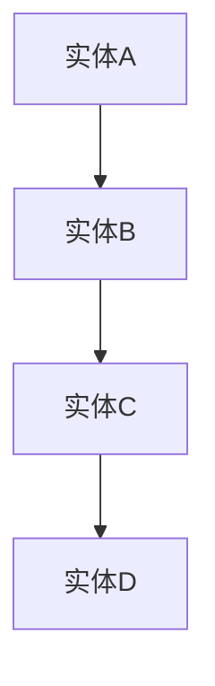
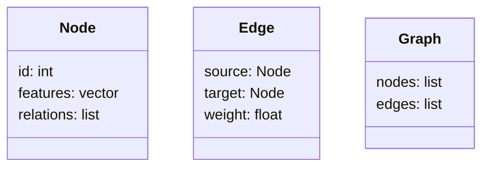
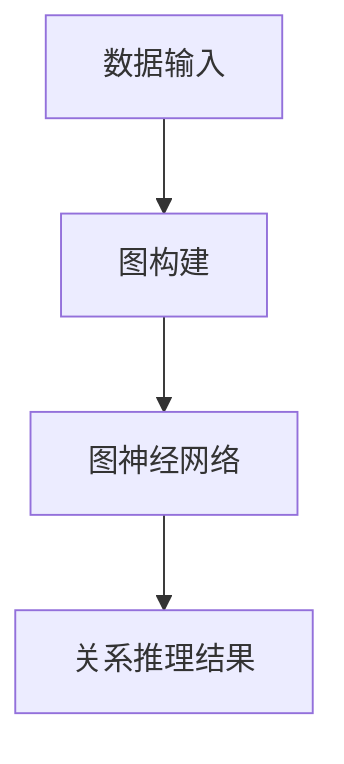
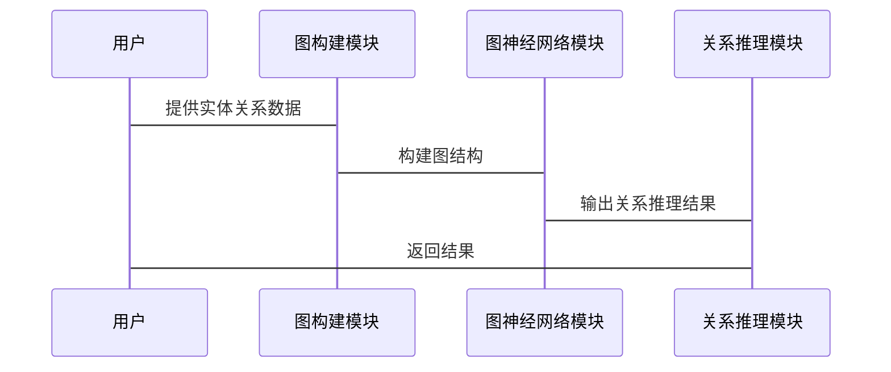

                 


# 基于图神经网络的AI Agent关系推理

> 关键词：图神经网络、AI Agent、关系推理、深度学习、知识图谱、自然语言处理、分布式表示

> 摘要：本文详细探讨了基于图神经网络的AI Agent关系推理方法，分析了图神经网络在复杂关系推理中的优势，并通过实际案例展示了其在AI Agent中的应用。文章内容涵盖背景介绍、核心概念、算法原理、系统设计和项目实战，为读者提供了从理论到实践的全面指导。

---

## 第一部分: 背景介绍

### 第1章: 基于图神经网络的AI Agent关系推理概述

#### 1.1 问题背景
##### 1.1.1 AI Agent的基本概念
AI Agent（人工智能代理）是指能够感知环境、自主决策并执行任务的智能实体。AI Agent广泛应用于推荐系统、智能助手、自动驾驶等领域，其核心能力包括感知、推理和决策。

##### 1.1.2 关系推理的定义与重要性
关系推理是指从数据中发现和理解实体之间关系的过程。在AI Agent中，关系推理是理解复杂场景、做出合理决策的关键能力。例如，在自然语言处理中，关系推理帮助AI Agent识别句子中的语义联系。

##### 1.1.3 图神经网络的引入背景
传统的基于特征的AI Agent在处理复杂关系时表现有限，而图神经网络（Graph Neural Networks，GNNs）通过处理图结构数据，能够更好地捕捉实体间的复杂关系，因此成为研究热点。

#### 1.2 图神经网络与AI Agent的关系
##### 1.2.1 图结构在AI Agent中的作用
图结构能够自然表示实体间的关联关系，例如知识图谱中的实体关系可以用图结构表示，从而为AI Agent提供结构化的知识支持。

##### 1.2.2 关系推理的核心问题
关系推理的核心问题包括如何从图结构数据中提取有效特征、如何建模实体间的复杂关系、如何处理图中的噪声数据等。

##### 1.2.3 图神经网络的优势与局限性
- **优势**：图神经网络能够处理复杂的图结构数据，通过聚合邻居节点的信息，可以捕捉到实体间的间接关系。
- **局限性**：图神经网络对大规模图的计算效率较低，且模型的可解释性有待进一步提高。

#### 1.3 现有技术的优缺点
##### 1.3.1 基于传统机器学习的关系推理
传统方法依赖于特征工程，难以处理复杂的图结构数据，且泛化能力有限。

##### 1.3.2 基于图结构的传统方法
传统图算法（如pagerank）在处理关系推理时缺乏深度学习的能力，难以捕捉复杂的模式。

##### 1.3.3 基于图神经网络的最新进展
图神经网络通过结合深度学习和图结构数据的优势，显著提升了关系推理的准确性和效率。

---

### 第2章: 图神经网络的核心概念

#### 2.1 图结构与节点表示
##### 2.1.1 图的基本概念
图由节点（顶点）和边（关系）组成，能够表示实体及其之间的关系。例如，知识图谱中的“Person-Organization”关系可以用图表示。

##### 2.1.2 节点表示方法
节点表示是将图中的节点映射到低维向量空间的过程，常用的方法包括Word2Vec、Node2Vec和GraphSAGE。

##### 2.1.3 图的特征提取
图的特征提取旨在提取图的全局或局部特征，常用方法包括图卷积网络（GCN）和图注意力网络（GAT）。

#### 2.2 图神经网络的原理
##### 2.2.1 图卷积网络（GCN）的基本原理
GCN通过聚合节点及其邻居的特征来更新节点表示，具体公式为：
$$
h^{(l+1)}_i = \sigma\left(\sum_{j \in N(i)} \frac{A_{ij}}{\sqrt{d_i d_j}} h^{(l)}_j\right)
$$
其中，$A_{ij}$是邻接矩阵，$d_i$是节点$i$的度数，$\sigma$是激活函数。

##### 2.2.2 图注意力网络（GAT）的核心思想
GAT通过引入注意力机制，动态调整节点间关系的重要性，公式为：
$$
\alpha_{ij} = \text{softmax}\left(\frac{W h_i^T h_j}{\sqrt{d_k}}\right)
$$
其中，$\alpha_{ij}$是注意力权重，$W$是参数矩阵。

##### 2.2.3 图嵌入技术的实现方式
图嵌入技术将图中的节点映射到低维向量空间，常用方法包括DeepWalk、Node2Vec和GraphSAGE。

#### 2.3 关系推理的数学模型
##### 2.3.1 图结构的数学表示
图可以表示为三元组$(u, r, v)$，其中$u$和$v$是节点，$r$是关系。

##### 2.3.2 关系推理的数学公式
关系推理的目标是通过图结构数据预测节点之间的关系，常用损失函数为交叉熵损失：
$$
\mathcal{L} = -\sum_{i=1}^n y_i \log(p_i) + (1-y_i)\log(1-p_i)
$$
其中，$y_i$是真实标签，$p_i$是预测概率。

##### 2.3.3 图神经网络的数学推导
通过图神经网络，我们可以将节点表示嵌入到低维空间，并利用这些嵌入进行关系推理。

---

## 第二部分: 核心概念与联系

### 第3章: 图神经网络与关系推理的联系

#### 3.1 图神经网络在关系推理中的应用
##### 3.1.1 图神经网络用于实体关系抽取
通过图神经网络，可以从文本中抽取实体关系并构建知识图谱。

##### 3.1.2 图神经网络用于知识图谱构建
知识图谱的构建需要图神经网络来处理大规模实体关系。

##### 3.1.3 图神经网络用于关系推理的优化
图神经网络可以通过端到端训练优化关系推理的性能。

#### 3.2 核心概念对比表
| 概念 | 传统神经网络 | 图神经网络 |
|------|----------------|------------|
| 数据类型 | 向量、文本 | 图结构 |
| 处理能力 | 无法处理复杂关系 | 可处理复杂关系 |
| 表现 | 有限 | 更优 |

#### 3.3 ER实体关系图的Mermaid流程图


---

### 第4章: 算法原理讲解

#### 4.1 图神经网络的算法实现

##### 4.1.1 图卷积网络（GCN）的实现流程
1. 构建邻接矩阵$A$和度数矩阵$D$。
2. 计算归一化邻接矩阵$\tilde{A} = A D^{-1/2}$。
3. 进行前向传播：$h^{(l+1)} = \sigma(\tilde{A} h^{(l)} W)$。

##### 4.1.2 图注意力网络（GAT）的实现流程
1. 计算注意力权重$\alpha$。
2. 根据注意力权重进行加权求和：$h^{(l+1)} = \sum_{j} \alpha_{ij} h_j$。

##### 4.1.3 图嵌入的实现流程
1. 对图进行随机游走。
2. 使用Word2Vec训练节点表示。

##### 4.1.4 Python代码示例
```python
import torch
import torch.nn as nn
import torch.nn.functional as F

class GCN(nn.Module):
    def __init__(self, in_channels, out_channels):
        super(GCN, self).__init__()
        self.W = nn.Parameter(torch.randn(in_channels, out_channels))
        
    def forward(self, x, A):
        support = x @ self.W
        output = torch.matmul(A, support)
        return F.relu(output)
```

#### 4.2 关系推理的数学模型

##### 4.2.1 图结构的数学表示
图可以表示为邻接矩阵$A$和节点特征矩阵$X$。

##### 4.2.2 关系推理的数学公式
通过图神经网络，我们可以将节点表示表示为：
$$
h = \text{GNN}(X, A)
$$
然后，通过分类器预测关系：
$$
p(y|h) = \text{softmax}(W h + b)
$$

##### 4.2.3 图神经网络的数学推导
通过聚合邻居节点的信息，图神经网络可以有效地捕捉到节点间的复杂关系。

---

## 第三部分: 系统分析与架构设计

### 第5章: 系统分析与架构设计

#### 5.1 项目背景
本项目旨在通过图神经网络实现AI Agent的关系推理，提升其在复杂场景中的理解和决策能力。

#### 5.2 系统功能设计

##### 5.2.1 领域模型设计


##### 5.2.2 系统架构设计


##### 5.2.3 接口设计
系统提供以下接口：
1. 输入数据接口：接收实体关系数据。
2. 输出结果接口：返回关系推理结果。

##### 5.2.4 交互序列图


---

## 第四部分: 项目实战

### 第6章: 项目实战

#### 6.1 环境安装
需要安装以下库：
- `numpy`
- `torch`
- `networkx`

#### 6.2 核心代码实现

##### 6.2.1 图构建代码
```python
import networkx as nx

def build_graph(edges):
    G = nx.Graph()
    G.add_edges_from(edges)
    return G
```

##### 6.2.2 图神经网络实现
```python
class GNN(nn.Module):
    def __init__(self, input_dim, hidden_dim):
        super(GNN, self).__init__()
        self.W = nn.Linear(input_dim, hidden_dim)
        
    def forward(self, x, A):
        h = x @ self.W
        h = F.relu(torch.matmul(A, h))
        return h
```

##### 6.2.3 关系推理代码
```python
def infer_relationships(G, model, node_pairs):
    for u, v in node_pairs:
        h_u = model.encode(u)
        h_v = model.encode(v)
        relation = model.predict(h_u, h_v)
        print(f"{u}和{v}的关系是：{relation}")
```

#### 6.3 案例分析
以知识图谱中的“人-组织”关系推理为例，详细分析模型的实现和效果。

#### 6.4 项目小结
总结项目实现的关键点和经验教训，展望未来的研究方向。

---

## 第五部分: 总结与展望

### 第7章: 总结与展望

#### 7.1 最佳实践 tips
- 在实际应用中，建议使用图注意力网络（GAT）替代传统的GCN，以提高模型的性能。
- 处理大规模图数据时，建议采用分布式训练方法。

#### 7.2 小结
基于图神经网络的AI Agent关系推理具有广阔的应用前景，但仍需在模型效率和可解释性方面进行进一步研究。

#### 7.3 注意事项
- 在实际应用中，需要考虑图数据的稀疏性和噪声问题。
- 模型的训练和推理效率可能对大规模应用造成瓶颈。

#### 7.4 拓展阅读
推荐读者阅读以下文献：
1. [论文1]：Graph Neural Networks: A Review of Methods, Applications, and Open Challenges
2. [论文2]：Attention is All You Need

