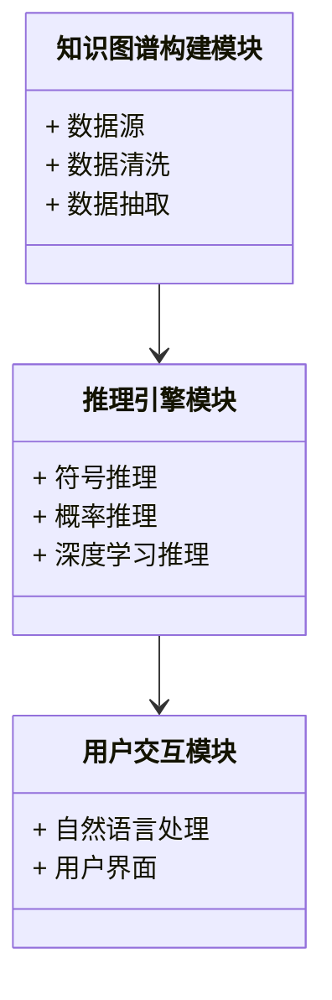
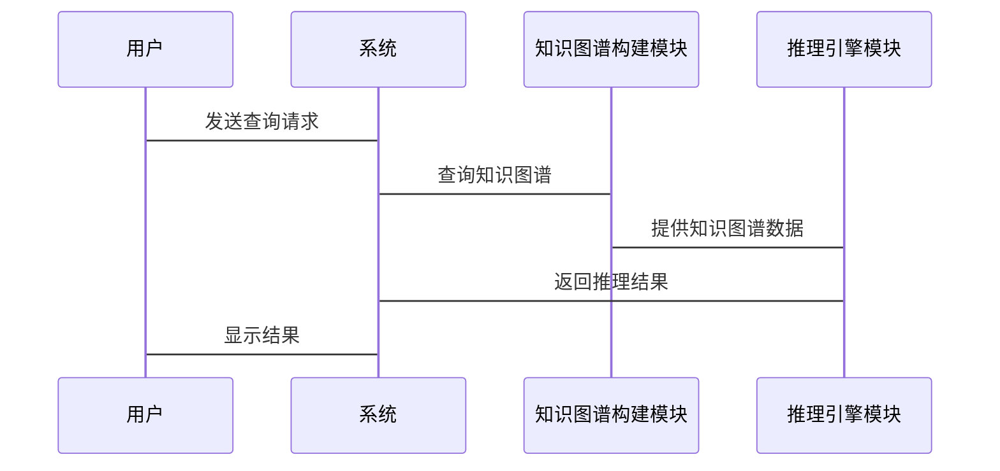

                 


# 基于图谱的AI Agent知识推理引擎

> 关键词：知识图谱，AI Agent，知识推理，符号推理，深度学习，系统架构

> 摘要：本文探讨了基于知识图谱的AI Agent知识推理引擎的设计与实现。通过分析知识图谱与AI Agent的结合，介绍了知识图谱的构建、表示和推理方法，并详细讲解了基于符号推理、概率推理和深度学习的算法原理。最后，通过项目实战展示了系统的实现过程，并展望了未来的发展方向。

---

## 第1章：知识图谱基础

### 1.1 知识图谱的定义与特点

#### 1.1.1 知识图谱的定义
知识图谱是一种以图结构形式表示知识的语义网络，由节点（实体）和边（关系）组成，广泛应用于搜索引擎、智能问答等领域。

#### 1.1.2 知识图谱的核心特点
- **结构化**：节点代表实体，边代表关系，属性丰富。
- **语义化**：通过属性和关系表达丰富的语义信息。
- **可扩展性**：支持动态扩展和更新。

#### 1.1.3 知识图谱的构建方法
构建知识图谱通常包括数据采集、预处理、抽取、融合、建模和存储等步骤。常用工具包括RDF和知识图谱嵌入技术（如Word2Vec）。

### 1.2 知识图谱的表示方法

#### 1.2.1 图论基础
图论中的图由节点和边组成，用于表示实体及其关系。

#### 1.2.2 知识图谱的节点与边表示
- **节点**：代表实体，如“人”、“组织”。
- **边**：代表关系，如“人→工作于→组织”。

#### 1.2.3 知识图谱的存储与建模
常用RDF三元组（主语-谓词-宾语）存储，如`<主语><谓词><宾语>`。

### 1.3 知识图谱的应用场景

#### 1.3.1 智能问答
通过知识图谱进行语义理解，提供准确的答案。

#### 1.3.2 推荐系统
基于实体间的关系进行个性化推荐。

#### 1.3.3 实体链接与消歧
通过知识图谱消除同名实体的歧义。

---

## 第2章：AI Agent基础

### 2.1 AI Agent的定义与类型

#### 2.1.1 AI Agent的定义
AI Agent是一种智能实体，能够感知环境、自主决策并执行任务。

#### 2.1.2 AI Agent的类型
- **简单反射型**：基于规则执行任务。
- **基于模型型**：使用内部模型进行推理和决策。
- **目标驱动型**：根据目标选择行动。

#### 2.1.3 AI Agent的核心任务
包括感知、推理、规划、学习和交互。

### 2.2 AI Agent的知识表示与推理

#### 2.2.1 知识表示的挑战
- **动态性**：知识需实时更新。
- **复杂性**：涉及多领域知识。
- **不确定性**：部分知识可能不准确。

#### 2.2.2 基于图谱的知识推理
利用知识图谱中的节点和边进行推理，如路径搜索和关系分析。

#### 2.2.3 AI Agent的知识更新机制
通过反馈和学习持续更新知识库，确保知识的准确性和时效性。

### 2.3 AI Agent与人类的协作

#### 2.3.1 人机协作的定义
人机协作是指人类与AI Agent共同完成任务的过程。

#### 2.3.2 AI Agent在协作中的角色
作为辅助工具，帮助人类提高效率和准确性。

#### 2.3.3 协作中的信任与安全问题
确保AI Agent的行为符合伦理规范，保护用户隐私。

---

## 第3章：知识图谱与AI Agent的结合

### 3.1 知识图谱在AI Agent中的作用

#### 3.1.1 知识图谱作为知识库
AI Agent利用知识图谱存储和管理知识，支持推理和决策。

#### 3.1.2 知识图谱作为推理基础
通过知识图谱进行逻辑推理，帮助AI Agent理解上下文。

#### 3.1.3 知识图谱作为交互媒介
知识图谱为人类与AI Agent的交互提供语义支持。

### 3.2 AI Agent与知识图谱的协同工作

#### 3.2.1 知识图谱驱动的推理
AI Agent基于知识图谱进行推理，生成响应。

#### 3.2.2 AI Agent驱动的知识更新
通过与用户的交互，AI Agent动态更新知识图谱。

#### 3.2.3 知识图谱与AI Agent的双向优化
知识图谱的优化提升AI Agent的推理能力，AI Agent的使用促进知识图谱的完善。

### 3.3 知识图谱与AI Agent的应用场景

#### 3.3.1 智能助手
如智能音箱，通过知识图谱提供服务建议。

#### 3.3.2 智能客服
基于知识图谱提供智能问答和问题解决。

#### 3.3.3 智能教育
AI Agent利用知识图谱为学生提供个性化的学习建议。

---

## 第4章：基于图谱的AI Agent知识推理引擎的核心概念

### 4.1 知识图谱的构建与优化

#### 4.1.1 知识图谱的构建流程
- 数据采集：从多种来源收集数据。
- 数据清洗：去除噪声数据。
- 数据抽取：提取结构化信息。
- 数据融合：整合多个来源的数据。
- 数据建模：构建知识图谱的结构。
- 数据存储：存储到知识库中。

#### 4.1.2 知识图谱的优化方法
- 去除冗余信息。
- 简化复杂关系。
- 补全缺失信息。

#### 4.1.3 知识图谱的质量评估
- 完整性：覆盖范围。
- 正确性：数据准确性。
- 一致性：数据内部协调性。

### 4.2 AI Agent的知识推理机制

#### 4.2.1 基于符号的推理
- 使用逻辑规则进行推理，如一阶逻辑。
- 适用于确定性问题。

#### 4.2.2 基于概率的推理
- 使用概率论进行推理，如贝叶斯网络。
- 适用于不确定性问题。

#### 4.2.3 基于深度学习的推理
- 使用神经网络进行推理，如图神经网络。
- 适用于复杂和非结构化数据。

### 4.3 知识图谱与AI Agent的交互优化

#### 4.3.1 交互设计
- 设计直观的用户界面。
- 支持自然语言输入。
- 提供反馈机制。

#### 4.3.2 优化策略
- 提供上下文感知的服务。
- 支持多轮对话。
- 结合实时数据进行动态推理。

---

## 第5章：算法原理与数学模型

### 5.1 符号推理算法

#### 5.1.1 算法流程
1. 输入查询。
2. 在知识图谱中进行路径搜索。
3. 返回符合条件的结果。

#### 5.1.2 数学公式
符号推理基于逻辑规则，如：
$$
\text{如果 } A \rightarrow B \text{ 且 } B \rightarrow C \text{，则 } A \rightarrow C
$$

### 5.2 概率推理算法

#### 5.2.1 算法流程
1. 构建贝叶斯网络。
2. 计算概率分布。
3. 根据概率值进行推理。

#### 5.2.2 数学公式
贝叶斯定理：
$$
P(A|B) = \frac{P(B|A)P(A)}{P(B)}
$$

### 5.3 深度学习推理算法

#### 5.3.1 算法流程
1. 将知识图谱嵌入到向量空间。
2. 使用神经网络进行推理。
3. 输出结果。

#### 5.3.2 数学公式
神经网络的损失函数：
$$
\text{损失} = \sum (y_i - \hat{y_i})^2
$$

---

## 第6章：系统架构与设计

### 6.1 系统功能设计

#### 6.1.1 领域模型
使用mermaid类图表示系统模块及其交互。



### 6.2 系统架构设计

#### 6.2.1 总体架构
使用mermaid架构图表示系统的整体架构。


### 6.3 系统接口设计

#### 6.3.1 接口定义
- API接口：提供RESTful服务，如`/query`, `/update`。

#### 6.3.2 交互流程
使用mermaid序列图表示用户与系统的交互流程。



---

## 第7章：项目实战

### 7.1 环境安装

#### 7.1.1 安装Python
使用Anaconda安装Python 3.8及以上版本。

#### 7.1.2 安装依赖库
安装必要的库，如`networkx`, `numpy`, `scikit-learn`。

### 7.2 核心代码实现

#### 7.2.1 知识图谱构建代码
```python
import networkx as nx

G = nx.DiGraph()
G.add_edge("人", "工作于", "公司")
G.add_edge("公司", "属于", "行业")
```

#### 7.2.2 推理引擎代码
```python
def symbolical_re

