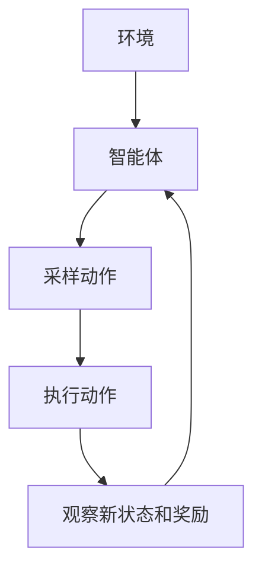
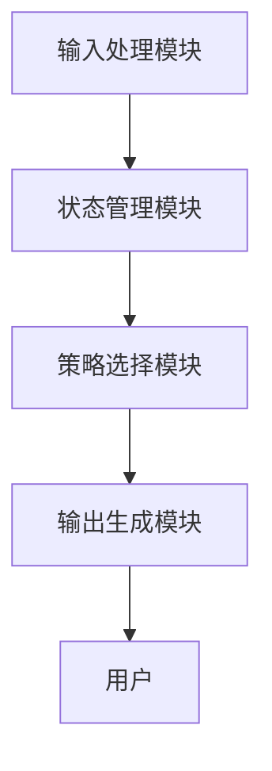

                 


---

# 基于强化学习的AI Agent对话策略

> **关键词**：强化学习，AI Agent，对话策略，自然语言处理，深度学习  
> **摘要**：本文深入探讨了基于强化学习的AI Agent对话策略，从基础理论到算法实现，再到系统设计和项目实战，全面分析了强化学习在对话系统中的应用及其优势。通过详细讲解马尔可夫决策过程、Q-Learning和DQN算法，结合实际对话场景，展示了如何构建高效的对话策略，并通过系统架构设计和项目实战，提供了可参考的实现方案。

---

## 第1章：强化学习与AI Agent概述

### 1.1 强化学习的基本概念

#### 1.1.1 强化学习的定义与特点
强化学习（Reinforcement Learning, RL）是一种机器学习方法，通过智能体与环境的交互，逐步优化决策策略。其特点包括：
- **试错性**：通过不断尝试和错误来优化策略。
- **延迟奖励**：奖励可能在多个步骤后才给出。
- **策略优化**：目标是找到最优策略以最大化累计奖励。

#### 1.1.2 AI Agent的基本概念
AI Agent（智能体）是指能够感知环境并采取行动以实现目标的实体。在对话系统中，AI Agent通过理解和生成对话内容，与用户进行交互。

#### 1.1.3 对话策略的定义与作用
对话策略是AI Agent在对话过程中选择回复的规则。其作用包括：
- **引导对话**：帮助用户完成特定任务。
- **提升用户体验**：使对话更加自然流畅。
- **适应动态变化**：根据对话进展调整回复内容。

### 1.2 强化学习在对话系统中的应用

#### 1.2.1 对话系统的基本架构
对话系统的架构通常包括：
- **输入处理**：接收用户输入并进行解析。
- **状态管理**：维护对话的上下文信息。
- **策略选择**：基于当前状态选择合适的回复。
- **输出生成**：生成最终的回复内容。

#### 1.2.2 强化学习在对话策略中的优势
- **动态适应性**：强化学习能够根据对话进展调整策略。
- **复杂场景处理**：适用于需要多轮交互和复杂决策的任务。
- **数据驱动**：通过大量数据优化策略，提升性能。

#### 1.2.3 基于强化学习的对话策略研究现状
当前研究主要集中在算法优化、对话状态管理以及多智能体协作等方面。然而，仍面临数据需求大、计算资源消耗高以及模型收敛性等问题。

---

## 第2章：强化学习的基本原理

### 2.1 马尔可夫决策过程

#### 2.1.1 状态、动作、奖励的定义
- **状态（State）**：环境中的当前情况，如对话历史和用户意图。
- **动作（Action）**：智能体在状态下的行为，如回复内容。
- **奖励（Reward）**：智能体采取动作后获得的反馈，用于评估动作的好坏。

#### 2.1.2 策略与价值函数
- **策略（Policy）**：决定智能体在状态下的动作选择的概率分布。
- **价值函数（Value Function）**：评估状态或状态-动作对的价值。

#### 2.1.3 探索与利用的平衡
探索（Exploration）：尝试新动作以发现更好的策略。  
利用（Exploitation）：利用当前已知的最佳策略以获取最大奖励。  
平衡两者有助于避免陷入局部最优，同时提高探索效率。

### 2.2 基于值的强化学习算法

#### 2.2.1 Q-Learning算法
Q-Learning通过维护一个Q表，记录状态-动作对的价值，并通过以下步骤更新：
1. 选择当前状态下的动作。
2. 执行动作，观察新状态和奖励。
3. 更新Q表中的对应值：  
   $$ Q(s, a) = Q(s, a) + \alpha (r + \gamma \max Q(s', a')) $$  
   其中，$\alpha$为学习率，$\gamma$为折扣因子。

#### 2.2.2 Deep Q-Network（DQN）算法
DQN通过深度神经网络近似Q函数，适用于高维状态空间。算法流程如下：


数学表达式为：  
$$ Q(s, a) = Q(s, a) + \alpha (r + \gamma Q(s', a') - Q(s, a)) $$  

#### 2.2.3 算法的收敛性分析
Q-Learning和DQN在理论上均可以收敛到最优策略，但实际应用中需注意学习率和折扣因子的设置。

### 2.3 基于策略的强化学习算法

#### 2.3.1 策略梯度方法
策略梯度方法直接优化策略参数。以REINFORCE算法为例，其更新规则为：  
$$ \theta = \theta + \alpha \nabla_\theta \log \pi_\theta(a|s) [r] $$  
其中，$\pi_\theta$为策略函数。

#### 2.3.2 REINFORCE算法
REINFORCE通过采样动作并计算梯度，更新策略参数。其流程如下：



#### 2.3.3 算法的优缺点对比
- **基于值的方法**：适合离散动作空间，但需维护Q表。
- **基于策略的方法**：适合连续动作空间，但计算复杂度较高。

---

## 第3章：对话策略中的强化学习

### 3.1 对话系统的状态表示

#### 3.1.1 状态建模的基本方法
- **基于词汇**：将对话内容分解为单词或短语。
- **基于语法树**：分析对话的语法结构。
- **基于情感分析**：评估对话的情感倾向。

#### 3.1.2 基于上下文的对话状态表示
对话状态通常包括用户意图、对话历史等信息。例如，可以使用词袋模型或序列模型（如LSTM）来表示对话历史。

#### 3.1.3 状态空间的压缩与简化
通过降维技术（如PCA）或哈希函数，减少状态空间的维度，提升计算效率。

### 3.2 对话策略的选择

#### 3.2.1 策略选择方法
- **贪心策略**：选择当前状态下最优的动作。
- **随机选择**：随机选取动作以增加探索性。
- **基于Q值的选择**：根据Q值的大小选择动作。

#### 3.2.2 动作空间设计
动作空间包括生成回复、确认信息、切换话题等具体动作。设计动作空间时，需考虑对话的多样性和复杂性。

#### 3.2.3 策略优化目标
最大化累计奖励，同时保持对话的连贯性和自然性。

### 3.3 基于强化学习的对话策略实现

#### 3.3.1 算法选择
根据具体场景选择合适的算法，如DQN适用于离散动作空间，而REINFORCE适用于连续动作空间。

#### 3.3.2 状态-动作-奖励建模
明确状态、动作、奖励的具体实现，确保算法的正确应用。

#### 3.3.3 系统实现步骤
1. 环境搭建：安装必要的库，如TensorFlow、Keras。
2. 数据准备：收集和预处理对话数据。
3. 模型训练：编写训练脚本，调整超参数。
4. 模型评估：设计测试用例，评估模型性能。

---

## 第4章：系统架构与实现

### 4.1 系统架构设计

#### 4.1.1 系统模块划分
- **输入处理模块**：接收用户输入并进行解析。
- **状态管理模块**：维护对话的上下文信息。
- **策略选择模块**：基于当前状态选择合适的回复。
- **输出生成模块**：生成最终的回复内容。

#### 4.1.2 模块间关系
通过Mermaid图展示各模块的交互流程：



### 4.2 算法实现细节

#### 4.2.1 Q-Learning算法的伪代码
```python
class QLearning:
    def __init__(self, state_space, action_space):
        self.Q = defaultdict(dict)
        for s in state_space:
            self.Q[s] = {a: 0 for a in action_space}
    
    def choose_action(self, state):
        return max(self.Q[state], key=lambda k: self.Q[state][k])
    
    def update(self, state, action, reward, next_state):
        self.Q[state][action] = self.Q[state][action] + alpha * (reward + gamma * max(self.Q[next_state].values()))
```

#### 4.2.2 深度神经网络的结构
使用卷积层和全连接层构建深度Q网络：

```python
import tensorflow as tf
from tensorflow import keras

model = keras.Sequential([
    keras.layers.Conv1D(64, 3, activation='relu', input_shape=(max_length, embedding_dim)),
    keras.layers.MaxPooling1D(2),
    keras.layers.LSTM(64),
    keras.layers.Dense(64, activation='relu'),
    keras.layers.Dense(num_actions, activation='linear')
])
```

#### 4.2.3 系统接口设计
定义清晰的接口规范，确保模块之间的数据传递和交互顺畅。

### 4.3 项目实战

#### 4.3.1 环境搭建
安装必要的库：
```bash
pip install tensorflow keras numpy
```

#### 4.3.2 数据准备
收集并预处理对话数据，建立训练样本。

#### 4.3.3 模型训练
编写训练脚本，调整超参数如学习率、折扣因子等。

#### 4.3.4 模型评估
设计测试用例，评估模型的回复准确性和流畅性。

---

## 第5章：高级主题与优化

### 5.1 多轮对话中的状态管理

#### 5.1.1 长期记忆机制
使用LSTM或Transformer等模型记忆对话历史。

#### 5.1.2 状态更新策略
动态调整状态权重，适应对话进展。

### 5.2 基于强化学习的对话策略优化

#### 5.2.1 算法改进
引入经验回放，防止策略早熟。

#### 5.2.2 模型压缩
减少模型参数，提升推理速度。

#### 5.2.3 跨模态学习
结合视觉、听觉信息，提升对话理解能力。

### 5.3 可解释性与鲁棒性

#### 5.3.1 可解释性策略
通过可解释模型（如规则基线）提供解释。

#### 5.3.2 鲁棒性增强
设计测试用例，验证模型在异常情况下的表现。

---

## 第6章：总结与展望

### 6.1 总结
本文系统地介绍了基于强化学习的AI Agent对话策略，从理论到实践，详细探讨了算法实现和系统设计。强化学习在对话系统中的应用展现出巨大潜力，但仍需解决数据需求和计算资源等问题。

### 6.2 未来展望
未来研究可关注多智能体协作、跨领域应用以及更高级的对话理解，如常识推理和情感计算。

---

通过以上章节的详细阐述，本文为读者提供了一个全面的视角，帮助理解基于强化学习的AI Agent对话策略，并为实际应用提供了可参考的实现方案。

