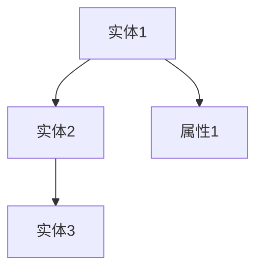

                 


# 基于知识图谱的AI Agent推理系统

> 关键词：知识图谱，AI Agent，推理系统，系统架构，项目实战

> 摘要：本文详细探讨了基于知识图谱的AI Agent推理系统的构建与应用。从知识图谱和AI Agent的基本概念出发，分析了两者的结合背景与核心优势，详细讲解了知识图谱的构建方法、AI Agent的推理机制，以及系统架构设计与实现。通过具体案例分析，展示了系统的实际应用场景与效果，最后提出了系统优化与未来研究方向。

---

# 第一部分: 基于知识图谱的AI Agent推理系统背景与基础

## 第1章: 知识图谱与AI Agent概述

### 1.1 知识图谱的定义与特点

知识图谱是一种以图结构形式表示知识的语义网络，由节点（实体）和边（关系）组成。其特点包括：

- **结构化**：实体与关系的明确表示，便于计算机理解和推理。
- **语义丰富**：通过上下文关系，提供深层次的语义信息。
- **动态扩展**：支持实时更新与扩展，适应新知识的加入。

### 1.2 AI Agent的定义与类型

AI Agent是一种智能体，能够感知环境并采取行动以实现目标。其类型包括：

- **反应式AI Agent**：基于当前感知做出反应。
- **认知式AI Agent**：具备推理、规划和学习能力。
- **协作式AI Agent**：能够与其他Agent协作完成任务。

### 1.3 知识图谱与AI Agent的结合背景

结合背景在于知识图谱为AI Agent提供了丰富的知识库，使其能够进行更智能的推理与决策。应用场景包括智能问答、推荐系统和自动驾驶等。

---

## 第2章: 知识图谱的构建与管理

### 2.1 知识图谱的构建流程

- **数据收集**：从多种来源（文本、数据库等）获取数据。
- **预处理**：清洗和标注数据。
- **实体识别与关系抽取**：利用NLP技术识别实体及其关系。
- **知识融合**：整合多个来源的数据，消除冲突。
- **存储与管理**：使用图数据库存储知识图谱。

### 2.2 知识图谱的表示方法

- **图结构表示**：使用节点和边表示实体及其关系。
- **表示学习**：通过深度学习模型（如Word2Vec）学习实体和关系的向量表示。
- **知识图谱的扩展与更新**：定期更新知识图谱以反映最新信息。

---

## 第3章: AI Agent的推理机制

### 3.1 基于知识图谱的推理算法

- **路径推理**：通过遍历图结构找到实体之间的关系路径。
- **规则推理**：基于预定义的规则进行推理。
- **概率推理**：基于概率论计算实体间关系的可信度。

### 3.2 知识图谱推理的挑战与优化

- **稀疏性问题**：解决知识图谱中某些关系缺失的问题。
- **上下文推理**：结合上下文信息提高推理准确性。
- **可解释性**：确保推理过程透明，便于解释。

---

# 第二部分: 知识图谱与AI Agent的核心概念与联系

## 第4章: 知识图谱与AI Agent的核心概念

### 4.1 知识图谱的核心概念

- **实体**：知识图谱中的基本单位，代表具体的概念或个体。
- **属性**：描述实体的特征或性质。
- **关系**：连接实体之间的纽带，具有方向性和权重。

### 4.2 AI Agent的核心概念

- **感知**：通过传感器或数据源获取环境信息。
- **推理**：基于知识图谱进行逻辑推理，得出结论。
- **决策**：根据推理结果做出最优决策。

### 4.3 知识图谱与AI Agent的联系

知识图谱为AI Agent提供了丰富的知识库，使其能够进行更智能的推理与决策。AI Agent则利用知识图谱的能力，提升自身的智能水平。

---

## 第5章: 知识图谱与AI Agent的核心要素

### 5.1 核心概念原理

- **知识表示**：通过图结构表示知识，便于计算机处理。
- **推理机制**：基于知识图谱进行逻辑推理，得出结论。

### 5.2 概念属性特征对比

| 概念 | 特征 |
|------|------|
| 实体 | 具体的个体或概念 |
| 属性 | 描述实体的特征 |
| 关系 | 连接实体的纽带 |

### 5.3 ER实体关系图架构



---

## 第6章: 知识图谱与AI Agent的系统架构

### 6.1 系统功能设计

- **知识图谱管理模块**：负责知识图谱的存储与管理。
- **推理引擎模块**：基于知识图谱进行推理。
- **AI Agent控制模块**：协调各模块完成任务。

### 6.2 系统架构设计


### 6.3 系统接口设计

- **输入接口**：接收用户请求或环境数据。
- **输出接口**：返回推理结果或执行操作。

---

## 第7章: 项目实战

### 7.1 环境安装

- **Python版本**：3.8以上
- **依赖库安装**：`pip install numpy, pandas, networkx`

### 7.2 系统核心实现

```python
# 知识图谱构建
class KnowledgeGraph:
    def __init__(self):
        self.graph = {}

    def add_entity(self, entity):
        if entity not in self.graph:
            self.graph[entity] = {}

    def add_relation(self, entity1, relation, entity2):
        self.graph[entity1][relation] = entity2

# AI Agent实现
class AI-Agent:
    def __init__(self, knowledge_graph):
        self.knowledge_graph = knowledge_graph

    def infer(self, query):
        # 实现推理逻辑
        pass
```

### 7.3 代码应用解读与分析

- **知识图谱构建**：通过类`KnowledgeGraph`管理实体与关系。
- **AI Agent实现**：通过类`AI-Agent`实现推理逻辑。

### 7.4 案例分析

- **案例1**：智能问答系统，基于知识图谱提供准确答案。
- **案例2**：推荐系统，根据用户行为和知识图谱推荐相关内容。

### 7.5 项目小结

通过实际案例展示了知识图谱与AI Agent的结合应用，验证了系统的可行性和有效性。

---

# 第三部分: 总结与扩展阅读

## 第8章: 总结

- **系统创新点**：结合知识图谱与AI Agent，提升推理能力。
- **注意事项**：数据质量、推理算法的优化和系统的可解释性。

## 第9章: 扩展阅读

- **推荐书籍**：《知识图谱：概念、方法与应用》
- **推荐论文**：《基于知识图谱的智能问答系统研究》

---

通过以上结构，我们可以系统地构建和分析基于知识图谱的AI Agent推理系统，涵盖从理论到实践的各个方面。

