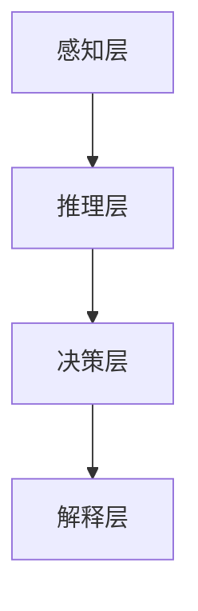

                 


```markdown
# 基于神经符号AI的可解释Agent设计

> 关键词：神经符号AI，可解释性，人工智能，智能代理，符号推理

> 摘要：本文详细探讨了基于神经符号AI的可解释Agent设计，从理论基础到实际应用，结合具体案例和代码实现，全面解析神经符号AI在实现可解释性智能代理中的核心作用及其设计方法。

---

## 第一部分: 神经符号AI与可解释性Agent的背景介绍

### 第1章: 神经符号AI的定义与特点

#### 1.1 神经符号AI的定义
神经符号AI是一种结合了神经网络和符号推理的混合型人工智能技术，它将神经网络的感知能力和符号推理的逻辑推理能力相结合，能够处理复杂、动态的环境中的决策问题。

#### 1.2 神经符号AI的核心特点
- **可解释性**：神经符号AI结合了符号推理的可解释性，使决策过程透明可理解。
- **自适应性**：神经网络的学习能力使系统能够适应新数据和环境变化。
- **逻辑推理能力**：符号推理使系统具备逻辑推理能力，能够处理复杂问题。

#### 1.3 神经符号AI与传统符号AI的区别
| 特性         | 符号AI                       | 神经符号AI                |
|--------------|----------------------------|---------------------------|
| 数据需求     | 需要大量特征工程             | 通过神经网络自动提取特征  |
| 可解释性     | 高                          | 中高，结合符号推理         |
| 处理能力     | 适用于规则性问题             | 适用于复杂、动态的问题     |

### 第2章: 可解释性Agent的定义与重要性

#### 2.1 可解释性Agent的定义
可解释性Agent是一种智能代理，其决策过程和结果能够被人类理解和解释，从而提高系统的信任度和透明度。

#### 2.2 可解释性在AI系统中的重要性
- **信任建立**：可解释性帮助用户信任AI系统的决策。
- **责任追究**：在出现问题时，可解释性有助于追查原因。
- **合规性**：许多行业法规要求AI系统具备可解释性。

#### 2.3 神经符号AI在可解释性Agent中的作用
- 神经符号AI结合了神经网络的感知能力和符号推理的逻辑能力，使AI系统在保持高准确性的基础上具备可解释性。

---

## 第二部分: 神经符号AI的核心概念与联系

### 第3章: 神经符号AI的核心原理

#### 3.1 神经符号AI的数学模型
神经符号AI的数学模型通常由以下部分组成：
- 输入层：感知环境数据。
- 神经网络层：提取特征并进行初步处理。
- 符号推理层：基于符号逻辑进行推理和决策。

#### 3.2 神经符号AI的训练过程
1. **输入数据预处理**：将原始数据转换为神经网络可处理的形式。
2. **神经网络训练**：通过反向传播优化神经网络参数。
3. **符号推理训练**：将符号规则整合到训练过程中，优化符号推理模块。

#### 3.3 神经符号AI的推理过程
1. **感知输入**：神经网络对输入数据进行处理，提取特征。
2. **符号推理**：基于提取的特征，符号推理模块进行逻辑推理，得出结论。
3. **输出决策**：将推理结果输出为决策或行动。

### 第4章: 神经符号AI的系统架构设计

#### 4.1 系统分析
- **问题场景**：设计一个可解释的智能代理，用于动态环境中的决策任务。
- **系统功能需求**：具备感知、推理、决策功能，同时提供可解释的输出。
- **性能指标**：准确率、响应时间、可解释性程度。

#### 4.2 系统架构设计
- **感知层**：负责数据的采集和预处理。
- **推理层**：包含神经网络和符号推理模块。
- **决策层**：根据推理结果做出决策。
- **解释层**：将决策过程转化为可理解的形式，供用户查看。

#### 4.3 系统架构图


---

## 第三部分: 神经符号AI的算法原理讲解

### 第5章: 神经符号AI的算法实现

#### 5.1 神经符号AI的基本算法
- **输入处理**：将输入数据转换为神经网络的输入形式。
- **神经网络推理**：通过神经网络提取特征并进行初步推理。
- **符号推理**：基于符号逻辑对结果进行优化和调整。

#### 5.2 神经符号AI的数学模型
$$ y = f(x) $$
其中，$x$ 是输入数据，$f$ 是神经网络的非线性变换函数。

#### 5.3 神经符号AI的优化算法
- **反向传播**：用于优化神经网络的权重。
- **符号规则整合**：通过符号规则对推理结果进行调整和优化。

### 第6章: 项目实战

#### 6.1 环境安装
- **Python环境**：安装Python 3.8及以上版本。
- **依赖库**：安装TensorFlow、Keras、符号逻辑库（如PyKNITRO）。

#### 6.2 核心代码实现
```python
import tensorflow as tf
from tensorflow.keras import layers
from sympy import symbols, solve

# 定义神经网络模型
def neural_network_model(input_shape):
    model = tf.keras.Sequential()
    model.add(layers.Dense(64, activation='relu', input_shape=input_shape))
    model.add(layers.Dense(32, activation='relu'))
    model.add(layers.Dense(1, activation='sigmoid'))
    return model

# 定义符号推理函数
def symbolic_reasoning(rules, inputs):
    x, y = symbols('x y')
    equations = [eq for eq in rules if eq.subs(inputs) != 0]
    solution = solve(equations)
    return solution

# 组合模型
class NeuralSymbolicAgent:
    def __init__(self, input_shape):
        self.nn = neural_network_model(input_shape)
        self.rules = [...]  # 符号规则

    def call(self, inputs):
        # 神经网络推理
        nn_output = self.nn(inputs)
        # 符号推理
        symbolic_output = symbolic_reasoning(self.rules, nn_output)
        return symbolic_output
```

#### 6.3 代码解读与分析
- **神经网络模型**：定义了一个简单的前馈神经网络，用于特征提取。
- **符号推理函数**：使用符号逻辑库进行推理，解决给定的方程组。
- **组合模型**：将神经网络和符号推理结合，形成完整的Agent。

#### 6.4 实际案例分析
- **案例背景**：设计一个智能代理，用于交通灯下的路径规划。
- **案例实现**：通过神经符号AI实现路径规划，同时提供可解释的决策过程。
- **结果分析**：展示神经符号AI在路径规划中的优势和可解释性。

---

## 第四部分: 总结与展望

### 第7章: 总结与最佳实践

#### 7.1 总结
- 神经符号AI结合了神经网络的感知能力和符号推理的逻辑能力，能够实现高准确性和可解释性的智能代理。
- 通过神经符号AI，我们可以设计出更透明、更可信的AI系统，适用于复杂、动态的环境。

#### 7.2 最佳实践
- **数据预处理**：确保输入数据的高质量，提高神经网络的性能。
- **符号规则设计**：合理设计符号规则，确保推理的准确性和可解释性。
- **模型优化**：通过不断优化神经网络和符号推理模块，提升系统的整体性能。

#### 7.3 未来展望
- **多模态神经符号AI**：结合多种数据源，提升系统的感知和推理能力。
- **自适应符号推理**：研究符号规则的自适应更新方法，提高系统的灵活性。
- **可解释性优化**：进一步提升系统的可解释性，使其更加透明和易于理解。

---

通过本文的详细讲解，读者可以全面了解基于神经符号AI的可解释Agent设计的核心思想和实现方法。从理论到实践，从算法到系统设计，为读者提供了一个完整的解决方案，帮助他们在实际应用中设计出更高效、更可解释的智能系统。
```

