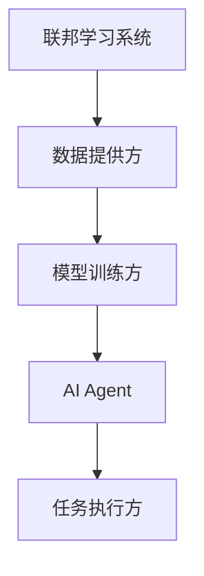
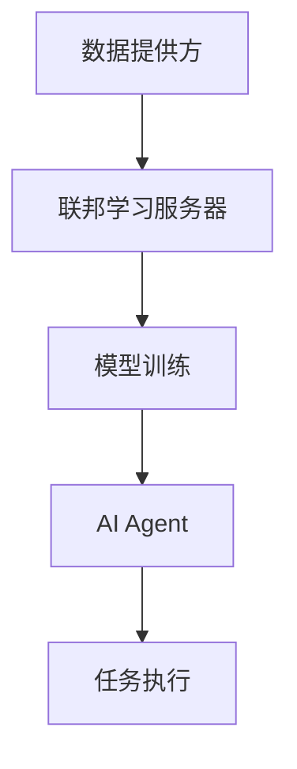
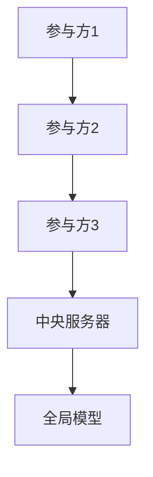

                 


# 基于联邦学习的隐私保护AI Agent

> 关键词：联邦学习，隐私保护，AI Agent，分布式机器学习，数据安全

> 摘要：随着人工智能技术的快速发展，数据隐私保护成为了社会关注的焦点。联邦学习（Federated Learning）作为一种新兴的分布式机器学习技术，能够在不共享原始数据的前提下，协作训练模型，从而保护数据隐私。AI Agent作为人工智能的核心组成部分，具有自主决策和交互的能力。本文将探讨如何基于联邦学习构建隐私保护的AI Agent，分析其核心原理、系统架构及实际应用场景。

---

# 第一部分: 背景与核心概念

## 第1章: 联邦学习与AI Agent的背景介绍

### 1.1 联邦学习的背景与问题背景
#### 1.1.1 数据隐私保护的现状与挑战
随着人工智能技术的快速发展，数据成为驱动模型训练的核心资源。然而，数据的集中存储和共享引发了严重的隐私泄露问题。例如，医疗数据的泄露可能导致患者隐私被侵犯，金融数据的泄露可能引发经济损失。如何在保护数据隐私的前提下进行模型训练，成为亟待解决的问题。

#### 1.1.2 联邦学习的定义与问题描述
联邦学习是一种分布式机器学习技术，允许多个参与方在不共享原始数据的情况下，协作训练一个全局模型。其核心思想是将模型的训练任务分布在不同的设备或服务器上，仅在需要时进行参数同步，从而避免数据的集中存储和传输。

#### 1.1.3 联邦学习的核心目标与边界
联邦学习的核心目标是在保护数据隐私的前提下，实现模型的高效训练和更新。其主要边界包括：
1. 数据不出域：数据仅在本地进行处理，不共享给其他方。
2. 模型共享：仅共享模型参数，不共享原始数据。
3. 安全性：确保联邦学习过程中的通信安全和模型安全。

### 1.2 AI Agent的基本概念与问题背景
#### 1.2.1 AI Agent的定义与分类
AI Agent（人工智能代理）是指能够感知环境、自主决策并执行任务的智能体。根据智能体的智能水平和决策能力，可以将AI Agent分为：
1. 反应式AI Agent：根据当前感知做出反应。
2. 计划式AI Agent：具有目标规划和执行能力。
3. 学习式AI Agent：能够通过经验改进性能。

#### 1.2.2 AI Agent的核心功能与应用场景
AI Agent的核心功能包括：
1. 感知环境：通过传感器或数据接口获取环境信息。
2. 知识表示：将环境信息转化为内部知识表示。
3. 决策推理：基于知识表示进行推理和决策。
4. 行动执行：根据决策结果执行具体操作。

AI Agent的应用场景包括自动驾驶、智能助手、智能客服等。

#### 1.2.3 AI Agent与联邦学习的结合
AI Agent需要在保护数据隐私的前提下，实现自主决策和任务执行。联邦学习为AI Agent提供了一种隐私保护的模型训练机制，使其能够在不共享原始数据的情况下，提升自身的智能水平。

### 1.3 联邦学习与AI Agent的结合
#### 1.3.1 联邦学习如何支持AI Agent的隐私保护
联邦学习通过分布式模型训练，避免了原始数据的集中存储和共享，从而保护了AI Agent的数据隐私。AI Agent可以在本地设备上进行模型训练，仅将模型参数上传到联邦服务器，实现模型的更新和优化。

#### 1.3.2 AI Agent在联邦学习中的角色与价值
AI Agent可以作为联邦学习的参与者，与其他设备或服务器协作训练模型。其价值体现在：
1. 提高模型训练的效率：通过分布式计算，减少单点设备的计算负担。
2. 保护数据隐私：AI Agent仅在本地处理数据，避免数据泄露风险。
3. 实现自主决策：AI Agent可以根据联邦模型的更新结果，自主进行决策和任务执行。

#### 1.3.3 联邦学习与AI Agent的边界与外延
联邦学习与AI Agent的结合主要体现在模型训练和数据隐私保护方面。其边界包括：
1. 数据处理：AI Agent仅处理本地数据，不共享原始数据。
2. 模型更新：AI Agent参与联邦模型的训练，仅上传模型参数。
3. 任务执行：AI Agent根据联邦模型的决策结果执行具体任务。

---

## 第2章: 联邦学习与AI Agent的核心概念

### 2.1 联邦学习的核心原理
#### 2.1.1 联邦学习的基本原理
联邦学习通过分布式计算框架，将模型的训练任务分配给多个参与方。每个参与方在本地数据上训练模型，并将模型参数上传到中央服务器。中央服务器对所有参与方的模型参数进行聚合，生成全局模型。

#### 2.1.2 联邦学习的通信机制
联邦学习的通信机制包括：
1. 参数同步：参与方定期将本地模型参数上传到中央服务器。
2. 模型聚合：中央服务器对所有参与方的模型参数进行聚合，生成全局模型。
3. 模型分发：中央服务器将全局模型分发给参与方，供其更新本地模型。

#### 2.1.3 联邦学习的安全性与隐私保护机制
联邦学习通过以下机制保护数据隐私：
1. 数据加密：对上传的模型参数进行加密，防止数据泄露。
2. 差分隐私：在模型参数中加入噪声，保护数据的隐私性。
3. 访问控制：限制只有授权的参与方才能访问模型参数。

### 2.2 AI Agent的核心原理
#### 2.2.1 AI Agent的自主决策机制
AI Agent通过感知环境、知识表示和决策推理，实现自主决策。其决策机制包括：
1. 状态感知：通过传感器或数据接口获取环境信息。
2. 知识表示：将环境信息转化为内部知识表示。
3. 决策推理：基于知识表示进行推理和决策。

#### 2.2.2 AI Agent的知识表示与推理
知识表示是AI Agent理解环境的关键。常用的知识表示方法包括：
1. 逻辑表示：通过逻辑规则表示知识。
2. 图结构表示：通过图结构表示实体之间的关系。
3. 概率表示：通过概率模型表示不确定性。

#### 2.2.3 AI Agent的交互与协作机制
AI Agent通过与其他智能体或人类用户交互，实现协作任务。其交互机制包括：
1. 任务分配：根据任务需求分配协作角色。
2. 信息共享：通过通信机制共享任务相关信息。
3. 协作决策：基于共享信息进行协作决策。

### 2.3 联邦学习与AI Agent的结合原理
#### 2.3.1 联邦学习如何支持AI Agent的隐私保护
联邦学习通过分布式模型训练，避免了原始数据的集中存储和共享。AI Agent可以在本地设备上进行模型训练，仅将模型参数上传到联邦服务器，实现模型的更新和优化。

#### 2.3.2 AI Agent在联邦学习中的协作机制
AI Agent可以作为联邦学习的参与者，与其他设备或服务器协作训练模型。其协作机制包括：
1. 参数同步：AI Agent定期将本地模型参数上传到中央服务器。
2. 模型聚合：中央服务器对所有参与方的模型参数进行聚合，生成全局模型。
3. 模型分发：中央服务器将全局模型分发给AI Agent，供其更新本地模型。

#### 2.3.3 联邦学习与AI Agent的结合模型
联邦学习与AI Agent的结合模型包括：
1. 分布式训练：AI Agent在本地数据上进行模型训练，仅上传模型参数。
2. 模型聚合：中央服务器对所有参与方的模型参数进行聚合，生成全局模型。
3. 任务执行：AI Agent根据联邦模型的决策结果执行具体任务。

---

## 第3章: 联邦学习与AI Agent的核心概念对比分析

### 3.1 联邦学习与AI Agent的核心属性对比
#### 3.1.1 数据隐私保护能力对比
| 对比维度 | 联邦学习 | AI Agent |
|----------|----------|----------|
| 数据共享 | 仅共享模型参数 | 仅共享模型参数 |
| 数据存储 | 分布式存储 | 本地存储 |
| 数据访问 | 受限访问控制 | 自主决策访问 |

#### 3.1.2 模型训练效率对比
| 对比维度 | 联邦学习 | AI Agent |
|----------|----------|----------|
| 训练速度 | 分布式计算，高效 | 本地计算，效率较低 |
| 模型更新 | 定期同步，快速更新 | 单点训练，更新较慢 |

#### 3.1.3 系统可扩展性对比
| 对比维度 | 联邦学习 | AI Agent |
|----------|----------|----------|
| 系统扩展性 | 高 | 中 |
| 资源消耗 | 分布式计算，资源消耗较高 | 本地计算，资源消耗较低 |

### 3.2 联邦学习与AI Agent的实体关系分析


### 3.3 联邦学习与AI Agent的流程对比


---

# 第二部分: 算法原理与数学模型

## 第4章: 联邦学习的算法原理

### 4.1 联邦学习的基本算法流



#### 4.1.1 联邦学习的基本流程
1. 初始化：中央服务器初始化全局模型参数。
2. 参与方本地训练：每个参与方在本地数据上训练模型，并更新模型参数。
3. 参数聚合：参与方将本地模型参数上传到中央服务器，中央服务器对所有参与方的模型参数进行聚合，生成新的全局模型。
4. 模型分发：中央服务器将更新后的全局模型分发给所有参与方，供其更新本地模型。
5. 循环执行：重复步骤2至步骤4，直到模型收敛或达到预设的训练次数。

#### 4.1.2 联邦学习的数学模型
模型聚合是联邦学习的核心步骤，常用的聚合方法包括加权平均和差分隐私。

模型聚合的数学公式为：
$$
\theta_{\text{global}} = \sum_{i=1}^{n} w_i \theta_i
$$
其中，$\theta_{\text{global}}$ 表示全局模型参数，$w_i$ 表示参与方$i$的权重，$\theta_i$ 表示参与方$i$的本地模型参数。

#### 4.1.3 联邦学习的Python实现示例
```python
import numpy as np

# 初始化全局模型参数
global_theta = np.random.randn(2, 1)

# 参与方本地训练
for i in range(num_participants):
    local_theta = np.random.randn(2, 1)
    global_theta = global_theta + local_theta

# 参数聚合
global_theta = global_theta / num_participants
```

---

## 第5章: AI Agent的算法原理

### 5.1 AI Agent的自主决策机制
#### 5.1.1 知识表示与推理
知识表示是AI Agent理解环境的关键。常用的知识表示方法包括逻辑表示、图结构表示和概率表示。

#### 5.1.2 决策推理
决策推理是AI Agent基于知识表示进行推理和决策的过程。常用的决策方法包括基于规则的决策和基于概率的决策。

#### 5.1.3 交互与协作
AI Agent通过与其他智能体或人类用户交互，实现协作任务。其交互机制包括任务分配、信息共享和协作决策。

### 5.2 AI Agent的数学模型
AI Agent的决策过程可以表示为：
$$
\text{决策} = \argmax_{a} Q(s, a)
$$
其中，$Q(s, a)$ 表示在状态$s$下选择动作$a$的期望收益。

### 5.3 AI Agent的Python实现示例
```python
import numpy as np

# 初始化知识表示
knowledge = {
    '状态': ['状态1', '状态2'],
    '动作': ['动作1', '动作2']
}

# 决策推理
def decide(state):
    if state == '状态1':
        return '动作1'
    else:
        return '动作2'

# 交互与协作
def collaborate(partners):
    for partner in partners:
        # 信息共享
        shared_info = {'状态': '状态1', '动作': '动作1'}
        # 协作决策
        decision = decide(shared_info['状态'])
        return decision
```

---

## 第6章: 联邦学习与AI Agent的结合算法

### 6.1 联邦学习支持AI Agent的隐私保护
#### 6.1.1 数据隐私保护机制
联邦学习通过数据加密、差分隐私和访问控制等机制，保护AI Agent的数据隐私。

#### 6.1.2 模型训练过程
AI Agent在本地数据上进行模型训练，并将模型参数上传到中央服务器。中央服务器对所有参与方的模型参数进行聚合，生成全局模型。

### 6.2 AI Agent在联邦学习中的协作机制
#### 6.2.1 模型聚合
模型聚合是联邦学习的核心步骤，常用的聚合方法包括加权平均和差分隐私。

#### 6.2.2 模型更新
AI Agent根据中央服务器分发的全局模型，更新本地模型参数。

### 6.3 联邦学习与AI Agent结合的数学模型
模型聚合的数学公式为：
$$
\theta_{\text{global}} = \sum_{i=1}^{n} w_i \theta_i
$$
其中，$\theta_{\text{global}}$ 表示全局模型参数，$w_i$ 表示参与方$i$的权重，$\theta_i$ 表示参与方$i$的本地模型参数。

---

# 第三部分: 系统分析与架构设计

## 第7章: 系统分析与架构设计方案

### 7.1 问题场景介绍
联邦学习与AI Agent结合的系统主要用于保护数据隐私的前提下，实现模型的高效训练和AI Agent的自主决策。常见的应用场景包括医疗数据共享、金融风险控制和智能设备协作。

### 7.2 系统功能设计
系统功能设计包括：
1. 数据隐私保护：通过加密和差分隐私保护数据隐私。
2. 模型训练：支持分布式模型训练和模型聚合。
3. AI Agent决策：支持AI Agent的自主决策和协作任务。

### 7.3 系统架构设计
系统架构设计包括：
1. 联邦服务器：负责模型聚合和分发。
2. 参与方：包括数据提供方和AI Agent。
3. 中央服务器：负责模型聚合和分发。

### 7.4 系统交互设计
系统交互设计包括：
1. 参数同步：参与方定期将本地模型参数上传到中央服务器。
2. 模型聚合：中央服务器对所有参与方的模型参数进行聚合，生成全局模型。
3. 模型分发：中央服务器将全局模型分发给参与方，供其更新本地模型。

---

## 第8章: 项目实战

### 8.1 项目环境安装
项目实战需要以下环境：
1. Python 3.8+
2. NumPy
3. TensorFlow或PyTorch
4. Mermaid图表工具

### 8.2 系统核心实现
系统核心实现包括：
1. 模型训练：在本地数据上训练模型，并更新模型参数。
2. 参数聚合：将本地模型参数上传到中央服务器，进行模型聚合。
3. 模型分发：从中央服务器获取全局模型，更新本地模型。

### 8.3 代码实现与解读
```python
import numpy as np

# 初始化全局模型参数
global_theta = np.random.randn(2, 1)

# 参与方本地训练
for i in range(num_participants):
    local_theta = np.random.randn(2, 1)
    global_theta = global_theta + local_theta

# 参数聚合
global_theta = global_theta / num_participants
```

### 8.4 实际案例分析
实际案例分析包括：
1. 数据隐私保护：通过加密和差分隐私保护数据隐私。
2. 模型训练：支持分布式模型训练和模型聚合。
3. AI Agent决策：支持AI Agent的自主决策和协作任务。

### 8.5 项目小结
通过项目实战，我们可以看到联邦学习与AI Agent结合的优势。联邦学习通过分布式模型训练保护了数据隐私，AI Agent通过自主决策实现了任务执行。两者结合可以实现高效、安全的模型训练和任务执行。

---

# 第四部分: 最佳实践

## 第9章: 最佳实践

### 9.1 小结
联邦学习与AI Agent的结合为数据隐私保护和模型训练提供了一种新的思路。通过分布式计算和数据加密，可以在保护数据隐私的前提下，实现高效的模型训练和AI Agent的自主决策。

### 9.2 注意事项
在实际应用中，需要注意以下几点：
1. 数据隐私保护：确保数据不出域，避免数据泄露。
2. 模型安全：防止模型被攻击或篡改。
3. 系统性能：优化系统性能，提高模型训练效率。

### 9.3 拓展阅读
1. 联邦学习的最新研究进展。
2. AI Agent的自主决策算法。
3. 数据隐私保护的技术创新。

---

# 总结

通过本文的分析与探讨，我们可以看到基于联邦学习的隐私保护AI Agent在数据隐私保护和模型训练方面具有重要的应用价值。未来的研究方向可以包括优化联邦学习的算法效率、提升AI Agent的自主决策能力以及探索新的数据隐私保护技术。

