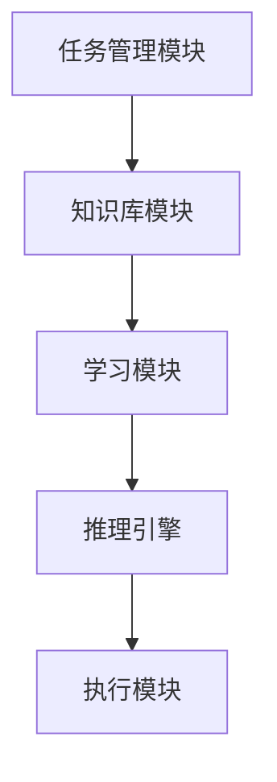

                 


# 基于课程学习的AI Agent能力进阶

## 关键词：课程学习、AI Agent、能力进阶、算法原理、系统架构、项目实战

## 摘要：  
基于课程学习的AI Agent能力进阶是一种通过系统性地设计学习路径和任务，帮助AI Agent逐步提升其核心能力的方法。本文从课程学习的基本概念出发，详细分析其在AI Agent中的应用机制，探讨相关的算法原理和系统架构设计。通过实际项目案例的解读，深入剖析课程学习如何推动AI Agent的能力进阶，并展望其在未来AI发展中的潜力。

---

## 第一部分: 课程学习与AI Agent基础

### 第1章: 课程学习与AI Agent概述

#### 1.1 课程学习的定义与特点
课程学习（Curriculum Learning）是一种机器学习策略，通过将学习任务按照难度递增的顺序进行组织，帮助模型逐步掌握复杂的能力。其核心特点包括：
- **渐进性**：任务难度从简单到复杂，逐步递进。
- **引导性**：通过引导性任务设计，降低学习难度。
- **动态性**：任务难度和学习目标可以根据模型表现动态调整。

#### 1.2 AI Agent的基本概念与能力
AI Agent（人工智能代理）是指能够感知环境、自主决策并执行任务的智能实体。其核心能力包括：
- **感知能力**：通过传感器或数据输入感知环境状态。
- **推理能力**：基于感知信息进行逻辑推理和决策。
- **学习能力**：通过学习算法不断优化自身的知识库和行为策略。

#### 1.3 课程学习与AI Agent的关联
课程学习为AI Agent提供了一种系统性的学习路径，通过设计递进式任务，帮助AI Agent逐步掌握复杂能力。这种关联主要体现在：
- **任务设计**：课程学习为AI Agent提供了一组难度递增的任务，帮助其逐步提升能力。
- **知识构建**：通过课程学习，AI Agent可以系统性地构建知识库，增强其推理和决策能力。
- **能力进阶**：课程学习通过任务难度的递进，帮助AI Agent实现从简单到复杂的能力进阶。

---

## 第二部分: 课程学习的核心概念与联系

### 第2章: 课程学习的机制与原理

#### 2.1 课程学习的机制
课程学习的核心机制包括：
- **知识表示**：将任务分解为一系列难度递增的知识点或任务模块。
- **任务建模**：将任务转化为具体的模型或算法，便于AI Agent理解和执行。
- **策略优化**：通过动态调整任务难度和学习策略，优化AI Agent的学习效率。

#### 2.2 AI Agent的核心概念
AI Agent的核心概念包括：
- **知识库**：存储AI Agent所需的所有知识和经验。
- **推理引擎**：基于知识库进行逻辑推理和决策。
- **学习模块**：通过学习算法优化AI Agent的能力。

#### 2.3 课程学习与AI Agent的关系
课程学习与AI Agent的关系可以用以下几点来概括：
- **知识构建**：课程学习为AI Agent提供系统性的知识构建路径。
- **任务执行**：通过课程学习设计的递进式任务，AI Agent可以逐步提升任务执行能力。
- **能力进阶**：课程学习帮助AI Agent实现从简单到复杂的能力进阶。

---

## 第三部分: 课程学习的算法原理

### 第3章: 课程学习的算法原理

#### 3.1 监督学习算法
监督学习是课程学习的一种典型应用。其核心思想是通过标注数据对模型进行训练，帮助模型逐步掌握任务。公式表示为：
$$ \text{损失函数} = \frac{1}{n} \sum_{i=1}^{n} (y_i - \hat{y}_i)^2 $$
其中，$y_i$是真实标签，$\hat{y}_i$是模型预测值。

#### 3.2 强化学习算法
强化学习通过奖励机制引导AI Agent学习最优策略。其核心公式为：
$$ Q(s, a) = r + \gamma \max_{a'} Q(s', a') $$
其中，$s$是状态，$a$是动作，$r$是奖励，$\gamma$是折扣因子。

#### 3.3 迁移学习算法
迁移学习通过将已学习的知识迁移到新任务中，提升学习效率。其核心公式为：
$$ P_{\text{target}}(y|x) = \frac{P_{\text{source}}(y|x) \cdot P_{\text{prior}}(y)}{P_{\text{prior}}(y|x)} $$

---

## 第四部分: 课程学习的系统架构设计

### 第4章: 课程学习的系统架构设计

#### 4.1 系统功能设计
课程学习系统的功能模块包括：
- **任务管理模块**：负责任务的设计、分配和管理。
- **知识库模块**：存储和管理AI Agent所需的知识。
- **学习模块**：通过学习算法优化AI Agent的能力。

#### 4.2 系统架构图
以下是一个典型的课程学习系统的架构图：



---

## 第五部分: 课程学习的项目实战

### 第5章: 项目实战

#### 5.1 环境安装
安装所需的依赖包：
```bash
pip install numpy
pip install scikit-learn
pip install matplotlib
```

#### 5.2 核心代码实现
以下是一个基于课程学习的AI Agent实现示例：
```python
import numpy as np
from sklearn.datasets import make_classification
from sklearn.linear_model import LogisticRegression

# 生成数据
X, y = make_classification(n_samples=1000, n_features=2, n_classes=2)

# 定义课程学习策略
def curriculum_learning(X, y, n_epochs=100):
    for epoch in range(n_epochs):
        # 动态调整任务难度
        if epoch < 50:
            current_X = X[:200]
            current_y = y[:200]
        else:
            current_X = X
            current_y = y
        # 训练模型
        model = LogisticRegression()
        model.fit(current_X, current_y)
        print(f"Epoch {epoch}: Accuracy = {model.score(current_X, current_y)}")

# 执行课程学习
curriculum_learning(X, y)
```

#### 5.3 案例分析
通过上述代码，我们可以看到课程学习如何帮助AI Agent逐步掌握复杂任务。在前50个训练周期中，模型仅使用少量数据进行训练，逐步增加数据量，最终在100个训练周期中达到较高的准确率。

---

## 第六部分: 课程学习的高级应用与未来趋势

### 第6章: 高级应用与未来趋势

#### 6.1 高级应用
课程学习已经在多个领域展现出其潜力，包括教育、医疗、金融等。例如，在教育领域，课程学习可以用于设计个性化学习路径。

#### 6.2 未来趋势
未来的课程学习将更加注重动态性和个性化。AI Agent将能够根据自身能力和环境反馈，动态调整学习路径。

---

## 总结

课程学习为AI Agent的能力进阶提供了一种系统性的方法。通过本文的分析，我们深入了解了课程学习的核心概念、算法原理和系统架构，并通过实际案例展示了其应用潜力。未来，课程学习将在更多领域展现出其价值，帮助AI Agent实现更高级的能力提升。

