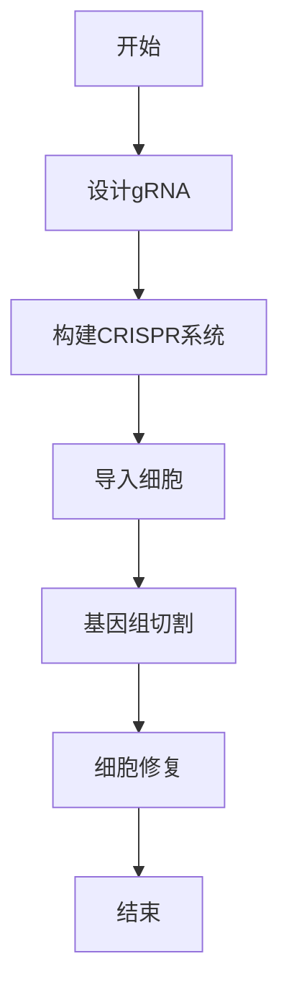

                 

# 基因编辑技术的伦理争议与投资风险

## 关键词：
基因编辑技术、伦理争议、投资风险、技术原理、法律框架、案例分析

## 摘要：
基因编辑技术作为一项革命性的生物技术，正在改变医学、农业和科学研究的面貌。然而，这项技术也引发了广泛的伦理争议和投资风险。本文将从基因编辑技术的背景与核心概念出发，深入分析其伦理争议，探讨投资风险，并结合法律与监管框架，提供实际案例分析和未来展望。

---

## 第一部分：基因编辑技术的背景与核心概念

### 第1章：基因编辑技术的起源与发展

#### 1.1 基因编辑技术的起源
基因编辑技术的起源可以追溯到20世纪初，科学家们开始研究如何在分子层面上修改基因组。早期的技术包括锌指核酸酶（ZFN）和转录激活因子样效应核酸酶（TALEN），但这些技术操作复杂、成本高昂，限制了其广泛应用。直到CRISPR-Cas9技术的出现，基因编辑迎来了重大突破。

**CRISPR-Cas9的发现：**
CRISPR-Cas9技术来源于细菌的免疫系统，科学家们将其改造为一种高效的基因编辑工具。CRISPR-Cas9通过RNA引导Cas9蛋白在特定的DNA位置切割，从而实现基因的定点修改。

**基因编辑技术的发展历程：**
1. **早期技术：** 锌指核酸酶（ZFN）和转录激活因子样效应核酸酶（TALEN）。
2. **CRISPR-Cas9的崛起：** 2012年，CRISPR-Cas9技术被开发出来，迅速成为基因编辑领域的主流工具。
3. **后续发展：** 包括CRISPR-Cas9的改进版（如高保真CRISPR）和基于CRISPR的其他技术（如CRISPR-dCas9用于基因调控）。

**现状与未来展望：**
目前，基因编辑技术已在医学、农业和工业领域得到广泛应用。未来，随着技术的进一步发展，基因编辑将更加精准和高效，但同时也将面临更多伦理和法律挑战。

---

### 第2章：基因编辑技术的核心原理

#### 2.1 基因编辑技术的基本原理
基因编辑技术的核心原理是通过特定的酶（如Cas9）和引导RNA（gRNA）在目标基因组位置引入双链断裂（DSB），从而实现基因的插入、删除或替换。

**步骤分析：**
1. **设计引导RNA：** 根据目标基因的位置设计特定的gRNA。
2. **构建CRISPR系统：** 将Cas9蛋白和gRNA导入细胞。
3. **基因组切割：** Cas9在gRNA引导下切割目标DNA。
4. **修复机制：** 细胞利用非同源末端连接（NHEJ）或同源定向修复（HDR）机制修复断裂的DNA，从而实现基因编辑。

**数学模型与算法：**
基因编辑的效率可以通过以下公式计算：
$$
\text{编辑效率} = \frac{\text{成功编辑的细胞数}}{\text{总细胞数}} \times 100\%
$$
此外，基因编辑的特异性可以通过以下因素影响：
1. gRNA的设计：gRNA的序列是否与目标基因高度匹配。
2. Cas9的表达水平：Cas9的过表达可能导致脱靶效应。
3. 细胞类型：不同细胞类型的修复机制可能影响编辑效率。

---

#### 2.2 基因编辑技术的数学模型与算法

**CRISPR-Cas9的数学模型：**
基因编辑的效率可以通过以下公式计算：
$$
\text{编辑效率} = \frac{\text{成功编辑的细胞数}}{\text{总细胞数}} \times 100\%
$$
此外，基因编辑的特异性可以通过以下因素影响：
1. gRNA的设计：gRNA的序列是否与目标基因高度匹配。
2. Cas9的表达水平：Cas9的过表达可能导致脱靶效应。
3. 细胞类型：不同细胞类型的修复机制可能影响编辑效率。

**算法流程图：**

---

## 第3章：基因编辑技术的伦理争议

### 3.1 人类基因编辑的伦理问题

#### 3.1.1 人类基因编辑的伦理框架
人类基因编辑涉及对人类胚胎、生殖细胞或体细胞的基因修改。这种技术可能带来深远的伦理争议，尤其是在治疗疾病和增强人类性能之间的界限模糊。

**伦理争议：**
1. **治疗与增强的界限：** 基因编辑用于治疗疾病是否合理？如果用于增强性能，是否违背自然法则？
2. **社会公平：** 贵族基因编辑可能导致社会不平等，进一步加剧社会阶层的分化。
3. **不可逆性：** 基因编辑可能对人类基因组造成不可逆的改变，影响未来世代。

**伦理解决方案：**
1. **严格的监管：** 设立国际性法规，限制人类基因编辑的用途。
2. **伦理审查：** 对基因编辑项目进行伦理审查，确保其符合社会道德标准。
3. **公众参与：** 鼓励公众参与基因编辑的伦理讨论，确保技术的使用符合社会共同价值观。

---

### 3.2 动物与植物基因编辑的伦理问题

#### 3.2.1 动物基因编辑的伦理争议
动物基因编辑可能带来动物福利和生态平衡的问题。例如，基因编辑的动物可能在自然环境中具有竞争优势，威胁野生种群。

**伦理争议：**
1. **动物福利：** 基因编辑可能导致动物痛苦或缩短寿命。
2. **生态平衡：** 基因编辑的动物可能破坏自然生态系统。
3. **伦理监管：** 动物基因编辑需要严格的伦理监管，确保其符合动物福利和生态保护的原则。

**伦理解决方案：**
1. **伦理审查：** 对动物基因编辑项目进行伦理审查，确保其符合动物福利和生态保护的原则。
2. **国际合作：** 建立国际合作机制，共同应对动物基因编辑的伦理挑战。
3. **公众教育：** 加强公众教育，提高人们对动物基因编辑伦理问题的认识。

---

## 第4章：基因编辑技术的投资风险

### 4.1 基因编辑技术的投资现状

#### 4.1.1 基因编辑技术的投资现状分析
基因编辑技术的投资现状呈现出快速增长的趋势。根据市场研究机构的数据，全球基因编辑技术的市场规模预计将在未来几年内以年均20%的速度增长。

**市场分析：**
1. **医疗领域：** 基因编辑在治疗遗传病和癌症方面具有巨大潜力，吸引了大量的投资。
2. **农业领域：** 基因编辑在提高作物产量和抗病性方面也得到了广泛应用。
3. **工业领域：** 基因编辑在生物制造和环保领域也显示出巨大潜力。

**投资趋势预测：**
随着基因编辑技术的不断进步，其在医疗、农业和工业领域的应用将更加广泛，吸引更多的投资。

---

### 4.2 基因编辑技术的投资策略

#### 4.2.1 基因编辑技术的投资策略分析
基因编辑技术的投资策略需要考虑技术风险、市场前景和伦理法律问题。

**投资策略：**
1. **技术风险：** 基因编辑技术仍处于发展阶段，存在一定的技术不确定性。
2. **市场前景：** 基因编辑技术在医疗、农业和工业领域的应用前景广阔。
3. **伦理法律：** 基因编辑技术涉及复杂的伦理和法律问题，需要考虑监管政策的变化。

**投资风险控制：**
1. **多元化投资：** 将资金分散投资于不同的基因编辑项目，降低风险。
2. **技术评估：** 对基因编辑技术的成熟度和可行性进行深入评估。
3. **政策跟踪：** 密切关注相关政策的变化，及时调整投资策略。

---

## 第5章：基因编辑技术的法律与监管框架

### 5.1 基因编辑技术的法律框架

#### 5.1.1 基因编辑技术的法律定义
基因编辑技术的法律定义因国家而异。在一些国家，基因编辑技术被明确禁止用于人类生殖细胞的基因编辑，而在其他地方，其法律框架较为宽松。

**法律争议：**
1. **专利纠纷：** 基因编辑技术的专利归属问题。
2. **监管政策：** 不同国家对基因编辑技术的监管政策存在差异。

---

## 第6章：基因编辑技术的案例分析

### 6.1 基因编辑技术的成功案例

#### 6.1.1 CRISPR-Cas9的商业化
CRISPR-Cas9技术的商业化是基因编辑技术成功应用的典范。例如，美国公司Editas Medicine通过CRISPR-Cas9技术治疗遗传性疾病，取得了显著的进展。

---

### 6.2 基因编辑技术的失败案例

#### 6.2.1 基因编辑疗法的失败
基因编辑疗法的失败案例也提醒我们技术的局限性和伦理的重要性。例如，某些基因编辑疗法由于脱靶效应导致了严重的副作用。

---

## 第7章：基因编辑技术的未来展望

### 7.1 基因编辑技术的技术发展方向

#### 7.1.1 高保真CRISPR技术
高保真CRISPR技术旨在提高基因编辑的特异性，减少脱靶效应。

---

### 7.2 基因编辑技术的伦理与法律演变

#### 7.2.1 伦理法律的协调
随着基因编辑技术的不断发展，伦理和法律框架也需要不断完善，以适应技术的发展。

---

### 7.3 基因编辑技术的投资机会

#### 7.3.1 基因编辑技术的投资机会
基因编辑技术的投资机会主要集中在医疗、农业和工业领域。未来，随着技术的不断进步，基因编辑技术将带来更多的投资机会。

---

## 总结

基因编辑技术作为一项革命性的生物技术，正在改变医学、农业和科学研究的面貌。然而，这项技术也引发了广泛的伦理争议和投资风险。本文从基因编辑技术的背景与核心概念出发，深入分析了其伦理争议，探讨了投资风险，并结合法律与监管框架，提供了实际案例分析和未来展望。

